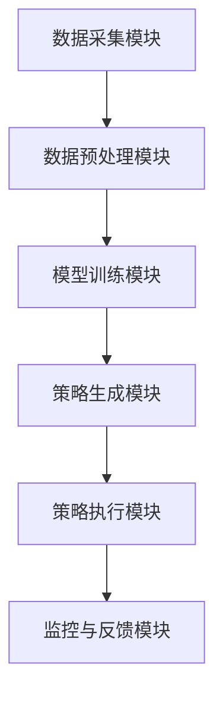
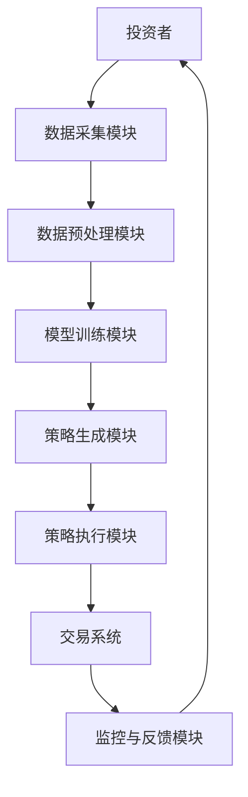

                 


# 智能个人资产配置动态调整器

> 关键词：智能资产配置，动态调整，强化学习，动态规划，金融系统架构

> 摘要：本文详细介绍了智能个人资产配置动态调整器的设计与实现，从传统资产配置的局限性出发，阐述了智能化资产配置的需求与趋势，重点分析了基于强化学习和动态规划的核心算法，以及系统的整体架构设计。通过实际案例分析，展示了智能动态调整器在个人资产管理中的实际应用价值，并提出了系统的实现方案与优化建议。

---

# 第1章: 智能个人资产配置的背景与问题描述

## 1.1 传统个人资产配置的局限性

### 1.1.1 传统资产配置的定义与特点

传统的个人资产配置是指根据投资者的风险承受能力、投资目标和市场环境，将资金分配到不同的资产类别（如股票、债券、房地产等）中，以实现风险与收益的最佳平衡。这种配置方式通常基于历史数据和经验判断，具有以下特点：

- **静态性**：传统配置往往基于过去的数据和市场环境，难以适应市场的动态变化。
- **主观性**：依赖于分析师的主观判断，存在较大的不确定性。
- **低效性**：对于个人投资者而言，手动调整资产配置的效率较低，且难以实时跟踪市场变化。

### 1.1.2 传统资产配置中的问题与挑战

随着金融市场环境的复杂化和投资者需求的多样化，传统资产配置方式逐渐暴露出以下问题：

- **市场波动性增加**：近年来，全球市场的波动性显著增加，传统的静态配置难以应对短期市场变化。
- **信息滞后性**：传统配置方式依赖于历史数据和定期报告，难以实现实时动态调整。
- **个性化需求不足**：传统配置方式往往基于固定的资产类别划分，难以满足个人投资者的个性化需求。

### 1.1.3 传统资产配置与现代投资需求的不匹配

现代投资者对资产配置的需求更加多元化和个性化，传统的资产配置方式在以下方面显得力不从心：

- **实时性需求**：投资者希望资产配置能够根据市场变化实时调整。
- **个性化需求**：不同投资者的风险偏好和财务目标差异较大，传统配置难以满足个性化需求。
- **高效性需求**：投资者希望资产配置能够自动化、智能化地完成，减少人工干预。

---

## 1.2 智能化资产配置的需求与趋势

### 1.2.1 人工智能在金融领域的应用背景

随着人工智能技术的快速发展，AI在金融领域的应用越来越广泛。从算法交易到风险管理，人工智能正在改变传统的金融服务模式。资产配置作为金融领域的重要组成部分，同样受益于AI技术的进步。

### 1.2.2 智能化资产配置的核心优势

智能化资产配置通过引入人工智能技术，能够实现以下目标：

- **实时监控与动态调整**：基于实时市场数据和投资者的动态需求，自动调整资产配置。
- **个性化服务**：根据投资者的个性化需求，提供定制化的资产配置方案。
- **高效性与准确性**：通过算法优化，提高资产配置的效率和准确性。

### 1.2.3 个人资产管理的智能化转型趋势

随着金融科技（FinTech）的兴起，智能化资产配置已经成为资产管理领域的主流趋势。个人投资者对智能化服务的需求日益增长，推动了智能资产配置动态调整器的快速发展。

---

## 1.3 智能个人资产配置动态调整器的目标与意义

### 1.3.1 动态调整器的目标功能

智能个人资产配置动态调整器的目标是实现以下功能：

- **实时数据采集与分析**：实时采集市场数据和投资者需求变化，进行分析和预测。
- **动态优化与调整**：基于分析结果，动态优化资产配置方案。
- **自动化执行**：根据优化结果，自动执行资产调整操作。

### 1.3.2 动态调整器的核心价值

动态调整器的核心价值体现在以下几个方面：

- **提高投资收益**：通过实时优化资产配置，提升投资收益。
- **降低投资风险**：通过动态调整，降低市场波动对投资组合的影响。
- **提升投资体验**：为投资者提供便捷、高效的服务，提升投资体验。

### 1.3.3 对个人投资者的实际意义

对于个人投资者而言，动态调整器的意义重大：

- **简化投资决策**：投资者无需手动调整资产配置，减少决策疲劳。
- **提高投资效率**：通过自动化调整，提高投资效率。
- **降低投资风险**：动态调整能够及时应对市场变化，降低投资风险。

---

## 1.4 本章小结

本章从传统资产配置的局限性出发，分析了智能化资产配置的需求与趋势，并详细阐述了智能个人资产配置动态调整器的目标与意义。通过对比传统与智能资产配置的特点，读者可以更好地理解动态调整器的核心价值。

---

# 第2章: 智能个人资产配置动态调整器的核心概念与机制

## 2.1 智能动态调整的核心概念

### 2.1.1 动态调整的定义与特征

动态调整是指根据市场环境和投资者需求的变化，实时优化和调整资产配置方案的过程。其核心特征包括：

- **实时性**：动态调整基于实时数据和市场变化。
- **动态性**：调整过程是动态的、持续的。
- **个性化**：根据投资者的个性化需求进行调整。

### 2.1.2 智能动态调整的实现原理

智能动态调整的核心实现原理是通过人工智能算法，分析市场数据和投资者需求，生成最优的资产配置方案。其实现过程可以分为以下几个步骤：

1. **数据采集**：采集市场数据和投资者需求数据。
2. **数据分析**：对数据进行清洗、预处理和分析。
3. **模型训练**：基于数据分析结果，训练优化模型。
4. **策略生成**：根据模型预测结果，生成优化的资产配置策略。
5. **策略执行**：根据生成的策略，执行资产调整操作。

### 2.1.3 动态调整与静态配置的主要区别

动态调整与静态配置的主要区别如下：

| 特性                | 动态调整                | 静态配置                |
|---------------------|-------------------------|-------------------------|
| 时间维度           | 实时动态调整            | 定期静态配置            |
| 数据依赖           | 依赖实时市场数据        | 依赖历史数据            |
| 调整频率           | 高频调整                | 低频调整                |
| 个性化程度         | 高度个性化              | 较低个性化              |

---

## 2.2 动态调整器的逻辑框架

### 2.2.1 数据采集与处理模块

数据采集与处理模块是动态调整器的核心模块之一，其功能包括：

- **数据采集**：从金融市场数据源（如股票市场、债券市场等）采集实时数据。
- **数据预处理**：对采集的数据进行清洗、标准化和特征提取。
- **数据存储**：将处理后的数据存储到数据库中，供后续模块使用。

### 2.2.2 模型构建与分析模块

模型构建与分析模块是动态调整器的核心模块，其功能包括：

- **模型训练**：基于历史数据和实时数据，训练优化模型。
- **数据分析**：对市场数据和投资者需求进行分析，生成优化建议。
- **风险评估**：评估不同资产配置方案的风险和收益。

### 2.2.3 策略生成与执行模块

策略生成与执行模块是动态调整器的最终执行模块，其功能包括：

- **策略生成**：根据模型分析结果，生成优化的资产配置策略。
- **策略执行**：将生成的策略转化为具体的交易指令，执行资产调整操作。
- **反馈优化**：根据执行结果，优化模型和策略。

---

## 2.3 动态调整器的核心算法与数学模型

### 2.3.1 基于强化学习的动态调整算法

强化学习是一种人工智能算法，适用于动态调整器的核心优化问题。其基本原理是通过智能体与环境的交互，逐步学习最优策略。在动态调整器中，强化学习可以用于以下场景：

1. **状态定义**：市场环境和投资者需求可以定义为智能体的状态。
2. **动作空间**：智能体可以执行的动作包括调整资产比例、选择投资品种等。
3. **奖励机制**：根据调整结果的收益和风险，定义奖励函数。

### 2.3.2 动态规划模型的数学表达

动态规划是一种优化算法，适用于解决动态调整中的最优决策问题。其数学表达如下：

$$
V(s) = \max_{a} [ r(s, a) + \gamma V(s', a) ]
$$

其中：
- $V(s)$ 表示状态 $s$ 的价值函数。
- $a$ 表示动作。
- $r(s, a)$ 表示执行动作 $a$ 在状态 $s$ 下的奖励。
- $\gamma$ 表示折扣因子。
- $s'$ 表示执行动作 $a$ 后的新状态。

### 2.3.3 风险-收益平衡的优化函数

为了实现风险与收益的平衡，动态调整器需要建立一个优化函数。常见的优化函数形式如下：

$$
\min_{w} \left( \mathbb{E}[ (w^T r - \lambda w^T \Sigma w) ] \right)
$$

其中：
- $w$ 表示资产权重向量。
- $r$ 表示资产的预期收益率。
- $\Sigma$ 表示资产收益率的协方差矩阵。
- $\lambda$ 表示风险厌恶系数。

---

## 2.4 本章小结

本章详细阐述了智能动态调整器的核心概念与机制，包括动态调整的核心概念、逻辑框架和核心算法。通过对比分析，读者可以更好地理解动态调整器的工作原理和实现方法。

---

# 第3章: 智能动态调整器的算法原理与实现

## 3.1 强化学习在动态调整中的应用

### 3.1.1 强化学习的基本原理

强化学习是一种基于试错的人工智能算法，通过智能体与环境的交互，逐步学习最优策略。其基本原理如下：

1. **状态空间**：智能体所处的状态。
2. **动作空间**：智能体可以执行的动作。
3. **奖励机制**：智能体执行动作后获得的奖励或惩罚。
4. **策略优化**：通过不断试错，优化策略以最大化累计奖励。

### 3.1.2 在资产配置中的状态定义

在动态调整器中，状态可以定义为市场环境和投资者需求的综合指标。例如：

- **市场状态**：包括市场指数、波动率等。
- **投资者状态**：包括风险偏好、财务目标等。

### 3.1.3 动作空间与奖励机制设计

动作空间可以定义为资产配置的调整动作，例如：

- 调整股票比例。
- 调整债券比例。
- 调整现金比例。

奖励机制可以根据调整结果的收益和风险进行设计，例如：

$$
r = \alpha \times \text{收益} - \beta \times \text{风险}
$$

其中：
- $\alpha$ 和 $\beta$ 是奖励函数的系数，用于平衡收益与风险。

---

## 3.2 基于动态规划的调整策略

### 3.2.1 动态规划的数学模型

动态规划是一种基于最优子结构的优化算法，适用于解决动态调整中的最优决策问题。其数学模型如下：

$$
V(s) = \max_{a} [ r(s, a) + \gamma V(s', a) ]
$$

其中：
- $V(s)$ 表示状态 $s$ 的价值函数。
- $a$ 表示动作。
- $r(s, a)$ 表示执行动作 $a$ 在状态 $s$ 下的奖励。
- $\gamma$ 表示折扣因子。
- $s'$ 表示执行动作 $a$ 后的新状态。

### 3.2.2 状态转移方程的构建

状态转移方程描述了状态 $s$ 在执行动作 $a$ 后转移到新状态 $s'$ 的概率。其形式如下：

$$
P(s' | s, a) = \text{概率} \{ s' | s, a \}
$$

### 3.2.3 最优策略的求解过程

最优策略的求解过程可以通过动态规划算法实现。具体步骤如下：

1. **初始化**：设定初始状态和初始价值函数。
2. **迭代更新**：根据状态转移方程和奖励函数，迭代更新价值函数。
3. **策略提取**：从优化的价值函数中提取最优策略。

---

## 3.3 算法实现的代码框架

### 3.3.1 环境搭建与数据准备

首先，需要搭建强化学习环境，并准备市场数据和投资者需求数据。以下是一个简单的数据准备代码示例：

```python
import pandas as pd
import numpy as np

# 数据准备
market_data = pd.read_csv('market_data.csv')
portfolio_data = pd.read_csv('portfolio.csv')
```

### 3.3.2 算法核心代码实现

以下是一个基于强化学习的动态调整算法实现代码示例：

```python
class DynamicAdjuster:
    def __init__(self, state_space, action_space):
        self.state_space = state_space
        self.action_space = action_space
        # 初始化价值函数
        self.value_fn = np.zeros(len(state_space))
    
    def get_state(self, market_data):
        # 根据市场数据获取当前状态
        state = self.state_space[np.argmin(abs(market_data - np.array(self.state_space)))]
        return state
    
    def choose_action(self, state):
        # 根据当前状态选择动作
        action = self.action_space[np.argmax(self.value_fn[state])]
        return action
    
    def update_value_fn(self, state, action, reward, next_state):
        # 更新价值函数
        self.value_fn[state] = reward + self.gamma * self.value_fn[next_state]
    
    def optimize(self, market_data, portfolio_data):
        # 动态优化过程
        pass
```

### 3.3.3 代码运行与结果分析

运行代码并分析结果，观察动态调整器在不同市场环境下的表现。以下是一个简单的结果分析示例：

```python
# 运行动态调整器
adjuster = DynamicAdjuster(state_space, action_space)
adjuster.optimize(market_data, portfolio_data)

# 分析调整结果
print(adjuster.value_fn)
print(adjuster.choose_action(current_state))
```

---

## 3.4 本章小结

本章详细阐述了强化学习和动态规划在动态调整器中的应用，通过代码实现和结果分析，展示了算法的核心原理和实现方法。读者可以通过本章内容理解动态调整器的算法实现过程。

---

# 第4章: 智能动态调整器的系统架构与设计

## 4.1 系统功能模块划分

智能动态调整器的系统架构可以划分为以下几个功能模块：

1. **数据采集与预处理模块**：负责采集和预处理市场数据和投资者需求数据。
2. **模型训练与优化模块**：负责训练和优化动态调整模型。
3. **策略生成与执行模块**：负责生成和执行最优资产配置策略。
4. **监控与反馈模块**：负责监控系统运行状态，并根据反馈结果优化模型。

### 4.1.1 数据采集与预处理模块

数据采集与预处理模块的功能如下：

- **数据采集**：从金融市场数据源采集实时数据。
- **数据清洗**：去除异常数据和缺失数据。
- **数据特征提取**：提取有助于模型训练的特征。

### 4.1.2 模型训练与优化模块

模型训练与优化模块的功能如下：

- **模型选择**：选择合适的机器学习模型。
- **模型训练**：基于训练数据训练模型。
- **模型优化**：通过交叉验证等方法优化模型参数。

---

## 4.2 系统架构设计

### 4.2.1 系统整体架构

以下是动态调整器的系统整体架构图：



---

## 4.3 接口设计与交互流程

### 4.3.1 系统接口设计

系统接口设计需要考虑以下方面：

1. **数据接口**：与金融市场数据源对接。
2. **用户接口**：与投资者交互，获取需求信息。
3. **交易接口**：与交易系统对接，执行资产调整操作。

### 4.3.2 系统交互流程

以下是系统交互的流程图：



---

## 4.4 本章小结

本章详细描述了智能动态调整器的系统架构与设计，包括功能模块划分、系统整体架构和接口设计。通过流程图和架构图的展示，读者可以清晰地理解系统的整体结构和各模块之间的关系。

---

# 第5章: 智能动态调整器的项目实战

## 5.1 项目环境安装与配置

### 5.1.1 Python环境安装

首先，需要安装Python编程环境，并安装必要的库：

```bash
pip install numpy pandas scikit-learn
```

### 5.1.2 数据源获取与准备

从金融市场数据源获取数据，并进行清洗和预处理：

```python
import pandas as pd
import numpy as np

# 获取市场数据
market_data = pd.read_csv('market_data.csv')
# 获取投资者需求数据
portfolio_data = pd.read_csv('portfolio.csv')
```

---

## 5.2 系统核心实现

### 5.2.1 数据采集与预处理

以下是数据采集与预处理的代码实现：

```python
def preprocess_data(market_data, portfolio_data):
    # 数据清洗
    market_data = market_data.dropna()
    portfolio_data = portfolio_data.dropna()
    # 特征提取
    features = ['return', 'volatility', 'market_cap']
    processed_market = market_data[features].fillna(0)
    processed_portfolio = portfolio_data[features].fillna(0)
    return processed_market, processed_portfolio
```

### 5.2.2 模型训练与优化

以下是模型训练与优化的代码实现：

```python
from sklearn.model

