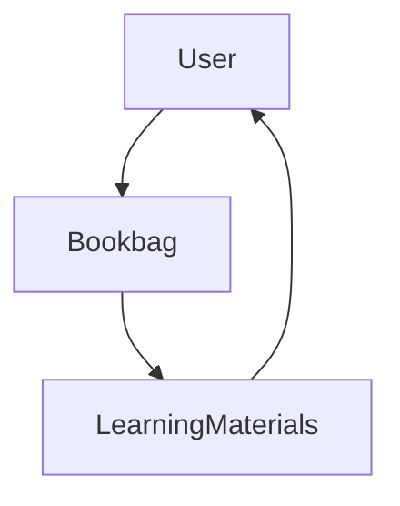
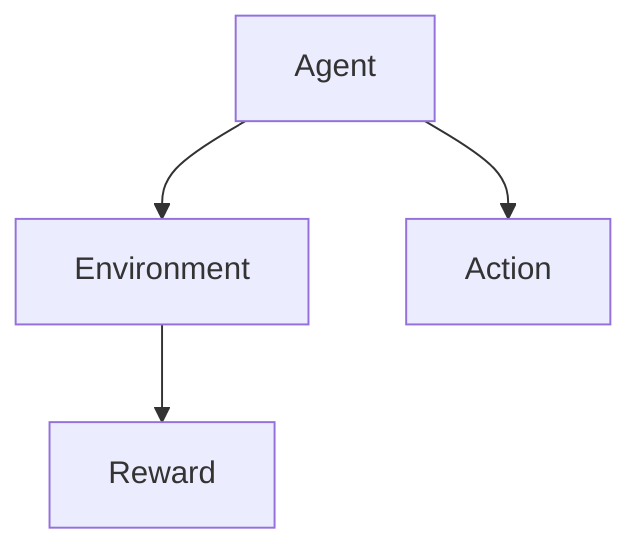
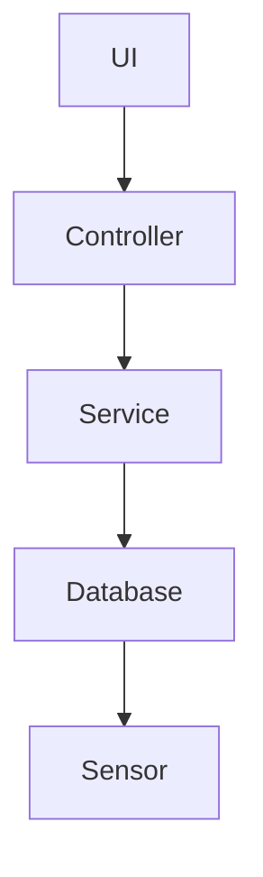

                 


# 智能书包：AI Agent的学习用品管理助手

## 关键词：
智能书包，AI Agent，学习用品管理，强化学习，系统架构设计，项目实战

## 摘要：
本文探讨了如何利用AI Agent技术来优化学习用品的管理，通过智能书包这一创新工具，结合强化学习算法和系统架构设计，提供了一个高效、智能的学习用品管理解决方案。文章详细介绍了AI Agent的基本原理、强化学习算法的应用、系统架构设计，以及实际项目案例，旨在为教育科技领域提供新的思路和参考。

---

## 第一部分：背景介绍

### 第1章：智能书包与AI Agent的背景

#### 1.1 问题背景与描述
- 1.1.1 学习用品管理的传统问题
  - 物品丢失：书包内物品易丢，导致学习效率低下。
  - 查找困难：传统书包无法快速定位所需物品，增加时间成本。
  - 管理混乱：缺乏系统性，难以追踪物品使用情况。
  
- 1.1.2 AI Agent的引入及其目标
  - 引入AI Agent，实现智能管理，提升学习效率。
  - AI Agent的目标：实时监控、智能提醒、数据分析。

- 1.1.3 智能书包的应用场景与边界
  - 场景：学校、家庭、办公场所。
  - 边界：仅限于学习用品管理，不涉及其他功能。

#### 1.2 AI Agent的基本概念
- 1.2.1 智能体（AI Agent）的定义
  - AI Agent是一个能够感知环境、自主决策并执行任务的智能系统。
  - 核心功能：感知、决策、执行。

- 1.2.2 AI Agent的核心要素与功能
  - 感知：通过传感器或数据输入获取环境信息。
  - 决策：基于算法做出最优选择。
  - 执行：通过动作或输出影响环境。

- 1.2.3 智能书包的系统架构
  - 书包作为物理载体，集成AI Agent技术。
  - 系统包括：传感器、数据处理模块、用户交互界面。

---

## 第二部分：核心概念与联系

### 第2章：AI Agent的核心原理

#### 2.1 AI Agent的工作原理
- 1.1.1 感知与决策机制
  - 通过传感器感知书包内物品的状态。
  - 使用算法进行决策，例如选择最优的存储位置。

- 1.1.2 行为规划与执行
  - 根据决策结果，执行具体动作，如自动调整物品位置。

- 1.1.3 与环境的交互过程
  - 书包与用户的交互，以及与外部系统的数据交换。

#### 2.2 核心概念对比表
- 传统管理方法 vs AI Agent方法
  | 方法 | 优点 | 缺点 |
  |------|------|------|
  | 传统 | 简单，成本低 | 易丢失，效率低 |
  | AI Agent | 高效，智能 | 成本高，技术复杂 |

#### 2.3 实体关系图
- Mermaid流程图展示：用户、书包、学习用品的交互关系


---

## 第三部分：算法原理讲解

### 第3章：强化学习算法原理

#### 3.1 强化学习简介
- 算法流程图：Mermaid图展示

- Python代码示例：简单的强化学习实现
```python
import numpy as np

class Agent:
    def __init__(self, actions):
        self.actions = actions
        self.learning_rate = 0.1
        self.gamma = 0.9
        self.Q = np.zeros(len(actions))

    def choose_action(self, Q_values):
        max_val = np.max(Q_values)
        action_index = np.random.choice([i for i, val in enumerate(Q_values) if val == max_val])
        return action_index

    def update_Q(self, state, action, reward, next_state_Q):
        self.Q[state] = self.Q[state] + self.learning_rate * (reward + self.gamma * np.max(next_state_Q) - self.Q[state])
```

#### 3.2 数学模型与公式
- 状态、动作、奖励函数的定义
  - 状态：书包内物品的位置和数量。
  - 动作：移动物品到新位置。
  - 奖励函数：奖励正确操作，惩罚错误。

- Q-learning算法的数学推导
  - Q-learning算法：$$ Q(s, a) = Q(s, a) + \alpha [r + \gamma \max Q(s', a') - Q(s, a)] $$
  - 其中，$$ \alpha $$ 是学习率，$$ \gamma $$ 是折扣因子。

---

## 第四部分：系统分析与架构设计

### 第4章：系统分析与设计

#### 4.1 需求分析
- 功能需求：物品管理、提醒、数据分析
- 非功能需求：安全性、响应速度

#### 4.2 系统架构设计
- Mermaid架构图：展示分层架构


- 关键组件：数据层、业务逻辑层、用户界面层

---

## 第五部分：项目实战

### 第5章：项目实战：智能书包管理系统

#### 5.1 环境安装
- Python 3.8及以上版本
- 安装依赖：numpy, matplotlib, gym

#### 5.2 系统核心实现源代码
```python
import numpy as np
import gym
from gym import spaces

class BookbagEnv(gym.Env):
    def __init__(self, capacity=5):
        self.capacity = capacity
        self.items = []
        self.observation_space = spaces.Box(low=0, high=1, shape=(self.capacity,))
        self.action_space = spaces.Discrete(4)  # 0: add, 1: remove, 2: search, 3: reorder

    def reset(self):
        self.items = []
        return self.observation_space.sample()

    def step(self, action):
        # 实现具体动作逻辑
        pass
```

---

## 第六部分：最佳实践

### 第6章：总结与展望

#### 6.1 小结
- 通过AI Agent和强化学习，智能书包实现了高效的学习用品管理。

#### 6.2 注意事项
- 数据安全：确保用户数据隐私。
- 系统维护：定期更新算法，优化性能。

#### 6.3 拓展阅读
- 《强化学习：理论与算法》
- 《AI系统架构设计》

---

## 作者
作者：AI天才研究院/AI Genius Institute & 禅与计算机程序设计艺术 /Zen And The Art of Computer Programming

