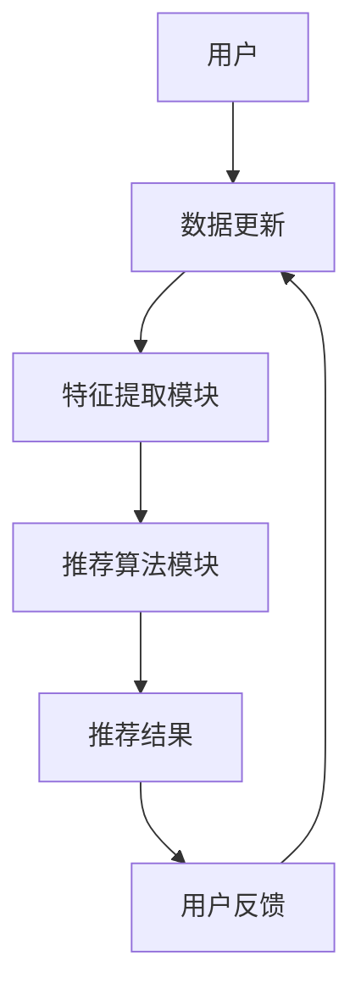

                 


```
# 智能书架：AI Agent的个性化阅读推荐系统

## 关键词：
- AI Agent
- 个性化阅读推荐
- 智能书架
- 推荐系统算法
- 系统架构设计

## 摘要：
智能书架是一种基于AI Agent的个性化阅读推荐系统，旨在通过智能化的技术手段，为用户提供精准、个性化的阅读推荐服务。本文将从问题背景、核心概念、算法原理、系统架构设计、项目实战等多方面详细阐述智能书架的实现过程，帮助读者全面理解AI Agent在阅读推荐系统中的应用。

---

# 第一部分：智能书架背景与核心概念

## 第1章：个性化阅读推荐系统概述

### 1.1 问题背景与描述
#### 1.1.1 当前阅读推荐系统的痛点
在信息爆炸的时代，用户每天面对海量的信息和内容，如何快速找到符合个人兴趣和需求的阅读资源成为一大挑战。传统的阅读推荐系统存在以下问题：
- 数据稀疏性：用户行为数据不足，导致推荐精度低。
- 单一性：推荐算法过于依赖单一特征（如用户行为或内容特征），难以覆盖用户的多维度需求。
- 实时性：推荐结果无法实时更新，难以应对用户兴趣的变化。

#### 1.1.2 智能书架的目标与功能
智能书架的目标是通过AI Agent技术，构建一个能够实时感知用户需求、动态调整推荐策略的个性化阅读推荐系统。其核心功能包括：
- 用户偏好分析：基于用户历史行为、阅读记录、兴趣标签等数据，构建用户画像。
- 内容理解：对书籍的内容进行深度分析，提取关键词、主题、情感倾向等特征。
- 智能推荐：结合用户画像和内容特征，生成个性化推荐列表，并支持实时更新。

#### 1.1.3 系统的边界与外延
智能书架的边界主要集中在阅读推荐领域，不涉及书籍的存储、购买、借阅等功能。其外延则包括：
- 数据源：用户行为数据、书籍 metadata、用户反馈数据。
- 推荐策略：基于协同过滤、内容推荐、混合推荐等算法。
- 交互方式：支持用户主动调整推荐结果的反馈机制。

### 1.2 智能书架的核心要素与组成
智能书架的核心要素包括：
1. **用户模型**：基于用户行为和偏好构建的用户画像。
2. **内容模型**：对书籍内容进行深度分析的知识图谱。
3. **推荐算法**：结合用户模型和内容模型的推荐算法。
4. **反馈机制**：用户对推荐结果的实时反馈与调整。

---

## 第2章：AI Agent与个性化推荐的核心概念

### 2.1 AI Agent的基本原理
#### 2.1.1 AI Agent的定义与分类
AI Agent（人工智能代理）是指能够感知环境、自主决策并执行任务的智能体。根据应用场景的不同，AI Agent可以分为：
- **反应式AI Agent**：基于当前输入做出实时反应。
- **认知式AI Agent**：具备推理、学习和规划能力。
- **协作式AI Agent**：能够与其他Agent或人类进行协作。

#### 2.1.2 AI Agent在推荐系统中的角色
AI Agent在智能书架中的主要角色是：
- **数据采集**：实时收集用户的阅读行为、偏好等数据。
- **特征提取**：对用户和内容进行深度分析，提取关键特征。
- **决策与推荐**：基于分析结果，生成个性化推荐列表。
- **反馈优化**：根据用户反馈，动态调整推荐策略。

### 2.2 个性化推荐系统的核心原理
#### 2.2.1 推荐算法的分类与对比
以下是对几种常见推荐算法的对比：

| 算法类型 | 特点 | 优缺点 | 适用场景 |
|----------|------|---------|-----------|
| 协同过滤 | 基于用户相似性推荐 | 数据稀疏性问题，计算复杂度高 | 用户基数较大的场景 |
| 基于内容的推荐 | 基于内容相似性推荐 | 冷启动问题 | 内容特征明确的场景 |
| 混合推荐 | 结合协同过滤和内容推荐 | 高精度、低冷启动问题 | 综合推荐场景 |

#### 2.2.2 混合推荐模型的优势
混合推荐模型结合了协同过滤和内容推荐的优点，能够有效降低数据稀疏性问题，同时提升推荐的准确性和多样性。其核心思想是：
$$ \text{score}(u,i) = \alpha \cdot \text{similarity}(u,i) + \beta \cdot \text{content\_similarity}(u,i) $$
其中，$\alpha$ 和 $\beta$ 是权重参数，用于平衡协同过滤和内容推荐的影响力。

---

## 第3章：智能书架的算法原理

### 3.1 推荐算法的数学模型
#### 3.1.1 协同过滤算法的实现
协同过滤算法的核心思想是通过用户相似性计算推荐结果。其数学公式如下：
$$ \text{score}(u,i) = \frac{\sum_{u'} \text{similarity}(u,u') \times r(u',i)}{\sum_{u'} \text{similarity}(u,u')} $$
其中，$\text{similarity}(u,u')$ 表示用户 $u$ 和 $u'$ 的相似性，$r(u',i)$ 表示用户 $u'$ 对物品 $i$ 的评分。

#### 3.1.2 基于内容的推荐算法
基于内容的推荐算法通过分析物品的内容特征，找到与目标物品相似的物品。其数学公式如下：
$$ \text{similarity}(i,j) = \frac{\sum_{k} w_k \times (v_{ik} - \mu_k)(v_{jk} - \mu_k)}{\sqrt{\sum_{k} (v_{ik} - \mu_k)^2} \times \sqrt{\sum_{k} (v_{jk} - \mu_k)^2}} $$
其中，$w_k$ 是特征 $k$ 的权重，$v_{ik}$ 是物品 $i$ 在特征 $k$ 上的值，$\mu_k$ 是全局平均值。

---

## 第4章：智能书架的系统架构设计

### 4.1 系统功能设计
智能书架的系统功能设计可以分为以下几个模块：
1. **数据采集模块**：负责收集用户的阅读行为、偏好等数据。
2. **特征提取模块**：对用户和书籍内容进行深度分析，提取特征。
3. **推荐算法模块**：基于用户特征和内容特征，生成推荐列表。
4. **反馈优化模块**：根据用户反馈，动态调整推荐策略。

### 4.2 系统架构图
以下是智能书架的系统架构图：



---

## 第5章：项目实战与代码实现

### 5.1 环境安装与配置
以下是项目实战所需的环境配置：
1. Python 3.8+
2. 安装依赖：
   ```bash
   pip install numpy pandas scikit-learn
   ```

### 5.2 核心代码实现
以下是推荐算法的核心代码实现：
```python
import numpy as np
from sklearn.metrics.pairwise import cosine_similarity

# 用户-物品矩阵
user_item_matrix = np.array([[4, 3, 0],
                              [2, 0, 4],
                              [1, 5, 2]])

# 计算相似性矩阵
similarity_matrix = cosine_similarity(user_item_matrix)

# 定义协同过滤算法
def collaborative_filtering(matrix, user_index, item_index):
    similar_users = np.argsort(similarity_matrix[user_index])[::-1]
    similar_users = similar_users[similarity_matrix[user_index][similar_users] != 0]
    weighted_sum = 0
    for user in similar_users:
        weighted_sum += user_item_matrix[user][item_index] * similarity_matrix[user_index][user]
    return weighted_sum / similarity_matrix[user_index][similar_users].sum()

# 示例推荐
user_index = 0
item_index = 2
print(collaborative_filtering(user_item_matrix, user_index, item_index))
```

---

## 第6章：最佳实践与总结

### 6.1 小结
智能书架通过结合AI Agent和个性化推荐技术，能够为用户提供精准、个性化的阅读推荐服务。其核心在于构建高效的推荐算法和实时的反馈机制。

### 6.2 注意事项
在实际应用中，需要注意以下几点：
- 数据隐私问题：确保用户数据的安全性和隐私性。
- 算法优化：根据实际需求，动态调整推荐算法的权重参数。
- 系统性能：优化推荐算法的计算效率，确保实时响应。

### 6.3 拓展阅读
- 《推荐系统实战：算法与工程实践》
- 《人工智能：现代方法》
- 《机器学习实战》

---

作者：AI天才研究院/AI Genius Institute & 禅与计算机程序设计艺术 /Zen And The Art of Computer Programming
```

