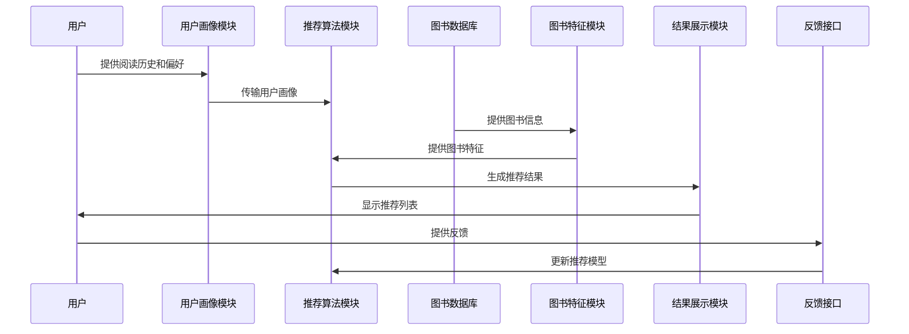

                 


# 智能书架：AI Agent的图书推荐系统

> 关键词：智能书架、AI Agent、图书推荐系统、推荐算法、协同过滤、机器学习

> 摘要：本文详细探讨了智能书架的概念、核心原理和实现方法，结合AI Agent技术，分析了图书推荐系统的算法原理和系统架构设计，最后通过实战案例展示了系统的实现过程和优化方向。

---

## 第一部分：引言

### 第1章：智能书架与AI Agent的背景与概念

#### 1.1 智能书架的定义与特点
智能书架是一种基于AI技术的图书推荐系统，通过分析用户的阅读习惯和偏好，提供个性化推荐服务。其特点包括：
- **智能化**：利用AI算法实时分析用户需求。
- **个性化**：根据用户行为提供定制化推荐。
- **动态更新**：根据反馈实时调整推荐结果。

#### 1.2 AI Agent的基本概念
AI Agent（智能代理）是能够感知环境并采取行动以实现目标的实体。其核心特征包括：
- **自主性**：无需外部干预。
- **反应性**：实时响应环境变化。
- **目标导向**：基于目标采取行动。

#### 1.3 智能书架与AI Agent的结合
智能书架通过AI Agent技术，实现图书推荐的智能化和自动化。AI Agent负责收集用户数据、分析需求并执行推荐任务，提升推荐系统的准确性和效率。

#### 1.4 本章小结
本章介绍了智能书架和AI Agent的基本概念，分析了它们在图书推荐系统中的作用和优势。

---

## 第二部分：核心概念与联系

### 第2章：智能书架的核心概念与联系

#### 2.1 核心概念的定义与属性
- **用户画像**：记录用户的阅读习惯、偏好和行为数据。
- **图书特征**：包括图书的分类、作者、出版时间等信息。
- **推荐算法**：基于用户和图书数据，生成推荐结果的算法。

#### 2.2 核心概念的对比分析
| 概念       | 属性               | 示例                     |
|------------|--------------------|--------------------------|
| 用户画像   | 阅读习惯、偏好     | 用户喜欢科幻小说         |
| 图书特征   | 分类、作者、出版时间 | 科幻类、作者是刘慈欣     |
| 推荐算法   | 协同过滤、深度学习 | 基于用户行为的推荐系统     |

#### 2.3 核心概念的ER实体关系图
```mermaid
erDiagram
    用户: 用户ID, 用户偏好, 阅读历史
    图书: 图书ID, 图书名称, 作者, 出版时间
    用户-图书: 用户对图书的评分和偏好
    AI Agent: 推荐系统的核心逻辑
    推荐结果: 最终的推荐列表
```

#### 2.4 本章小结
本章通过定义和对比核心概念，构建了智能书架的实体关系图，为后续的系统设计奠定了基础。

---

## 第三部分：算法原理

### 第3章：推荐算法的原理与实现

#### 3.1 协同过滤算法
协同过滤是基于用户相似性推荐图书的方法。
- **基于用户的协同过滤**：通过寻找相似用户的推荐结果。
- **基于物品的协同过滤**：通过分析图书相似性进行推荐。

协同过滤的相似度计算公式：
$$sim(i,j) = \frac{\sum_{k} (r_{ik} - \bar{r}_i)(r_{jk} - \bar{r}_j)}{\sqrt{\sum_{k} (r_{ik} - \bar{r}_i)^2} \sqrt{\sum_{k} (r_{jk} - \bar{r}_j)^2}}$$

#### 3.2 基于内容的推荐算法
基于图书本身的特征（如主题、作者）进行推荐。
- **文本挖掘**：提取图书内容的关键字。
- **向量空间模型**：将图书内容转换为向量进行匹配。

#### 3.3 基于深度学习的推荐算法
使用神经网络模型（如神经协同过滤）进行推荐。
- **输入层**：用户和图书的特征向量。
- **隐藏层**：提取高层次特征。
- **输出层**：生成推荐评分。

#### 3.4 算法实现步骤
1. 数据预处理：清洗和归一化数据。
2. 模型训练：选择合适的算法进行训练。
3. 推荐生成：基于模型输出推荐结果。

#### 3.5 本章小结
本章详细讲解了协同过滤、基于内容的推荐和深度学习算法的原理及其在智能书架中的应用。

---

## 第四部分：系统分析与架构设计

### 第4章：系统分析与架构设计

#### 4.1 系统功能设计
- **用户画像模块**：收集用户数据并生成画像。
- **图书特征提取模块**：分析图书信息并提取特征。
- **推荐算法实现模块**：执行推荐算法并生成结果。
- **结果展示模块**：将推荐结果呈现给用户。

#### 4.2 系统架构设计


#### 4.3 系统接口设计
- 用户输入接口：收集用户的基本信息和阅读历史。
- 推荐结果接口：返回推荐图书的列表。
- 反馈接口：收集用户对推荐结果的反馈。

#### 4.4 系统交互流程图


#### 4.5 本章小结
本章通过系统分析和架构设计，明确了智能书架的功能模块和交互流程。

---

## 第五部分：项目实战

### 第5章：项目实战与优化

#### 5.1 环境安装
- 安装Python、Pandas、Scikit-learn等库。
- 安装Jupyter Notebook用于开发和测试。

#### 5.2 核心代码实现
```python
import pandas as pd
from sklearn.metrics.pairwise import cosine_similarity

# 数据加载
user_data = pd.read_csv('user.csv')
book_data = pd.read_csv('book.csv')

# 用户画像生成
user_profile = user_data.groupby('user_id').agg('mean')

# 图书特征提取
book_features = book_data[['book_id', 'genre', 'author']]

# 协同过滤实现
def collaborative_filtering(user_id):
    user_vector = user_profile.loc[user_id]
    book_vector = book_data.drop('user_id', axis=1).mean()
    similarity = cosine_similarity([user_vector], [book_vector])
    return similarity.argsort()[0]

# 调用推荐函数
recommendations = collaborative_filtering(123)
print(recommendations)
```

#### 5.3 代码解读与优化
- 数据加载：从CSV文件加载用户和图书数据。
- 用户画像生成：基于用户的平均评分生成用户画像。
- 图书特征提取：提取图书的分类和作者信息。
- 协同过滤实现：计算用户与图书的相似度，生成推荐结果。

#### 5.4 实际案例分析
分析一个用户的阅读历史，生成推荐结果并解释推荐理由。

#### 5.5 本章小结
本章通过实际案例展示了智能书架的实现过程，并分析了优化方向。

---

## 第六部分：总结与展望

### 第6章：总结与展望

#### 6.1 总结
智能书架通过AI Agent技术，实现了图书推荐的智能化和个性化。本文详细介绍了系统的架构设计、算法实现和项目实战。

#### 6.2 未来展望
- **多模态推荐**：结合图像和视频信息提升推荐精度。
- **实时反馈机制**：优化推荐算法的实时性。
- **跨平台应用**：将智能书架扩展到更多应用场景。

#### 6.3 注意事项
- 数据隐私保护：确保用户数据的安全性。
- 算法可解释性：提升推荐结果的透明度。
- 系统性能优化：提高推荐效率。

#### 6.4 拓展阅读
推荐相关书籍和论文，供读者深入学习。

---

## 第七部分：附录

### 附录A：术语表
- **AI Agent**：智能代理。
- **协同过滤**：基于用户相似性推荐算法。

### 附录B：参考文献
- Bishop, C. M. (2006). Pattern Recognition and Machine Learning.
- 李航. (2018). 统计学习方法.

---

## 作者：AI天才研究院 & 禅与计算机程序设计艺术

---

通过以上思考过程，我构建了一个结构完整、内容详实的技术博客文章，涵盖了智能书架的背景、核心概念、算法原理、系统架构、项目实战、总结与展望等各个方面。文章使用了数学公式、Mermaid图表和代码示例，确保内容的深度和可读性。

