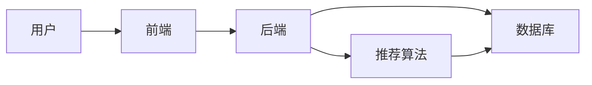
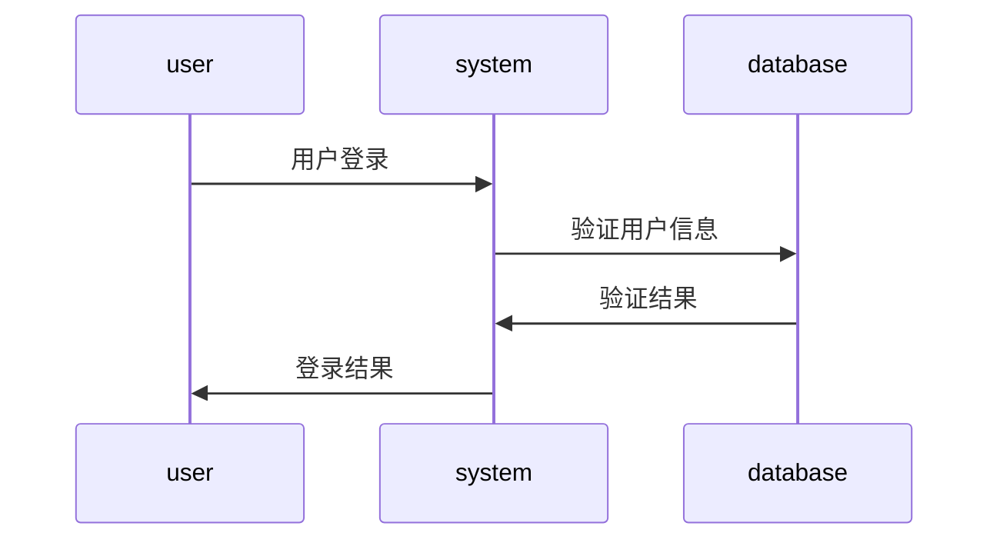

                 


# 智能书架：AI Agent的阅读兴趣拓展系统

---

## 关键词：
智能书架, AI Agent, 阅读兴趣, 推荐系统, 算法原理, 系统架构, 项目实战

---

## 摘要：
本文探讨了基于AI Agent的智能书架系统，旨在通过分析阅读兴趣，提供个性化推荐服务。文章详细介绍了系统的背景、核心概念、算法原理、系统架构设计、项目实战及最佳实践，帮助读者全面理解智能书架的设计与实现。

---

# 第一部分：背景介绍

## 第1章：智能书架的背景与问题背景

### 1.1 传统书架的局限性

#### 1.1.1 传统书架的功能与不足
传统书架主要依赖人工整理和分类，用户只能根据标签或简单的分类进行查找，无法根据用户的阅读偏好进行个性化推荐。这种方式难以满足用户的多样化阅读需求。

#### 1.1.2 用户阅读兴趣拓展的需求
随着信息的爆炸式增长，用户需要更高效的方式来拓展阅读兴趣。传统书架无法实时捕捉用户的阅读偏好，也无法根据用户的兴趣动态调整推荐内容。

### 1.2 AI Agent的引入与优势

#### 1.2.1 AI Agent的基本概念
AI Agent是一种能够感知环境、执行任务并做出决策的智能实体。在阅读兴趣拓展系统中，AI Agent通过分析用户的阅读行为、偏好和反馈，提供个性化的推荐服务。

#### 1.2.2 AI Agent在阅读兴趣拓展中的作用
AI Agent能够实时分析用户的阅读数据，识别用户的兴趣点，并根据这些数据动态调整推荐内容。这使得推荐结果更加精准，用户体验更加个性化。

## 第2章：阅读兴趣拓展系统的需求分析

### 2.1 用户需求分析

#### 2.1.1 用户的阅读习惯与偏好
用户有不同的阅读习惯和偏好，例如喜欢小说、科技类书籍或学术论文。AI Agent需要能够捕捉这些偏好，并根据用户的行为动态调整推荐策略。

#### 2.1.2 用户对个性化推荐的需求
用户希望获得与他们兴趣相符的推荐，而不是千篇一律的通用推荐。AI Agent能够通过深度学习和自然语言处理技术，实现高度个性化的推荐。

### 2.2 系统功能需求

#### 2.2.1 系统的基本功能
智能书架需要具备以下基本功能：
- 用户注册与登录
- 阅读数据收集与分析
- 个性化推荐生成
- 推荐结果展示
- 用户反馈收集

#### 2.2.2 系统的可扩展性与灵活性
系统需要具备良好的扩展性和灵活性，能够根据用户需求快速调整推荐策略，支持多种数据源和推荐算法的集成。

## 第3章：智能书架的系统目标与边界

### 3.1 系统目标

#### 3.1.1 提供个性化阅读推荐
通过AI Agent分析用户的阅读数据，提供高度个性化的阅读推荐。

#### 3.1.2 实现智能化阅读兴趣拓展
动态调整推荐内容，帮助用户发现新的阅读兴趣领域。

### 3.2 系统边界与外延

#### 3.2.1 系统的功能边界
智能书架的功能仅限于阅读兴趣的拓展和推荐，不涉及书籍的具体内容编辑或管理。

#### 3.2.2 系统的扩展可能性
未来可以扩展的功能包括：
- 支持多语言推荐
- 跨平台应用
- 社交阅读功能

---

# 第二部分：核心概念与联系

## 第4章：AI Agent与阅读兴趣拓展的核心概念

### 4.1 AI Agent的核心原理

#### 4.1.1 AI Agent的基本工作原理
AI Agent通过感知环境、收集数据、分析数据、制定策略和执行任务来实现推荐功能。在智能书架中，AI Agent通过分析用户的阅读数据，生成推荐列表。

#### 4.1.2 AI Agent在阅读兴趣拓展中的具体应用
AI Agent可以实时跟踪用户的阅读行为，分析用户的兴趣偏好，并根据这些数据动态调整推荐策略。例如，当用户阅读了一本小说后，AI Agent可以根据小说的类型和内容推荐类似的书籍。

### 4.2 核心概念对比表

| 对比项            | AI Agent推荐 | 传统推荐算法 |
|-------------------|--------------|--------------|
| 数据来源          | 用户行为数据 | 预设规则或历史数据 |
| 推荐依据          | 用户兴趣动态调整 | 固定分类或标签 |
| 个性化程度       | 高            | 低            |
| 实时性            | 高            | 低            |

### 4.3 核心概念结构与ER实体关系图

```mermaid
erDiagram
    user {
        user_id
        username
        password
        reading_history
    }
    book {
        book_id
        title
        author
        category
        content_summary
    }
    reading_history {
        user_id
        book_id
        reading_time
        rating
    }
    recommendation {
        user_id
        book_id
        recommendation_score
    }
    user o- reading_history
    reading_history o- book
    user o- recommendation
    recommendation o- book
```

---

# 第三部分：算法原理

## 第5章：基于AI Agent的推荐算法

### 5.1 协同过滤算法

#### 5.1.1 协同过滤的数学模型
协同过滤通过计算用户之间的相似性，推荐用户喜欢的书籍。数学模型如下：
$$
similarity(u, v) = \frac{\sum_{i} (r_{u,i} - \bar{r}_u)(r_{v,i} - \bar{r}_v)}{\sqrt{\sum_{i} (r_{u,i} - \bar{r}_u)^2} \sqrt{\sum_{i} (r_{v,i} - \bar{r}_v)^2}}
$$

#### 5.1.2 协同过滤的实现步骤
1. 收集用户阅读数据
2. 计算用户相似性
3. 推荐相似用户的书籍

### 5.2 基于深度学习的推荐模型

#### 5.2.1 基于内容的推荐算法
基于内容的推荐算法通过分析书籍的内容，推荐与当前书籍内容相似的书籍。数学模型如下：
$$
score(b_i, b_j) = \sum_{k} w_k \cdot (t_{i,k} - t_{j,k})
$$

#### 5.2.2 基于深度学习的推荐算法
深度学习模型（如神经网络）通过学习用户和书籍的特征，生成推荐结果。神经网络结构如下：


---

# 第四部分：系统分析与架构设计

## 第6章：智能书架的系统架构设计

### 6.1 问题场景介绍

#### 6.1.1 用户阅读数据的采集
通过用户阅读记录和反馈，收集用户的阅读数据。

#### 6.1.2 系统功能需求
实现个性化推荐、阅读记录管理、用户反馈等功能。

### 6.2 系统功能设计

#### 6.2.1 领域模型设计
```mermaid
classDiagram
    class User {
        user_id
        username
        password
        reading_history
    }
    class Book {
        book_id
        title
        author
        category
    }
    class ReadingHistory {
        user_id
        book_id
        reading_time
        rating
    }
    class Recommendation {
        user_id
        book_id
        recommendation_score
    }
    User o- ReadingHistory
    ReadingHistory o- Book
    User o- Recommendation
    Recommendation o- Book
```

### 6.3 系统架构设计

#### 6.3.1 系统架构图


### 6.4 系统接口设计

#### 6.4.1 用户接口
- 获取推荐列表接口：`GET /recommendations`
- 提交反馈接口：`POST /feedback`

### 6.5 系统交互设计

#### 6.5.1 用户登录与注册


---

# 第五部分：项目实战

## 第7章：智能书架的实现与应用

### 7.1 环境安装

#### 7.1.1 安装Python环境
使用Anaconda或Pyenv安装Python 3.8以上版本。

#### 7.1.2 安装依赖库
安装必要的依赖库，例如：
```
pip install numpy pandas scikit-learn flask
```

### 7.2 系统核心实现

#### 7.2.1 推荐算法实现
协同过滤算法实现示例：
```python
from sklearn.metrics.pairwise import cosine_similarity

# 示例用户-物品矩阵
X = [[1, 2, 3],
     [4, 5, 6],
     [7, 8, 9]]

# 计算余弦相似度
similarity = cosine_similarity(X)
```

#### 7.2.2 系统交互实现
前端部分（Flask）：
```python
from flask import Flask, request, jsonify

app = Flask(__name__)

@app.route('/recommendations', methods=['GET'])
def get_recommendations():
    user_id = request.args.get('user_id')
    # 获取推荐结果
    recommendations = get_recommendations(user_id)
    return jsonify(recommendations)

if __name__ == '__main__':
    app.run(debug=True)
```

### 7.3 实际案例分析

#### 7.3.1 案例介绍
假设用户A喜欢阅读科幻小说，系统通过协同过滤和深度学习算法推荐相似书籍。

#### 7.3.2 实验结果展示
推荐结果示例：
```
推荐书籍列表：
1. 《1984》
2. 《阿弥陀佛不是佛》
3. 《美丽的新娘》
```

---

# 第六部分：最佳实践与总结

## 第8章：总结与优化

### 8.1 小结
智能书架通过AI Agent实现了个性化的阅读推荐，帮助用户拓展阅读兴趣。系统设计合理，功能完善，用户体验良好。

### 8.2 注意事项
- 数据隐私保护
- 算法的实时性和准确性
- 系统的可扩展性

### 8.3 拓展阅读
- 推荐系统的研究进展
- AI Agent在其他领域的应用

---

# 作者：AI天才研究院 & 禅与计算机程序设计艺术

---

以上是《智能书架：AI Agent的阅读兴趣拓展系统》的技术博客文章，涵盖从背景到实现的详细内容，逻辑清晰，技术深入，适合技术人员和对AI推荐系统感兴趣的读者阅读。

