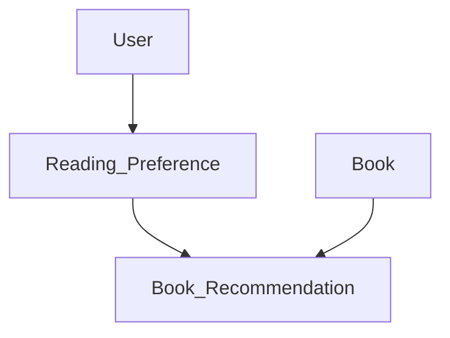
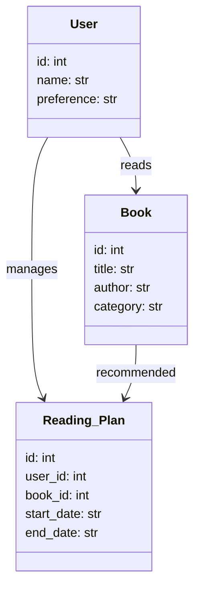
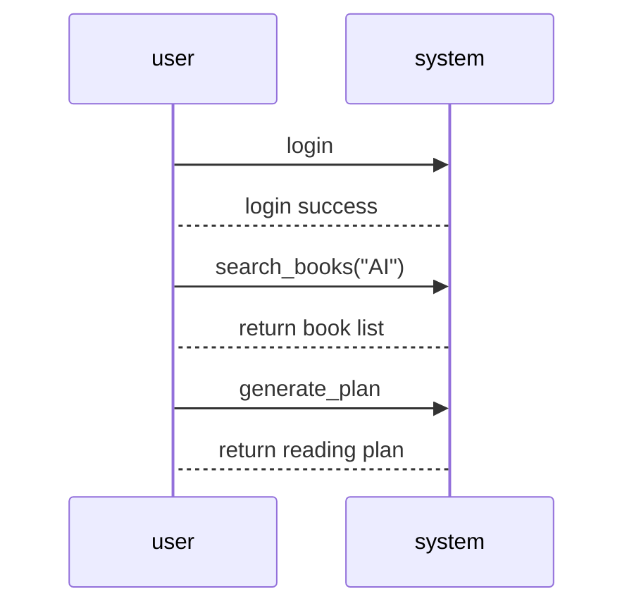

                 


# 智能书架：AI Agent的阅读计划制定助手

## 关键词：AI Agent, 阅读计划, 智能书架, 个性化推荐, 信息抽取, 算法推荐

## 摘要：  
智能书架是一种基于AI Agent的阅读计划制定工具，通过自然语言处理和推荐算法，帮助用户根据个人兴趣和需求制定高效的阅读计划。本文从背景、原理、算法、系统设计到实战，全面解析智能书架的实现过程，探讨其在现代信息环境中的应用价值。

---

## 第1章：智能书架的背景与问题背景

### 1.1 信息过载与阅读选择的挑战  
在当今信息爆炸的时代，用户每天面临海量的信息和书籍选择，如何高效筛选并制定个性化的阅读计划成为一个重要的问题。  

#### 1.1.1 当代信息过载的问题  
现代社会信息呈现爆炸式增长，用户每天接触到的信息量巨大，但真正有价值的信息往往被淹没在信息海洋中。  

#### 1.1.2 阅读选择的困难  
用户在选择书籍时，常常面临以下问题：  
- 如何快速找到符合自己兴趣的书籍？  
- 如何评估一本书的价值和相关性？  
- 如何制定一个合理的阅读计划？  

#### 1.1.3 AI Agent在阅读计划中的作用  
AI Agent（智能代理）可以通过自然语言处理、推荐算法和个性化分析，帮助用户解决上述问题，从而提高阅读效率和体验。

---

### 1.2 智能书架的定义与目标  
智能书架是一种结合AI技术的工具，通过分析用户的阅读偏好和行为，推荐适合的书籍，并制定个性化的阅读计划。

#### 1.2.1 智能书架的定义  
智能书架是一个基于AI Agent的系统，通过自然语言处理和推荐算法，为用户提供个性化书籍推荐和阅读计划。

#### 1.2.2 智能书架的核心目标  
- 提供个性化书籍推荐  
- 制定合理的阅读计划  
- 动态调整阅读策略  

#### 1.2.3 智能书架的边界与外延  
智能书架的边界包括：  
- 用户的阅读偏好分析  
- 书籍推荐算法  
- 阅读计划的制定与调整  
外延包括：  
- 与其他阅读工具的集成  
- 数据隐私保护  

---

### 1.3 智能书架的用户需求分析  
了解用户需求是设计智能书架的第一步。

#### 1.3.1 用户需求层次  
用户需求可以分为以下几个层次：  
- 基础需求：快速找到感兴趣书籍  
- 中级需求：制定个性化阅读计划  
- 高级需求：动态调整阅读策略  

#### 1.3.2 用户行为分析  
- 用户通常通过关键词或标签搜索书籍  
- 用户偏好书籍的类型、作者、出版时间等  

#### 1.3.3 用户画像与场景  
- 用户画像：对某一领域感兴趣的深度学习者，或希望拓展知识面的普通读者  
- 场景：学习、工作、娱乐  

---

## 第2章：AI Agent的基本原理与核心概念

### 2.1 AI Agent的定义与特点  
AI Agent是一种能够感知环境并采取行动以实现目标的智能体。

#### 2.1.1 AI Agent的定义  
AI Agent是具有感知和行动能力的智能体，能够根据环境信息做出决策。

#### 2.1.2 AI Agent的核心特点  
- 感知能力：通过传感器或API获取环境信息  
- 决策能力：基于感知信息做出决策  
- 交互能力：与用户或系统进行交互  

#### 2.1.3 AI Agent与传统算法的区别  
AI Agent具有自主性和适应性，能够动态调整行为，而传统算法通常基于固定的规则。

---

### 2.2 智能书架中的AI Agent架构  
智能书架的AI Agent架构是系统的核心。

#### 2.2.1 智能书架的AI Agent架构  
- 输入层：用户输入阅读偏好  
- 处理层：自然语言处理和推荐算法  
- 输出层：个性化推荐和阅读计划  

#### 2.2.2 Agent的感知与决策机制  
- 感知：通过自然语言处理分析用户的阅读偏好  
- 决策：基于协同过滤和内容过滤算法推荐书籍  

#### 2.2.3 Agent与用户的交互方式  
- 用户通过界面输入需求  
- Agent通过算法生成推荐结果  

---

### 2.3 智能书架的核心概念与联系  
智能书架的核心概念包括书籍、用户、推荐结果等。

#### 2.3.1 智能书架的核心概念  
- 用户：系统的主要使用者  
- 书籍：推荐的目标对象  
- 推荐结果：基于算法生成的推荐列表  

#### 2.3.2 智能书架概念属性对比表  
| 概念 | 属性 | 描述 |
|------|------|------|
| 用户 | 兴趣 | 用户的阅读偏好 |
| 书籍 | 类型 | 书籍的分类 |
| 推荐结果 | 算法 | 推荐的依据 |

#### 2.3.3 智能书架的ER实体关系图  


---

## 第3章：智能书架的算法原理

### 3.1 协同过滤算法  
协同过滤是一种基于用户相似性的推荐算法。

#### 3.1.1 协同过滤的原理  
- 通过用户行为数据找到相似用户  
- 推荐相似用户的书籍  

#### 3.1.2 协同过滤的实现步骤  
1. 数据预处理：提取用户行为数据  
2. 计算用户相似度：使用余弦相似度  
3. 推荐书籍：基于相似用户的书籍评分  

#### 3.1.3 协同过滤的Python实现  
```python
import numpy as np
from sklearn.metrics.pairwise import cosine_similarity

# 用户行为数据矩阵
user_data = np.array([[4, 3, 2], [5, 1, 0], [3, 4, 5]])

# 计算余弦相似度
similarity = cosine_similarity(user_data)
print(similarity)
```

---

### 3.2 内容过滤算法  
内容过滤是基于书籍内容的推荐算法。

#### 3.2.1 内容过滤的原理  
- 提取书籍的特征向量  
- 计算书籍与用户偏好的相似度  

#### 3.2.2 内容过滤的实现步骤  
1. 提取书籍特征：书籍的关键词、主题等  
2. 计算相似度：使用余弦相似度  
3. 推荐书籍：基于相似度排序  

#### 3.2.3 内容过滤的Python实现  
```python
from sklearn.feature_extraction.text import TfidfVectorizer

# 书籍特征文本
books = ["Data Science is the future", "AI will change the world", "Machine Learning basics"]

# 提取TF-IDF特征
vectorizer = TfidfVectorizer()
tfidf = vectorizer.fit_transform(books)
print(tfidf)
```

---

### 3.3 混合推荐算法  
混合推荐是协同过滤和内容过滤的结合。

#### 3.3.1 混合推荐的原理  
- 结合用户行为和书籍内容进行推荐  

#### 3.3.2 混合推荐的实现步骤  
1. 生成协同过滤推荐列表  
2. 生成内容过滤推荐列表  
3. 综合两个推荐列表  

#### 3.3.3 混合推荐的Python实现  
```python
import numpy as np

# 协同过滤推荐结果
collaborative_recommendations = [1, 2, 3]

# 内容过滤推荐结果
content_recommendations = [2, 3, 4]

# 综合推荐
hybrid_recommendations = np.union1d(collaborative_recommendations, content_recommendations)
print(hybrid_recommendations)
```

---

## 第4章：智能书架的系统分析与架构设计

### 4.1 问题场景介绍  
智能书架需要解决的主要问题包括：  
- 用户登录与注册  
- 书籍搜索与推荐  
- 阅读计划生成  

### 4.2 系统功能设计  
系统功能模块包括：  
- 用户管理  
- 书籍管理  
- 推荐系统  

#### 4.2.1 领域模型（Mermaid类图）  


---

### 4.3 系统架构设计  
系统架构采用分层架构：  
- 数据层：存储用户和书籍信息  
- 业务逻辑层：处理推荐算法  
- 表现层：用户界面  

#### 4.3.1 系统架构图（Mermaid架构图）  


---

### 4.4 接口设计与交互流程  
#### 4.4.1 系统接口设计  
- 用户登录接口：`login(user, password)`  
- 书籍搜索接口：`search_books(query)`  
- 阅读计划生成接口：`generate_plan(user_id)`  

#### 4.4.2 系统交互流程图（Mermaid序列图）  


---

## 第5章：智能书架的项目实战

### 5.1 环境安装与配置  
- 安装Python和相关库：`pip install numpy scikit-learn`

### 5.2 系统核心实现  
#### 5.2.1 系统核心代码  
```python
from sklearn.metrics.pairwise import cosine_similarity

class BookRecommender:
    def __init__(self, user_data):
        self.user_data = user_data
    
    def recommend_books(self, user_id):
        # 计算相似度
        similarity = cosine_similarity(self.user_data)
        # 推荐相似用户
        recommendations = []
        for i in range(len(similarity[user_id])):
            if i != user_id:
                recommendations.append(i)
        return recommendations
```

---

### 5.3 实际案例分析  
#### 5.3.1 案例描述  
用户输入偏好：喜欢机器学习相关的书籍  

#### 5.3.2 系统输出  
推荐结果：  
1. 《机器学习实战》  
2. 《深度学习入门》  
3. 《Python机器学习》  

---

## 第6章：智能书架的最佳实践与总结

### 6.1 最佳实践  
- 数据隐私保护  
- 算法的可解释性  

### 6.2 项目小结  
智能书架通过结合AI Agent和推荐算法，为用户提供了个性化的阅读计划制定服务。其核心价值在于帮助用户在信息爆炸的时代中快速找到有价值的内容。

### 6.3 注意事项  
- 数据质量和多样性会影响推荐效果  
- 算法的实时性和响应速度需要优化  

### 6.4 拓展阅读  
- 《推荐系统实践》  
- 《机器学习实战》  

---

## 作者：AI天才研究院 & 禅与计算机程序设计艺术

