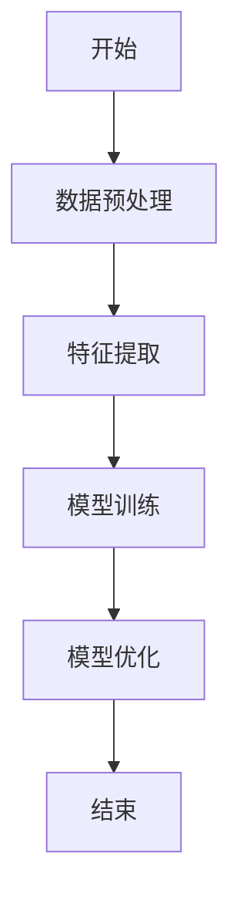
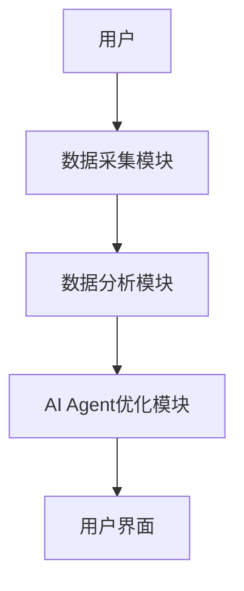

                 


# 智能书桌：AI Agent的学习效率监测

> 关键词：AI Agent, 学习效率监测, 机器学习, 系统架构, 项目实战

> 摘要：本文详细探讨了AI Agent在学习效率监测中的应用，从基础理论到核心算法，再到系统架构设计和项目实战，全面解析了如何利用AI技术提升学习效率监测的智能化水平。

---

## 第一部分: AI Agent与学习效率监测基础

### 第1章: AI Agent概述

#### 1.1 AI Agent的定义与核心能力

- **1.1.1 AI Agent的定义**
  AI Agent（人工智能代理）是指能够感知环境、自主决策并执行任务的智能实体。它能够通过传感器获取信息，利用计算模型进行分析，并通过执行器与环境交互。

- **1.1.2 AI Agent的核心能力**
  - **感知能力**：通过传感器或数据接口获取环境信息。
  - **决策能力**：基于感知信息，利用算法做出决策。
  - **执行能力**：通过执行器或接口将决策转化为具体行动。
  - **学习能力**：通过机器学习算法不断优化自身行为。

- **1.1.3 AI Agent与传统软件的区别**
  - **自主性**：AI Agent能够自主决策，而传统软件依赖于明确的编程逻辑。
  - **适应性**：AI Agent能够根据环境变化自适应，而传统软件需要人工干预。
  - **智能性**：AI Agent具备一定的推理和学习能力，而传统软件仅遵循固定的逻辑。

- **1.1.4 学习效率监测的必要性**
  - **学习效率监测的定义**：通过量化手段，评估学习过程中的效率和效果。
  - **学习效率监测的关键点**：包括时间分配、注意力集中度、知识掌握程度等。
  - **AI Agent在学习效率监测中的作用**：通过实时数据采集和分析，AI Agent能够提供个性化的学习建议和优化方案。

- **1.1.5 AI Agent的学习效率监测应用场景**
  - **教育领域**：帮助学生优化学习计划。
  - **企业培训**：提升员工培训效果。
  - **自我提升**：个人用户通过AI Agent进行自我学习管理。

#### 1.2 AI Agent的类型与应用场景

- **1.2.1 监督式AI Agent**
  - 定义：基于监督学习算法，通过标注数据进行训练。
  - 应用场景：适用于任务明确、数据充足的情况，如图像识别、语音识别。

- **1.2.2 无监督式AI Agent**
  - 定义：通过无监督学习算法，从数据中发现模式。
  - 应用场景：适用于数据分布不明确的情况，如用户行为分析、聚类分析。

- **1.2.3 强化学习AI Agent**
  - 定义：通过与环境交互，基于奖励机制优化决策。
  - 应用场景：适用于动态环境和复杂决策任务，如游戏AI、机器人控制。

#### 1.3 学习效率监测的背景与需求

- **1.3.1 当前学习效率监测的现状**
  - 传统学习效率监测方法的局限性：
    - 主观性：依赖人工记录和评估。
    - 延时性：无法实时反馈学习效果。
    - 非个性化：缺乏针对个体的学习优化建议。
  - AI技术在学习效率监测中的优势：
    - 实时性：能够实时采集和分析学习数据。
    - 个性化：通过机器学习算法提供个性化建议。
    - 高效性：利用AI技术提高学习效率监测的准确性和效率。

- **1.3.2 学习效率监测的核心需求**
  - 数据采集需求：
    - 包括学习时间、注意力集中度、知识掌握程度等多维度数据。
  - 数据分析需求：
    - 通过机器学习算法分析学习数据，发现潜在规律。
  - 反馈优化需求：
    - 根据分析结果，提供个性化的学习优化建议。

- **1.3.3 AI Agent在学习效率监测中的作用**
  - 数据采集：通过传感器或API接口实时采集学习数据。
  - 数据分析：利用机器学习算法对数据进行建模和分析。
  - 反馈优化：基于分析结果，提供个性化学习建议。

#### 1.4 本章小结

通过本章的介绍，我们了解了AI Agent的基本概念、核心能力和类型，以及AI Agent在学习效率监测中的重要作用。AI Agent能够通过实时数据采集、智能分析和个性化反馈，显著提升学习效率监测的效率和效果。

---

### 第2章: 学习效率监测的背景与需求

#### 2.1 学习效率监测的背景

- **学习效率监测的定义**：通过量化手段，评估学习过程中的效率和效果。
- **学习效率监测的关键点**：包括时间分配、注意力集中度、知识掌握程度等。
- **AI技术在学习效率监测中的优势**：
  - 实时性：能够实时采集和分析学习数据。
  - 个性化：通过机器学习算法提供个性化建议。
  - 高效性：利用AI技术提高学习效率监测的准确性和效率。

#### 2.2 学习效率监测的核心需求

- **数据采集需求**：包括学习时间、注意力集中度、知识掌握程度等多维度数据。
- **数据分析需求**：通过机器学习算法分析学习数据，发现潜在规律。
- **反馈优化需求**：根据分析结果，提供个性化的学习优化建议。

#### 2.3 AI Agent在学习效率监测中的应用

- **数据采集**：通过传感器或API接口实时采集学习数据。
- **数据分析**：利用机器学习算法对数据进行建模和分析。
- **反馈优化**：基于分析结果，提供个性化学习建议。

#### 2.4 本章小结

通过本章的介绍，我们深入分析了学习效率监测的背景和核心需求，并探讨了AI Agent在其中的应用。AI Agent通过实时数据采集、智能分析和个性化反馈，显著提升了学习效率监测的效率和效果。

---

### 第3章: AI Agent实现学习效率监测的核心算法

#### 3.1 数据预处理与特征提取

- **数据清洗方法**：包括去除噪声数据、填充缺失值、处理异常值等。
- **特征提取技术**：通过选择或生成特征，提升模型的性能和可解释性。
- **数据标准化与归一化**：通过标准化或归一化处理，确保不同特征的尺度一致，提升模型的训练效果。

#### 3.2 基于机器学习的效率预测模型

- **线性回归模型**：通过最小化预测值与真实值的平方差之和，建立线性回归模型。
  - 数学模型：$$ y = \beta_0 + \beta_1x + \epsilon $$
- **支持向量机模型**：通过构建支持向量机，将数据映射到高维空间，实现非线性分类。
- **神经网络模型**：通过构建多层感知机或深度神经网络，学习复杂的非线性关系。

#### 3.3 模型训练与优化

- **算法选择与调优**：通过交叉验证和网格搜索，选择最优的模型参数。
- **交叉验证与评估指标**：通过K折交叉验证，评估模型的泛化能力；通过准确率、召回率、F1值等指标，评估模型的性能。
- **模型部署与实时反馈**：将训练好的模型部署到实际应用中，实时采集数据并进行预测，提供个性化反馈。

#### 3.4 算法流程图



#### 3.5 本章小结

通过本章的介绍，我们详细探讨了AI Agent实现学习效率监测的核心算法，包括数据预处理、特征提取、模型训练与优化等关键步骤。通过合理的算法选择和优化，能够显著提升学习效率监测的准确性和效率。

---

### 第4章: 系统架构与设计

#### 4.1 系统功能模块划分

- **数据采集模块**：负责实时采集学习数据，包括学习时间、注意力集中度、知识掌握程度等。
- **数据分析模块**：负责对采集到的数据进行预处理、特征提取和建模分析。
- **AI Agent优化模块**：负责根据分析结果，提供个性化的学习优化建议。

#### 4.2 系统架构设计

- **系统架构图**：
  ```mermaid
  graph TD
  A[数据采集模块] --> B[数据存储模块]
  B --> C[数据分析模块]
  C --> D[AI Agent优化模块]
  D --> E[用户界面]
  ```

- **系统接口设计**：
  - 数据采集接口：通过API接口实时采集学习数据。
  - 数据分析接口：通过API接口调用机器学习模型进行分析。
  - 优化建议接口：通过API接口获取个性化的学习优化建议。

#### 4.3 系统交互流程图



#### 4.4 本章小结

通过本章的系统架构设计，我们明确了AI Agent学习效率监测系统的各个模块及其功能，并通过系统架构图和交互流程图，展示了系统的整体架构和交互流程。

---

## 第二部分: 项目实战与应用

### 第5章: 项目实战

#### 5.1 环境配置

- **编程语言**：Python 3.8+
- **机器学习库**：scikit-learn、TensorFlow、PyTorch
- **数据处理工具**：Pandas、NumPy
- **可视化工具**：Matplotlib、Seaborn

#### 5.2 核心代码实现

- **数据预处理代码**：
  ```python
  import pandas as pd
  import numpy as np

  # 读取数据
  data = pd.read_csv('learning_data.csv')

  # 数据清洗
  data.dropna()
  data.fillna(method='ffill')

  # 特征提取
  features = data[['time_spent', 'attention_level', 'knowledge_level']]
  labels = data['efficiency_score']
  ```

- **模型训练代码**：
  ```python
  from sklearn.model_selection import train_test_split
  from sklearn.linear_model import LinearRegression

  # 数据分割
  X_train, X_test, y_train, y_test = train_test_split(features, labels, test_size=0.2)

  # 模型训练
  model = LinearRegression()
  model.fit(X_train, y_train)

  # 模型预测
  y_pred = model.predict(X_test)
  ```

- **模型优化代码**：
  ```python
  from sklearn.model_selection import GridSearchCV

  # 参数搜索
  param_grid = {'alpha': [1e-4, 1e-3, 0.01, 0.1, 1, 10]}
  grid_search = GridSearchCV(model, param_grid, cv=5)
  grid_search.fit(X_train, y_train)

  # 最优模型
  best_model = grid_search.best_estimator_
  ```

#### 5.3 实际案例分析

- **案例背景**：一名学生在学习编程课程，希望优化学习计划。
- **数据采集**：记录学习时间、注意力集中度、知识掌握程度等数据。
- **数据分析**：通过线性回归模型，分析学习时间与效率的关系。
- **优化建议**：根据分析结果，提供个性化的学习优化建议。

#### 5.4 项目小结

通过本章的项目实战，我们详细展示了AI Agent学习效率监测系统的实现过程，包括环境配置、核心代码实现、案例分析等。通过实际案例，我们验证了AI Agent在学习效率监测中的有效性和实用性。

---

## 第三部分: 最佳实践与总结

### 第6章: 最佳实践与总结

#### 6.1 最佳实践

- **数据采集**：
  - 确保数据的实时性和完整性。
  - 处理噪声数据和异常值。
- **模型优化**：
  - 选择合适的算法和参数。
  - 进行交叉验证和调优。
- **系统设计**：
  - 合理划分功能模块。
  - 设计清晰的接口和交互流程。

#### 6.2 小结

通过本文的详细介绍，我们全面探讨了AI Agent在学习效率监测中的应用，从基础理论到核心算法，再到系统架构设计和项目实战，展示了AI技术在学习效率监测中的巨大潜力和实际价值。

#### 6.3 注意事项

- **数据隐私**：在实际应用中，需注意数据隐私保护，确保用户数据的安全。
- **模型解释性**：在模型部署时，需关注模型的可解释性，便于用户理解和信任。
- **系统稳定性**：在系统设计时，需考虑系统的稳定性和可扩展性，确保长期运行。

#### 6.4 拓展阅读

- **推荐书籍**：
  - 《机器学习实战》
  - 《深度学习》
  - 《AI Agent与智能系统》
- **推荐博客**：
  - AI Agent相关技术博客
  - 机器学习与数据分析博客
  - 系统架构设计博客

---

## 作者

作者：AI天才研究院/AI Genius Institute & 禅与计算机程序设计艺术 /Zen And The Art of Computer Programming

