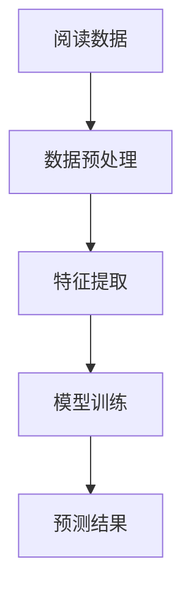
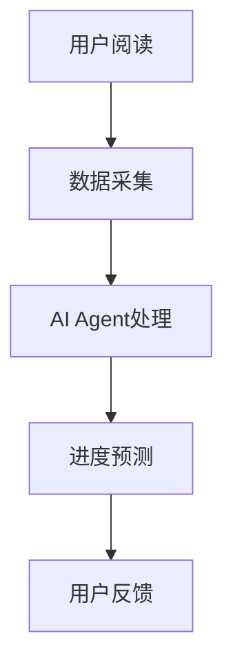
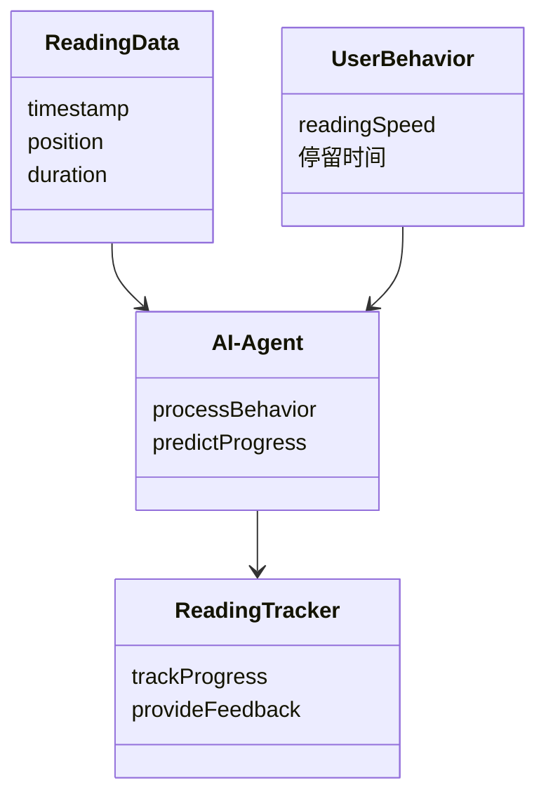
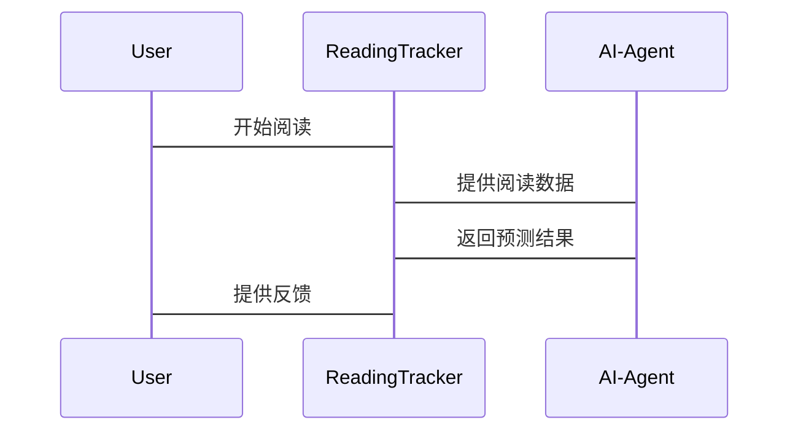

                 


# 智能书签：AI Agent的阅读进度追踪

> 关键词：智能书签，AI Agent，阅读进度追踪，自然语言处理，机器学习，用户行为分析

> 摘要：本文探讨了利用AI Agent技术实现智能书签的阅读进度追踪方法。通过分析阅读数据，结合自然语言处理和机器学习算法，构建一个能够实时追踪用户阅读进度、预测阅读速度并提供个性化反馈的智能系统。文章详细介绍了系统设计、算法原理、实现步骤和实际案例，为读者提供全面的技术解析。

---

## 第1章: 智能书签与AI Agent的背景介绍

### 1.1 问题背景与问题描述
#### 1.1.1 阅读进度追踪的痛点
在数字化阅读时代，用户每天接触的信息量巨大，如何有效追踪和管理阅读进度成为一个挑战。传统阅读工具只能记录阅读时间、位置等基本信息，无法深入分析阅读行为和理解内容。

#### 1.1.2 AI Agent在阅读追踪中的作用
AI Agent（智能代理）能够实时分析用户的阅读数据，识别阅读模式，预测阅读进度，甚至提供建议。这使得阅读管理更加智能化和个性化。

#### 1.1.3 当前阅读追踪工具的局限性
- 数据分析深度不足
- 无法个性化反馈
- 缺乏主动学习能力

### 1.2 问题解决与边界外延
#### 1.2.1 AI Agent如何解决阅读追踪问题
通过自然语言处理和机器学习，AI Agent可以实时分析阅读内容，预测用户兴趣点，优化阅读路径。

#### 1.2.2 智能书签的核心目标与边界
核心目标是实现精准的阅读进度追踪，边界包括仅关注阅读行为，不涉及其他用户数据。

### 1.3 智能书签的核心要素与概念结构
#### 1.3.1 核心概念的定义与特征
- **阅读数据**：包括阅读时间、位置、速度、停留时间等。
- **用户行为**：用户的阅读习惯、偏好等。
- **AI Agent**：负责数据处理和分析。

#### 1.3.2 智能书签的系统架构


#### 1.3.3 阅读进度追踪的关键要素
- 数据采集
- 行为分析
- 进度预测

---

## 第2章: AI Agent与阅读进度追踪的核心原理

### 2.1 AI Agent的基本原理
#### 2.1.1 AI Agent的定义与分类
- **定义**：能够感知环境并自主决策的智能体。
- **分类**：基于规则和基于学习的AI Agent。

#### 2.1.2 AI Agent的核心算法与技术
- **自然语言处理**：用于解析阅读内容。
- **机器学习**：用于预测阅读进度。

#### 2.1.3 AI Agent与阅读追踪的结合
通过实时数据流处理，AI Agent能够动态调整阅读进度预测模型。

### 2.2 阅读进度追踪的核心原理
#### 2.2.1 阅读数据的采集与处理
- 采集：通过API接口获取阅读数据。
- 处理：清洗和标准化数据。

#### 2.2.2 阅读行为的模式识别
- 使用聚类算法识别用户的阅读习惯。
- 示例：识别用户在阅读过程中常停留的页数。

#### 2.2.3 阅读进度的预测与反馈
- 预测：基于历史数据构建回归模型。
- 反馈：实时更新预测结果。

### 2.3 AI Agent与阅读进度追踪的关系
#### 2.3.1 AI Agent在阅读追踪中的角色
作为数据处理和分析的核心，AI Agent能够实时更新阅读进度预测。

#### 2.3.2 阅读进度追踪对AI Agent的促进作用
通过实际应用，提升AI Agent的自然语言处理和学习能力。

#### 2.3.3 两者协同工作流程


---

## 第3章: 阅读进度追踪的算法原理

### 3.1 算法概述
#### 3.1.1 阅读数据的特征提取
- 时间特征：阅读时间、间隔时间。
- 行为特征：页面停留时间、滑动次数。

#### 3.1.2 阅读行为的模式识别算法
- 使用K-Means聚类识别用户阅读习惯。

#### 3.1.3 阅读进度预测的数学模型
- 线性回归模型：
$$ y = \beta_0 + \beta_1x + \epsilon $$

### 3.2 算法实现
#### 3.2.1 数据预处理流程
```python
import pandas as pd
data = pd.read_csv('reading_data.csv')
data = data.dropna()
```

#### 3.2.2 模型训练与优化
```python
from sklearn.linear_model import LinearRegression
model = LinearRegression()
model.fit(X_train, y_train)
```

#### 3.2.3 算法的实现代码
```python
import numpy as np
import matplotlib.pyplot as plt

# 示例数据
x = np.arange(10).reshape(-1, 1)
y = np.array([1, 3, 5, 7, 9, 11, 13, 15, 17, 19]).reshape(-1, 1)

# 训练模型
model = LinearRegression()
model.fit(x, y)

# 可视化
plt.scatter(x, y, color='r')
plt.plot(x, model.predict(x), color='b')
plt.show()
```

### 3.3 算法的数学模型与公式
#### 3.3.1 阅读进度预测的线性回归模型
$$ y = \beta_0 + \beta_1x + \epsilon $$

---

## 第4章: 系统分析与架构设计

### 4.1 问题场景介绍
用户在阅读电子书时，系统实时追踪并分析阅读行为，提供个性化反馈。

### 4.2 系统功能设计


### 4.3 系统架构设计


### 4.4 系统接口设计
- **数据采集接口**：收集阅读数据。
- **预测接口**：返回阅读进度预测结果。

### 4.5 系统交互流程


---

## 第5章: 项目实战

### 5.1 环境安装
- 安装Python和相关库：
```bash
pip install numpy pandas scikit-learn
```

### 5.2 核心代码实现
```python
import pandas as pd
from sklearn.linear_model import LinearRegression
import joblib

# 加载数据
data = pd.read_csv('reading_data.csv')

# 分割数据
X = data[['time', 'position']]
y = data['progress']

# 训练模型
model = LinearRegression()
model.fit(X, y)

# 保存模型
joblib.dump(model, 'reading_progress_model.pkl')
```

### 5.3 代码应用解读与分析
- **数据加载**：从CSV文件加载阅读数据。
- **模型训练**：使用线性回归模型训练阅读进度预测模型。
- **模型保存**：使用joblib保存训练好的模型，以便后续使用。

### 5.4 实际案例分析
- **案例背景**：用户在阅读一本技术书籍，希望预测其完成时间。
- **数据分析**：通过模型预测，用户预计在5天内完成阅读。

### 5.5 项目小结
通过Python代码实现了一个简单的阅读进度预测系统，展示了AI Agent在实际应用中的潜力。

---

## 第6章: 最佳实践与总结

### 6.1 最佳实践 tips
- **数据质量**：确保数据的完整性和准确性。
- **模型优化**：定期更新模型以提升预测准确性。
- **用户体验**：设计友好的用户界面，提升用户体验。

### 6.2 小结
智能书签结合AI Agent技术，能够有效提升阅读进度追踪的精准度和智能化水平。

### 6.3 注意事项
- 数据隐私保护
- 系统性能优化
- 模型可解释性

### 6.4 拓展阅读
- 推荐书籍：《机器学习实战》
- 在线资源：GitHub上的相关项目

---

## 作者

作者：AI天才研究院 & 禅与计算机程序设计艺术

---

希望这篇技术博客能够为读者提供深入的智能书签设计与实现的洞察，帮助大家更好地理解AI Agent在阅读进度追踪中的应用。

