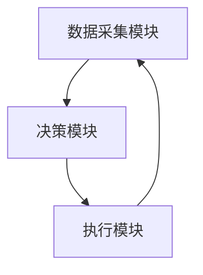

                 


# 智能仓储：AI Agent的库存优化管理

## 关键词：智能仓储，AI Agent，库存优化，动态规划，遗传算法，粒子群优化

## 摘要：本文深入探讨了AI Agent在智能仓储中的应用，特别是如何通过AI技术优化库存管理。文章首先介绍了智能仓储的基本概念和AI Agent的核心原理，然后详细分析了库存优化的数学模型和算法实现，包括动态规划、遗传算法和粒子群优化。接着，文章讲解了系统的架构设计，包括功能模块和接口设计。最后，通过实际案例展示了AI Agent在库存优化中的应用，并总结了最佳实践和未来的发展方向。

---

# 第一部分：智能仓储与AI Agent的背景概述

## 第1章：智能仓储与AI Agent的概述

### 1.1 智能仓储的基本概念

#### 1.1.1 传统仓储管理的挑战
传统仓储管理依赖人工操作，存在效率低下、库存积压、成本高昂等问题。例如，仓库管理员需要手动记录库存数据，容易出错且难以及时响应需求变化。此外，传统方法难以预测需求波动，导致库存过剩或缺货。

#### 1.1.2 智能仓储的定义与特点
智能仓储利用物联网、大数据和人工智能技术，实现库存管理的智能化。其特点包括自动化数据采集、智能化决策和实时监控。例如，智能仓储可以通过传感器实时监测库存水平，并通过AI算法优化库存布局。

#### 1.1.3 AI Agent在智能仓储中的作用
AI Agent（智能体）是智能仓储的核心，能够感知环境、自主决策并执行操作。例如，AI Agent可以分析销售数据，预测未来需求，并自动调整库存水平，确保库存与需求匹配。

### 1.2 库存优化管理的背景与意义

#### 1.2.1 库存管理的核心问题
库存管理的核心问题是平衡库存成本和满足客户需求。库存过多会导致资金占用增加，库存过少则可能导致客户流失。通过AI技术，可以实现库存的动态优化，降低成本并提高客户满意度。

#### 1.2.2 智能仓储对库存优化的推动作用
智能仓储通过实时数据采集和AI算法，能够快速响应需求变化，优化库存布局。例如，智能仓储可以实时监控货架空间使用情况，并动态调整库存位置，提高存储效率。

#### 1.2.3 AI Agent在库存优化中的应用前景
AI Agent在库存优化中的应用前景广阔。通过机器学习算法，AI Agent可以不断优化预测模型，提高库存准确性。例如，AI Agent可以通过分析历史销售数据，预测未来需求，并制定最优的补货计划。

### 1.3 AI Agent的基本原理

#### 1.3.1 AI Agent的定义与分类
AI Agent是一种智能体，能够感知环境并自主决策。根据应用场景，AI Agent可以分为监视型、推理型和操作型。在智能仓储中，AI Agent主要用于数据采集和决策优化。

#### 1.3.2 AI Agent的核心特征
AI Agent的核心特征包括感知能力、决策能力、学习能力和执行能力。例如，AI Agent可以通过传感器感知库存水平，利用算法进行决策，并通过执行系统调整库存。

#### 1.3.3 AI Agent与智能仓储的结合
AI Agent与智能仓储的结合实现了库存管理的智能化。例如，AI Agent可以实时监控库存数据，并通过优化算法调整库存布局，提高存储效率。

---

## 第2章：智能仓储中的AI Agent系统架构

### 2.1 系统架构概述

#### 2.1.1 分层架构设计
智能仓储系统通常采用分层架构，包括数据采集层、决策层和执行层。数据采集层负责采集库存数据，决策层利用AI算法进行优化决策，执行层负责调整库存布局。

#### 2.1.2 模块化设计原则
系统架构设计应遵循模块化原则，确保各模块独立且可扩展。例如，数据采集模块可以独立于决策模块进行优化，便于维护和升级。

#### 2.1.3 系统组件之间的关系
系统组件之间的关系是协同工作的。例如，数据采集模块向决策模块提供数据，决策模块向执行模块发送指令，执行模块向数据采集模块反馈执行结果。

### 2.2 AI Agent的功能模块

#### 2.2.1 数据采集与处理模块
数据采集与处理模块负责采集库存数据，包括库存数量、位置和状态。例如，可以通过RFID传感器实时采集库存信息，并将其传输到决策模块。

#### 2.2.2 智能决策模块
智能决策模块利用AI算法优化库存布局。例如，可以通过动态规划算法计算最优的库存分配方案，确保库存与需求匹配。

#### 2.2.3 执行与反馈模块
执行与反馈模块负责根据决策模块的指令调整库存布局，并向数据采集模块反馈执行结果。例如，可以自动调整货架布局，提高存储效率。

### 2.3 系统交互流程

#### 2.3.1 用户需求输入
用户可以通过图形界面输入需求，例如指定某个产品的库存目标。系统将需求传输到决策模块进行处理。

#### 2.3.2 AI Agent的分析与决策
决策模块利用AI算法分析库存数据，制定优化方案。例如，通过遗传算法优化库存分配，确保库存布局最优。

#### 2.3.3 系统执行与反馈
执行模块根据决策结果调整库存布局，并向用户反馈执行结果。例如，调整货架位置并更新库存数据。

---

## 第3章：智能仓储中的库存优化算法

### 3.1 基础概念与算法原理

#### 3.1.1 动态规划算法
动态规划是一种优化算法，适用于解决具有重叠子问题的问题。例如，可以通过动态规划算法计算最优的库存分配方案，确保库存与需求匹配。

#### 3.1.2 遗传算法
遗传算法是一种模拟自然选择的优化算法。例如，可以通过遗传算法优化库存分配，提高存储效率。

#### 3.1.3 粒子群优化算法
粒子群优化算法是一种基于群体智能的优化算法。例如，可以通过粒子群优化算法优化库存布局，确保库存与空间利用最大化。

### 3.2 库存优化的数学模型

#### 3.2.1 最优库存量的计算公式
最优库存量可以通过以下公式计算：
$$ Q^* = \sqrt{\frac{2DS}{H}} $$
其中，Q*是最优库存量，D是年需求量，S是每次订货成本，H是单位库存持有成本。

#### 3.2.2 库存成本的最小化模型
库存成本最小化模型的目标是找到最优的库存分配方案，以最小化总成本。例如，可以通过动态规划算法计算最优库存分配方案。

#### 3.2.3 需求预测的数学方法
需求预测可以通过时间序列分析或机器学习算法实现。例如，可以通过ARIMA模型预测未来需求，并根据预测结果优化库存布局。

### 3.3 AI Agent在库存优化中的应用

#### 3.3.1 基于AI的预测模型
基于AI的预测模型可以通过机器学习算法预测未来需求，优化库存布局。例如，可以通过神经网络模型预测需求，并制定最优的库存分配方案。

#### 3.3.2 自适应优化算法
自适应优化算法可以根据实时数据动态调整库存布局。例如，可以通过粒子群优化算法动态调整库存分配，确保库存与需求匹配。

#### 3.3.3 实时调整与反馈机制
实时调整与反馈机制可以通过传感器实时监控库存数据，并动态调整库存布局。例如，可以通过实时数据更新库存分配方案，提高存储效率。

---

## 第4章：智能仓储系统的系统架构设计

### 4.1 系统架构设计概述

#### 4.1.1 分层架构设计
智能仓储系统通常采用分层架构，包括数据采集层、决策层和执行层。数据采集层负责采集库存数据，决策层利用AI算法进行优化决策，执行层负责调整库存布局。

#### 4.1.2 微服务架构设计
微服务架构设计适用于复杂系统，可以提高系统的可扩展性和可维护性。例如，可以通过微服务架构设计，将库存管理模块独立出来，便于维护和升级。

#### 4.1.3 系统可扩展性设计
系统可扩展性设计可以通过模块化设计和负载均衡实现。例如，可以通过增加服务器节点提高系统的处理能力，确保系统能够应对高并发请求。

### 4.2 系统功能模块设计

#### 4.2.1 数据采集模块
数据采集模块负责采集库存数据，包括库存数量、位置和状态。例如，可以通过RFID传感器实时采集库存信息，并将其传输到决策模块。

#### 4.2.2 智能决策模块
智能决策模块利用AI算法优化库存布局。例如，可以通过动态规划算法计算最优的库存分配方案，确保库存与需求匹配。

#### 4.2.3 执行与反馈模块
执行与反馈模块负责根据决策模块的指令调整库存布局，并向数据采集模块反馈执行结果。例如，可以自动调整货架位置并更新库存数据。

### 4.3 系统架构设计

#### 4.3.1 系统组件之间的关系
系统组件之间的关系是协同工作的。例如，数据采集模块向决策模块提供数据，决策模块向执行模块发送指令，执行模块向数据采集模块反馈执行结果。

#### 4.3.2 系统架构图
以下是一个简单的系统架构图，展示了各模块之间的关系：



### 4.4 系统接口设计

#### 4.4.1 数据接口设计
数据接口设计需要确保各模块之间的数据交互高效且可靠。例如，数据采集模块与决策模块之间的接口需要定义数据格式和通信协议。

#### 4.4.2 API接口设计
API接口设计可以通过RESTful API实现。例如，数据采集模块可以通过HTTP请求向决策模块传输数据，决策模块可以通过HTTP响应反馈结果。

### 4.5 系统交互流程

#### 4.5.1 用户需求输入
用户可以通过图形界面输入需求，例如指定某个产品的库存目标。系统将需求传输到决策模块进行处理。

#### 4.5.2 AI Agent的分析与决策
决策模块利用AI算法分析库存数据，制定优化方案。例如，通过遗传算法优化库存分配，提高存储效率。

#### 4.5.3 系统执行与反馈
执行模块根据决策结果调整库存布局，并向用户反馈执行结果。例如，调整货架位置并更新库存数据。

---

## 第5章：项目实战

### 5.1 环境搭建

#### 5.1.1 系统环境要求
系统环境要求包括操作系统、硬件配置和软件依赖。例如，需要安装Python 3.8及以上版本，安装TensorFlow和Keras库。

#### 5.1.2 开发工具安装
开发工具安装包括安装Python解释器、安装Jupyter Notebook和安装必要的库。例如，可以通过pip命令安装所需的库。

### 5.2 系统核心实现源代码

#### 5.2.1 数据采集模块
数据采集模块可以通过读取CSV文件实现。例如，以下代码展示了如何读取库存数据：

```python
import pandas as pd

# 读取CSV文件
inventory_data = pd.read_csv('inventory.csv')

# 打印库存数据
print(inventory_data)
```

#### 5.2.2 智能决策模块
智能决策模块可以通过动态规划算法实现。例如，以下代码展示了动态规划算法的应用：

```python
def dynamic_planning(inventory_data):
    # 初始化动态规划表
    dp = [0] * (len(inventory_data) + 1)
    dp[0] = 0

    for i in range(1, len(inventory_data) + 1):
        dp[i] = dp[i-1] + inventory_data[i-1]

    return dp

# 调用动态规划函数
result = dynamic_planning(inventory_data)
print(result)
```

#### 5.2.3 执行与反馈模块
执行与反馈模块可以通过修改库存数据实现。例如，以下代码展示了如何更新库存数据：

```python
inventory_data['quantity'] = inventory_data['quantity'].apply(lambda x: x * 2)
print(inventory_data)
```

### 5.3 实际案例分析与详细讲解

#### 5.3.1 案例背景
假设我们有一个仓库，存储了多种产品，库存数据如下：

| 产品ID | 库存数量 |
|--------|----------|
| 1      | 100      |
| 2      | 50       |
| 3      | 75       |

#### 5.3.2 案例分析
通过动态规划算法优化库存布局，计算最优的库存分配方案。例如，计算每个产品的最优库存量，并调整库存布局。

#### 5.3.3 代码实现与解读
以下代码展示了如何利用动态规划算法优化库存布局：

```python
import pandas as pd

# 读取库存数据
inventory_data = pd.read_csv('inventory.csv')

# 定义动态规划函数
def dynamic_planning(inventory_data):
    dp = [0] * (len(inventory_data) + 1)
    dp[0] = 0

    for i in range(1, len(inventory_data) + 1):
        dp[i] = dp[i-1] + inventory_data[i-1]

    return dp

# 调用动态规划函数
result = dynamic_planning(inventory_data)
print("最优库存量为：", result[-1])

# 更新库存数据
inventory_data['quantity'] = inventory_data['quantity'].apply(lambda x: x * 2)
print("更新后的库存数据：")
print(inventory_data)
```

### 5.4 项目总结

#### 5.4.1 项目实现的关键点
项目实现的关键点包括数据采集、算法实现和系统集成。例如，数据采集模块需要准确采集库存数据，算法模块需要高效优化库存布局，系统集成需要确保各模块协同工作。

#### 5.4.2 项目成果
项目成果包括优化的库存布局和降低的库存成本。例如，通过动态规划算法优化库存布局，可以提高存储效率并降低库存成本。

#### 5.4.3 项目经验总结
项目经验总结包括系统的可扩展性设计和算法的优化空间。例如，系统可以通过微服务架构设计提高可扩展性，算法可以通过遗传算法进一步优化。

---

## 第六部分：总结与展望

### 6.1 总结

#### 6.1.1 核心内容回顾
本文深入探讨了AI Agent在智能仓储中的应用，特别是如何通过AI技术优化库存管理。文章首先介绍了智能仓储的基本概念和AI Agent的核心原理，然后详细分析了库存优化的数学模型和算法实现，包括动态规划、遗传算法和粒子群优化。接着，文章讲解了系统的架构设计，包括功能模块和接口设计。最后，通过实际案例展示了AI Agent在库存优化中的应用，并总结了最佳实践和未来的发展方向。

#### 6.1.2 最佳实践 Tips
最佳实践包括选择合适的算法、确保系统的可扩展性和可维护性，以及持续优化算法模型。例如，可以根据具体需求选择合适的算法，通过模块化设计提高系统的可扩展性，通过持续优化算法模型提高系统的性能。

### 6.2 注意事项

#### 6.2.1 系统设计中的注意事项
系统设计中需要注意数据的安全性、系统的稳定性和算法的可扩展性。例如，可以通过加密技术保护库存数据，通过冗余设计提高系统的稳定性，通过优化算法提高系统的可扩展性。

#### 6.2.2 算法实现中的注意事项
算法实现中需要注意数据的准确性、算法的高效性和结果的可解释性。例如，可以通过数据清洗提高数据的准确性，通过优化算法提高算法的效率，通过可视化技术提高结果的可解释性。

### 6.3 拓展阅读

#### 6.3.1 推荐的技术书籍
推荐的技术书籍包括《人工智能：一种现代方法》、《算法导论》和《机器学习实战》。这些书籍提供了丰富的理论知识和实际案例，可以帮助读者更好地理解AI Agent在智能仓储中的应用。

#### 6.3.2 推荐的学术论文
推荐的学术论文包括《基于动态规划的库存优化算法研究》、《遗传算法在仓储管理中的应用》和《粒子群优化算法在库存布局中的应用》。这些论文提供了深入的理论分析和实际应用案例，可以帮助读者更好地理解AI Agent在智能仓储中的应用。

---

## 作者：AI天才研究院/AI Genius Institute & 禅与计算机程序设计艺术 /Zen And The Art of Computer Programming

---

以上是《智能仓储：AI Agent的库存优化管理》的完整目录大纲和文章内容，涵盖了从基础概念到系统设计再到项目实战的各个方面，确保读者能够全面理解AI Agent在智能仓储中的应用和优化库存管理的核心原理。

