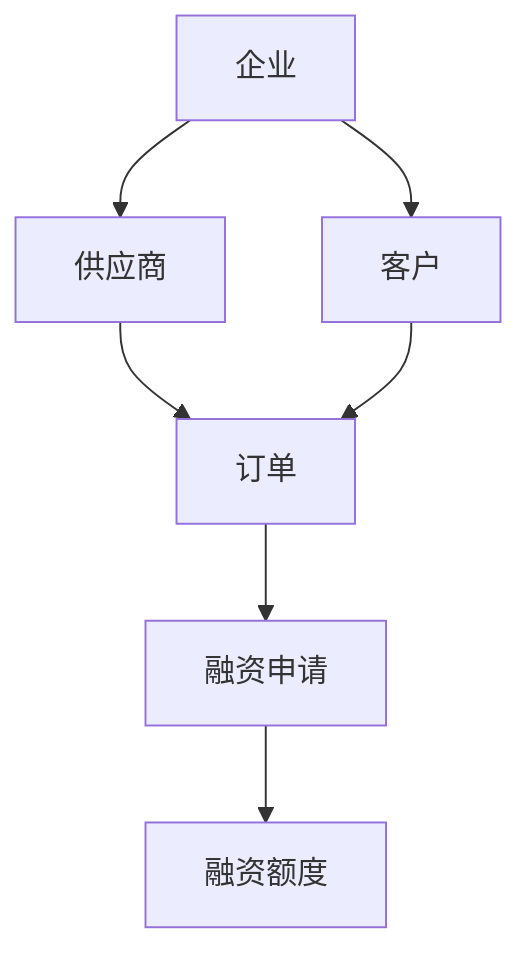

                 


# 智能供应链金融额度管理系统

> 关键词：智能供应链金融、人工智能、大数据、区块链、风险管理、额度管理、数字化转型

> 摘要：智能供应链金融额度管理系统通过大数据、人工智能和区块链等技术，优化供应链金融中的融资效率和风险控制。本文深入探讨了智能供应链金融的核心概念、关键技术、系统架构及项目实战，为读者提供全面的技术解析。

---

## 第1章: 供应链金融的背景与核心概念

### 1.1 供应链金融的定义与特点

#### 1.1.1 供应链金融的定义
供应链金融是指通过整合供应链上下游企业之间的资金流、信息流和物流，提供融资服务的金融模式。其核心在于利用核心企业的信用，为供应链上的中小企业提供融资支持。

#### 1.1.2 供应链金融的核心特点
- **系统性**：覆盖供应链的全链条，从供应商到制造商，再到分销商和最终消费者。
- **协同性**：通过协同管理，优化资金分配，降低整体成本。
- **风险管理**：通过数据驱动的风控手段，降低融资风险。

#### 1.1.3 供应链金融的参与者与流程
参与者包括核心企业、供应商、分销商、金融机构和科技服务提供方。流程涵盖需求分析、额度评估、融资申请、资金发放和监控管理。

### 1.2 传统供应链金融的痛点

#### 1.2.1 信息不对称问题
传统模式下，金融机构难以获取供应链上下游企业的实时数据，导致融资效率低下。

#### 1.2.2 融资效率低下
繁琐的审批流程和人工操作导致融资时间长，难以满足企业的即时需求。

#### 1.2.3 风险控制难度大
缺乏实时数据和智能化工具，导致风险评估不够精准，难以有效控制融资风险。

### 1.3 智能供应链金融的必要性

#### 1.3.1 技术进步带来的机遇
大数据、人工智能和区块链等技术的发展，为供应链金融的智能化提供了技术支撑。

#### 1.3.2 智能化管理的优势
通过智能化工具，实现数据的实时采集、分析和决策，提升融资效率和风险控制能力。

#### 1.3.3 企业数字化转型的需求
企业需要通过数字化转型，提升竞争力，而供应链金融的智能化是其中的重要部分。

### 1.4 本章小结
本章介绍了供应链金融的定义、特点、传统模式的痛点以及智能供应链金融的必要性，为后续内容奠定了基础。

---

## 第2章: 智能供应链金融额度管理的核心概念

### 2.1 智能供应链金融的定义

#### 2.1.1 智能供应链金融的定义
智能供应链金融是通过大数据、人工智能等技术，实现供应链金融的智能化管理，优化融资效率和风险控制。

### 2.2 智能供应链金融额度管理的关键技术

#### 2.2.1 大数据技术
大数据技术用于采集和分析海量数据，为额度评估提供支持。

#### 2.2.2 人工智能技术
人工智能技术用于构建风险评估模型，实现智能化决策。

#### 2.2.3 区块链技术
区块链技术用于确保数据的安全性和透明性，增强信任。

### 2.3 智能供应链金融额度管理的实现方法

#### 2.3.1 数据采集与处理
通过传感器、ERP系统等采集供应链中的实时数据，并进行清洗和预处理。

#### 2.3.2 风险评估模型
基于机器学习算法，构建风险评估模型，评估企业的信用风险。

#### 2.3.3 自动化决策机制
通过自动化系统，实现融资额度的实时计算和决策。

### 2.4 核心概念对比表

| **概念**       | **传统供应链金融**                     | **智能供应链金融**                     |
|----------------|----------------------------------------|----------------------------------------|
| 数据来源       | 线下数据                               | 线上数据 + AI分析                     |
| 风险评估       | 人工评估                               | AI自动评估 + 大数据分析               |
| 决策效率       | 低效                                   | 高效                                   |

### 2.5 ER实体关系图



### 2.6 本章小结
本章详细介绍了智能供应链金融的核心概念和关键技术，为后续章节的技术实现奠定了基础。

---

## 第3章: 智能供应链金融额度管理系统的算法原理

### 3.1 算法原理介绍

#### 3.1.1 机器学习模型
随机森林是一种常用的算法，用于分类和回归问题。

### 3.1.2 算法流程

1. 数据预处理：清洗和特征提取。
2. 模型训练：基于训练数据构建随机森林模型。
3. 模型评估：使用测试数据评估模型性能。
4. 预测与优化：基于模型预测融资额度，并进行优化调整。

### 3.2 Python代码实现

```python
import pandas as pd
from sklearn.ensemble import RandomForestRegressor
from sklearn.metrics import mean_squared_error

# 数据加载
data = pd.read_csv('supply_chain_data.csv')

# 特征与标签分离
X = data.drop('融资额度', axis=1)
y = data['融资额度']

# 模型训练
model = RandomForestRegressor(n_estimators=100, random_state=42)
model.fit(X, y)

# 模型预测
y_pred = model.predict(X)

# 模型评估
mse = mean_squared_error(y, y_pred)
print(f'均方误差: {mse}')
```

### 3.3 数学模型与公式

#### 3.3.1 随机森林模型
随机森林是一种集成学习算法，通过多个决策树的组合来提高模型的准确性和鲁棒性。

#### 3.3.2 模型评估
均方误差公式：
$$ MSE = \frac{1}{n}\sum_{i=1}^{n}(y_i - \hat{y}_i)^2 $$

### 3.4 本章小结
本章详细介绍了智能供应链金融额度管理系统的算法原理，并通过Python代码实现了随机森林模型，为后续的系统设计提供了技术支持。

---

## 第4章: 智能供应链金融额度管理系统的架构设计

### 4.1 需求分析

#### 4.1.1 系统目标
实现供应链金融的智能化管理，提高融资效率和风险控制能力。

### 4.2 系统架构设计

#### 4.2.1 分层架构
- 数据层：负责数据的存储和管理。
- 业务逻辑层：负责业务逻辑的实现。
- 用户界面层：负责与用户的交互。

#### 4.2.2 系统架构图


### 4.3 数据库设计

#### 4.3.1 数据库结构
设计关系型数据库，包括企业信息表、订单表、融资申请表和融资额度表。

### 4.4 本章小结
本章详细介绍了智能供应链金融额度管理系统的架构设计，为后续的系统实现提供了指导。

---

## 第5章: 智能供应链金融额度管理系统的项目实战

### 5.1 环境安装

#### 5.1.1 技术选型
选择Python、Flask框架和MySQL数据库。

### 5.2 系统核心实现

#### 5.2.1 后端实现

```python
from flask import Flask, request, jsonify

app = Flask(__name__)

@app.route('/api/融资额度', methods=['POST'])
def compute_financing_quota():
    data = request.json
    # 处理数据并返回结果
    return jsonify({'融资额度': result})
```

#### 5.2.2 前端实现
使用React框架，构建用户友好的界面。

### 5.3 案例分析

#### 5.3.1 案例背景
某制造企业需要为其供应商提供融资支持。

#### 5.3.2 数据分析
通过历史数据，分析供应商的信用状况和财务状况。

#### 5.3.3 结果展示
生成供应商的融资额度，并实时更新。

### 5.4 本章小结
本章通过项目实战，详细介绍了智能供应链金融额度管理系统的实现过程，为读者提供了实际的应用参考。

---

## 第6章: 总结与展望

### 6.1 本章总结
智能供应链金融额度管理系统通过大数据、人工智能和区块链等技术，实现了供应链金融的智能化管理，提高了融资效率和风险控制能力。

### 6.2 未来展望
未来，随着技术的不断进步，智能供应链金融将更加智能化和自动化，为企业提供更加高效和精准的融资服务。

---

## 作者：AI天才研究院 & 禅与计算机程序设计艺术

---

以上是《智能供应链金融额度管理系统》的技术博客文章，涵盖了从背景到实现的各个方面，希望对读者有所帮助。

