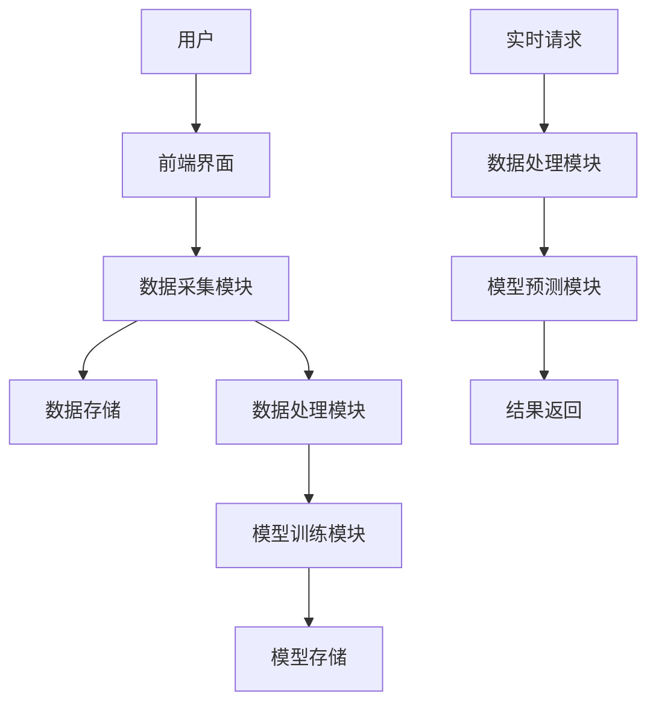

                 


# 智能保险理赔欺诈预防系统

> 关键词：保险欺诈预防，人工智能，机器学习，系统架构，风险管理

> 摘要：本文深入探讨了智能保险理赔欺诈预防系统的构建与应用。通过分析保险行业面临的欺诈问题，介绍了系统的核心概念、算法原理、系统架构及实际案例。文章内容涵盖从理论到实践的各个方面，为读者提供全面的技术视角。

---

## 第1章: 保险行业背景与欺诈问题

### 1.1 保险行业的现状与挑战

#### 1.1.1 保险行业的基本概念
保险是一种以风险转移为核心的金融服务，旨在通过分散风险为客户提供经济保障。保险行业涵盖寿险、产险、健康险等多个领域，其核心业务包括承保、理赔和客户服务。

#### 1.1.2 保险理赔的核心流程
保险理赔是保险业务中的关键环节，通常包括报案、审核、调查、赔付等步骤。传统理赔流程依赖人工操作，效率较低且易受主观因素影响。

#### 1.1.3 保险行业的数字化转型趋势
随着技术的进步，保险行业正逐步向数字化转型。大数据、人工智能和区块链等技术的应用，为保险行业的创新提供了新的可能性。

---

### 1.2 欺诈问题的严重性

#### 1.2.1 欺诈行为的定义与分类
保险欺诈是指故意编造虚假信息或隐瞒真相，骗取保险金的行为。常见的欺诈类型包括虚构事故、夸大损失、伪造证据等。

#### 1.2.2 欺诈行为对保险行业的影响
欺诈行为增加了保险公司的赔付成本，降低了行业的盈利能力。同时，欺诈行为还可能破坏保险市场的信任机制，影响行业的健康发展。

#### 1.2.3 传统欺诈检测方法的局限性
传统欺诈检测主要依赖人工审核和简单的规则匹配，这种方法效率低下，且难以捕捉复杂多变的欺诈模式。

---

### 1.3 智能保险理赔欺诈预防系统的重要性

#### 1.3.1 智能系统的核心优势
智能系统通过大数据分析和机器学习算法，能够快速识别潜在欺诈行为，显著提高欺诈检测的准确性和效率。

#### 1.3.2 智能系统在保险行业的应用前景
随着人工智能技术的成熟，智能保险理赔欺诈预防系统将成为保险行业的标配，帮助保险公司实现降本增效。

#### 1.3.3 智能系统的技术实现路径
通过收集和分析理赔数据，结合机器学习模型，构建智能化的欺诈预防系统，实现对欺诈行为的精准识别和预测。

---

## 第2章: 智能保险理赔欺诈预防系统的核心概念

### 2.1 欺诈预防系统的定义与特点

#### 2.1.1 系统的定义
智能保险理赔欺诈预防系统是一种基于人工智能技术的保险欺诈检测系统，旨在通过数据分析和模型预测，识别潜在的欺诈行为。

#### 2.1.2 系统的核心特点
- **数据驱动**：依赖大量历史数据进行训练和预测。
- **实时性**：能够快速处理和分析实时数据，实现即时检测。
- **可扩展性**：支持大规模数据处理和模型优化。

---

### 2.2 核心概念与联系

#### 2.2.1 数据特征工程
数据特征工程是欺诈预防系统的核心，通过提取和筛选关键特征，提升模型的预测能力。

| 特征类型 | 特征描述 | 示例 |
|----------|----------|------|
| 基础特征 | 基于投保人和事故的基本信息 | 投保人年龄、事故时间等 |
| 行为特征 | 反映投保人和事故相关的行为模式 | 投保记录、理赔频率等 |
| 上下文特征 | 包括时间和空间维度的信息 | 事故发生地点、时间分布等 |

#### 2.2.2 模型选择与优化
模型选择是欺诈预防系统的关键，常见的模型包括逻辑回归、随机森林和XGBoost。

#### 2.2.3 系统架构设计
系统架构设计决定了系统的稳定性和可扩展性，通常包括数据层、算法层和应用层。

---

## 第3章: 智能保险理赔欺诈预防系统的算法原理

### 3.1 算法选择与优化

#### 3.1.1 常见的欺诈检测算法
- **逻辑回归**：适用于二分类问题，适合欺诈与非欺诈的分类。
- **随机森林**：基于树的集成算法，具有较高的准确性和鲁棒性。
- **XGBoost**：梯度提升树，适合处理复杂的数据关系。

### 3.2 算法实现流程

#### 3.2.1 数据预处理
数据预处理是算法实现的基础，包括数据清洗、特征提取和数据标准化。

#### 3.2.2 模型训练
通过训练数据，模型学习欺诈行为的特征，生成预测模型。

#### 3.2.3 模型评估与调优
通过验证集评估模型性能，调整超参数，优化模型效果。

---

## 第4章: 智能保险理赔欺诈预防系统的系统架构设计

### 4.1 系统功能设计

#### 4.1.1 系统功能模块
- **数据采集模块**：负责收集投保人信息、事故记录等数据。
- **数据处理模块**：对数据进行清洗、转换和特征提取。
- **模型训练模块**：基于处理后的数据，训练欺诈检测模型。
- **实时检测模块**：对新提交的理赔请求进行实时检测。

### 4.2 系统架构设计

#### 4.2.1 系统架构图


---

## 第5章: 项目实战与案例分析

### 5.1 环境搭建

#### 5.1.1 安装必要的库
```bash
pip install pandas numpy scikit-learn xgboost
```

---

### 5.2 核心代码实现

#### 5.2.1 数据预处理代码
```python
import pandas as pd
from sklearn.impute import SimpleImputer
from sklearn.preprocessing import StandardScaler

# 加载数据
data = pd.read_csv('fraud_data.csv')

# 数据清洗
data.dropna(inplace=True)

# 特征提取
X = data.drop('is_fraud', axis=1)
y = data['is_fraud']
```

---

## 第6章: 最佳实践与小结

### 6.1 最佳实践
- 数据质量是模型性能的基础，需重视数据清洗和特征工程。
- 模型调优是提升预测准确性的关键，需结合业务场景选择合适的算法。

### 6.2 小结
智能保险理赔欺诈预防系统通过大数据和人工智能技术，显著提升了欺诈检测的效率和准确性，为保险行业带来了巨大的价值。

---

## 作者：AI天才研究院 & 禅与计算机程序设计艺术

