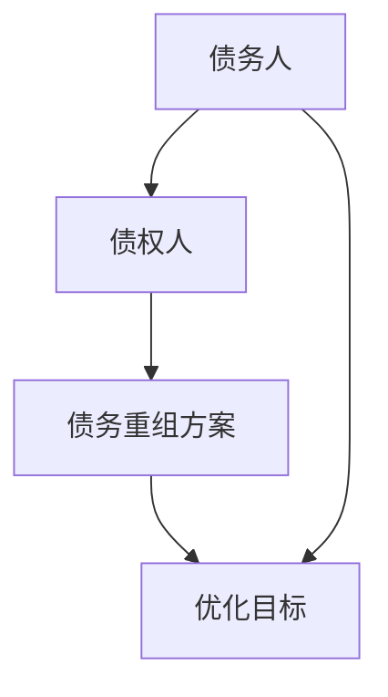
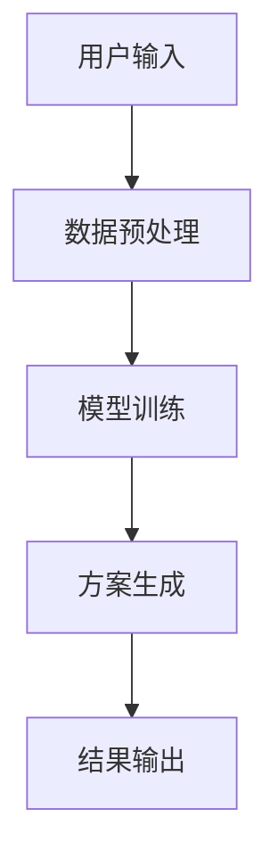
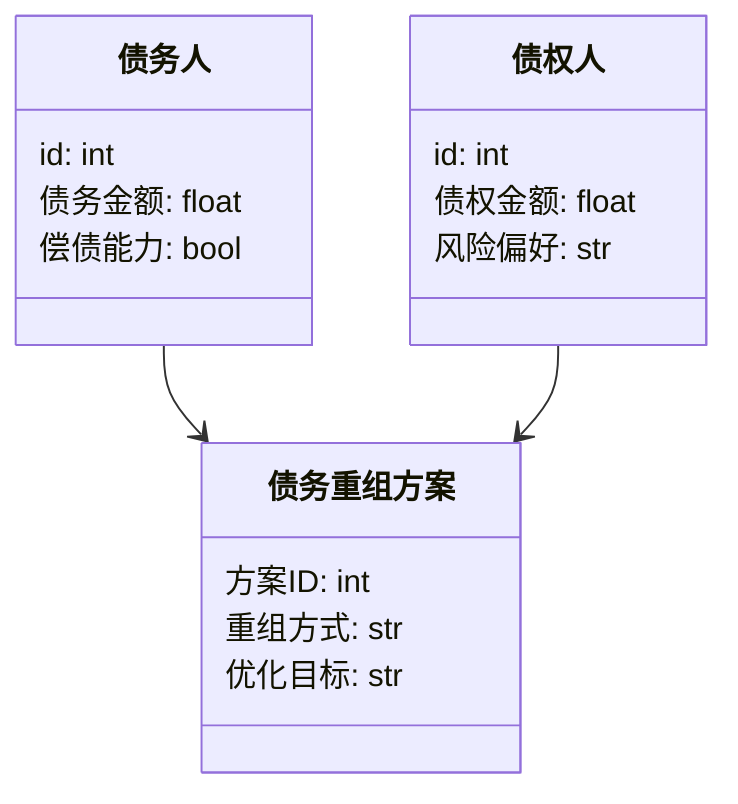
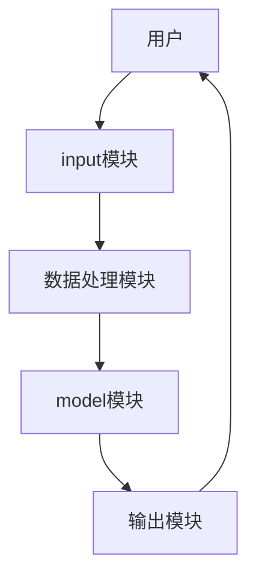

                 


# 智能债务重组建议生成器

## 关键词：智能债务重组，人工智能，机器学习，债务优化，金融技术，系统架构

## 摘要：本文探讨了如何利用人工智能技术优化债务重组过程，介绍了智能债务重组的核心概念、算法原理、系统架构设计以及实际案例分析。通过详细的技术分析和代码实现，展示了如何构建一个高效的智能债务重组建议生成器，为金融行业提供创新的解决方案。

---

# 第1章: 智能债务重组建议生成器的背景介绍

## 1.1 问题背景与问题描述

### 1.1.1 债务重组的传统方法与挑战

债务重组是企业为了优化财务结构、缓解短期偿债压力而进行的重要财务活动。传统债务重组过程通常涉及复杂的谈判、数据分析和多方协调，效率低下且容易受到人为因素的影响。

- **传统方法的低效性**：传统债务重组过程依赖于人工分析，耗时长且容易出错。
- **复杂性**：涉及多方利益，需要考虑债务人和债权人的双重需求。
- **数据不足**：传统方法难以处理海量数据，导致决策不够精准。

### 1.1.2 传统债务重组中的效率瓶颈

- **信息不对称**：债务人和债权人之间的信息不透明，影响重组方案的制定。
- **缺乏数据分析支持**：传统方法难以从大量数据中提取有价值的信息，导致决策缺乏科学依据。
- **协商成本高**：复杂的谈判过程增加了时间和经济成本。

### 1.1.3 智能化债务重组的必要性

随着人工智能技术的发展，智能化债务重组成为可能。通过机器学习算法，可以快速分析大量数据，提供最优重组方案，提高效率和准确性。

---

## 1.2 问题解决与边界外延

### 1.2.1 智能债务重组的解决方案

智能债务重组通过引入机器学习算法，利用历史数据和实时数据，生成最优的债务重组方案，帮助债务人和债权人达成一致。

- **数据驱动决策**：利用机器学习模型分析历史债务重组案例，提取规律，预测最优方案。
- **自动化建议生成**：系统自动推荐多个可行的重组方案，供债务人和债权人选择。
- **实时更新**：根据市场变化和企业财务状况的变化，实时调整重组建议。

### 1.2.2 智能债务重组的边界与限制

- **数据质量**：模型的准确性依赖于数据的质量和完整性。
- **模型的可解释性**：复杂的模型可能难以解释结果，影响决策的透明性。
- **法律和合规性**：债务重组需要符合相关法律法规，系统的建议需要考虑法律因素。

### 1.2.3 智能债务重组的外延与应用范围

智能债务重组不仅适用于企业，还可以应用于个人债务重组，甚至可以扩展到跨境债务重组，涉及多国法律和市场的复杂情况。

---

## 1.3 核心概念与组成要素

### 1.3.1 债务重组的核心要素

债务重组的核心要素包括债务人、债权人、债务金额、重组方式和重组目标。

- **债务人**：需要优化债务结构的企业或个人。
- **债权人**：提供资金的银行或其他金融机构。
- **债务金额**：当前的债务总额。
- **重组方式**：包括延长还款期限、降低利率、债务分割等。
- **重组目标**：优化债务结构，降低偿债压力，实现双赢。

### 1.3.2 智能债务重组的组成模块

智能债务重组系统通常包括以下几个模块：

- **数据输入模块**：接收债务人和债权人的基本信息、财务数据和市场信息。
- **数据预处理模块**：对数据进行清洗、归一化和特征提取。
- **模型训练模块**：利用机器学习算法训练模型，生成重组方案。
- **方案生成模块**：根据模型输出，生成多个可行的重组方案。
- **结果输出模块**：将重组方案输出给用户，并提供解释和建议。

### 1.3.3 核心概念的属性特征对比

| 核心概念 | 属性特征 | 对比分析 |
|----------|-----------|----------|
| 债务人    | 财务状况、偿债能力 | 数据驱动决策 |
| 债权人    | 资金需求、风险偏好 | 利益平衡 |
| 债务金额  | 当前债务总额 | 数据驱动决策 |

---

## 1.4 本章小结

本章介绍了智能债务重组的背景和核心概念，分析了传统债务重组的低效性和智能化的必要性。通过对比分析，明确了智能债务重组的核心要素和组成模块，为后续的算法设计和系统实现奠定了基础。

---

# 第2章: 智能债务重组的核心概念与联系

## 2.1 核心概念原理

### 2.1.1 债务重组的数学模型

智能债务重组的核心在于建立一个数学模型，用于预测最优的重组方案。常用的数学模型包括线性规划和非线性规划。

- **线性规划模型**：目标是最小化债务重组的成本，约束条件包括债务人和债权人的利益平衡。
- **非线性规划模型**：适用于更复杂的场景，目标函数和约束条件均为非线性。

### 2.1.2 智能债务重组的算法原理

机器学习算法在债务重组中的应用主要集中在监督学习和无监督学习。

- **监督学习**：利用历史债务重组案例，训练分类模型，预测重组方案的可行性。
- **无监督学习**：通过聚类分析，将债务人和债权人分成不同的群体，制定个性化的重组方案。

### 2.1.3 核心概念的属性特征对比

| 核心概念 | 属性特征 | 对比分析 |
|----------|-----------|----------|
| 算法类型 | 监督学习 vs 无监督学习 | 数据类型和目标不同 |

---

## 2.2 核心概念的ER实体关系图



---

## 2.3 核心概念的系统架构



---

## 2.4 本章小结

本章详细分析了智能债务重组的核心概念和算法原理，通过ER图和架构图展示了系统的整体结构。接下来将深入探讨算法的实现细节。

---

# 第3章: 智能债务重组的算法原理

## 3.1 算法原理概述

### 3.1.1 基于机器学习的债务重组算法

常用的算法包括随机森林、支持向量机（SVM）和神经网络。随机森林在处理高维数据时表现优异，适合债务重组中的分类和回归问题。

### 3.1.2 算法的核心思想与流程

1. 数据预处理：清洗数据，处理缺失值，归一化特征。
2. 模型训练：使用训练数据训练机器学习模型。
3. 模型优化：通过交叉验证调整模型参数，提高准确率。

### 3.1.3 算法的优缺点分析

- **优点**：随机森林具有高准确性和良好的泛化能力。
- **缺点**：计算复杂度较高，对特征工程要求较高。

---

## 3.2 算法的详细实现

### 3.2.1 数据预处理

```python
def preprocess(data):
    # 处理缺失值
    data = data.dropna()
    # 数据归一化
    from sklearn.preprocessing import StandardScaler
    scaler = StandardScaler()
    data_scaled = scaler.fit_transform(data)
    return data_scaled
```

### 3.2.2 模型训练

```python
from sklearn.ensemble import RandomForestRegressor
import numpy as np

def train_model(data, labels):
    model = RandomForestRegressor(n_estimators=100, random_state=42)
    model.fit(data, labels)
    return model
```

### 3.2.3 模型优化

```python
from sklearn.model_selection import GridSearchCV

def optimize_model(model, data, labels):
    # 定义参数搜索空间
    param_grid = {'n_estimators': [100, 200], 'max_depth': [None, 10]}
    grid_search = GridSearchCV(model, param_grid, cv=5)
    grid_search.fit(data, labels)
    best_model = grid_search.best_estimator_
    return best_model
```

---

## 3.3 算法的数学模型与公式

### 3.3.1 基于线性规划的债务重组模型

目标是最小化债务重组的成本，约束条件包括债务人和债权人的利益平衡。

$$ \text{min} \sum_{i=1}^{n} c_i x_i $$

其中，$c_i$ 是第 $i$ 项债务的成本，$x_i$ 是债务重组的变量。

### 3.3.2 基于机器学习的预测模型

$$ P(y|x) = \frac{e^{w x}}{\sum_{k} e^{w_k x}} $$

其中，$w$ 是模型参数，$x$ 是输入特征，$y$ 是输出类别。

---

## 3.4 算法的实现代码

```python
import pandas as pd
from sklearn.ensemble import RandomForestRegressor
from sklearn.model_selection import train_test_split
from sklearn.metrics import mean_squared_error

# 加载数据
data = pd.read_csv('debt_data.csv')
labels = data['target'].values
features = data.drop('target', axis=1).values

# 数据分割
train_features, test_features, train_labels, test_labels = train_test_split(features, labels, test_size=0.2, random_state=42)

# 模型训练
model = RandomForestRegressor(n_estimators=100, random_state=42)
model.fit(train_features, train_labels)

# 模型预测
predictions = model.predict(test_features)
print(mean_squared_error(test_labels, predictions))
```

---

## 3.5 本章小结

本章详细介绍了智能债务重组算法的实现过程，包括数据预处理、模型训练和优化。通过代码示例，展示了如何利用机器学习算法生成最优的债务重组方案。

---

# 第4章: 智能债务重组的系统分析与架构设计

## 4.1 系统架构概述

### 4.1.1 系统的功能模块划分

智能债务重组系统主要包括以下功能模块：

- **数据输入模块**：接收债务人和债权人的基本信息。
- **数据预处理模块**：对数据进行清洗和归一化处理。
- **模型训练模块**：利用机器学习算法训练模型。
- **方案生成模块**：根据模型输出生成重组方案。
- **结果输出模块**：将重组方案输出给用户。

### 4.1.2 系统的总体架构设计


### 4.1.3 系统的交互流程

1. 用户输入债务人和债权人的基本信息。
2. 数据预处理模块对数据进行清洗和归一化。
3. 模型训练模块利用训练数据训练机器学习模型。
4. 方案生成模块根据模型输出生成多个可行的重组方案。
5. 结果输出模块将重组方案输出给用户，并提供解释和建议。

---

## 4.2 系统功能设计

### 4.2.1 领域模型设计



---

## 4.3 系统架构设计

### 4.3.1 系统架构图


---

## 4.4 系统接口设计

系统接口设计包括数据输入接口、模型训练接口和结果输出接口。每个接口都有清晰的输入和输出定义。

---

## 4.5 系统交互设计

### 4.5.1 交互流程图



---

## 4.6 本章小结

本章详细分析了智能债务重组系统的架构设计，包括功能模块划分、系统架构图和交互流程图。通过系统的整体设计，为后续的实现提供了清晰的指导。

---

# 第5章: 智能债务重组的项目实战

## 5.1 项目介绍

本项目旨在开发一个智能债务重组建议生成器，利用机器学习算法分析历史数据，生成最优的债务重组方案。

---

## 5.2 环境安装

### 5.2.1 安装Python和必要的库

```bash
pip install numpy pandas scikit-learn mermaid4jupyter jupyterlab
```

---

## 5.3 系统核心实现源代码

### 5.3.1 数据预处理

```python
import pandas as pd
from sklearn.preprocessing import StandardScaler

def preprocess(data):
    # 处理缺失值
    data = data.dropna()
    # 数据归一化
    scaler = StandardScaler()
    data_scaled = scaler.fit_transform(data)
    return data_scaled
```

### 5.3.2 模型训练

```python
from sklearn.ensemble import RandomForestRegressor

def train_model(data, labels):
    model = RandomForestRegressor(n_estimators=100, random_state=42)
    model.fit(data, labels)
    return model
```

### 5.3.3 模型优化

```python
from sklearn.model_selection import GridSearchCV

def optimize_model(model, data, labels):
    param_grid = {'n_estimators': [100, 200], 'max_depth': [None, 10]}
    grid_search = GridSearchCV(model, param_grid, cv=5)
    grid_search.fit(data, labels)
    best_model = grid_search.best_estimator_
    return best_model
```

### 5.3.4 方案生成

```python
def generate_recommendations(model, data):
    recommendations = model.predict(data)
    return recommendations
```

---

## 5.4 代码应用解读与分析

- **数据预处理**：通过删除缺失值和归一化处理，确保数据的完整性和一致性。
- **模型训练**：利用随机森林算法训练模型，生成最优的债务重组方案。
- **模型优化**：通过网格搜索优化模型参数，提高准确率和性能。

---

## 5.5 实际案例分析

### 5.5.1 案例背景

假设我们有一家中型制造企业，当前债务总额为1000万元，面临短期偿债压力。希望通过智能债务重组建议生成器生成最优的债务重组方案。

---

### 5.5.2 数据准备

```python
data = pd.read_csv('manufacturing_company.csv')
labels = data['target'].values
features = data.drop('target', axis=1).values
```

---

### 5.5.3 模型训练与优化

```python
model = RandomForestRegressor(n_estimators=200, max_depth=10, random_state=42)
model.fit(features, labels)
best_model = optimize_model(model, features, labels)
```

---

### 5.5.4 方案生成与输出

```python
recommendations = generate_recommendations(best_model, features)
print(recommendations)
```

---

## 5.6 本章小结

本章通过实际案例分析，展示了如何利用智能债务重组建议生成器生成最优的债务重组方案。通过代码实现和案例分析，读者可以更好地理解系统的实际应用。

---

# 第6章: 智能债务重组的最佳实践与总结

## 6.1 项目小结

智能债务重组建议生成器通过机器学习算法，帮助债务人和债权人快速生成最优的债务重组方案，提高效率和准确性。

---

## 6.2 最佳实践 tips

1. 数据预处理是关键，确保数据的完整性和一致性。
2. 选择合适的算法，根据数据类型和目标选择合适的模型。
3. 模型优化是提高准确率的重要步骤，通过网格搜索等方法调整参数。

---

## 6.3 注意事项

- 数据隐私和安全问题需要高度重视。
- 模型的可解释性需要在实际应用中进行验证和调整。
- 系统的实时性和响应速度需要优化。

---

## 6.4 拓展阅读

- 《机器学习实战》
- 《深度学习》
- 《金融数据分析与建模》

---

# 作者：AI天才研究院/AI Genius Institute & 禅与计算机程序设计艺术/Zen And The Art of Computer Programming

---

通过以上步骤，我们可以清晰地看到，智能债务重组建议生成器的开发过程包括背景分析、核心概念设计、算法实现、系统架构设计和项目实战等多个方面。通过系统的分析和实践，我们可以为金融行业提供一种高效、准确的债务重组解决方案。

