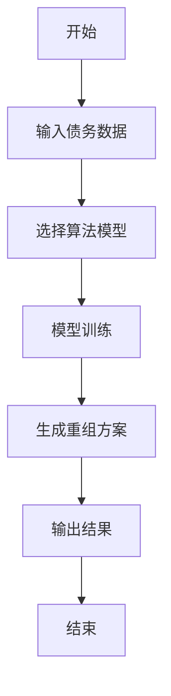
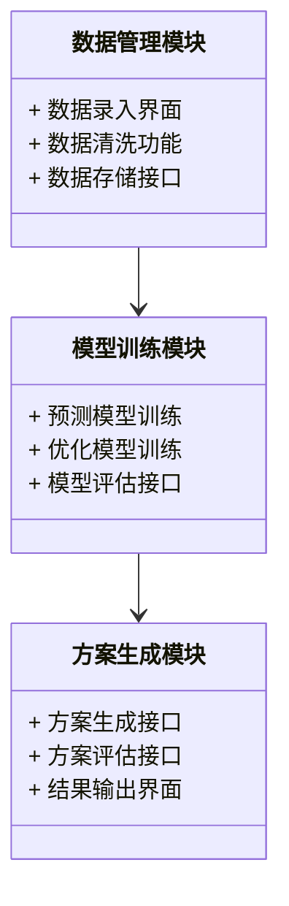
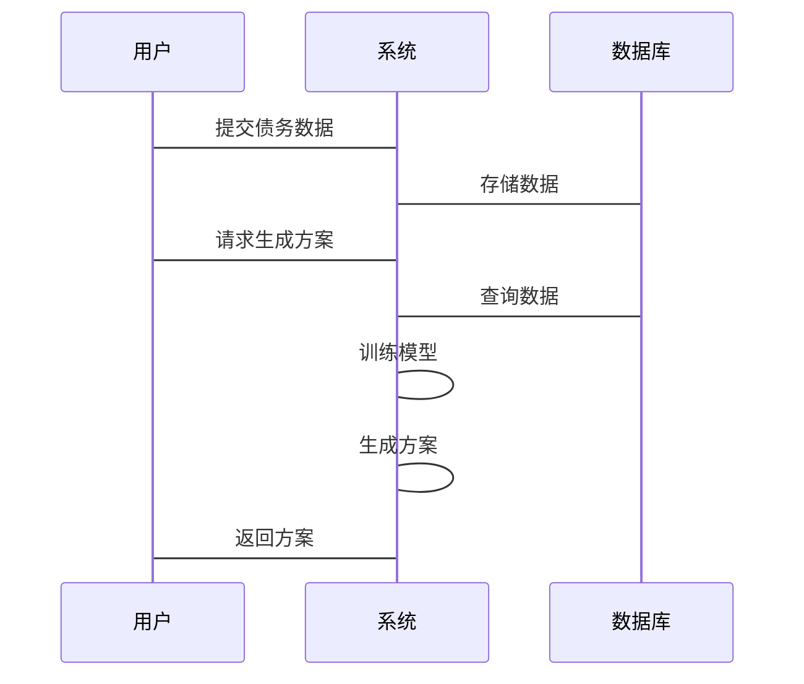

                 


# 智能债务重组方案生成与评估

## 关键词：
智能债务重组，人工智能，算法优化，数学建模，系统架构，案例分析

## 摘要：
本文系统地探讨了智能债务重组的核心概念、算法原理、系统架构和实际应用。通过结合人工智能和大数据技术，提出了一种基于多目标优化的智能债务重组方案生成与评估方法。文章详细分析了传统债务重组的局限性，介绍了智能债务重组的核心优势，包括数据驱动的债务分析、智能算法的应用和多目标优化的实现。通过构建线性规划和深度学习模型，展示了智能债务重组方案生成的数学建模过程。同时，本文还设计了系统的架构图和交互流程图，详细阐述了智能债务重组系统的实现过程。最后，通过实际案例分析，验证了智能债务重组方案的可行性和有效性，并总结了最佳实践和未来研究方向。

---

## 第一部分: 智能债务重组概述

## 第1章: 智能债务重组的背景与概念

### 1.1 债务重组的基本概念

#### 1.1.1 什么是债务重组
- 债务重组是指通过调整债务的条件（如本金、利率、期限等）来优化债务偿还方案的过程。
- 债务重组的目标是降低债务风险，实现债务人和债权人的共赢。

#### 1.1.2 债务重组的常见场景
- 企业因经营不善或资金链断裂，无法按时偿还债务。
- 债权人希望通过债务重组降低损失。
- 金融机构通过债务重组优化资产质量。

#### 1.1.3 债务重组的必要性与重要性
- 传统债务重组方式效率低、成本高。
- 智能债务重组能够快速匹配最优方案，降低双方风险。

### 1.2 智能债务重组的定义与特点

#### 1.2.1 传统债务重组的局限性
- 传统债务重组依赖人工计算，效率低。
- 方案单一，难以满足复杂场景需求。

#### 1.2.2 智能债务重组的核心优势
- 数据驱动，能够快速处理大量债务数据。
- 基于智能算法，生成多样化的优化方案。
- 多目标优化，兼顾债务人和债权人的利益。

#### 1.2.3 智能债务重组的实现方式
- 数据采集与清洗
- 模型训练与优化
- 方案生成与评估

### 1.3 智能债务重组的背景与趋势

#### 1.3.1 人工智能在金融领域的应用
- AI技术在信用评估、风险控制、投资决策中的应用。
- 基于机器学习的债务预测与优化。

#### 1.3.2 智能债务重组的市场需求
- 企业融资需求增加，债务问题日益突出。
- 金融机构需要高效工具来处理债务重组。

#### 1.3.3 智能债务重组的未来发展
- 技术创新：更复杂的算法和模型。
- 应用拓展：从企业债务扩展到个人债务。
- 行业融合：智能债务重组与区块链等技术结合。

---

## 第2章: 智能债务重组的核心概念与联系

### 2.1 智能债务重组的核心概念

#### 2.1.1 数据驱动的债务分析
- 数据来源：债务人的财务数据、市场数据、历史数据。
- 数据清洗与特征提取：去除噪声数据，提取关键特征。

#### 2.1.2 智能算法的应用
- 基于机器学习的债务预测。
- 基于强化学习的方案优化。

#### 2.1.3 多目标优化的实现
- 目标函数设计：最小化债务风险，最大化偿债能力。
- 约束条件：债务期限、利率、本金比例。

### 2.2 智能债务重组的系统架构

#### 2.2.1 数据采集与处理
- 数据源：债务人信息、债权人信息、债务合同。
- 数据清洗：去除无效数据，补充缺失数据。

#### 2.2.2 模型构建与训练
- 线性回归模型：预测债务违约概率。
- 支持向量机（SVM）：分类债务风险等级。
- 神经网络模型：深度学习债务优化方案。

#### 2.2.3 方案生成与评估
- 方案生成：基于模型生成多个优化方案。
- 方案评估：对比不同方案的可行性与收益。

### 2.3 核心概念的ER实体关系图

```mermaid
erDiagram
    actor 债务人 {
        string 债务人ID
        string 名称
        string 联系方式
    }
    actor 债权人 {
        string 债权人ID
        string 名称
        string 联系方式
    }
    entity 债务信息 {
        string 债务ID
        decimal 本金
        decimal 利率
        date 起始日期
        date 结束日期
        string 债务状态
    }
    entity 重组方案 {
        string 方案ID
        decimal 新本金
        decimal 新利率
        date 新起始日期
        date 新结束日期
        string 方案状态
    }
    debt_restructuring(债务人, 债权人, 债务信息, 重组方案)
```

---

## 第3章: 智能债务重组的算法原理

### 3.1 债务重组方案生成算法

#### 3.1.1 基于线性规划的方案生成
- 线性规划模型：
  $$\text{目标函数：} \min Z = c_1x_1 + c_2x_2 + \dots + c_nx_n$$
  $$\text{约束条件：}$$
  $$\sum_{i=1}^{n} a_ix_i = b$$
  $$x_i \geq 0, i=1,2,\dots,n$$

- 算法流程图：


#### 3.1.2 基于深度学习的方案生成
- 神经网络结构：输入层、隐藏层、输出层。
- 损失函数：交叉熵损失。
- 优化算法：随机梯度下降（SGD）。

#### 3.1.3 算法流程图
- 上述线性规划和深度学习模型的结合流程。

### 3.2 债务重组方案评估算法

#### 3.2.1 评估指标
- 方案可行性：是否满足约束条件。
- 方案收益：债权人收益最大化。
- 方案风险：债务人违约概率。

#### 3.2.2 多目标优化
- 使用加权函数将多目标转化为单目标优化。
- 权重系数的确定：基于专家评分或历史数据。

#### 3.2.3 方案评估流程图
- 方案输入、评估指标计算、结果输出。

---

## 第4章: 智能债务重组的系统分析与架构设计

### 4.1 问题场景介绍

#### 4.1.1 债务重组系统的需求分析
- 功能需求：数据输入、模型训练、方案生成、方案评估。
- 性能需求：处理大规模数据，实时生成方案。

#### 4.1.2 项目介绍
- 项目目标：开发智能债务重组系统。
- 项目范围：支持多种债务类型，提供多种优化方案。

### 4.2 系统功能设计

#### 4.2.1 系统功能模块
- 数据管理模块：数据录入、数据清洗。
- 模型训练模块：训练预测模型、优化模型。
- 方案生成模块：生成重组方案、评估方案。

#### 4.2.2 功能模块类图


### 4.3 系统架构设计

#### 4.3.1 系统架构图
- 分层架构：数据层、业务逻辑层、用户界面层。

#### 4.3.2 接口设计
- RESTful API：数据接口、模型接口、方案接口。

#### 4.3.3 交互流程图


---

## 第5章: 智能债务重组的项目实战

### 5.1 环境安装与配置

#### 5.1.1 系统环境
- 操作系统：Linux/Windows/macOS。
- 开发工具：Python、Jupyter Notebook、PyCharm。

#### 5.1.2 依赖库安装
- Python库：numpy、pandas、scikit-learn、keras、tensorflow。
- 其他工具：数据库连接库（如 pymysql）、数据可视化库（如 matplotlib）。

### 5.2 系统核心实现

#### 5.2.1 数据管理模块实现
- 数据清洗代码：
  ```python
  import pandas as pd
  df = pd.read_csv('debt_data.csv')
  df.dropna(inplace=True)
  df.to_csv('clean_data.csv', index=False)
  ```

#### 5.2.2 模型训练模块实现
- 线性回归模型训练：
  ```python
  from sklearn.linear_model import LinearRegression
  model = LinearRegression()
  model.fit(X_train, y_train)
  ```

#### 5.2.3 方案生成模块实现
- 方案生成代码：
  ```python
  def generate_plan(principal, rate, term):
      monthly_payment = (principal * rate * (1 + rate) ** term) / (12 * (1 + rate) ** term - 12)
      return monthly_payment
  ```

### 5.3 案例分析与结果解读

#### 5.3.1 实际案例
- 案例背景：某企业债务重组。
- 方案生成：基于模型生成多种优化方案。
- 方案评估：对比不同方案的可行性与收益。

#### 5.3.2 案例结果
- 方案一：降低本金，延长还款期限。
- 方案二：调整利率，优化还款计划。
- 方案三：结合多种优化策略。

### 5.4 项目总结

#### 5.4.1 实践总结
- 系统实现的关键点。
- 方案生成与评估的效率提升。

#### 5.4.2 项目意义
- 提高债务重组效率，降低债务风险。
- 为企业和金融机构提供高效工具。

---

## 第6章: 智能债务重组的最佳实践与未来展望

### 6.1 最佳实践 tips

#### 6.1.1 实际应用中的注意事项
- 数据质量：确保数据准确性和完整性。
- 模型优化：持续优化算法和模型。
- 方案可行性：结合实际情况调整方案。

#### 6.1.2 模型优化建议
- 使用超参数调优。
- 引入领域知识，优化特征选择。
- 定期更新模型，适应市场变化。

### 6.2 未来展望与研究方向

#### 6.2.1 技术创新
- 更复杂的深度学习模型。
- 结合区块链技术，实现智能合约。
- 自然语言处理技术的应用。

#### 6.2.2 应用拓展
- 从企业债务扩展到个人债务。
- 结合其他金融业务，提供综合解决方案。

#### 6.2.3 行业影响
- 提高金融行业的效率。
- 降低债务违约风险。
- 促进金融市场的健康发展。

---

## 第7章: 总结与展望

### 7.1 总结
- 智能债务重组的优势：高效、精准、多样化。
- 系统架构的核心作用：数据驱动、算法优化、方案生成。

### 7.2 展望
- 技术进步：更先进的算法和模型。
- 应用广泛：智能债务重组在更多领域的应用。
- 未来发展：智能化、自动化、个性化的债务重组方案。

---

## 作者信息

作者：AI天才研究院/AI Genius Institute & 禅与计算机程序设计艺术 /Zen And The Art of Computer Programming

