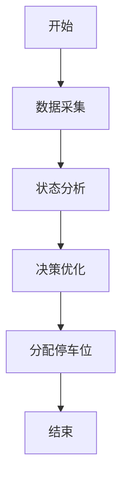
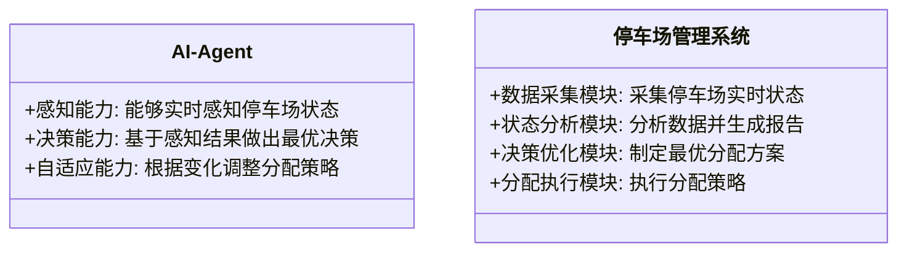
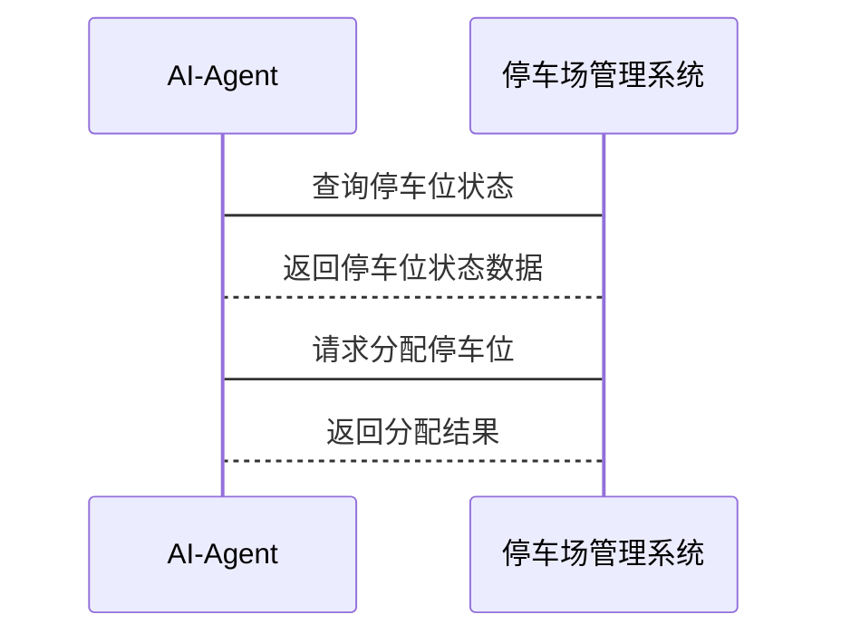

                 


```markdown
# 智能停车系统：AI Agent的车位分配优化

> 关键词：智能停车系统，AI Agent，车位分配优化，算法原理，系统设计，项目实战

> 摘要：本文详细探讨了智能停车系统中AI Agent在车位分配优化中的应用，从背景、核心概念、算法原理到系统设计和项目实战，全面解析了如何利用AI技术提升停车效率和用户体验。

---

## 第一部分：智能停车系统概述

### 第1章：智能停车系统的发展与挑战

#### 1.1 智能停车系统的背景介绍
- 1.1.1 停车问题的现状与痛点
  - 城市化进程加速，停车位资源紧张。
  - 传统停车系统效率低，用户体验差。
- 1.1.2 智能停车系统的概念与目标
  - 利用AI技术优化车位分配，提升停车效率。
- 1.1.3 AI Agent在智能停车中的作用
  - AI Agent作为智能系统的核心，实时感知和决策。

#### 1.2 车位分配优化的核心问题
- 1.2.1 车位分配问题的定义
  - 在有限停车位资源下，如何高效分配给车辆。
- 1.2.2 优化目标与约束条件
  - 最大化车位利用率，减少等待时间。
- 1.2.3 系统边界与外延
  - 系统范围包括停车场入口、出口及内部区域。

---

## 第二部分：AI Agent与车位分配优化的核心概念

### 第2章：AI Agent的基本原理与特性

#### 2.1 AI Agent的定义与分类
- 2.1.1 AI Agent的基本定义
  - AI Agent是具备感知和决策能力的智能体。
- 2.1.2 基于AI Agent的分类
  - 分为基于规则、基于学习和基于强化学习的AI Agent。
- 2.1.3 AI Agent的核心属性与特征对比
  - 表格形式对比感知能力、决策能力、自适应能力等。

#### 2.2 车位分配优化的数学模型
- 2.2.1 数学模型的构建
  - 使用整数线性规划模型。
- 2.2.2 优化目标的数学表达
  - 最大化车位使用率：$$\text{Maximize} \sum_{i=1}^{n} v_i$$
- 2.2.3 约束条件的数学表示
  - 每个停车位只能分配一辆车：$$\sum_{j=1}^{m} x_{ij} \leq 1$$

### 第3章：车位分配优化的算法原理

#### 3.1 基于AI Agent的车位分配算法
- 3.1.1 算法的基本思路
  - 实时感知停车场状态，动态分配停车位。
- 3.1.2 算法的实现步骤
  - 数据采集、状态分析、决策优化。
- 3.1.3 算法的数学模型与公式
  - 使用粒子群优化算法进行车位分配。

#### 3.2 算法流程


#### 3.3 算法实现代码
```python
import numpy as np

def optimizeParking():
    parking_spaces = np.random.randint(0, 100, 50)
    for i in range(len(parking_spaces)):
        if parking_spaces[i] == 0:
            assign_space(i)
```

---

## 第三部分：系统设计与实现

### 第4章：系统设计与架构分析

#### 4.1 问题场景介绍
- 大型商场停车场的高峰期车位分配问题。

#### 4.2 系统功能设计
- 功能模块包括数据采集、状态分析、决策优化和分配执行。

#### 4.3 系统架构设计


#### 4.4 系统接口设计
- 使用RESTful API实现停车场管理系统与AI Agent之间的通信。

#### 4.5 系统交互流程


### 第5章：项目实战与优化策略

#### 5.1 项目环境安装
- 安装Python、numpy、mermaid等开发工具。

#### 5.2 代码实现
```python
import requests
import json

def assign_space(car_id):
    url = 'http://localhost:8000/api/allocate'
    data = {'car_id': car_id}
    response = requests.post(url, json=data)
    return json.loads(response.text)
```

#### 5.3 案例分析与优化
- 分析高峰期车位分配效率，优化算法参数。

#### 5.4 优化策略
- 实时调整停车位分配策略，动态优化停车效率。

---

## 第四部分：总结与展望

### 第6章：总结与展望

#### 6.1 内容总结
- AI Agent在车位分配优化中的重要作用。
- 系统设计和实现的具体方法。

#### 6.2 未来展望
- 结合5G和物联网技术，进一步提升停车系统智能化水平。

### 第7章：最佳实践与注意事项

#### 7.1 最佳实践
- 确保数据采集的实时性和准确性。
- 定期优化算法模型，适应需求变化。

#### 7.2 注意事项
- 处理好系统扩展性和性能的关系。
- 注意数据隐私和系统安全。

### 第8章：附录

#### 8.1 参考文献
- [1] 《AI Agent原理与应用》
- [2] 《智能停车系统设计与实现》

#### 8.2 数据集与工具
- 数据集链接：[停车位状态数据集](#)
- 工具与库：numpy、requests、mermaid等。

---

## 作者信息

作者：AI天才研究院 & 禅与计算机程序设计艺术

---

通过以上详细的结构安排，本文系统地介绍了智能停车系统中AI Agent的车位分配优化方法，从理论到实践，为读者提供了全面的技术指导和实现方案。
```

