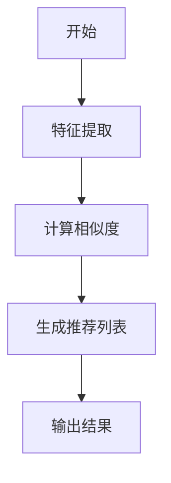
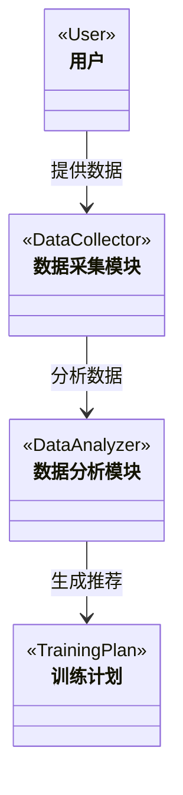
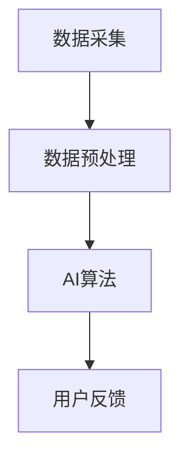
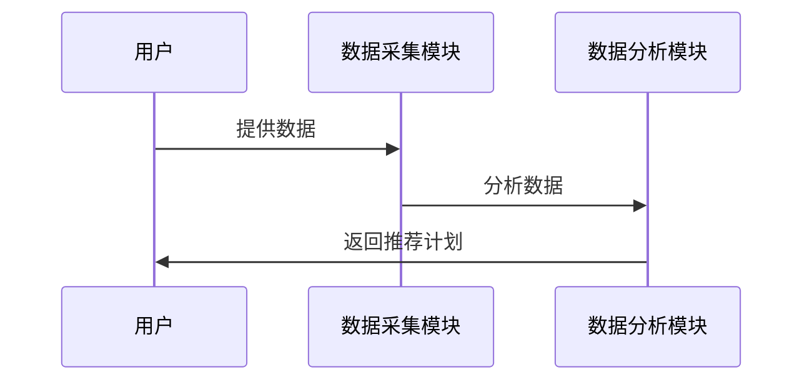

                 


# 智能健身器：AI Agent的个性化训练计划

**关键词：AI Agent、个性化训练、智能健身、健身科技、人工智能算法**

**摘要：** 本文探讨了AI Agent在智能健身器中的应用，详细分析了其如何通过个性化训练计划提升健身效果。文章从背景、原理到实战，全面解析了AI Agent在健身领域的核心作用，结合算法原理和系统架构设计，为读者提供了深入的技术洞察。

---

## 第一部分：智能健身器的背景与概念

### 第1章：智能健身器的背景与现状

#### 1.1 智能健身设备的发展历程
- **1.1.1 传统健身设备的局限性**
  - 传统健身设备功能单一，缺乏智能化和个性化。
  - 用户难以获得实时反馈和科学指导。
  - 数据采集和分析能力有限。

- **1.1.2 智能化健身设备的兴起**
  - 智能健身设备通过传感器和AI技术实现数据采集与分析。
  - 提供实时反馈和个性化建议，提升用户体验。
  - 市场需求激增，推动行业快速发展。

- **1.1.3 当前市场现状与趋势**
  - 市场规模持续扩大，AI技术成为核心驱动力。
  - 用户对个性化和智能化需求日益增长。
  - 未来趋势：AI算法优化，设备功能多样化。

#### 1.2 个性化训练计划的重要性
- **1.2.1 个性化训练的概念**
  - 根据用户的身体状况、健身目标和偏好制定专属计划。
  - 强调科学性和高效性，避免过度训练或不足。

- **1.2.2 个性化训练在健身中的作用**
  - 提高训练效果，缩短达成目标的时间。
  - 减少运动损伤，提升安全性。
  - 增强用户体验，提升用户满意度。

- **1.2.3 数据驱动的个性化训练**
  - 利用传感器数据、运动数据和用户反馈。
  - 结合AI算法，动态调整训练计划。

#### 1.3 AI Agent在健身领域的应用
- **1.3.1 AI Agent的基本概念**
  - AI Agent是一种智能体，能够感知环境并做出决策。
  - 在健身领域，AI Agent用于数据采集、分析和推荐。

- **1.3.2 AI Agent在健身中的应用场景**
  - 实时监测用户的运动数据，如心率、动作幅度。
  - 分析数据，推荐适合的训练计划和动作建议。
  - 提供个性化反馈，优化训练效果。

- **1.3.3 智能健身器的核心价值**
  - 提供科学、个性化的训练指导。
  - 帮助用户高效达成健身目标。
  - 增强用户粘性，提升产品竞争力。

#### 1.4 本章小结
本章介绍了智能健身器的发展背景，强调了个性化训练的重要性，并详细探讨了AI Agent在健身领域的应用及其核心价值。

---

## 第二部分：AI Agent的核心概念与原理

### 第2章：AI Agent的基本原理

#### 2.1 AI Agent的定义与分类
- **2.1.1 AI Agent的定义**
  - AI Agent是一种能够感知环境、做出决策并执行任务的智能体。
  - 在健身领域，AI Agent通过传感器和数据处理系统，为用户提供个性化建议。

- **2.1.2 基于规则的AI Agent**
  - 基于预定义的规则和逻辑进行决策。
  - 适用于简单场景，如固定动作的推荐。

- **2.1.3 基于学习的AI Agent**
  - 利用机器学习算法，从数据中学习决策规则。
  - 适用于复杂场景，能够动态调整训练计划。

#### 2.2 AI Agent的核心模块
- **2.2.1 感知模块**
  - 通过传感器采集用户数据，如心率、动作幅度。
  - 数据预处理和特征提取。

- **2.2.2 决策模块**
  - 分析感知数据，结合用户目标和偏好。
  - 生成个性化训练计划和建议。

- **2.2.3 执行模块**
  - 将决策结果转化为具体行动，如调整训练强度。
  - 提供实时反馈和指导。

#### 2.3 AI Agent的感知与决策机制
- **2.3.1 数据采集与处理**
  - 多传感器融合技术，确保数据的准确性和完整性。
  - 数据清洗和特征提取，为后续分析提供基础。

- **2.3.2 状态分析与评估**
  - 利用机器学习模型，评估用户的当前状态。
  - 状态评估结果用于生成个性化建议。

- **2.3.3 行动决策与优化**
  - 基于状态评估结果，动态调整训练计划。
  - 利用强化学习优化决策策略，提升训练效果。

#### 2.4 本章小结
本章详细讲解了AI Agent的基本原理，包括其定义、核心模块和感知与决策机制，为后续的算法分析和系统设计奠定了基础。

---

## 第三部分：AI Agent的算法原理与数学模型

### 第3章：AI Agent的推荐算法原理

#### 3.1 推荐算法概述
- **3.1.1 基于协同过滤的推荐算法**
  - 基于用户行为数据，找到相似用户的偏好。
  - 推荐用户可能感兴趣的训练计划。

- **3.1.2 基于内容的推荐算法**
  - 利用训练计划的特征，如类型、难度、时长。
  - 推荐与用户偏好匹配的训练计划。

- **3.1.3 混合推荐算法**
  - 结合协同过滤和基于内容的推荐算法。
  - 提高推荐的准确性和多样性。

#### 3.2 协同过滤算法的数学模型
- **用户-物品矩阵**
  - 行表示用户，列表示训练计划。
  - 元素值表示用户对训练计划的偏好。

- **相似度计算公式**
  $$\text{相似度} = \frac{\sum_{i=1}^{n}(r_{ui} - \bar{r_u})(r_{vi} - \bar{r_v})}{\sqrt{\sum_{i=1}^{n}(r_{ui} - \bar{r_u})^2} \cdot \sqrt{\sum_{i=1}^{n}(r_{vi} - \bar{r_v})^2}}$$
  - 其中，$r_{ui}$是用户$u$对训练计划$i$的评分，$\bar{r_u}$是用户$u$的平均评分。

#### 3.3 基于内容的推荐算法实现
- **特征提取与表示**
  - 将训练计划的特征转化为向量表示。
  - 使用词袋模型或TF-IDF提取文本特征。

- **相似度计算与排序**
  - 计算训练计划之间的余弦相似度。
  - 根据相似度排序，推荐最相似的训练计划。

- **算法流程图（Mermaid）**


#### 3.4 本章小结
本章详细探讨了AI Agent的推荐算法，包括协同过滤和基于内容的推荐算法，并通过数学公式和流程图展示了算法的实现过程。

---

## 第四部分：系统分析与架构设计

### 第4章：智能健身器的系统架构

#### 4.1 系统需求分析
- **功能需求**
  - 数据采集：心率、动作幅度等。
  - 数据分析：个性化评估和推荐。
  - 用户交互：实时反馈和指导。

- **性能需求**
  - 实时性：快速响应用户需求。
  - 准确性：保证推荐的科学性和有效性。

#### 4.2 系统功能设计
- **领域模型（Mermaid类图）**


#### 4.3 系统架构设计
- **分层架构**
  - 数据采集层：传感器和数据预处理。
  - AI处理层：算法实现和数据分析。
  - 用户界面层：交互和反馈。

- **架构图（Mermaid）**


#### 4.4 系统接口设计
- **API接口**
  - 数据采集接口：接收传感器数据。
  - 推荐接口：返回个性化训练计划。

#### 4.5 系统交互设计
- **交互流程图（Mermaid）**


#### 4.6 本章小结
本章通过系统分析和架构设计，详细描述了智能健身器的实现过程，包括功能设计、架构选择和接口设计。

---

## 第五部分：项目实战

### 第5章：智能健身器的实现

#### 5.1 环境安装与配置
- **Python环境**
  - 安装Python 3.8及以上版本。
  - 安装必要的库：numpy、pandas、scikit-learn。

#### 5.2 核心代码实现
- **数据预处理代码**
```python
import numpy as np
import pandas as pd

# 读取数据
data = pd.read_csv('training_plan.csv')

# 数据清洗
data.dropna(inplace=True)
data['user_id'] = data['user_id'].astype(int)
```

- **推荐算法实现**
```python
from sklearn.metrics.pairwise import cosine_similarity

# 计算用户相似度矩阵
user_similarity = cosine_similarity(data)
```

#### 5.3 案例分析与优化
- **案例分析**
  - 用户A：目标减脂，喜欢中等强度训练。
  - 推荐计划：结合协同过滤和基于内容的推荐，生成个性化计划。

- **优化建议**
  - 定期更新算法模型，提升推荐准确性。
  - 引入用户反馈机制，优化推荐结果。

#### 5.4 本章小结
本章通过实际项目实战，详细讲解了智能健身器的实现过程，包括环境配置、代码实现和案例分析。

---

## 第六部分：最佳实践与总结

### 第6章：AI Agent在智能健身器中的最佳实践

#### 6.1 小结与总结
- AI Agent通过个性化推荐和实时反馈，显著提升了健身效果。
- 结合算法优化和系统设计，确保了推荐的准确性和高效性。

#### 6.2 注意事项
- 数据隐私保护：确保用户数据的安全性。
- 算法可解释性：提升用户信任度。
- 系统稳定性：保证实时响应和高可用性。

#### 6.3 拓展阅读
- 《机器学习实战》
- 《深度学习入门：基于Python》
- 《自然语言处理入门》

---

## 作者信息

作者：AI天才研究院/AI Genius Institute & 禅与计算机程序设计艺术/Zen And The Art of Computer Programming

---

本文通过系统化的分析和实战，全面探讨了AI Agent在智能健身器中的应用，为读者提供了从理论到实践的深度洞察。

