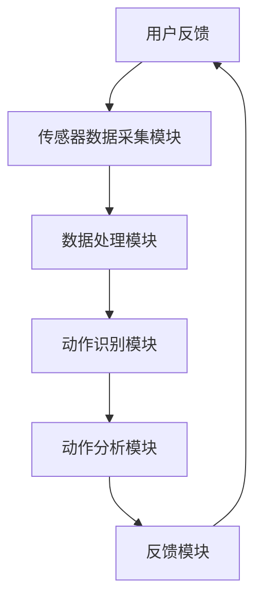

                 


# 智能健身镜：AI Agent的动作纠正

> 关键词：智能健身镜、AI Agent、动作纠正、计算机视觉、深度学习

> 摘要：智能健身镜通过AI Agent实现动作纠正，结合计算机视觉和深度学习技术，为用户提供个性化的健身指导。本文详细探讨了AI Agent的动作纠正机制、算法原理、系统架构及项目实现，旨在为相关领域的开发者和研究者提供理论支持和实践指导。

---

## 第一部分：智能健身镜的发展背景与概述

### 第1章：智能健身镜的发展背景

#### 1.1 智能健身镜的定义与特点

智能健身镜是一种结合了计算机视觉、人工智能和物联网技术的智能健身设备，它通过镜子的界面提供实时的健身指导和动作纠正服务。其主要特点包括：

- **实时性**：能够实时捕捉用户的动作，并立即提供反馈。
- **智能化**：通过AI算法分析动作，提供个性化的纠正建议。
- **便捷性**：用户无需额外的设备，只需一面镜子即可完成健身训练。
- **交互性**：支持语音或手势交互，提升用户体验。

#### 1.2 AI Agent在健身领域的应用

AI Agent（智能代理）是一种能够感知环境、自主决策并执行任务的智能系统。在健身领域，AI Agent的主要应用包括：

- **动作捕捉与分析**：通过摄像头捕捉用户的动作，识别动作的正确性。
- **实时反馈**：根据动作分析结果，提供纠正建议或指导。
- **个性化训练计划**：基于用户的动作数据，制定个性化的训练方案。

#### 1.3 智能健身镜的市场现状与发展趋势

随着人们对健康生活的追求和科技的进步，智能健身镜市场逐渐崛起。其发展趋势包括：

- **技术升级**：从简单的动作捕捉到深度学习的广泛应用。
- **用户需求多样化**：从单一的健身指导到全面的健康管理和社交互动。
- **市场竞争加剧**：越来越多的企业进入智能健身镜市场，推动技术和服务的不断创新。

---

## 第二部分：AI Agent的动作纠正核心概念

### 第2章：AI Agent的动作纠正机制

#### 2.1 动作捕捉与分析

动作捕捉是AI Agent实现动作纠正的第一步。通过摄像头捕捉用户的动作数据，AI系统能够实时分析用户的动作是否标准。

##### 2.1.1 动作捕捉技术的原理

动作捕捉技术主要基于计算机视觉，通过摄像头采集用户的身体姿态、关节位置等信息。常见的动作捕捉技术包括：

- **基于深度学习的动作捕捉**：利用卷积神经网络（CNN）提取图像特征，识别人体姿态。
- **基于骨骼跟踪的动作捕捉**：通过算法提取人体骨骼信息，重建三维人体模型。

##### 2.1.2 基于AI的运动分析算法

运动分析算法的核心是将捕捉到的动作数据与标准动作进行对比，识别动作中的偏差。常用的算法包括：

- **姿态估计**：通过深度学习模型（如姿态估计网络）预测人体关键点位置。
- **运动轨迹分析**：分析动作的连贯性和流畅性。

##### 2.1.3 动作捕捉的实现方式

动作捕捉的实现方式多样，常见的包括：

- **单目摄像头**：通过单目摄像头捕捉动作，适用于简单的动作捕捉。
- **多目摄像头**：通过多个摄像头从不同角度捕捉动作，提高捕捉精度。
- **红外传感器**：通过红外传感器捕捉人体动作，适用于室内环境。

#### 2.2 动作纠正的实现逻辑

动作纠正的核心是AI系统根据捕捉到的动作数据，判断动作是否标准，并提供纠正建议。

##### 2.2.1 动作纠正的算法流程

动作纠正的算法流程包括以下几个步骤：

1. **数据采集**：通过摄像头或传感器采集用户的动作数据。
2. **数据预处理**：对采集到的数据进行降噪和归一化处理。
3. **动作识别**：利用深度学习模型识别用户的动作类型。
4. **动作分析**：将识别出的动作与标准动作进行对比，找出偏差。
5. **纠正建议**：根据分析结果，生成纠正建议并反馈给用户。

##### 2.2.2 AI Agent如何判断动作是否标准

AI系统通过以下方法判断动作是否标准：

- **基于概率模型的判断**：通过概率模型计算动作与标准动作的相似度。
- **基于规则的判断**：根据预设的规则判断动作是否符合标准。
- **基于深度学习的判断**：利用深度学习模型预测动作的正确性。

##### 2.2.3 动作纠正的反馈机制

反馈机制是动作纠正的重要组成部分，主要包括：

- **实时反馈**：通过镜子屏幕实时显示纠正建议。
- **语音反馈**：通过语音助手提供纠正指导。
- **视觉反馈**：通过视觉提示（如颜色变化）提醒用户调整动作。

#### 2.3 动作纠正的系统设计

动作纠正系统的设计需要考虑以下几个方面：

##### 2.3.1 系统架构设计

动作纠正系统的架构设计包括以下几个模块：

1. **数据采集模块**：负责采集用户的动作数据。
2. **数据处理模块**：对采集到的数据进行预处理和特征提取。
3. **动作识别模块**：识别用户的动作类型。
4. **动作分析模块**：分析动作的正确性。
5. **反馈模块**：根据分析结果提供纠正建议。

##### 2.3.2 系统的核心算法与数据流

系统的算法流程如下：

1. 数据采集模块采集用户的动作数据。
2. 数据处理模块对数据进行预处理。
3. 动作识别模块识别动作类型。
4. 动作分析模块分析动作的正确性。
5. 反馈模块根据分析结果提供纠正建议。

---

## 第三部分：AI Agent动作纠正的算法原理

### 第3章：动作捕捉与分析算法

#### 3.1 基于深度学习的动作捕捉

基于深度学习的动作捕捉主要利用卷积神经网络（CNN）提取图像特征，识别人体姿态。

##### 3.1.1 常见的动作捕捉模型

常见的动作捕捉模型包括：

- **OpenPose**：基于CNN的姿态估计模型。
- **Hourglass Network**：用于姿态估计的Hourglass网络。
- **Simple Baseline**：用于姿态估计的轻量级模型。

##### 3.1.2 基于卷积神经网络的动作捕捉实现

动作捕捉的实现步骤如下：

1. **图像输入**：将用户图像输入CNN网络。
2. **特征提取**：通过卷积层提取图像特征。
3. **姿态估计**：通过解码器预测人体关键点位置。

##### 3.1.3 动作捕捉的数学模型

动作捕捉的数学模型可以通过以下公式表示：

$$
I(x,y) = \sum_{i=1}^{n} w_i \cdot f_i(x,y)
$$

其中，\(I(x,y)\) 是图像的像素值，\(w_i\) 是权重，\(f_i(x,y)\) 是特征函数。

#### 3.2 基于骨骼跟踪的动作分析

骨骼跟踪是通过算法提取人体骨骼信息，重建三维人体模型。

##### 3.2.1 骨骼跟踪的基本原理

骨骼跟踪的基本原理是通过传感器或摄像头捕捉人体关节的位置，重建人体骨骼模型。

##### 3.2.2 基于AI的骨骼跟踪算法

基于AI的骨骼跟踪算法主要包括：

- **基于CNN的骨骼跟踪**：利用CNN提取骨骼特征。
- **基于LSTM的骨骼跟踪**：利用LSTM预测骨骼运动轨迹。

##### 3.2.3 骨骼跟踪在动作分析中的应用

骨骼跟踪在动作分析中的应用包括：

- **动作识别**：通过骨骼信息识别动作类型。
- **动作纠正**：通过骨骼信息分析动作偏差。

#### 3.3 动作纠正的数学模型

动作纠正的数学模型可以通过以下公式表示：

$$
\text{纠正建议} = \argmin_{a \in A} \sum_{i=1}^{n} (a_i - s_i)^2
$$

其中，\(A\) 是动作集合，\(s_i\) 是标准动作的特征。

---

## 第四部分：智能健身镜的系统架构与实现

### 第4章：智能健身镜的系统架构设计

#### 4.1 系统功能模块划分

系统的功能模块包括：

1. **传感器数据采集模块**：负责采集用户的动作数据。
2. **AI处理模块**：负责对数据进行分析和处理。
3. **用户反馈模块**：负责向用户反馈纠正建议。

#### 4.2 系统架构设计

系统的架构设计可以通过以下Mermaid图表示：



#### 4.3 系统的核心算法与数据流

系统的算法流程如下：

1. 用户进行动作。
2. 传感器采集动作数据。
3. 数据处理模块对数据进行预处理。
4. 动作识别模块识别动作类型。
5. 动作分析模块分析动作的正确性。
6. 反馈模块根据分析结果提供纠正建议。

---

## 第五部分：项目实战

### 第5章：项目实战

#### 5.1 环境安装

项目实战需要以下环境：

- **Python 3.8以上版本**
- **深度学习框架（如TensorFlow或PyTorch）**
- **OpenCV库**
- **摄像头或传感器设备**

#### 5.2 系统核心实现源代码

以下是一个简单的动作纠正系统的代码示例：

```python
import cv2
import numpy as np

def capture_action():
    # 初始化摄像头
    cap = cv2.VideoCapture(0)
    while True:
        ret, frame = cap.read()
        if not ret:
            break
        # 进行动作捕捉
        action = detect_action(frame)
        # 进行动作分析
        correct_action(action)
        # 显示结果
        cv2.imshow('Action Correction', frame)
        if cv2.waitKey(1) == ord('q'):
            break
    cap.release()
    cv2.destroyAllWindows()

def detect_action(frame):
    # 使用OpenCV进行动作捕捉
    # 返回动作类型
    pass

def correct_action(action):
    # 根据动作类型提供纠正建议
    print(f"纠正建议：{action}")
```

#### 5.3 案例分析与详细讲解

以下是一个动作纠正的案例分析：

1. **用户动作**：用户进行深蹲动作。
2. **动作捕捉**：摄像头捕捉到用户的动作数据。
3. **动作识别**：识别出用户动作类型为深蹲。
4. **动作分析**：分析动作的正确性，发现用户膝盖弯曲不足。
5. **纠正建议**：建议用户在深蹲时膝盖弯曲至90度。

---

## 第六部分：总结与展望

### 第6章：总结与展望

#### 6.1 本章总结

智能健身镜通过AI Agent实现动作纠正，结合计算机视觉和深度学习技术，为用户提供个性化的健身指导。本文详细探讨了AI Agent的动作纠正机制、算法原理、系统架构及项目实现。

#### 6.2 未来展望

未来，智能健身镜的发展方向包括：

- **技术升级**：进一步提高动作捕捉的精度和反馈的实时性。
- **用户需求多样化**：提供更多样化的健身内容和个性化服务。
- **市场竞争加剧**：推动技术和服务的不断创新。

---

## 作者信息

作者：AI天才研究院/AI Genius Institute & 禅与计算机程序设计艺术 /Zen And The Art of Computer Programming

---

以上是《智能健身镜：AI Agent的动作纠正》的技术博客文章的完整目录和内容框架。希望本文能为相关领域的开发者和研究者提供有价值的参考和指导。

