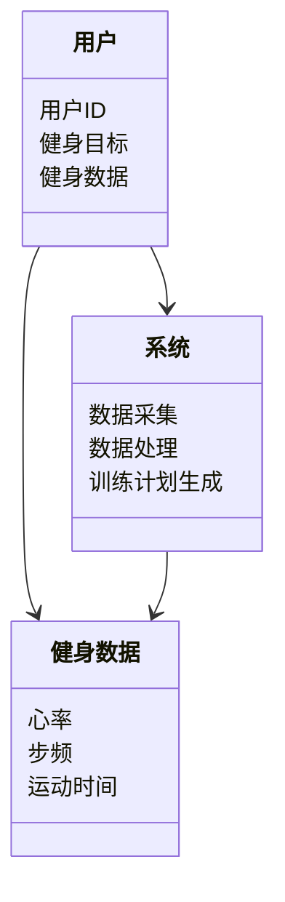
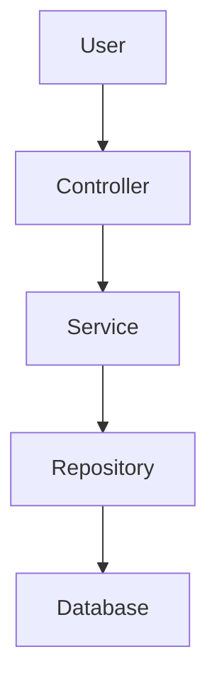
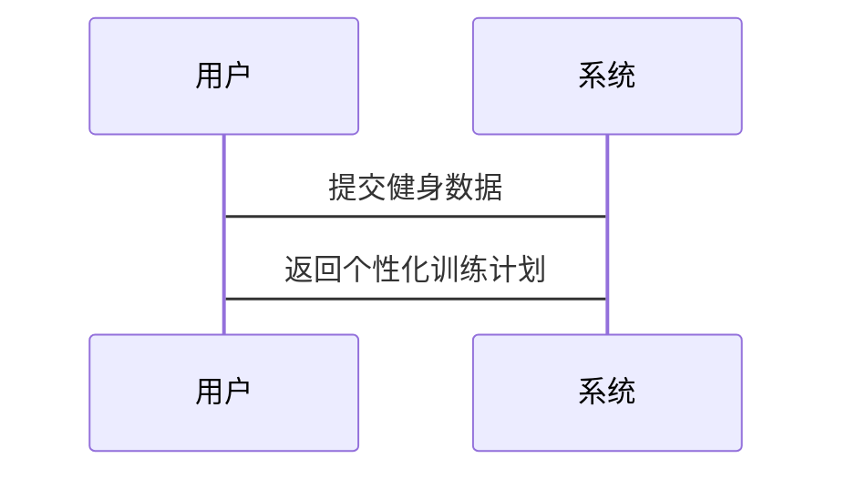

                 


# 智能健身：AI Agent的个性化训练计划

> 关键词：AI Agent, 个性化训练计划, 智能健身, 健身数据, 推荐算法, 系统架构, 项目实战

> 摘要：本文将探讨如何利用AI Agent技术实现个性化训练计划，分析其背后的核心概念、算法原理和系统架构，并通过实际项目案例展示其应用价值。通过本文，读者将深入了解AI在健身领域的创新应用，掌握从数据采集到算法实现的全过程，并最终能够构建一个基于AI的个性化训练计划系统。

---

# 第一部分: 背景与概念

## 第1章: 智能健身的背景与问题描述

### 1.1 传统健身方式的局限性

#### 1.1.1 传统健身计划的不足
传统的健身计划往往基于通用模板，忽视了个体差异。例如，一个减脂计划可能对所有人适用，但忽略了不同人的代谢率、运动习惯和饮食习惯的差异，导致效果不佳。

#### 1.1.2 用户需求的多样性与复杂性
现代健身需求多样化，用户可能同时追求减脂、增肌、提高耐力等多重目标。传统的一-size-fits-all方法难以满足这些复杂需求。

#### 1.1.3 健身数据的碎片化问题
用户的健身数据（如心率、步频、运动强度等）通常分散在不同的设备和平台中，难以整合和分析。

### 1.2 AI Agent在健身领域的应用潜力

#### 1.2.1 AI Agent的基本概念
AI Agent是一种能够感知环境、执行任务并做出决策的智能实体。在健身领域，AI Agent可以实时分析用户的健身数据，并推荐个性化的训练计划。

#### 1.2.2 AI在个性化训练中的优势
AI能够快速处理大量数据，挖掘隐藏的模式，并根据用户反馈动态调整训练计划，从而实现真正的个性化。

#### 1.2.3 智能健身的未来发展趋势
随着传感器技术的进步和AI算法的优化，未来的健身设备将更加智能化，能够实时监测用户的健康状况并提供个性化的指导。

## 第2章: 个性化训练计划的核心要素

### 2.1 健身目标的多样性

#### 2.1.1 健身目标的分类
常见的健身目标包括减脂、增肌、提高耐力、改善柔韧性等。

#### 2.1.2 不同目标的训练策略差异
例如，减脂训练需要高强度间歇训练，而增肌训练需要力量训练。

#### 2.1.3 健身目标的动态变化
用户的健身目标可能会随着时间推移而变化，AI Agent需要能够实时捕捉这些变化并调整训练计划。

### 2.2 用户特征的分析

#### 2.2.1 身体状况评估
通过传感器数据（如心率、步频等）和问卷调查，评估用户的初始身体状况。

#### 2.2.2 运动习惯与偏好
了解用户的运动习惯（如喜欢室内还是室外运动）和偏好（如喜欢哪种类型的运动）。

#### 2.2.3 健康数据的采集与处理
采集用户的健康数据（如BMI、体脂率等），并进行预处理和特征提取。

### 2.3 健身计划的动态调整

#### 2.3.1 训练计划的个性化定制
基于用户的特征和目标，生成个性化的训练计划。

#### 2.3.2 根据反馈实时调整
通过用户的反馈（如完成情况、感受等），动态调整训练计划。

#### 2.3.3 长期目标与短期目标的平衡
在追求长期目标的同时，设置短期目标以保持用户的动力。

---

# 第二部分: 核心概念与联系

## 第3章: AI Agent的核心原理

### 3.1 AI Agent的基本原理

#### 3.1.1 人工智能的基本概念
人工智能（AI）是指模拟人类智能的计算机系统，能够执行学习、推理和自适应等任务。

#### 3.1.2 代理（Agent）的定义与特征
代理是指能够感知环境、采取行动以实现目标的智能实体。AI Agent具有自主性、反应性、目标导向性和社交能力。

#### 3.1.3 AI Agent的工作流程
AI Agent的工作流程包括感知环境、分析信息、制定决策、执行行动和反馈优化。

### 3.2 个性化训练计划的算法模型

#### 3.2.1 基于规则的推荐算法
基于预定义的规则推荐训练计划，例如“如果用户目标是减脂，则推荐高强度间歇训练”。

#### 3.2.2 基于数据挖掘的推荐算法
通过挖掘用户的健身数据，发现隐藏的模式，并推荐相似的训练计划。

#### 3.2.3 基于机器学习的推荐算法
利用机器学习模型（如协同过滤、深度学习等）预测用户的偏好，并推荐个性化训练计划。

### 3.3 健身数据的特征分析

#### 3.3.1 数据的采集与预处理
采集用户的健身数据（如运动时间、心率、步频等），并进行清洗和标准化。

#### 3.3.2 数据特征的提取与分类
将数据特征分为类别特征（如性别）、数值特征（如年龄）和时间特征（如运动频率）。

#### 3.3.3 数据特征的权重计算
根据特征的重要性赋予不同的权重，例如年龄对增肌的影响较大，而心率对减脂的影响较大。

## 第4章: 核心概念的联系与对比

### 4.1 AI Agent与传统健身计划的区别

#### 4.1.1 个性化程度对比
AI Agent能够实现真正的个性化推荐，而传统计划往往是通用的。

#### 4.1.2 数据处理方式对比
AI Agent能够整合和分析多源数据，而传统计划通常基于有限的输入。

#### 4.1.3 调整速度对比
AI Agent可以实时调整，而传统计划需要人工干预。

### 4.2 不同算法模型的优劣势对比

| 算法模型       | 优点                           | 缺点                           |
|----------------|--------------------------------|--------------------------------|
| 基于规则的推荐 | 实现简单，易于解释              | 需要手动定义规则，缺乏灵活性 |
| 基于数据挖掘的推荐 | 可以发现数据中的隐含模式        | 对数据质量要求较高             |
| 基于机器学习的推荐 | 能够自动学习用户偏好           | 需要大量数据和计算资源          |

### 4.3 健身数据与训练计划的关系

#### 4.3.1 数据驱动的训练计划制定
通过分析用户的健身数据，制定个性化的训练计划。

#### 4.3.2 数据反馈对训练计划的优化作用
用户的反馈（如完成情况、感受）可以优化训练计划。

#### 4.3.3 数据的实时性与计划的动态调整
实时数据（如心率）可以实时调整训练强度。

---

# 第三部分: 算法原理与数学模型

## 第5章: 算法原理与数学模型

### 5.1 基于机器学习的推荐算法

#### 5.1.1 协同过滤算法
协同过滤是一种基于用户相似性推荐算法。

- **数学公式**：
  $$ sim(u, v) = \frac{\sum_{i \in u \& v} (r_i(u) - \bar{r}(u))(r_i(v) - \bar{r}(v))}{\sqrt{\sum_{i \in u \& v} (r_i(u) - \bar{r}(u))^2} \cdot \sqrt{\sum_{i \in u \& v} (r_i(v) - \bar{r}(v))^2}} $$
  其中，$sim(u, v)$ 表示用户u和v的相似度，$r_i(u)$ 表示用户u对物品i的评分，$\bar{r}(u)$ 表示用户u的平均评分。

#### 5.1.2 基于内容的推荐算法
基于内容的推荐算法基于物品的特征进行推荐。

- **数学公式**：
  $$ score(i, u) = \sum_{f \in F} w_f \cdot f(i) $$
  其中，$score(i, u)$ 表示物品i对用户u的得分，$F$ 表示特征集合，$w_f$ 表示特征f的权重。

#### 5.1.3 混合推荐算法
混合推荐算法结合了协同过滤和基于内容的推荐算法。

### 5.2 健身数据的特征分析与权重计算

#### 5.2.1 数据的预处理与标准化
将原始数据进行标准化处理，例如使用归一化方法：

$$ x' = \frac{x - \mu}{\sigma} $$
其中，$\mu$ 表示均值，$\sigma$ 表示标准差。

#### 5.2.2 数据特征的权重计算
使用加权平均法计算特征的权重：

$$ w_i = \frac{\sum_{j} w_{i,j}}{n} $$
其中，$w_i$ 表示特征i的权重，$w_{i,j}$ 表示特征i在样本j中的权重，$n$ 表示样本数量。

---

# 第四部分: 系统分析与架构设计

## 第6章: 系统分析与架构设计

### 6.1 问题场景介绍

#### 6.1.1 问题背景
用户需要一个能够根据自身特征和目标，推荐个性化训练计划的系统。

#### 6.1.2 问题目标
设计一个基于AI Agent的个性化训练计划推荐系统。

### 6.2 系统功能设计

#### 6.2.1 领域模型


#### 6.2.2 系统架构设计


#### 6.2.3 系统接口设计
定义API接口，例如：

- `/api/user/data`：获取用户的健身数据
- `/api/training-plan/generate`：生成训练计划

### 6.3 系统交互设计

#### 6.3.1 交互流程


---

# 第五部分: 项目实战

## 第7章: 项目实战

### 7.1 环境安装

#### 7.1.1 安装Python
安装Python 3.8及以上版本。

#### 7.1.2 安装依赖库
安装必要的依赖库，例如：
```bash
pip install numpy pandas scikit-learn
```

### 7.2 系统核心实现源代码

#### 7.2.1 数据预处理
```python
import pandas as pd

def preprocess_data(data):
    # 数据清洗
    data.dropna(inplace=True)
    # 标准化
    from sklearn.preprocessing import StandardScaler
    scaler = StandardScaler()
    data_scaled = scaler.fit_transform(data)
    return data_scaled
```

#### 7.2.2 训练计划生成
```python
from sklearn.neighbors import NearestNeighbors

def generate_training_plan(data, target):
    model = NearestNeighbors(n_neighbors=5)
    model.fit(data)
    neighbors = model.kneighbors(target, return_distance=True)
    return neighbors
```

### 7.3 案例分析与解读

#### 7.3.1 案例分析
假设用户目标是减脂，系统推荐高强度间歇训练计划。

#### 7.3.2 代码实现
```python
# 示例代码
user_data = preprocess_data(train_data)
plan = generate_training_plan(user_data, target)
print(plan)
```

---

# 第六部分: 总结与展望

## 第8章: 总结与展望

### 8.1 总结
本文详细介绍了如何利用AI Agent实现个性化训练计划，涵盖了从背景分析到系统实现的全过程。

### 8.2 未来展望
未来的智能健身系统将更加智能化，能够实时监测用户的健康状况，并提供更加精准的个性化指导。

---

作者：AI天才研究院/AI Genius Institute & 禅与计算机程序设计艺术 /Zen And The Art of Computer Programming

