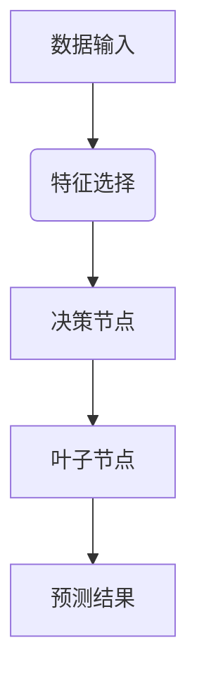
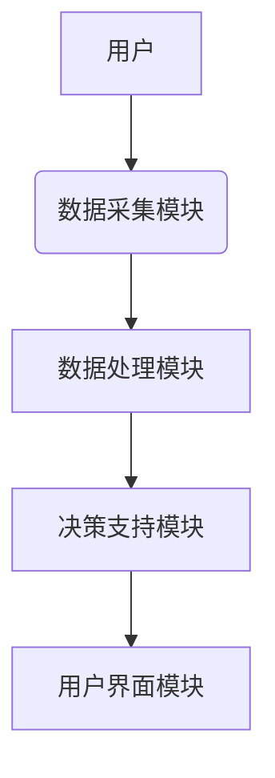

                 


# 智能农业技术的进步与农业现代化投资

## 关键词：智能农业，农业现代化，物联网，大数据，人工智能，投资策略

## 摘要：智能农业技术通过物联网、大数据和人工智能等手段，显著提升了农业生产的效率和可持续性。本文探讨了这些技术的核心原理及其在农业现代化中的应用，分析了投资这些技术的潜力和策略，为农业投资者提供了有价值的参考。

---

# 第一部分：智能农业技术的基础与背景

## 第1章：智能农业技术的背景与现状

### 1.1 智能农业的基本概念

#### 1.1.1 农业现代化的定义与内涵
农业现代化是指通过科技、管理和制度的创新，提高农业生产力、资源利用效率和可持续发展能力的过程。它强调从传统农业向高效、智能、绿色农业的转变。

#### 1.1.2 智能农业技术的核心要素
智能农业技术的核心要素包括物联网（IoT）、大数据分析、人工智能（AI）、区块链等。这些技术通过数据采集、处理和应用，优化农业生产过程。

#### 1.1.3 智能农业与传统农业的对比
| 方面 | 传统农业 | 智能农业 |
|------|----------|----------|
| 生产效率 | 低，依赖人工 | 高，自动化和智能化 |
| 资源利用 | 浪费，粗放 | 节约，精准化管理 |
| 决策方式 | 经验驱动 | 数据驱动 |

### 1.2 智能农业技术的现状与发展趋势

#### 1.2.1 全球农业技术发展的现状
全球范围内，智能农业技术的应用正在快速增长，特别是在发达国家和地区。例如，精准农业、无人机监测、智能灌溉系统等技术已得到广泛应用。

#### 1.2.2 智能农业技术的未来趋势
未来的智能农业将更加依赖于AI和大数据，实现农业生产的全面数字化和智能化。区块链技术将用于农产品溯源，确保质量安全。

#### 1.2.3 中国农业现代化的进展与挑战
中国在智能农业方面取得了显著进展，但在技术普及、农民教育和政策支持方面仍面临挑战。

---

## 第2章：农业现代化与智能农业技术的关系

### 2.1 农业现代化的核心要素

#### 2.1.1 农业生产效率的提升
通过智能技术减少劳动力，提高生产效率。例如，智能温室可以自动调节温度和湿度。

#### 2.1.2 农业产业链的优化
从种植到销售的全链条优化，利用大数据分析市场需求，优化库存管理。

#### 2.1.3 农业可持续发展的要求
智能农业通过精准施肥、节水灌溉等技术，减少对环境的影响，促进可持续发展。

### 2.2 智能农业技术在农业现代化中的作用

#### 2.2.1 提高农业生产效率
智能农业技术通过自动化和数据驱动决策，显著提高生产效率。

#### 2.2.2 优化农业资源配置
通过数据分析，优化土地、水资源的分配，提高资源利用效率。

#### 2.2.3 推动农业创新与可持续发展
智能农业技术推动农业向绿色、智能方向发展，促进可持续发展。

---

## 第3章：智能农业技术的核心概念与联系

### 3.1 核心概念的定义与属性

#### 3.1.1 物联网技术在农业中的应用
物联网通过传感器和网络连接，实时监测农田环境数据，如温度、湿度、光照等，帮助农民做出科学决策。

#### 3.1.2 大数据分析与农业决策
大数据分析技术对海量数据进行处理，提取有价值的信息，为农业生产决策提供支持。

#### 3.1.3 人工智能在农业自动化中的作用
人工智能用于作物识别、病虫害诊断、自动化收割等，提高农业生产效率。

### 3.2 核心概念的对比分析

#### 3.2.1 不同技术的特点对比表格
| 技术 | 特点 | 应用场景 |
|------|------|----------|
| 物联网 | 实时数据采集 | 环境监测 |
| 大数据分析 | 数据处理与预测 | 市场分析 |
| 人工智能 | 模式识别与决策 | 病虫害诊断 |

#### 3.2.2 技术之间的协同效应分析
物联网采集数据，大数据分析处理数据，人工智能应用数据，三者协同推动农业生产智能化。

#### 3.2.3 技术在农业中的具体应用场景
例如，智能温室利用物联网传感器监测环境数据，结合人工智能算法优化作物生长条件。

---

## 第4章：智能农业技术的算法原理

### 4.1 机器学习算法在农业中的应用

#### 4.1.1 决策树算法的原理与流程图
决策树是一种直观的机器学习算法，用于分类和回归。流程图展示了数据输入、特征选择、决策节点的划分过程。



#### 4.1.2 随机森林算法的实现与优化
随机森林通过集成多个决策树模型，提高预测准确性和鲁棒性。

#### 4.1.3 算法在作物产量预测中的应用
使用机器学习算法预测作物产量，帮助农民优化种植计划。

### 4.2 算法实现的数学模型与公式

#### 4.2.1 决策树的分类算法公式
基尼不纯度公式：
$$ Gini = \sum_{i=1}^{n} p_i (1 - p_i) $$

#### 4.2.2 随机森林的集成学习原理
随机森林通过 bagging 技术生成多个训练数据集，构建多个决策树，最终通过投票或平均得到结果。

#### 4.2.3 算法实现的Python代码示例
```python
from sklearn.tree import DecisionTreeClassifier
from sklearn.ensemble import RandomForestClassifier

# 示例数据集
X = [[1, 2], [3, 4], [5, 6], [7, 8]]
y = [0, 1, 0, 1]

# 决策树模型
dt_model = DecisionTreeClassifier()
dt_model.fit(X, y)

# 随机森林模型
rf_model = RandomForestClassifier(n_estimators=10)
rf_model.fit(X, y)
```

---

## 第5章：智能农业系统的分析与架构设计

### 5.1 系统分析与设计

#### 5.1.1 智能农业系统的项目介绍
本项目旨在构建一个智能农业管理系统，实现农田环境监测、作物管理、病虫害诊断等功能。

#### 5.1.2 系统功能模块的划分
- 数据采集模块：通过传感器采集环境数据。
- 数据处理模块：对数据进行清洗和分析。
- 决策支持模块：基于分析结果提供种植建议。
- 用户界面模块：供用户查看数据和操作。

#### 5.1.3 系统架构的mer



---

## 第6章：智能农业系统的接口与交互设计

### 6.1 系统接口设计

#### 6.1.1 数据采集接口
通过传感器接口采集土壤湿度、温度等数据。

#### 6.1.2 数据处理接口
将采集到的数据传输到云端进行处理和分析。

#### 6.1.3 决策支持接口
根据分析结果生成种植建议，反馈给用户。

### 6.2 系统交互流程

#### 6.2.1 用户登录与数据查看
用户登录系统后，查看实时环境数据和历史数据。

#### 6.2.2 病虫害诊断流程
用户上传作物图片，系统通过AI模型识别病虫害类型，提供防治建议。

---

## 第7章：项目实战与案例分析

### 7.1 项目实战

#### 7.1.1 环境配置
安装必要的Python库，如scikit-learn、pandas等。

#### 7.1.2 核心代码实现
实现决策树和随机森林模型，用于预测作物产量。

#### 7.1.3 代码应用解读
解释代码的功能，如数据预处理、模型训练、结果预测等。

### 7.2 案例分析

#### 7.2.1 环境监测案例
通过物联网传感器实时监测土壤湿度，自动启动灌溉系统。

#### 7.2.2 病虫害诊断案例
使用AI模型识别作物病害，提供防治措施。

---

## 第8章：最佳实践、小结与展望

### 8.1 最佳实践

#### 8.1.1抽选技术要点
选择适合的智能农业技术，如物联网、大数据分析和机器学习。

#### 8.1.2 数据安全
确保数据存储和传输的安全性，保护农民的隐私。

### 8.2 小结
智能农业技术的应用显著提升了农业生产的效率和可持续性，为农业现代化提供了有力支持。

### 8.3 未来展望

#### 8.3.1 技术发展
未来，智能农业将更加依赖于AI和大数据，实现农业生产的全面数字化和智能化。

#### 8.3.2 投资策略
投资者应关注智能农业技术的研发和应用，特别是在精准农业和绿色农业领域。

---

## 作者：AI天才研究院 & 禅与计算机程序设计艺术

---

这篇文章详细探讨了智能农业技术的进步及其在农业现代化中的应用，分析了投资策略和未来趋势。希望对读者在智能农业领域的研究和投资有所帮助。

