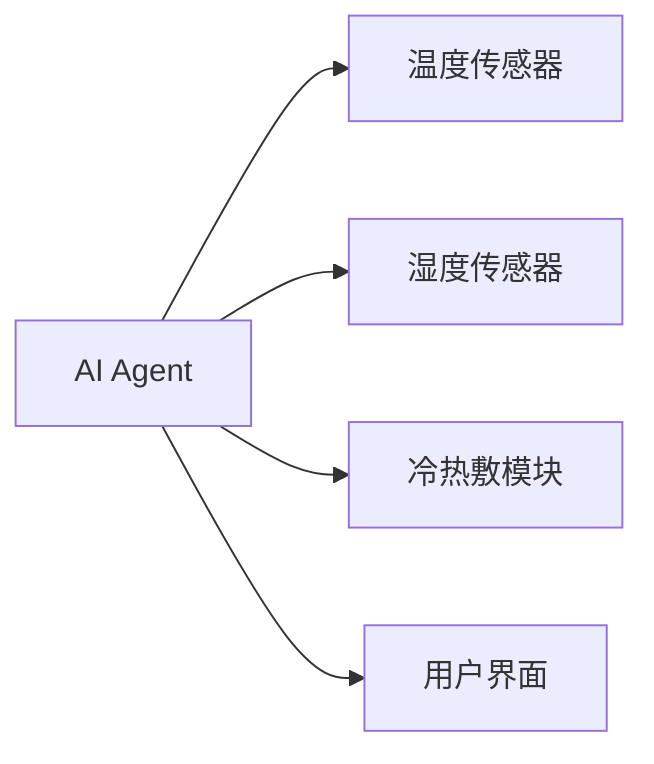
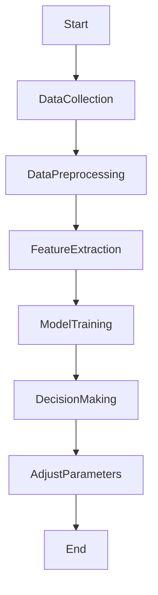
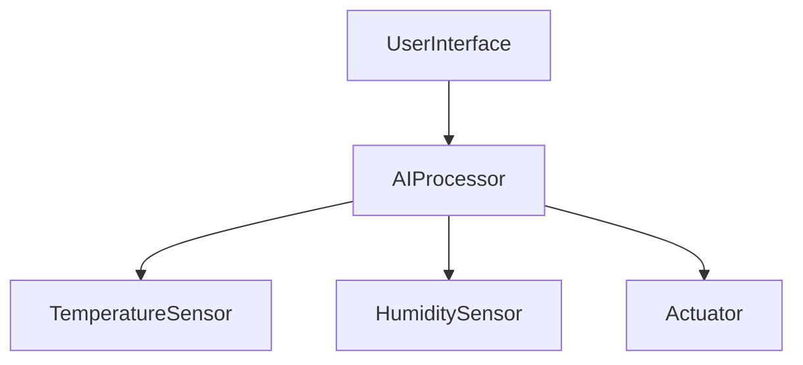

                 


# 智能冷热敷眼罩：AI Agent的眼部护理定制

## 关键词：智能冷热敷眼罩、AI Agent、眼部护理、定制化、算法实现

## 摘要：  
本文探讨了智能冷热敷眼罩如何通过AI Agent实现个性化眼部护理。文章详细分析了传统冷热敷眼罩的局限性，并介绍了AI技术如何解决这些问题，提供定制化的护理方案。通过算法原理、系统架构设计、项目实战等多方面的讲解，展示了AI在智能眼罩中的具体应用，为用户提供了深入的技术洞察和实践指导。

---

## 正文

### 第一部分：背景介绍

#### 第1章：智能冷热敷眼罩的背景与问题背景

##### 1.1 问题背景  
随着科技的发展，现代人长时间使用电子设备，导致眼部疲劳、干涩等问题日益严重。传统冷热敷眼罩虽然能缓解症状，但存在以下问题：  
- 温度不可调节，无法根据个人需求定制。  
- 缺乏实时反馈，无法根据眼部状态调整护理方案。  
- 功能单一，无法与其他健康设备联动。  

##### 1.2 问题描述  
智能冷热敷眼罩的目标是通过AI技术实现以下功能：  
- 实时监测眼部温度、湿度等参数。  
- 根据数据调整冷热敷的温度和时间。  
- 提供个性化护理建议，优化用户体验。  

##### 1.3 问题解决  
AI Agent通过以下方式实现智能冷热敷：  
- 集成温度、湿度传感器，实时采集眼部数据。  
- 利用机器学习算法分析数据，调整冷热敷参数。  
- 提供定制化的护理方案，如不同温度的交替使用。  

##### 1.4 系统架构与技术优势  
智能冷热敷眼罩的系统架构包括感知层、决策层和执行层：  
- 感知层：传感器采集数据。  
- 决策层：AI算法分析数据并制定方案。  
- 执行层：调整冷热敷模块，执行护理方案。  

##### 1.5 应用价值  
- 提供个性化的护理体验，改善眼部健康。  
- 降低眼部疾病的发病率，提升生活质量。  
- 为AI技术在医疗健康领域的应用提供新思路。  

---

### 第二部分：核心概念与联系

#### 第2章：AI Agent的核心概念与原理

##### 2.1 AI Agent的基本原理  
AI Agent在智能眼罩中的作用：  
- 感知层：通过传感器采集眼部环境数据。  
- 决策层：利用算法分析数据，生成护理方案。  
- 执行层：根据方案调整冷热敷模块。  

##### 2.2 核心概念与联系  
AI Agent的功能模块包括：  
- 数据采集模块：负责采集温度、湿度等数据。  
- 数据处理模块：对数据进行预处理和特征提取。  
- 模型训练模块：利用机器学习算法训练模型。  
- 执行控制模块：根据模型输出调整冷热敷参数。  

##### 2.3 实体关系图  
以下是AI Agent在智能眼罩中的实体关系图：  


---

### 第三部分：算法原理讲解

#### 第3章：AI Agent的算法实现

##### 3.1 算法流程图  
以下是AI Agent的算法流程图：  


##### 3.2 算法实现细节  
- 数据预处理：对传感器数据进行去噪和归一化处理。  
- 特征提取：提取温度、湿度等关键特征。  
- 模型训练：使用深度学习模型（如CNN）进行训练。  
- 决策制定：根据模型输出调整冷热敷参数。  

##### 3.3 数学模型  
以下是机器学习模型的数学表达式：  
$$ y = f(x) $$  
其中，\( x \) 是输入特征，\( y \) 是输出目标。  

---

### 第四部分：系统分析与架构设计

#### 第4章：系统架构与设计

##### 4.1 系统功能设计  
智能冷热敷眼罩的功能模块包括：  
- 用户界面：显示实时数据和操作菜单。  
- 数据采集模块：采集并传输数据。  
- AI处理模块：分析数据并生成护理方案。  
- 冷热敷模块：根据方案调整温度和湿度。  

##### 4.2 系统架构图  
以下是系统架构图：  


##### 4.3 接口设计与交互流程  
- 用户通过界面选择护理模式。  
- 系统采集数据并传送给AI处理器。  
- AI处理器分析数据并调整冷热敷参数。  
- 冷热敷模块执行调整后的方案。  

---

### 第五部分：项目实战

#### 第5章：项目实现与分析

##### 5.1 环境搭建  
- 安装Python、TensorFlow等开发工具。  
- 配置传感器和硬件设备。  

##### 5.2 核心代码实现  
以下是AI处理模块的核心代码：  
```python
import numpy as np
import tensorflow as tf

# 数据预处理
def preprocess_data(data):
    # 数据归一化
    normalized_data = (data - np.mean(data)) / np.std(data)
    return normalized_data

# 模型训练
def train_model(data, labels):
    model = tf.keras.Sequential([
        tf.keras.layers.Dense(64, activation='relu'),
        tf.keras.layers.Dense(1, activation='sigmoid')
    ])
    model.compile(optimizer='adam', loss='binary_crossentropy', metrics=['accuracy'])
    model.fit(data, labels, epochs=10, batch_size=32)
    return model

# 决策制定
def decide_action(model, data):
    prediction = model.predict(data)
    if prediction > 0.5:
        return 'increase_temp'
    else:
        return 'decrease_temp'
```

##### 5.3 实际案例分析  
通过实际案例分析，展示AI Agent如何优化冷热敷参数，提升护理效果。  

---

### 第六部分：最佳实践

#### 第6章：经验总结与注意事项

##### 6.1 经验总结  
- 确保数据采集的准确性和实时性。  
- 定期更新AI模型，提升护理效果。  

##### 6.2 注意事项  
- 传感器的校准和维护。  
- 用户隐私保护。  

##### 6.3 拓展阅读  
- 推荐相关领域的书籍和论文。  

---

## 结语  
智能冷热敷眼罩通过AI Agent实现了个性化的眼部护理，为用户提供了高效、便捷的健康解决方案。未来，随着AI技术的不断发展，智能眼罩的功能将更加智能化，为人类健康保驾护航。

---

## 作者：AI天才研究院/AI Genius Institute & 禅与计算机程序设计艺术 /Zen And The Art of Computer Programming

