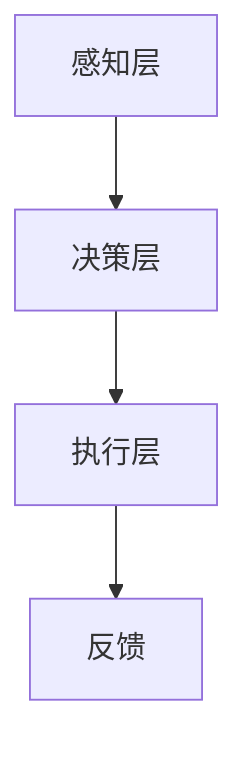
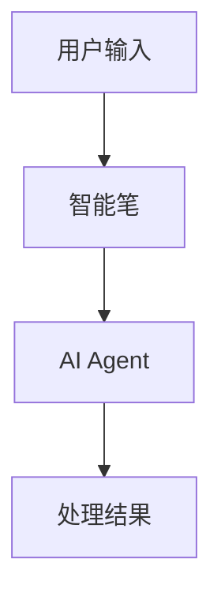
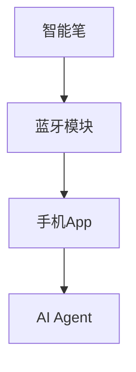

                 


# 智能办公文具：AI Agent的工作效率追踪

> 关键词：智能办公文具，AI Agent，工作效率追踪，文本处理，目标检测，系统架构

> 摘要：随着人工智能技术的飞速发展，智能办公文具逐渐成为提升办公效率的重要工具。本文深入探讨AI Agent在智能办公文具中的应用，分析其核心原理、系统架构及实际案例，展示如何通过AI技术优化办公流程，提升工作效率。

---

## 第1章 智能办公文具与AI Agent概述

### 1.1 问题背景与定义

#### 1.1.1 办公效率提升的痛点
在现代办公环境中，效率是企业的核心竞争力之一。然而，传统办公文具如笔、本子等，难以满足现代办公对智能化、自动化的需求。常见的痛点包括：
- **信息碎片化**：笔记分散，难以快速检索和管理。
- **时间浪费**：手动整理和查找信息耗时耗力。
- **任务优先级不明确**：难以根据重要性自动排序任务。

#### 1.1.2 AI Agent的定义与特点
AI Agent（智能代理）是一种能够感知环境、自主决策并执行任务的智能系统。其特点包括：
- **自主性**：无需人工干预，自动执行任务。
- **反应性**：实时感知环境变化并做出反应。
- **目标导向**：基于目标进行决策和行动。

#### 1.1.3 智能办公文具的核心概念
智能办公文具结合AI Agent，通过传感器和AI算法，实时采集并分析用户输入，提供智能化的办公辅助功能。

### 1.2 智能办公文具的现状与挑战

#### 1.2.1 当前办公文具的智能化趋势
随着技术进步，智能文具逐渐普及，如智能笔、智能本等。这些设备通过蓝牙、Wi-Fi等技术连接到手机或电脑，实现数据同步和分析。

#### 1.2.2 AI Agent在办公场景中的应用
AI Agent可应用于任务管理、日程安排、会议记录等领域。例如，智能笔可记录笔记并自动生成会议纪要。

#### 1.2.3 智能办公文具的局限性与挑战
- **数据隐私**：用户数据的安全性问题。
- **技术复杂性**：AI算法的优化和硬件的集成难度较高。

### 1.3 本章小结
本章介绍了智能办公文具的背景、定义及其在办公环境中的应用，分析了其面临的挑战。

---

## 第2章 AI Agent的核心原理

### 2.1 AI Agent的基本原理

#### 2.1.1 感知层: 数据采集与处理
AI Agent通过传感器、摄像头等设备采集环境数据，并进行预处理。

#### 2.1.2 决策层: 算法与模型
基于感知层的数据，AI Agent通过算法（如自然语言处理）进行分析，生成决策。

#### 2.1.3 执行层: 动作与反馈
根据决策结果，AI Agent执行相应动作，并根据反馈调整行为。

#### 2.1.4 mermaid图：AI Agent的基本流程


### 2.2 AI Agent与办公文具的结合

#### 2.2.1 办公文具的智能化改造
通过AI技术，传统文具如笔、本子可实现智能化记录和分析。

#### 2.2.2 AI Agent在办公场景中的具体应用
- **文本处理**：智能笔记录笔记并自动生成摘要。
- **目标检测**：识别文档中的关键信息并进行分类。

#### 2.2.3 办公文具与AI Agent的协同工作流程


### 2.3 本章小结
本章详细讲解了AI Agent的基本原理及其与智能办公文具的结合方式。

---

## 第3章 智能办公文具的系统架构

### 3.1 系统组成与功能模块

#### 3.1.1 硬件模块: 智能办公文具的硬件组成
- 智能笔：内置传感器、蓝牙模块。
- 智能本：集成摄像头、麦克风。

#### 3.1.2 软件模块: AI Agent的实现
- 文本处理模块：负责数据的处理和分析。
- 图像识别模块：识别文档中的关键信息。

#### 3.1.3 数据处理模块: 数据采集与分析
- 数据采集：通过传感器获取用户输入。
- 数据分析：使用AI算法处理数据。

#### 3.1.4 mermaid图：系统组成模块


### 3.2 系统架构设计

#### 3.2.1 分层架构设计
系统分为感知层、决策层和执行层。

#### 3.2.2 模块之间的交互关系
- 感知层采集数据，传递给决策层。
- 决策层处理数据，发送指令到执行层。

#### 3.2.3 系统架构的优缺点分析
优点：模块化设计便于维护；缺点：通信延迟可能影响实时性。

#### 3.2.4 mermaid图：系统架构


### 3.3 本章小结
本章详细描述了智能办公文具的系统架构，包括硬件、软件和数据处理模块的设计。

---

## 第4章 AI Agent的核心算法

### 4.1 注意力机制与文本处理

#### 4.1.1 注意力机制的数学模型
注意力机制公式：
$$
\text{Attention}(Q, K, V) = \text{softmax}\left( \frac{QK^T}{\sqrt{d_k}} \right)V
$$

#### 4.1.2 文本处理的实现流程
- 数据预处理：将文本转换为向量。
- 注意力计算：生成注意力权重矩阵。
- 上下文向量：加权求和得到上下文向量。

#### 4.1.3 示例代码与实现细节
```python
def attention(Q, K, V):
    d_k = K.shape[-1]
    scores = (Q @ K.T) / np.sqrt(d_k)
    scores = np.exp(scores)
    attention_weights = scores / np.sum(scores, axis=-1, keepdims=True)
    output = (V.T @ attention_weights).T
    return output
```

### 4.2 目标检测与图像识别

#### 4.2.1 目标检测算法原理
使用YOLO算法进行目标检测，流程包括：
1. 输入图像。
2. 特征提取。
3. 预测边界框和类别。

#### 4.2.2 图像识别的实现流程
- 图像预处理：调整尺寸、归一化。
- 特征提取：使用卷积神经网络。
- 分类预测：输出结果。

#### 4.2.3 示例代码与实现细节
```python
def detect_objects(image):
    # 预处理
    input_image = preprocess(image)
    # 特征提取
    features = backbone(input_image)
    # 分类预测
    outputs = classifier(features)
    return outputs
```

### 4.3 本章小结
本章详细讲解了AI Agent的核心算法，包括注意力机制和目标检测。

---

## 第5章 智能办公文具的开发与实现

### 5.1 项目实战：智能笔的开发

#### 5.1.1 环境安装
安装必要的库，如TensorFlow、OpenCV、蓝牙库。

#### 5.1.2 核心代码实现
- 数据采集模块：采集用户的书写数据。
- AI处理模块：使用注意力机制分析文本。
- 结果显示模块：显示处理结果。

#### 5.1.3 代码解读与分析
```python
import tensorflow as tf
from tensorflow.keras import layers

# 定义注意力机制模型
class AttentionModel(tf.keras.Model):
    def __init__(self, units):
        super(AttentionModel, self).__init__()
        self.att Dense1 = layers.Dense(units)
        self.att Dense2 = layers.Dense(1)

    def call(self, inputs):
        attention = tf.nn.softmax(self.att Dense2(self.att Dense1(inputs)))
        output = tf.matmul(attention, inputs)
        return output
```

#### 5.1.4 实际案例分析
通过实际案例展示智能笔的应用，如记录会议笔记并自动生成摘要。

### 5.2 本章小结
本章通过实际项目展示了智能办公文具的开发过程，从环境搭建到代码实现，再到案例分析。

---

## 第6章 总结与展望

### 6.1 本章总结
本文详细探讨了AI Agent在智能办公文具中的应用，从核心原理到系统架构，再到实际案例，全面分析了其在办公效率提升中的作用。

### 6.2 未来展望
随着技术进步，智能办公文具将更加智能化，AI Agent将具备更强大的功能，如更精准的自然语言处理和更高效的决策算法。

### 6.3 最佳实践 tips
- 在开发过程中，确保数据安全和隐私保护。
- 选择合适的AI算法，优化系统性能。

### 6.4 作者信息
作者：AI天才研究院 & 禅与计算机程序设计艺术

---

以上为《智能办公文具：AI Agent的工作效率追踪》的技术博客文章的详细内容，涵盖从背景介绍到项目实战的各个方面，详细分析了AI Agent在智能办公文具中的应用及其对办公效率的提升。

