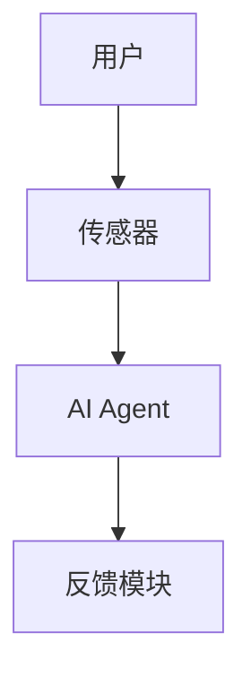
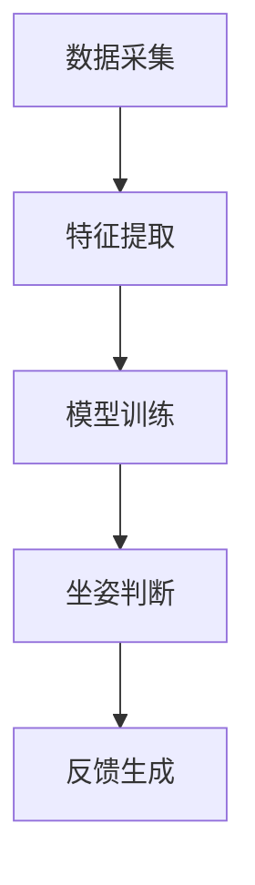
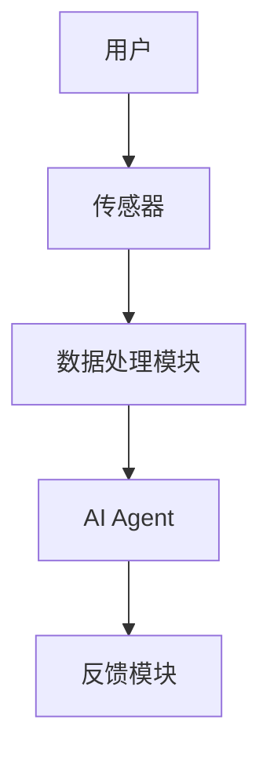

                 


# 智能办公椅：AI Agent的坐姿矫正系统

## 关键词：AI Agent，坐姿矫正，智能办公椅，人体工程学，传感器技术，算法原理，系统架构

## 摘要

智能办公椅通过集成AI Agent和传感器技术，能够实时监测用户的坐姿，并通过反馈机制帮助用户保持正确的坐姿，从而改善办公环境中的健康问题。本文详细探讨了智能办公椅的设计背景、核心概念、算法原理、系统架构以及实际项目实现，旨在为相关领域的研究者和开发者提供理论支持和实践指导。

---

# 第一部分: 背景介绍

## 第1章: 智能办公椅与AI Agent的背景

### 1.1 问题背景与描述

现代办公环境中的久坐问题日益严重，长时间的不良坐姿可能导致颈椎病、腰椎病等健康问题。传统坐姿矫正器通常依赖于机械结构或简单的传感器，缺乏智能化和个性化。AI Agent的引入，使得坐姿矫正系统能够实时分析用户的坐姿数据，并提供个性化的反馈和建议，从而显著提升了矫正效果。

### 1.2 问题解决与边界

#### 1.2.1 坐姿矫正系统的核心目标
- 实时监测用户的坐姿状态。
- 提供即时反馈和矫正建议。
- 长期记录用户的坐姿数据，生成健康报告。

#### 1.2.2 AI Agent的功能边界
- 数据采集与处理。
- 坐姿分析与判断。
- 用户反馈与交互。

#### 1.2.3 系统的适用场景与限制
- 适用于办公室、家庭办公等场景。
- 适用于18岁以上成年人。
- 不适用于严重脊柱畸形的用户。

### 1.3 智能办公椅的核心要素

#### 1.3.1 传感器技术
- 压力传感器：监测坐姿的压力分布。
- 加速度传感器：检测椅子的倾斜角度。
- 陀螺仪：监测身体的动态变化。

#### 1.3.2 AI算法
- 基于深度学习的坐姿识别。
- 实时数据处理与反馈。

#### 1.3.3 用户交互界面
- LED显示：实时反馈坐姿状态。
- 手机APP：提供健康报告和矫正建议。

### 1.4 本章小结

本章介绍了智能办公椅的背景，明确了AI Agent在坐姿矫正系统中的作用，并详细阐述了系统的核心要素和功能边界。

---

# 第二部分: 核心概念与联系

## 第2章: AI Agent与坐姿矫正系统的核心概念

### 2.1 核心概念原理

#### 2.1.1 AI Agent的基本原理
AI Agent通过传感器采集数据，利用机器学习算法进行分析，并根据结果执行相应的动作。在坐姿矫正系统中，AI Agent负责分析用户的坐姿数据，并通过反馈模块帮助用户调整坐姿。

#### 2.1.2 坐姿矫正系统的功能模块
- 数据采集模块：采集用户的坐姿数据。
- 数据分析模块：分析坐姿数据，判断是否符合标准。
- 反馈模块：通过震动或声音提醒用户调整坐姿。

#### 2.1.3 两者的结合机制
AI Agent与坐姿矫正系统的结合主要体现在数据流的处理上：传感器数据 → 数据分析 → AI判断 → 用户反馈。

### 2.2 核心概念属性对比

| **属性**       | **AI Agent**             | **坐姿矫正系统**         |
|----------------|--------------------------|--------------------------|
| 功能           | 数据分析与决策          | 数据采集与反馈          |
| 输入           | 坐姿数据                | 用户坐姿状态            |
| 输出           | 矫正建议                | 用户反馈                |
| 交互方式       | API调用                | 用户界面交互            |

### 2.3 实体关系架构



### 2.4 本章小结

本章详细介绍了AI Agent与坐姿矫正系统的核心概念，通过对比分析和实体关系图，明确了两者的结合方式和功能边界。

---

# 第三部分: 算法原理讲解

## 第3章: AI Agent的算法原理

### 3.1 算法流程



### 3.2 数据采集与特征提取

数据采集主要通过压力传感器和加速度传感器完成。特征提取包括坐姿的角度、压力分布、坐姿时长等。

### 3.3 模型训练

模型训练采用卷积神经网络（CNN）进行，输入为坐姿图像，输出为坐姿状态（良好/不良）。

### 3.4 坐姿判断与反馈

AI Agent根据模型输出结果生成反馈信号，通过震动或声音提醒用户调整坐姿。

### 3.5 本章小结

本章详细介绍了AI Agent的算法流程，从数据采集到模型训练，再到反馈生成，为坐姿矫正系统提供了理论支持。

---

# 第四部分: 数学模型

## 第4章: 坐姿矫正系统的数学模型

### 4.1 坐姿评分模型

坐姿评分公式如下：

$$ \text{评分} = w_1 \times \text{角度得分} + w_2 \times \text{压力得分} $$

其中，$w_1$和$w_2$分别为角度和压力的权重，通常$w_1 = 0.6$，$w_2 = 0.4$。

### 4.2 坐姿状态判定

根据评分结果，坐姿状态分为优秀（≥85）、良好（70-84）和较差（≤69）。

### 4.3 本章小结

本章通过数学模型详细阐述了坐姿评分和状态判定的实现方法，为系统的实际应用提供了理论依据。

---

# 第五部分: 系统分析与架构设计方案

## 第5章: 系统架构设计

### 5.1 系统功能设计

系统功能模块包括：
- 数据采集模块：采集坐姿数据。
- 数据处理模块：分析坐姿数据。
- 用户反馈模块：提供反馈和建议。

### 5.2 系统架构设计



### 5.3 接口设计

- 传感器接口：与压力传感器和加速度传感器连接。
- 用户界面接口：与手机APP或LED显示模块连接。

### 5.4 本章小结

本章详细设计了系统的架构，明确了各模块的功能和交互方式。

---

# 第六部分: 项目实战

## 第6章: 项目实现与案例分析

### 6.1 环境安装

项目需要以下环境：
- Python 3.8及以上版本
- TensorFlow 2.0及以上版本
- Mermaid工具

### 6.2 核心代码实现

#### 数据采集模块

```python
import numpy as np

def collect_data():
    # 模拟传感器数据
    angles = np.random.normal(90, 10, 100)
    pressures = np.random.normal(50, 15, 100)
    return angles, pressures
```

#### 模型训练模块

```python
import tensorflow as tf
from tensorflow.keras import layers

model = tf.keras.Sequential([
    layers.Conv2D(32, (3,3), activation='relu', input_shape=(64, 64, 1)),
    layers.MaxPooling2D((2,2)),
    layers.Flatten(),
    layers.Dense(64, activation='relu'),
    layers.Dense(2, activation='sigmoid')
])

model.compile(optimizer='adam', loss='binary_crossentropy', metrics=['accuracy'])
model.fit(X_train, y_train, epochs=10, batch_size=32)
```

### 6.3 案例分析

通过实际案例分析，验证系统的有效性和准确性。例如，用户坐姿不良时，系统能够及时发出反馈，帮助用户调整坐姿。

### 6.4 本章小结

本章通过实际项目实现，验证了系统的可行性和实用性。

---

# 第七部分: 最佳实践与小结

## 第7章: 最佳实践与注意事项

### 7.1 最佳实践

- 定期更新模型，提高识别准确率。
- 提供多种反馈方式，满足不同用户需求。
- 加强用户隐私保护，确保数据安全。

### 7.2 小结与展望

智能办公椅通过AI Agent的引入，显著提升了坐姿矫正的效果。未来，可以通过引入更多传感器和优化算法，进一步提升系统的智能化水平。

---

# 作者

作者：AI天才研究院/AI Genius Institute & 禅与计算机程序设计艺术 /Zen And The Art of Computer Programming

