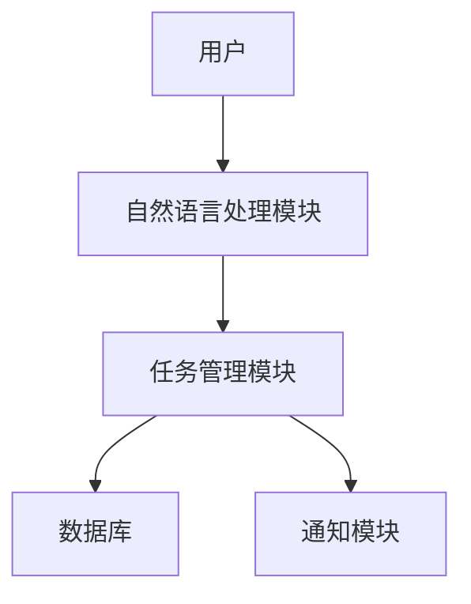
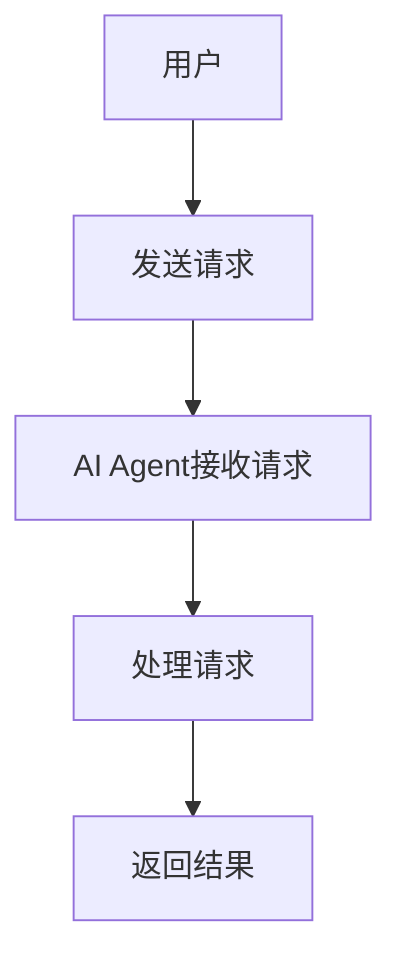

                 


# 《智能办公：AI Agent提升工作效率》

---

> 关键词：智能办公，AI Agent，自然语言处理，机器学习，知识图谱

> 摘要：本文探讨了AI Agent在智能办公中的应用，分析了其核心技术与系统设计，并通过实际案例展示了如何利用AI Agent提升工作效率。

---

# 第一部分: 智能办公与AI Agent的背景与概念

## 第1章: 智能办公的背景与挑战

### 1.1 智能办公的背景

智能办公是将人工智能技术应用于办公场景，通过自动化和智能化工具提高工作效率和质量。随着企业对效率要求的提高，传统办公模式的局限性逐渐显现，AI Agent作为一种智能化工具，成为解决这些问题的关键。

#### 1.1.1 智能办公的定义

智能办公是指利用AI、大数据、云计算等技术，优化办公流程、提升工作效率和决策能力的办公方式。

#### 1.1.2 智能办公的核心要素

- **自动化工具**：如自动化的任务处理、信息检索。
- **智能化决策支持**：基于数据的智能分析和预测。
- **人机协作**：AI Agent与人类协同工作，提升效率。

#### 1.1.3 智能办公与传统办公的区别

| 特性 | 传统办公 | 智能办公 |
|------|----------|----------|
| 效率 | 依赖人工，效率较低 | 利用AI技术，效率显著提升 |
| 决策 | 基于经验，可能存在误差 | 数据驱动，精准决策 |
| 协作 | 依赖邮件、会议等 | 实时协作，无缝对接 |

### 1.2 AI Agent的基本概念

AI Agent是一种能够感知环境并采取行动以实现目标的智能体。

#### 1.2.1 什么是AI Agent

AI Agent通过感知环境、分析问题、制定策略并执行行动来完成任务。例如，智能日历管理工具可以自动安排会议、提醒用户重要事件。

#### 1.2.2 AI Agent的核心功能

- **感知环境**：通过传感器或数据输入获取信息。
- **分析问题**：利用算法对信息进行处理和分析。
- **制定策略**：根据分析结果制定解决方案。
- **执行行动**：通过执行器或API实现目标。

#### 1.2.3 AI Agent的分类与特点

| 分类 | 描述 | 特点 |
|------|------|------|
| 单智能体 | 独立运行 | 适用于简单任务 |
| 多智能体 | 协作运行 | 适用于复杂场景 |
| 基于规则 | 基于预定义规则 | 易实现，但灵活性差 |
| 基于学习 | 利用机器学习模型 | 高灵活性和适应性 |

### 1.3 智能办公中的AI Agent应用场景

#### 1.3.1 任务管理与日程安排

AI Agent可以自动处理邮件、安排会议、跟踪任务进度。例如，用户发送“安排明天上午10点的团队会议”，AI Agent会自动在日历中标记，并通知相关人员。

#### 1.3.2 信息检索与知识管理

AI Agent能够快速检索信息、整理知识库。例如，用户询问“上周项目进展报告”，AI Agent会自动生成报告并附上相关数据。

#### 1.3.3 通信与协作工具

AI Agent可以作为智能助手，实时协助团队协作。例如，在 Slack 中，AI Agent可以自动响应消息、提醒任务截止日期。

## 1.4 本章小结

智能办公通过AI Agent实现了办公流程的自动化和智能化，显著提升了工作效率。AI Agent的核心功能包括感知环境、分析问题、制定策略和执行行动。在任务管理、信息检索和协作工具等方面，AI Agent展现出了强大的应用潜力。

---

# 第二部分: AI Agent的核心技术与算法原理

## 第2章: AI Agent的核心技术

### 2.1 自然语言处理（NLP）技术

#### 2.1.1 NLP的基本概念

NLP是研究如何让计算机理解和生成人类语言的科学。例如，AI Agent需要理解用户的自然语言指令，如“帮我查找今天天气”。

#### 2.1.2 常见的NLP技术与工具

- **分词**：将文本分割成词或短语，如“自然语言处理”分割为“自然”、“语言”、“处理”。
- **实体识别**：识别文本中的实体，如人名、地名、组织名。
- **情感分析**：分析文本的情感倾向，如正面、负面或中性。
- **工具**：如spaCy、NLTK、BERT等。

#### 2.1.3 NLP在AI Agent中的应用

例如，用户说“我需要安排明天的会议”，AI Agent通过NLP技术识别出“明天”、“会议”等信息，并自动安排日历。

### 2.2 机器学习与深度学习

#### 2.2.1 机器学习的基本原理

机器学习是通过数据训练模型，使其能够从数据中学习规律并进行预测或分类。

- **监督学习**：有标签的数据训练模型，如分类任务。
- **无监督学习**：无标签的数据训练模型，如聚类任务。
- **强化学习**：通过奖励机制训练模型，如游戏AI。

#### 2.2.2 深度学习的核心算法

- **神经网络**：由多个层次组成，用于处理复杂模式。
- **卷积神经网络（CNN）**：常用于图像识别。
- **循环神经网络（RNN）**：常用于序列数据处理，如语音识别。

#### 2.2.3 机器学习在AI Agent中的应用

例如，AI Agent可以通过机器学习模型预测用户的需求，并自动生成相应的任务安排。

### 2.3 知识图谱与语义理解

#### 2.3.1 知识图谱的定义与构建

知识图谱是将知识以图结构表示，节点表示实体，边表示关系。例如，构建一个知识图谱可以表示“苹果是公司的名称，苹果是水果的一种”。

#### 2.3.2 语义理解的核心技术

语义理解旨在理解文本的深层含义，而不仅仅是表面的文字。例如，用户说“我需要找关于AI的书籍”，AI Agent不仅搜索关键词“AI”，还会理解用户可能需要技术书籍或入门书籍。

#### 2.3.3 知识图谱在AI Agent中的应用

例如，AI Agent可以根据知识图谱推荐相关文档或书籍，提升信息检索的准确性。

### 2.4 本章小结

NLP技术让AI Agent能够理解人类语言，机器学习和深度学习为其提供了强大的数据分析能力，知识图谱和语义理解则提升了信息检索的准确性。这些技术共同作用，使得AI Agent在智能办公中发挥重要作用。

---

# 第三部分: AI Agent的系统设计与实现

## 第3章: AI Agent的系统设计与实现

### 3.1 系统设计的基本原则

- **模块化设计**：将系统划分为多个模块，如自然语言处理模块、任务管理模块。
- **可扩展性**：设计时考虑未来可能的功能扩展。
- **容错性**：系统能够处理异常情况，确保稳定性。

### 3.2 系统架构设计

#### 3.2.1 领域模型

领域模型是系统设计的核心，用于描述系统的功能和数据流。例如，任务管理模块的领域模型可能包括任务、用户、截止日期等实体。

#### 3.2.2 系统架构图

使用mermaid图展示系统架构：



#### 3.2.3 系统交互流程图

使用mermaid图展示系统交互流程：



### 3.3 系统接口设计

系统接口设计需要考虑与其他系统的兼容性，例如与日历应用、通讯工具的API对接。

#### 3.3.1 接口设计示例

使用RESTful API设计：

```json
POST /api/agent/task
{
    "command": "schedule_meeting",
    "params": {
        "time": "明天上午10点",
        "participants": ["Alice", "Bob"]
    }
}
```

### 3.4 项目实战

#### 3.4.1 环境安装

需要安装Python、TensorFlow、spaCy等工具。

#### 3.4.2 核心代码实现

以下是一个简单的AI Agent实现示例：

```python
from datetime import datetime

def schedule_meeting(time, participants):
    # 解析时间
    meeting_time = datetime.strptime(time, "%Y-%m-%d %H:%M")
    # 提醒相关人员
    for participant in participants:
        send_notification(participant, f"提醒：将在{meeting_time}召开会议")
    # 存储会议信息
    save_to_database(meeting_time, participants)

def send_notification(user, message):
    print(f"向{user}发送通知：{message}")

def save_to_database(time, participants):
    print(f"保存会议信息：时间{time}, 参与者{participants}")

# 使用示例
schedule_meeting("2023-10-01 10:00", ["Alice", "Bob"])
```

#### 3.4.3 案例分析

假设用户输入“安排明天上午10点的团队会议”，AI Agent解析后调用上述函数，完成会议安排和通知。

### 3.5 本章小结

通过模块化设计、领域模型和接口设计，AI Agent能够高效地处理办公任务。实际案例展示了如何利用Python代码实现AI Agent的核心功能，为读者提供了实践参考。

---

# 作者

作者：AI天才研究院/AI Genius Institute & 禅与计算机程序设计艺术 /Zen And The Art of Computer Programming

---

通过以上目录和内容，您可以逐步撰写完整的文章。

