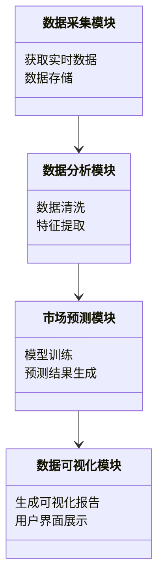
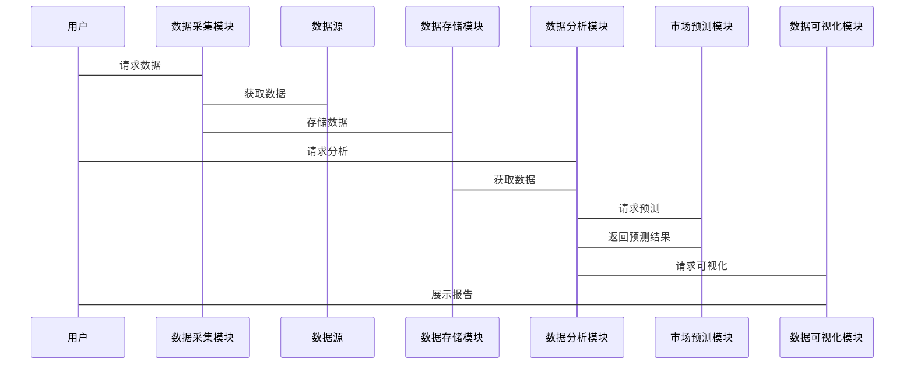

                 


# 智能加密货币市场分析平台

## 关键词：智能加密货币、市场分析、机器学习、深度学习、自然语言处理、区块链

## 摘要：智能加密货币市场分析平台是一种利用先进的机器学习、深度学习和自然语言处理技术，结合区块链数据，对加密货币市场进行实时分析和预测的系统。本文将详细介绍该平台的核心概念、算法原理、系统架构、项目实现及最佳实践，为读者提供全面的技术指导。

---

## 第1章: 加密货币与智能合约基础

### 1.1 加密货币的基本概念

#### 1.1.1 加密货币的定义与特点
加密货币是一种基于密码学的数字货币，具有去中心化、匿名性、不可篡改和全球流通等特点。与传统货币不同，加密货币的发行和交易不依赖于中央银行或金融机构，而是通过区块链技术实现点对点的价值转移。

#### 1.1.2 常见加密货币及其特点对比
以下是几种常见加密货币的对比：

| 加密货币 | 核心特点               | 主要用途               |
|----------|----------------------|----------------------|
| 比特币    | 去中心化、总量有限     | 数字货币、投资         |
| 以太坊    | 支持智能合约           | 去中心化应用（dApps）   |
| �狗狗币    | 可扩展性强、社区驱动   | 支付、小额交易         |
| 波卡币    | 多链架构、互操作性     | 跨链通信与资产转移     |

#### 1.1.3 加密货币的核心技术原理
加密货币的核心技术是区块链，其主要工作原理如下：

1. **区块**：将交易数据以区块形式存储，每个区块包含一定数量的交易记录。
2. **链式结构**：每个新区块都包含前一个区块的哈希值，形成链式结构，确保数据不可篡改。
3. **共识机制**：通过共识机制（如PoW、PoS）确保所有节点达成一致，验证交易的有效性。
4. **加密算法**：使用公钥和私钥对进行数字签名，确保交易的安全性。

### 1.2 智能合约的概念与特点

#### 1.2.1 智能合约的定义
智能合约是基于区块链的自动化程序，用于在满足特定条件时自动执行预设的代码。它能够自动执行、管理、跟踪和维护对商业协议的遵守，无需中介的干预。

#### 1.2.2 智能合约的核心功能与优势
智能合约的核心功能包括：

- **自动执行**：当触发条件满足时，智能合约自动执行预设操作。
- **不可篡改**：智能合约部署后无法修改，确保代码的透明性和安全性。
- **去中心化**：运行在区块链上，避免中心化机构的干预。

智能合约的优势在于能够降低信任成本，提高交易效率，减少人为错误。

#### 1.2.3 智能合约的实现原理
智能合约的实现原理可以分为以下步骤：

1. **编写智能合约代码**：使用Solidity等智能合约编程语言编写逻辑代码。
2. **部署智能合约**：将智能合约部署到区块链网络中。
3. **触发智能合约**：通过交易或其他区块链事件触发智能合约的执行。
4. **执行智能合约**：智能合约根据预设逻辑自动执行相应的操作。

### 1.3 加密货币市场分析的必要性

#### 1.3.1 加密货币市场的特点与挑战
加密货币市场具有以下特点：

- **高波动性**：市场价格波动剧烈，受市场情绪和新闻事件影响较大。
- **去中心化**：市场参与者众多，缺乏统一的监管机构。
- **信息不对称**：市场信息分布不均，投资者难以获取全面的数据。

#### 1.3.2 智能加密货币市场分析平台的定义
智能加密货币市场分析平台是一种利用人工智能、大数据分析和区块链技术，对加密货币市场进行实时监控、预测和决策支持的系统。它能够帮助投资者更好地理解市场动态，制定科学的投资策略。

#### 1.3.3 智能加密货币市场分析平台的核心功能与优势
智能加密货币市场分析平台的核心功能包括：

- **数据采集**：从多个数据源获取加密货币的市场数据。
- **数据分析**：对市场数据进行清洗、特征提取和建模分析。
- **市场预测**：利用机器学习和深度学习模型预测市场价格走势。
- **智能合约交互**：与智能合约对接，实现自动化交易和风险管理。

其优势在于能够提供实时的市场洞察，帮助投资者做出更明智的决策，同时通过自动化功能提高交易效率。

### 1.4 本章小结
本章主要介绍了加密货币和智能合约的基本概念、特点和技术原理，并探讨了智能加密货币市场分析平台的必要性及其核心功能与优势。这些内容为后续章节的深入分析奠定了基础。

---

## 第2章: 加密货币市场数据分析基础

### 2.1 加密货币市场数据的特征

#### 2.1.1 价格数据的波动性与周期性
加密货币的价格数据通常表现出强烈的波动性和周期性。例如，比特币的价格在2017年经历了一次大幅上涨，随后进入熊市，但在2020年又迎来新一轮上涨。

#### 2.1.2 交易量与市场情绪的关系
交易量是衡量市场活跃度的重要指标。高交易量通常意味着市场情绪高涨，价格可能面临较大的波动。

#### 2.1.3 市场参与者的多样性
加密货币市场参与者包括机构投资者、散户、矿工和开发者等，不同参与者的行为模式和交易策略各不相同。

### 2.2 数据获取与预处理

#### 2.2.1 数据源的选择与获取方法
常用的数据源包括CoinMarketCap、CoinGecko和Bitfinex等。以下是获取数据的步骤：

1. **选择数据源**：根据需求选择合适的数据源。
2. **数据接口调用**：使用API获取实时或历史数据。
3. **数据存储**：将获取的数据存储在数据库中，便于后续处理。

#### 2.2.2 数据清洗与标准化
数据清洗是确保数据质量的重要步骤，主要包括：

- **去重**：去除重复数据。
- **填充缺失值**：使用均值、中位数或其他方法填充缺失值。
- **标准化**：将数据归一化处理，便于后续分析。

#### 2.2.3 数据特征提取与选择
特征提取是将原始数据转化为具有代表性的特征，例如：

- **移动平均线（MA）**：计算一定时间内的平均价格。
- **相对强弱指数（RSI）**：衡量价格的超买或超卖状态。
- **波动率**：计算价格波动的程度。

### 2.3 数据可视化与初步分析

#### 2.3.1 时间序列数据的可视化方法
时间序列数据可以通过折线图、柱状图等可视化方式展示。例如，使用Matplotlib绘制比特币的价格走势。

```python
import matplotlib.pyplot as plt
import pandas as pd

# 假设df是包含比特币价格的数据框，index为日期
df['price'].plot(kind='line')
plt.title('Bitcoin Price Trend')
plt.xlabel('Date')
plt.ylabel('Price')
plt.show()
```

#### 2.3.2 市场趋势与周期性分析
通过傅里叶变换或ARIMA模型可以分析价格数据的周期性。例如，使用ARIMA模型预测未来的价格走势。

#### 2.3.3 数据分布与异常值检测
使用箱线图或Z-score方法检测异常值。例如，使用Z-score方法识别异常交易量。

### 2.4 本章小结
本章主要介绍了加密货币市场数据的特征、获取与预处理方法，以及数据可视化与初步分析的技巧。这些内容为后续的市场情绪分析和预测模型奠定了基础。

---

## 第3章: 市场情绪分析与自然语言处理

### 3.1 市场情绪对加密货币价格的影响

#### 3.1.1 市场情绪的定义与分类
市场情绪是指市场参与者对某种资产的价格走势的心理预期。常见的市场情绪包括乐观、悲观、中立等。

#### 3.1.2 市场情绪与价格波动的关系
市场情绪是影响加密货币价格波动的重要因素。例如，乐观的市场情绪可能导致价格上涨，而悲观的市场情绪可能导致价格下跌。

#### 3.1.3 市场情绪的量化方法
常用的市场情绪量化方法包括：

- **情感分析**：基于文本的情感分析，判断市场情绪的正负。
- **恐慌指数**：通过市场波动率量化市场的恐慌程度。

### 3.2 自然语言处理在市场情绪分析中的应用

#### 3.2.1 NLP技术的基本原理
NLP技术通过文本处理、语义分析和情感分类等方法，帮助分析市场情绪。例如，使用词袋模型或词嵌入模型（如Word2Vec）进行文本表示。

#### 3.2.2 基于文本的情感分析方法
情感分析是通过分析文本中的情感倾向，判断市场情绪。例如，使用VADER情感分析器对新闻标题进行情感分类。

#### 3.2.3 基于新闻和社交媒体的市场情绪分析
新闻和社交媒体是影响市场情绪的重要来源。例如，通过分析社交媒体上的 tweets，判断市场情绪的变化。

### 3.3 市场情绪分析的实现与优化

#### 3.3.1 常见NLP模型的选择与优化
常用的NLP模型包括TF-IDF、LDA和BERT等。选择合适的模型取决于具体任务和数据特征。

#### 3.3.2 基于深度学习的市场情绪分析
深度学习模型（如LSTM和Transformer）在市场情绪分析中表现出色。例如，使用BERT模型进行情感分类。

#### 3.3.3 情绪分析结果的可视化与应用
通过词云、情感分布图等方式可视化情绪分析结果，并将其应用于交易策略的优化。

### 3.4 本章小结
本章主要介绍了市场情绪对加密货币价格的影响，以及自然语言处理技术在市场情绪分析中的应用。通过情感分析和深度学习模型，可以有效捕捉市场情绪的变化，为交易策略提供支持。

---

## 第4章: 基于机器学习的市场预测模型

### 4.1 时间序列分析与预测

#### 4.1.1 时间序列分析的基本方法
时间序列分析是通过历史数据预测未来趋势的方法。常用的方法包括移动平均法、指数平滑法和ARIMA模型。

#### 4.1.2 常见时间序列模型的优缺点
| 模型     | 优点                           | 缺点                           |
|----------|--------------------------------|--------------------------------|
| ARIMA    | 模型简单，易于实现             | 无法捕捉复杂的时间依赖关系     |
| LSTM     | 能捕捉长期依赖关系             | 训练时间较长                   |
| Transformer| 并行计算能力强                 | 需要更多的计算资源             |

#### 4.1.3 基于机器学习的时间序列预测方法
使用LSTM或Transformer模型进行时间序列预测。例如，使用LSTM模型预测比特币的价格走势。

### 4.2 基于深度学习的市场预测

#### 4.2.1 LSTM网络的基本原理
LSTM（长短期记忆网络）通过门控机制捕捉时间序列中的长期依赖关系。其结构包括输入门、遗忘门和输出门。

#### 4.2.2 LSTM网络在时间序列预测中的应用
LSTM网络广泛应用于金融时间序列预测。例如，使用LSTM模型预测以太坊的价格走势。

#### 4.2.3 基于Transformer的市场预测模型
Transformer模型通过自注意力机制捕捉全局依赖关系，适用于多步预测任务。

### 4.3 模型优化与评估

#### 4.3.1 模型评估指标与方法
常用的评估指标包括均方误差（MSE）、平均绝对误差（MAE）和R²系数。

#### 4.3.2 超参数优化与模型调优
通过网格搜索或随机搜索优化模型的超参数，提高预测精度。

#### 4.3.3 模型部署与实时预测
将训练好的模型部署到生产环境中，实现加密货币价格的实时预测。

### 4.4 本章小结
本章主要介绍了时间序列分析和深度学习模型在市场预测中的应用。通过优化模型和选择合适的算法，可以提高预测精度，为投资者提供科学的决策支持。

---

## 第5章: 系统架构设计

### 5.1 问题场景介绍
智能加密货币市场分析平台需要处理大量的市场数据，实时分析市场动态，并提供预测结果。系统需要具备高可用性、可扩展性和安全性。

### 5.2 项目介绍
本项目旨在开发一个智能加密货币市场分析平台，提供数据采集、分析、预测和可视化功能。

### 5.3 系统功能设计

#### 5.3.1 领域模型（Mermaid 类图）


#### 5.3.2 系统架构设计（Mermaid 架构图）
```mermaid
container 加密货币市场分析平台 {
    数据采集模块
    数据分析模块
    市场预测模块
    数据可视化模块
}
```

### 5.4 系统接口设计
系统接口设计包括数据接口和用户接口。数据接口用于与外部数据源交互，用户接口用于展示分析结果。

### 5.5 系统交互（Mermaid 序列图）


### 5.6 本章小结
本章详细设计了智能加密货币市场分析平台的系统架构，包括功能模块、接口设计和系统交互流程。通过合理的设计，可以确保系统的高效运行和功能实现。

---

## 第6章: 项目实战

### 6.1 环境安装与配置

#### 6.1.1 安装Python与必要的库
安装Python 3.x，以及以下库：
- `pandas`
- `numpy`
- `matplotlib`
- `scikit-learn`
- `tensorflow`

#### 6.1.2 数据源的选择与获取
使用CoinMarketCap API获取加密货币数据。

#### 6.1.3 开发环境搭建
安装Jupyter Notebook或VS Code，配置虚拟环境。

### 6.2 系统核心实现

#### 6.2.1 数据采集模块的实现
编写代码从CoinMarketCap获取实时数据。

```python
import requests

url = 'https://pro.coinmarketcap.com/api/v1/tickers/bitcoin/'
response = requests.get(url)
data = response.json()
print(data)
```

#### 6.2.2 数据分析与特征提取
对数据进行清洗和特征提取，例如计算移动平均线。

```python
import pandas as pd

df = pd.DataFrame(data)
df['price'] = df['price'].astype(float)
df['moving_average'] = df['price'].rolling(7).mean()
```

#### 6.2.3 市场预测模型的实现
使用LSTM模型进行价格预测。

```python
from tensorflow.keras.models import Sequential
from tensorflow.keras.layers import LSTM, Dense

model = Sequential()
model.add(LSTM(50, input_shape=(1, 7)))
model.add(Dense(1))
model.compile(loss='mean_squared_error', optimizer='adam')
model.fit(X_train, y_train, epochs=100, batch_size=32)
```

#### 6.2.4 数据可视化与报告生成
使用Matplotlib生成可视化报告。

```python
import matplotlib.pyplot as plt

plt.plot(y_test, label='实际价格')
plt.plot(y_pred, label='预测价格')
plt.legend()
plt.show()
```

### 6.3 项目实现步骤与代码解读
详细解读上述代码，说明每个步骤的功能和实现细节。

### 6.4 实际案例分析与结果展示
以比特币为例，展示数据采集、分析、预测和可视化的完整流程。

### 6.5 本章小结
本章通过实际项目展示了智能加密货币市场分析平台的实现过程，从环境搭建到代码实现，再到结果展示，为读者提供了完整的实战指导。

---

## 第7章: 总结与展望

### 7.1 总结
智能加密货币市场分析平台通过结合区块链技术、机器学习和深度学习，为加密货币市场提供实时分析和预测支持。本文详细探讨了平台的核心概念、算法原理和系统架构，并通过实际案例展示了平台的实现过程。

### 7.2 最佳实践 tips
- 数据处理时，注意数据的实时性和准确性。
- 模型选择时，结合任务需求和数据特征。
- 系统设计时，注重模块的可扩展性和可维护性。

### 7.3 未来展望
未来的研究方向包括：

1. **多模态分析**：结合文本、图像等多种数据源进行市场分析。
2. **强化学习应用**：通过强化学习优化交易策略。
3. **隐私保护**：探索加密货币分析中的隐私保护技术。

### 7.4 本章小结
本文总结了智能加密货币市场分析平台的核心内容，并展望了未来的发展方向，为读者提供了进一步研究的方向和灵感。

---

## 作者：AI天才研究院/AI Genius Institute & 禅与计算机程序设计艺术 /Zen And The Art of Computer Programming

---

**Note:** 以上内容为《智能加密货币市场分析平台》的技术博客文章的完整大纲和部分内容示例。根据实际需求，可以进一步扩展每个章节的内容，添加更多详细的代码实现、数学公式和图表分析。

