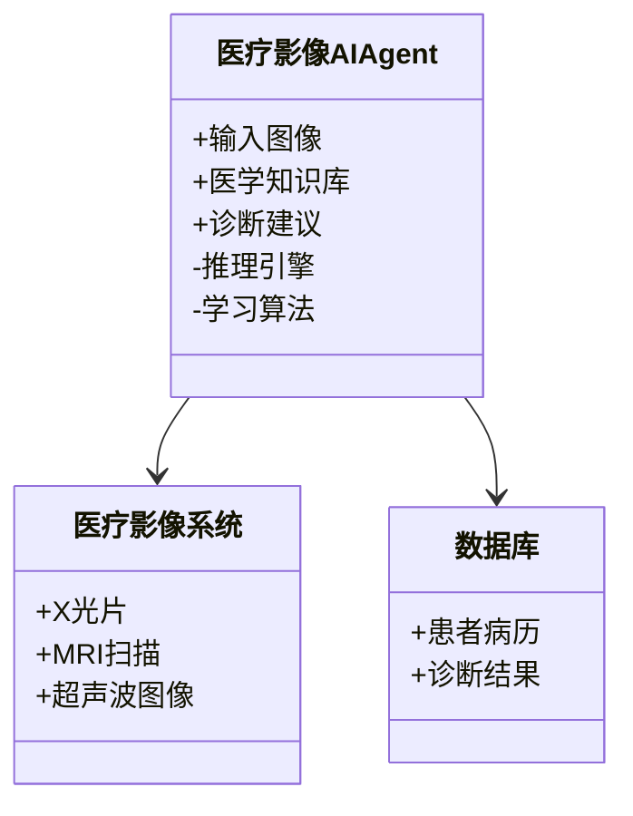
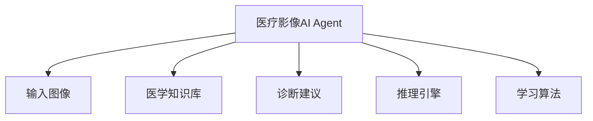

                 


# 智能医疗影像：AI Agent的辅助诊断

> 关键词：AI Agent，医疗影像，辅助诊断，深度学习，医学图像处理，智能医疗

> 摘要：本文深入探讨了AI Agent在医疗影像辅助诊断中的应用，分析了AI Agent的核心概念、算法原理、系统架构，并通过实际案例展示了其在医疗影像诊断中的优势与挑战。文章旨在为医疗专业人士和技术开发者提供有价值的参考，推动AI技术在智能医疗影像领域的进一步发展。

---

## 第一部分：智能医疗影像的背景与挑战

### 第1章：智能医疗影像的发展与AI Agent的引入

#### 1.1 智能医疗影像的背景

医疗影像在现代医学中扮演着至关重要的角色，从X光片到MRI扫描，影像数据为医生提供了诊断疾病的重要信息。然而，随着医疗影像数据的爆炸式增长，医生面临着巨大的挑战：如何高效、准确地处理海量数据，同时保证诊断的精确性。

AI Agent的引入为这一问题提供了新的解决方案。AI Agent（智能体）是一种能够感知环境、推理问题、并采取行动的智能系统。在医疗影像领域，AI Agent可以通过分析图像数据，辅助医生进行诊断，从而提高诊断效率和准确性。

#### 1.2 AI Agent的基本概念

AI Agent在医疗影像中的应用主要集中在以下几个方面：
- **感知**：通过深度学习模型对医学图像进行特征提取和识别。
- **推理**：基于知识图谱和概率推理，分析图像中的异常情况。
- **决策**：根据推理结果，生成诊断建议或触发进一步检查。

#### 1.3 智能医疗影像的现状与挑战

尽管AI Agent在医疗影像中的应用前景广阔，但仍然面临诸多挑战：
- **数据隐私**：医疗数据的敏感性要求高度的隐私保护。
- **算法泛化能力**：AI模型需要在不同设备和环境下保持稳定的性能。
- **医生接受度**：医生对AI诊断系统的信任度和接受度是推广的关键。

---

### 第2章：AI Agent的感知与推理机制

#### 2.1 感知机制

AI Agent的感知机制主要依赖于深度学习技术，尤其是卷积神经网络（CNN）。以下是感知机制的关键步骤：
- **图像预处理**：包括图像增强、归一化等步骤，以提高模型的训练效果。
- **特征提取**：通过CNN提取图像的深层特征。
- **目标检测与分割**：识别图像中的病变区域。

#### 2.2 推理机制

推理机制是AI Agent的核心，主要分为基于规则和基于概率的推理两种方式：
- **基于规则的推理**：通过预定义的医学知识库，进行逻辑推理。
- **基于概率的推理**：利用贝叶斯网络等概率模型，分析诊断的可能性。

#### 2.3 决策与执行机制

AI Agent的决策机制依赖于多模态数据的融合，例如结合患者的历史病历和当前的影像数据，生成最终的诊断建议。

---

## 第二部分：AI Agent的核心算法与数学模型

### 第3章：AI Agent的核心算法

#### 3.1 目标检测算法

目标检测是AI Agent感知阶段的重要任务。以下是一个基于Faster R-CNN的目标检测流程：

1. **输入图像**：将医学图像输入到Faster R-CNN模型中。
2. **特征提取**：通过CNN提取图像的特征图。
3. **候选区域生成**：使用RPN（Region Proposal Network）生成候选区域。
4. **目标分类与定位**：对每个候选区域进行分类和边界回归。

#### 3.2 图像分割算法

图像分割任务可以通过U-Net模型实现，尤其是在医学影像中，U-Net常用于细胞分割和病变区域的识别。

---

## 第三部分：系统架构与项目实战

### 第4章：系统架构设计

#### 4.1 领域模型设计

以下是医疗影像AI Agent的领域模型：



#### 4.2 系统架构设计

以下是系统的总体架构：



---

## 第四部分：项目实战与最佳实践

### 第5章：项目实战

#### 5.1 环境安装

为了运行AI Agent，需要安装以下环境：
- Python 3.8+
- PyTorch 1.9+
- torchvision 0.10+
- Jupyter Notebook

#### 5.2 核心代码实现

以下是基于PyTorch的目标检测代码示例：

```python
import torch
from torchvision.models import detection

model = detection.MaskRCNN(num_classes=2, pretrained=True)
optimizer = torch.optim.Adam(model.parameters(), lr=0.001)
criterion = detection.MaskRCNNLoss(model, 2)

for images, targets in dataloader:
    images = [img.to(device) for img in images]
    targets = [{k: v.to(device) for k, v in t.items()} for t in targets]
    outputs = model(images)
    loss = criterion(outputs, targets)
    optimizer.zero_grad()
    loss.backward()
    optimizer.step()
```

---

## 第五部分：总结与展望

### 第6章：总结与展望

AI Agent在医疗影像中的应用前景广阔，但仍需解决数据隐私、算法泛化能力等问题。未来，随着AI技术的不断进步，AI Agent将在医疗影像领域发挥更大的作用。

---

## 作者信息

作者：AI天才研究院/AI Genius Institute & 禅与计算机程序设计艺术 /Zen And The Art of Computer Programming

