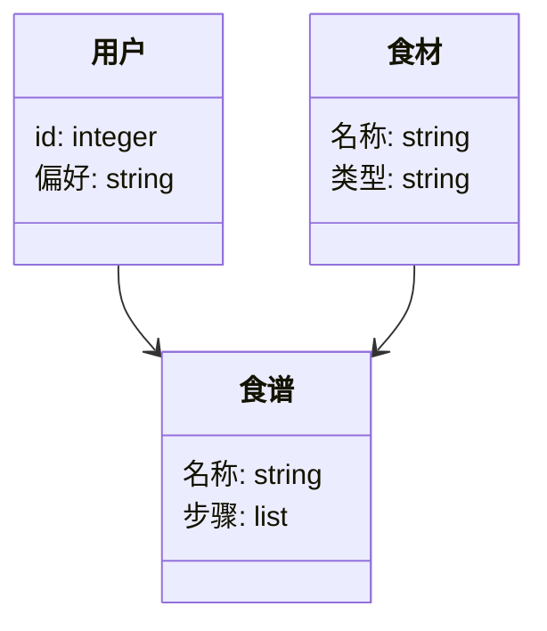

                 


# 智能厨具：AI Agent的烹饪指导系统

> **关键词**：智能厨具，AI Agent，烹饪指导系统，人工智能，自然语言处理，智能推荐  
> **摘要**：本文深入探讨了AI Agent在智能厨具中的应用，特别是如何通过AI技术实现烹饪指导系统。从背景介绍到核心概念，从算法原理到系统架构设计，再到项目实战，全面解析了AI Agent在烹饪指导中的核心功能与实现方式。文章通过详细的技术分析和案例解读，展示了AI Agent如何提升烹饪体验，为读者提供了一套完整的智能厨具解决方案。

---

## 第1章: 智能厨具的发展与现状

### 1.1 智能厨具的定义与分类

#### 1.1.1 智能厨具的定义  
智能厨具是指结合了物联网（IoT）、人工智能（AI）和大数据技术的厨房设备，能够通过传感器、摄像头和智能芯片感知环境、识别食材，并通过AI算法为用户提供智能化的烹饪指导。  

#### 1.1.2 智能厨具的主要分类  
智能厨具可以根据功能和技术特点分为以下几类：  
1. **智能锅具**：如智能电饭煲、智能炒锅，能够自动调节温度、时间，实现一键烹饪。  
2. **智能刀具**：如智能厨师刀，能够识别食材种类，提供切割建议。  
3. **智能厨具套装**：如集成AI烹饪指导的多功能厨房设备套装。  

#### 1.1.3 智能厨具的市场现状与发展趋势  
目前，智能厨具市场增长迅速，主要得益于AI技术的成熟和用户对智能化生活的追求。未来，智能厨具将更加注重用户体验，实现人机交互的智能化与个性化。

---

### 1.2 AI Agent的基本概念

#### 1.2.1 AI Agent的定义  
AI Agent（人工智能代理）是指能够感知环境、理解用户需求并采取行动以实现目标的智能系统。在烹饪指导中，AI Agent可以理解为一个虚拟助手，通过自然语言处理（NLP）与用户交互，并根据用户的烹饪需求提供个性化建议。

#### 1.2.2 AI Agent的核心功能  
AI Agent在烹饪指导中的核心功能包括：  
1. **自然语言理解**：通过NLP技术理解用户的烹饪需求。  
2. **知识推理**：基于烹饪知识库进行推理，生成合理的烹饪步骤。  
3. **个性化推荐**：根据用户口味偏好推荐食谱或食材。  

#### 1.2.3 AI Agent与传统烹饪工具的结合  
AI Agent通过与智能厨具的传感器和执行机构结合，实现了烹饪过程的智能化。例如，AI Agent可以通过语音交互指导用户完成烹饪步骤，或者通过传感器实时调整烹饪参数。

---

## 第2章: AI Agent在烹饪指导中的应用价值

### 2.1 烹饪指导的智能化需求

#### 2.1.1 烹饪指导的痛点分析  
传统烹饪过程中存在以下痛点：  
1. **烹饪步骤复杂**：初学者难以掌握复杂的烹饪技巧。  
2. **食材识别困难**：用户难以准确识别食材种类。  
3. **个性化需求未满足**：不同用户的口味偏好未得到充分考虑。  

#### 2.1.2 AI Agent如何解决这些痛点  
AI Agent通过智能化的交互和知识推理，能够帮助用户解决上述问题。例如，AI Agent可以通过语音交互实时指导用户完成烹饪步骤，或者通过图像识别帮助用户识别食材种类。  

#### 2.1.3 智能厨具的用户需求分析  
用户对智能厨具的主要需求包括：  
1. **简单易用**：操作步骤简单，适合所有用户群体。  
2. **个性化服务**：根据用户口味推荐食谱。  
3. **高效便捷**：缩短烹饪时间，提升效率。  

---

### 2.2 AI Agent在烹饪指导中的核心功能

#### 2.2.1 自然语言处理与语音交互  
AI Agent通过自然语言处理技术实现语音交互，用户可以通过语音指令与AI Agent互动，例如“我想做一道红烧肉”。  

#### 2.2.2 烹饪知识库的构建与管理  
AI Agent需要一个庞大的烹饪知识库，包括食材特性、烹饪步骤、食谱推荐等内容。知识库可以通过爬取公开食谱数据和专家知识构建。  

#### 2.2.3 智能推荐与个性化服务  
AI Agent可以根据用户的饮食偏好和历史记录推荐个性化食谱，例如推荐低脂饮食或适合素食者的食谱。  

---

## 第3章: AI Agent的核心概念与原理

### 3.1 AI Agent的体系结构

#### 3.1.1 基于规则的AI Agent  
基于规则的AI Agent通过预定义的规则进行推理，例如“如果食材是牛肉，则推荐煎炒”。  

#### 3.1.2 基于知识图谱的AI Agent  
基于知识图谱的AI Agent通过构建食材、烹饪方法和食谱之间的关系网络进行推理，例如“牛肉可以采用煎、炒、炖等多种烹饪方式”。  

#### 3.1.3 基于大模型的AI Agent  
基于大模型的AI Agent利用生成式AI（如GPT）生成烹饪建议，例如“您可以尝试将牛肉与红酒一起炖煮，搭配洋葱和胡萝卜”。  

---

### 3.2 AI Agent的工作流程

#### 3.2.1 信息输入与解析  
AI Agent通过语音或图像输入接收用户的烹饪需求，例如用户说“我想做一道意大利面”。  

#### 3.2.2 知识推理与决策  
AI Agent根据用户需求和知识库中的信息生成烹饪步骤，例如“建议使用新鲜的番茄酱和帕尔玛奶酪”。  

#### 3.2.3 结果输出与反馈  
AI Agent通过语音或屏幕输出烹饪步骤，并根据用户反馈不断优化建议。  

---

## 第4章: AI Agent的算法原理与数学模型

### 4.1 基于规则的推理算法

#### 4.1.1 规则引擎的实现原理  
基于规则的推理算法通过规则引擎实现，例如使用Rete算法进行规则匹配。  

#### 4.1.2 规则库的构建与管理  
规则库可以通过专家知识构建，例如“如果食材是鱼，则推荐清蒸”。  

#### 4.1.3 规则匹配与推理流程  
规则引擎通过匹配输入数据与规则库中的规则，生成推理结果。  

---

### 4.2 基于大模型的生成式AI

#### 4.2.1 大模型的训练与微调  
大模型可以通过迁移学习技术进行微调，例如在GPT-3的基础上微调烹饪相关的数据。  

#### 4.2.2 文本生成的数学模型  
生成式AI的核心模型是基于Transformer的文本生成模型，数学公式如下：  
$$ P(x_{i}) = \prod_{j=1}^{i} P(x_{j}|x_{<j}) $$  

#### 4.2.3 基于Transformer的生成式算法  
Transformer模型通过自注意力机制实现长文本生成，例如生成详细的烹饪步骤。  

---

## 第5章: 系统架构与功能设计

### 5.1 系统功能模块划分

#### 5.1.1 用户交互模块  
用户交互模块负责接收用户的输入，并通过语音或屏幕输出烹饪指导。  

#### 5.1.2 烹饪知识库模块  
烹饪知识库模块存储食材、食谱和烹饪方法等信息，供AI Agent调用。  

#### 5.1.3 AI推理引擎模块  
AI推理引擎模块负责根据用户需求和知识库信息生成烹饪建议。  

#### 5.1.4 系统管理模块  
系统管理模块负责系统的配置管理和版本更新。  

---

### 5.2 系统架构设计

#### 5.2.1 领域模型类图  
以下是领域模型的类图（使用Mermaid）：  


#### 5.2.2 系统架构图  
以下是系统架构图（使用Mermaid）：  


---

## 第6章: 项目实战

### 6.1 环境搭建

#### 6.1.1 开发环境  
需要安装Python、TensorFlow、PyTorch等开发工具。  

#### 6.1.2 环境配置  
配置Python版本和相关库的依赖。  

---

### 6.2 核心代码实现

#### 6.2.1 自然语言处理模块  
以下是自然语言处理模块的代码示例：  
```python
def process_input(user_input):
    # 分词
    tokens = tokenize(user_input)
    # 解析意图
    intent = get_intent(tokens)
    return intent
```

#### 6.2.2 烹饪知识库模块  
以下是烹饪知识库模块的代码示例：  
```python
class RecipeDatabase:
    def __init__(self):
        self.recipes = {}
    
    def add_recipe(self, recipe_name, steps):
        self.recipes[recipe_name] = steps
    
    def get_recipe(self, recipe_name):
        return self.recipes.get(recipe_name, [])
```

---

### 6.3 案例分析与详细解读

#### 6.3.1 案例分析  
以“制作意大利面”为例，AI Agent可以根据用户需求推荐食材和步骤。  

#### 6.3.2 实际应用  
用户通过语音输入“我想做意大利面”，AI Agent通过自然语言处理解析需求，从知识库中检索相关食谱，并生成烹饪步骤。  

---

## 第7章: 最佳实践与小结

### 7.1 最佳实践

#### 7.1.1 系统优化建议  
建议在系统中增加用户反馈机制，优化AI Agent的推荐算法。  

#### 7.1.2 开发注意事项  
开发过程中需要注意系统的可扩展性和可维护性。  

---

### 7.2 小结

AI Agent在智能厨具中的应用为烹饪指导带来了新的可能性。通过智能化的交互和知识推理，AI Agent能够显著提升用户的烹饪体验。未来，随着AI技术的进一步发展，智能厨具将变得更加智能化和个性化。

---

## 第8章: 注意事项与拓展阅读

### 8.1 注意事项

#### 8.1.1 用户隐私保护  
开发过程中需要注意用户的隐私保护，避免数据泄露。  

#### 8.1.2 系统稳定性  
确保系统的稳定性和可靠性，避免因技术问题影响用户体验。  

---

### 8.2 拓展阅读

#### 8.2.1 相关技术领域  
建议读者进一步学习自然语言处理（NLP）、知识图谱构建和生成式AI的相关技术。  

#### 8.2.2 未来研究方向  
未来可以研究AI Agent在其他生活场景中的应用，例如智能家电和健康管理。  

---

## 作者信息

作者：AI天才研究院/AI Genius Institute & 禅与计算机程序设计艺术/Zen And The Art of Computer Programming  

---

本文通过详细的技术分析和案例解读，全面解析了AI Agent在烹饪指导中的核心功能与实现方式。从背景介绍到系统架构设计，再到项目实战，为读者提供了一套完整的智能厨具解决方案。希望本文能为相关领域的研究者和开发者提供有价值的参考。

