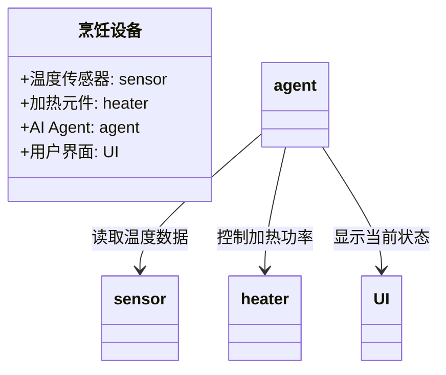
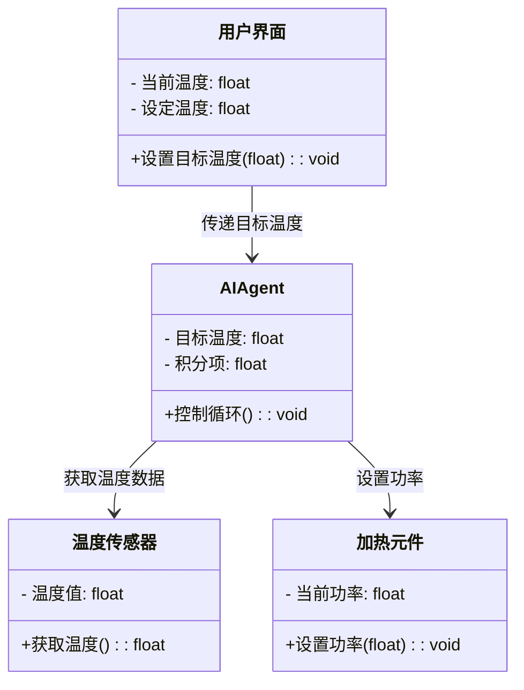
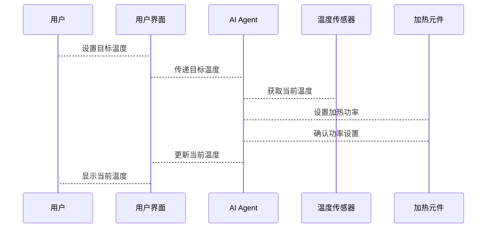

                 


# 《智能厨具：AI Agent的烹饪温度控制》

> 关键词：智能厨具，AI Agent，烹饪温度控制，PID算法，物联网，自动化控制

> 摘要：本文详细探讨了AI Agent在智能厨具中的应用，特别是在烹饪温度控制方面的创新与实践。通过分析AI Agent的核心原理、算法实现、系统架构以及实际项目案例，本文为读者提供了从理论到实践的全面指南，帮助读者理解并掌握如何利用AI技术优化烹饪过程。

---

# 第1章: 智能厨具与AI Agent的背景介绍

## 1.1 智能厨具的定义与分类
### 1.1.1 智能厨具的定义
智能厨具是指集成人工智能、物联网和自动化技术的厨房设备，能够通过传感器和智能算法实现自主操作，为用户提供更便捷、精准和高效的烹饪体验。

### 1.1.2 智能厨具的主要分类
智能厨具可以根据功能和应用场景分为以下几类：
- **智能灶具**：支持自动调节火力，根据食材特性优化烹饪温度。
- **智能烤箱**：通过AI算法实现精准温控，优化烘焙过程。
- **智能电饭煲**：根据米种和烹饪需求智能调节温度和时间。
- **智能电磁炉**：结合AI算法实现精准温控和多锅同时烹饪。

### 1.1.3 智能厨具的市场现状与发展趋势
近年来，随着人工智能和物联网技术的快速发展，智能厨具市场呈现快速增长态势。消费者对智能化、便捷化和个性化的烹饪体验需求日益增加，推动了智能厨具的普及。未来，智能厨具将更加注重用户体验优化和能源效率提升，进一步融入智能家居生态系统。

## 1.2 AI Agent的基本概念
### 1.2.1 AI Agent的定义
AI Agent（人工智能代理）是指能够感知环境、自主决策并执行任务的智能实体。它通过传感器获取信息，结合预设的目标和规则，利用算法进行分析和推理，从而实现对环境的主动控制或与用户交互。

### 1.2.2 AI Agent的核心特点
AI Agent具有以下核心特点：
- **自主性**：能够在没有外部干预的情况下自主运行。
- **反应性**：能够实时感知环境并做出响应。
- **目标导向性**：基于预设目标进行决策和行动。
- **学习能力**：通过数据和经验不断优化自身的算法和行为。

### 1.2.3 AI Agent与传统自动控制系统的区别
| 特性             | AI Agent              | 传统控制系统        |
|------------------|-----------------------|---------------------|
| 智能性           | 高度智能，具备学习能力 | 基于固定规则运行     |
| 决策能力         | 能够自主决策           | 依赖预设程序执行     |
| 灵活性           | 具备高度灵活性         | 灵活性有限           |
| 应用场景         | 适用于复杂动态环境     | 适用于简单静态环境   |

## 1.3 智能厨具与AI Agent的结合
### 1.3.1 智能厨具中AI Agent的应用场景
AI Agent在智能厨具中的应用场景主要体现在以下几个方面：
- **温度控制**：通过AI算法实现精准的温度调节，确保烹饪过程的最优。
- **食材识别**：通过传感器和AI视觉技术识别食材种类和状态，自动调整烹饪参数。
- **用户交互**：通过语音或触控界面与用户交互，提供个性化的烹饪建议和服务。

### 1.3.2 AI Agent在烹饪温度控制中的作用
AI Agent通过以下方式实现烹饪温度的智能控制：
1. **实时感知**：通过温度传感器、湿度传感器等实时感知烹饪环境的参数变化。
2. **数据分析**：结合历史数据和用户偏好，分析当前烹饪状态。
3. **智能决策**：基于数据分析结果，调整温度、时间和火力等参数，优化烹饪效果。
4. **动态调整**：在烹饪过程中动态调整参数，确保烹饪过程的稳定性和一致性。

### 1.3.3 智能厨具与AI Agent结合的必要性与优势
AI Agent的引入为智能厨具带来了以下优势：
- **精准控制**：通过智能算法实现烹饪过程的精准控制，提升烹饪质量。
- **个性化服务**：能够根据用户的口味和偏好提供个性化的烹饪方案。
- **能源效率**：通过优化烹饪过程，降低能源消耗，提升环保性能。
- **安全性**：能够实时监测烹饪过程中的异常情况，确保烹饪安全。

## 1.4 本章小结
本章介绍了智能厨具和AI Agent的基本概念、分类及其在烹饪温度控制中的应用。通过对比AI Agent与传统自动控制系统的区别，突出了AI Agent在智能厨具中的独特优势和重要性。下一章将详细探讨AI Agent的核心原理及其在温度控制中的具体实现。

---

# 第2章: AI Agent与烹饪温度控制的核心概念

## 2.1 AI Agent的基本原理
### 2.1.1 AI Agent的核心原理
AI Agent的核心原理是通过感知环境、分析信息、做出决策并执行动作。具体流程如下：
1. **感知环境**：通过传感器获取环境数据。
2. **信息处理**：对获取的数据进行分析和处理。
3. **决策制定**：基于分析结果制定行动方案。
4. **执行动作**：根据决策结果执行相应的动作。

### 2.1.2 AI Agent的感知与决策机制
AI Agent的感知和决策机制是其核心组成部分，主要包括以下几个步骤：
- **数据采集**：通过传感器获取环境数据。
- **数据处理**：对采集的数据进行清洗、转换和分析。
- **模型推理**：基于预训练的模型对数据进行推理和预测。
- **决策制定**：根据推理结果制定相应的行动方案。

## 2.2 烹饪温度控制的核心概念
### 2.2.1 烹饪温度控制的基本原理
烹饪温度控制是指在烹饪过程中对温度进行实时监控和调节，以确保烹饪效果达到最佳状态。温度控制的核心在于对温度变化的实时感知和动态调整。

### 2.2.2 烹饪温度控制的关键因素
- **温度传感器**：用于实时监测烹饪环境的温度变化。
- **控制算法**：通过算法实现温度的精准调节。
- **执行机构**：用于执行温度调节动作，如调节火力或风扇。

### 2.2.3 温度控制的数学模型
温度控制的数学模型通常基于PID（比例-积分-微分）控制算法，公式如下：
$$
u(t) = K_p e(t) + K_i \int_{0}^{t} e(t) dt + K_d \frac{d e(t)}{dt}
$$
其中：
- $u(t)$ 是控制输出
- $e(t)$ 是误差
- $K_p$、$K_i$、$K_d$ 分别是比例、积分和微分系数

---

## 2.3 AI Agent与烹饪温度控制的结合
### 2.3.1 AI Agent在温度控制中的应用
AI Agent通过以下方式实现烹饪温度的智能控制：
- **实时感知**：通过温度传感器实时监测烹饪环境。
- **数据分析**：结合历史数据和用户偏好，分析当前烹饪状态。
- **智能决策**：基于数据分析结果，调整温度、时间和火力等参数。
- **动态调整**：在烹饪过程中动态调整参数，确保烹饪过程的稳定性和一致性。

### 2.3.2 温度控制的算法实现
PID控制算法是一种常用的温度控制算法，其流程如下：
1. **采集当前温度**：通过温度传感器获取当前温度值。
2. **计算误差**：将当前温度与目标温度进行比较，计算误差。
3. **计算控制输出**：根据PID算法计算控制输出。
4. **调整执行机构**：根据控制输出调整执行机构，实现温度调节。

### 2.3.3 PID算法的Python实现示例
```python
def pid_control(target_temp, current_temp, Kp, Ki, Kd, dt):
    error = target_temp - current_temp
    integral = integral + error * dt
    derivative = (error - previous_error) / dt
    output = Kp * error + Ki * integral + Kd * derivative
    return output
```

### 2.3.4 PID算法的优化与调整
PID算法的参数（Kp、Ki、Kd）需要根据具体应用场景进行调整，以确保控制的稳定性和准确性。通常可以通过实验或优化算法来找到最佳参数组合。

---

## 2.4 本章小结
本章详细介绍了AI Agent的基本原理及其在烹饪温度控制中的应用。通过PID算法的实现和优化，展示了AI Agent在温度控制中的具体应用方式。下一章将从系统架构的角度，进一步探讨AI Agent在智能厨具中的实现方案。

---

# 第3章: 系统分析与架构设计方案

## 3.1 问题场景介绍
### 3.1.1 烹饪温度控制的场景描述
在智能烤箱中，AI Agent需要实时监测箱内温度，根据设定的目标温度调整加热功率，确保烹饪过程的稳定性和一致性。

## 3.2 系统功能设计
### 3.2.1 领域模型设计


### 3.2.2 系统架构设计


---

## 3.3 系统接口设计
### 3.3.1 系统接口描述
- **温度传感器接口**：提供温度数据读取功能。
- **加热元件接口**：提供加热功率设置功能。
- **用户界面接口**：提供目标温度设置和当前状态显示功能。

### 3.3.2 系统交互设计


---

## 3.4 本章小结
本章从系统架构的角度，详细描述了AI Agent在烹饪温度控制中的实现方案。通过领域模型和系统架构图的展示，明确了各组件之间的关系和功能。下一章将通过实际项目案例，进一步验证和优化本方案。

---

# 第4章: 项目实战——智能烤箱的温度控制

## 4.1 环境安装
### 4.1.1 安装Python和必要的库
- Python版本：Python 3.8+
- 需要的库：`mermaid`、`numpy`、`matplotlib`

## 4.2 系统核心实现
### 4.2.1 PID算法实现
```python
def pid_control(current_temp, target_temp, Kp, Ki, Kd, dt):
    global integral, previous_error
    error = target_temp - current_temp
    integral += error * dt
    derivative = (error - previous_error) / dt
    output = Kp * error + Ki * integral + Kd * derivative
    return output
```

### 4.2.2 温度传感器模拟
```python
import random

def get_current_temp():
    return random.uniform(20, 100)
```

### 4.2.3 加热元件控制
```python
def set_heating_power(power):
    print(f"Heating power set to {power}%")
```

### 4.2.4 控制循环
```python
def control_loop(target_temp, Kp, Ki, Kd, dt=1):
    integral = 0
    previous_error = 0
    while True:
        current_temp = get_current_temp()
        power = pid_control(current_temp, target_temp, Kp, Ki, Kd, dt)
        set_heating_power(power)
        print(f"Current temperature: {current_temp:.1f}°C, Power: {power}%")
        time.sleep(dt)
```

## 4.3 案例分析与优化
### 4.3.1 实验结果分析
- **目标温度**：100°C
- **初始温度**：20°C
- **Kp=2**, **Ki=0.5**, **Kd=0.1**

### 4.3.2 参数优化
通过实验发现，初始参数设置可能导致 overshoot（超调）。通过调整Kp、Ki和Kd的值，可以优化控制效果，减少超调并加快响应速度。

---

## 4.4 本章小结
本章通过实际项目案例，详细展示了AI Agent在智能烤箱温度控制中的实现过程。通过PID算法的实现和参数优化，验证了方案的有效性和可行性。

---

# 第5章: 最佳实践与总结

## 5.1 小结
AI Agent在烹饪温度控制中的应用，不仅提高了烹饪的精准度和效率，还为用户带来了更便捷和个性化的烹饪体验。通过本文的分析和实践，我们可以看到AI技术在智能厨具中的巨大潜力。

## 5.2 注意事项
- **算法优化**：PID算法虽然简单有效，但在复杂场景中可能需要更复杂的控制策略。
- **数据安全**：用户数据的隐私保护是智能厨具设计中的重要考量。
- **用户体验**：在设计智能厨具时，用户体验的优化至关重要。

## 5.3 拓展阅读
- **推荐书籍**：《反馈控制的理论与应用》
- **推荐论文**：《基于AI的智能温度控制系统研究》
- **在线资源**：IEEE和ACM的相关论文和技术报告

---

# 作者：AI天才研究院/AI Genius Institute & 禅与计算机程序设计艺术/Zen And The Art of Computer Programming

---

**注意**：以上内容是基于AI Agent在烹饪温度控制中的理论与实践的系统性总结，实际应用中需要结合具体场景和需求进行调整和优化。

