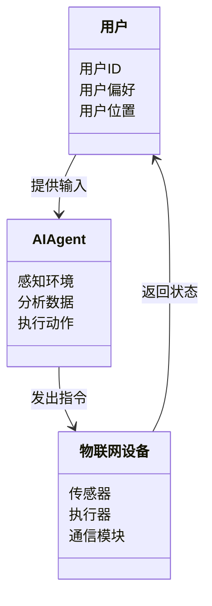

                 


# 智能厨房吊柜：AI Agent的厨房效率提升建议

> 关键词：智能厨房吊柜，AI Agent，厨房效率，物联网，智能家居，人工智能

> 摘要：本文将探讨如何通过AI Agent技术提升厨房吊柜的智能化水平，从而提高厨房效率。我们将从背景介绍、核心概念、算法原理、系统架构设计、项目实战和最佳实践等多个方面进行详细分析，最终提出具体的厨房效率提升建议。

---

# 第一部分: 背景与概念

## 第1章: 智能厨房吊柜的背景与现状

### 1.1 智能厨房吊柜的定义与特点

#### 1.1.1 厨房吊柜的传统功能与局限性
传统厨房吊柜主要用于存储厨具、食材和厨房用品。然而，传统吊柜的功能相对单一，无法与厨房中的其他设备或用户需求进行联动，存在以下问题：
- 食材存储不够智能化，无法根据食材种类和保质期进行动态调整。
- 缺乏与厨房其他设备（如冰箱、烤箱）的联动能力。
- 用户操作不够便捷，无法通过语音或移动设备进行远程控制。

#### 1.1.2 智能化改造的核心价值
通过AI Agent技术，智能厨房吊柜可以实现以下功能：
- **智能化存储管理**：根据食材种类、保质期和用户习惯，动态调整存储空间。
- **设备联动**：与厨房其他设备（如冰箱、微波炉）联动，优化厨房工作流程。
- **用户交互**：支持语音、手势或移动设备的远程控制，提升用户体验。

#### 1.1.3 当前市场中的智能厨房吊柜现状
当前市场中，智能厨房吊柜仍处于起步阶段，主要集中在以下方面：
- 部分高端橱柜品牌开始尝试将智能存储管理功能融入吊柜设计。
- 一些科技公司推出带有AI交互功能的厨房设备，但尚未形成统一的智能化标准。

---

### 1.2 AI Agent在厨房场景中的应用背景

#### 1.2.1 AI Agent的基本概念
AI Agent（人工智能代理）是指能够感知环境并采取行动以实现目标的智能实体。在厨房场景中，AI Agent可以充当用户与厨房设备之间的桥梁，帮助用户更高效地完成厨房任务。

#### 1.2.2 厨房场景中AI Agent的潜力
AI Agent在厨房中的潜力主要体现在以下方面：
- **智能助手**：通过语音交互帮助用户完成食材清单、食谱搜索等任务。
- **设备控制**：通过AI Agent实现厨房设备的联动控制，例如在用户开始烹饪时自动开启烤箱。
- **数据优化**：通过收集和分析用户行为数据，优化厨房设备的使用效率。

#### 1.2.3 当前技术发展水平与应用案例
目前，AI Agent在厨房中的应用还处于初级阶段，主要集中在以下案例：
- 智能音箱（如亚马逊的Alexa、谷歌的Google Home）可以与部分厨房设备联动。
- 智能冰箱可以通过AI Agent帮助用户管理食材库存。

---

## 第2章: 智能厨房吊柜的核心技术基础

### 2.1 AI Agent的核心原理

#### 2.1.1 人工智能的基本概念
人工智能（AI）是指计算机系统模拟人类智能的能力，包括学习、推理、感知和决策等功能。AI Agent作为AI的核心组件，能够根据环境输入采取相应行动。

#### 2.1.2 AI Agent的定义与分类
AI Agent可以分为以下几类：
- **简单反射型Agent**：基于预设规则进行行动。
- **基于模型的反应式Agent**：通过感知环境动态调整行动。
- **目标驱动型Agent**：根据目标采取行动。

#### 2.1.3 AI Agent在厨房场景中的功能实现
在厨房场景中，AI Agent的主要功能包括：
- **语音交互**：通过语音识别技术与用户进行对话。
- **设备控制**：通过物联网技术实现与厨房设备的联动。
- **数据处理**：分析用户行为数据，优化厨房工作流程。

---

### 2.2 物联网技术在厨房吊柜中的应用

#### 2.2.1 物联网的基本概念
物联网（IoT）是指通过各种信息传感设备，按照约定的协议，把任何物品与互联网连接起来，进行信息交换和通信的技术。

#### 2.2.2 厨房吊柜中的物联网设备
在智能厨房吊柜中，物联网设备包括：
- **传感器**：用于检测温度、湿度等环境参数。
- **通信模块**：用于与云端或其他设备进行数据传输。

#### 2.2.3 物联网技术对厨房效率的提升
物联网技术可以实现以下功能：
- **远程监控**：用户可以通过手机App实时查看厨房吊柜的状态。
- **自动调整**：根据环境数据自动调整吊柜的存储条件。

---

### 2.3 智能家居系统的基础架构

#### 2.3.1 智能家居的定义与特点
智能家居是指通过物联网技术将家中的各种设备（如灯、空调、电视等）连接起来，实现智能化管理。

#### 2.3.2 智能家居系统的组成与功能
智能家居系统通常包括以下组成部分：
- **硬件设备**：如传感器、执行器等。
- **软件平台**：如智能家居App、云平台等。
- **通信网络**：如Wi-Fi、蓝牙等。

#### 2.3.3 智能家居与厨房吊柜的结合
智能家居系统可以通过与厨房吊柜的联动，实现更高效的厨房管理。例如：
- 用户可以通过智能家居系统远程开启厨房吊柜的照明设备。
- 系统可以根据用户的位置自动调整厨房设备的状态。

---

# 第二部分: 核心概念与技术联系

## 第3章: AI Agent与物联网技术的融合

### 3.1 AI Agent与物联网技术的协同关系

#### 3.1.1 AI Agent在物联网中的角色
AI Agent在物联网中主要负责数据的分析和决策。通过AI Agent，物联网设备可以实现智能化的管理和控制。

#### 3.1.2 物联网数据对AI Agent的支撑
物联网设备生成的大量数据为AI Agent提供了决策依据。通过分析这些数据，AI Agent可以优化厨房吊柜的运行效率。

---

### 3.2 核心概念对比分析

#### 3.2.1 AI Agent与传统自动化设备的对比
| 特性          | AI Agent                  | 传统自动化设备          |
|---------------|---------------------------|-------------------------|
| 智能性         | 高                         | 低                     |
| 可定制性       | 高                         | 低                     |
| 学习能力       | 强                         | 无                     |

#### 3.2.2 物联网技术与传统厨房设备的对比
| 特性          | 物联网技术                | 传统厨房设备          |
|---------------|---------------------------|-------------------------|
| 连接性         | 高                         | 低                     |
| 可扩展性       | 高                         | 低                     |
| 智能性         | 高                         | 低                     |

#### 3.2.3 智能家居系统与传统厨房布局的对比
| 特性          | 智能家居系统              | 传统厨房布局          |
|---------------|---------------------------|-------------------------|
| 整体性         | 高                         | 低                     |
| 灵活性         | 高                         | 低                     |
| 便捷性         | 高                         | 低                     |

---

### 3.3 ER实体关系图

```mermaid
er
actor: 用户
agent: AI Agent
device: 物联网设备
system: 智能家居系统
```

---

## 第4章: AI Agent的算法原理

### 4.1 算法原理概述

#### 4.1.1 基于规则的AI Agent
基于规则的AI Agent通过预设的规则进行决策。例如：
- 当检测到食材即将过期时，触发提醒。

#### 4.1.2 基于机器学习的AI Agent
基于机器学习的AI Agent可以通过历史数据学习用户的习惯，并自动生成优化建议。例如：
- 通过分析用户的食材使用频率，自动调整存储空间。

#### 4.1.3

---

## 第5章: 系统架构设计

### 5.1 系统功能设计

#### 5.1.1 领域模型


#### 5.1.2 系统架构设计


---

## 第6章: 项目实战

### 6.1 环境配置

#### 6.1.1 开发工具
- Python 3.8+
- PyTorch 1.9+
- Flask 2.0+
- MQTT客户端（如Mosquitto）

#### 6.1.2 代码实现

```python
import mqtt
from flask import Flask

app = Flask(__name__)
mqtt_client = mqtt.Client()

@app.route('/')
def home():
    return "智能厨房吊柜系统"

@app.route('/set_mode/<mode>')
def set_mode(mode):
    mqtt_client.publish('kitchen/cabinet', mode)
    return f"设置为{mode}模式"
```

---

## 第7章: 最佳实践

### 7.1 注意事项

- 确保系统的安全性，防止黑客攻击。
- 定期更新AI模型，提升系统性能。
- 提供良好的用户界面，降低用户的使用门槛。

### 7.2 小结

通过AI Agent技术，智能厨房吊柜可以显著提升厨房效率。未来，随着技术的进一步发展，智能厨房吊柜将变得更加智能化和便捷。

### 7.3 拓展阅读

- [《智能家居系统设计》](https://example.com)
- [《人工智能在厨房中的应用》](https://example.com)

---

# 小结

通过本文的分析，我们可以看到，AI Agent技术为智能厨房吊柜的未来发展提供了巨大的潜力。通过智能化的存储管理、设备联动和用户交互，智能厨房吊柜可以显著提升厨房效率，为用户带来更便捷的厨房体验。

---

# 作者：AI天才研究院/AI Genius Institute & 禅与计算机程序设计艺术 /Zen And The Art of Computer Programming

