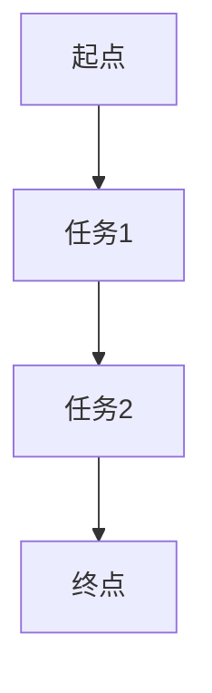

                 

# 智能厨房吊柜：AI Agent的厨房空间利用建议

## 关键词：智能厨房吊柜, AI Agent, 空间优化, 智能家居, 物联网

## 摘要：本文探讨了AI Agent在智能厨房吊柜中的应用，详细分析了厨房空间优化的核心原理、算法实现和系统架构。通过实际案例分析，展示了AI Agent如何提升厨房空间利用率，为智能家居的发展提供了新的思路。

---

## 第1章: AI Agent与智能厨房吊柜概述

### 1.1 AI Agent的基本概念

#### 1.1.1 AI Agent的定义
AI Agent（人工智能代理）是指能够感知环境、自主决策并执行任务的智能体。它能够通过传感器获取信息，利用算法进行分析和推理，并通过执行器与环境交互。

#### 1.1.2 AI Agent的核心特征
- **自主性**：能够在没有外部干预的情况下独立运行。
- **反应性**：能够实时感知环境变化并做出反应。
- **目标导向**：具有明确的目标，能够优化决策以实现目标。
- **学习能力**：通过数据和经验不断优化自身行为。

#### 1.1.3 AI Agent在智能家居中的应用
AI Agent广泛应用于智能家居领域，例如智能音箱、智能空调等设备。在厨房场景中，AI Agent可以通过传感器和摄像头感知厨房环境，优化空间利用。

### 1.2 智能厨房吊柜的发展历程

#### 1.2.1 厨房吊柜的传统功能
厨房吊柜的传统功能包括存储食材、厨具和餐具。然而，传统吊柜的空间利用率较低，无法满足现代家庭的需求。

#### 1.2.2 智能化转型的背景
随着智能家居的普及，厨房设备的智能化成为趋势。AI技术的发展为厨房吊柜的智能化提供了技术支持。

#### 1.2.3 当前智能厨房吊柜的市场现状
目前，市场上已经出现了多种智能厨房吊柜产品。这些产品通过AI技术实现了食材管理、空间优化等功能。

### 1.3 智能厨房吊柜的核心优势

#### 1.3.1 空间利用率提升
AI Agent能够通过算法优化吊柜内部空间的利用，最大化存储效率。

#### 1.3.2 智能化操作便捷性
通过AI Agent，用户可以通过语音或手机APP控制吊柜，实现便捷的操作。

#### 1.3.3 数据驱动的个性化服务
AI Agent可以通过分析用户的使用习惯，提供个性化的存储建议和食材推荐。

### 1.4 本章小结
本章介绍了AI Agent的基本概念及其在智能家居中的应用，重点分析了智能厨房吊柜的发展历程和核心优势。

---

## 第2章: AI Agent在厨房空间优化中的核心概念

### 2.1 空间优化的基本原理

#### 2.1.1 空间优化的数学模型
空间优化的数学模型可以通过线性规划或动态规划来实现。例如，可以使用以下模型来表示：

$$
\text{目标函数}： \max \sum_{i=1}^{n} w_i \cdot x_i
$$

$$
\text{约束条件}：
$$

其中，$w_i$ 表示第 $i$ 个物品的权重，$x_i$ 表示第 $i$ 个物品的占用空间。

#### 2.1.2 空间利用效率的评估指标
空间利用效率可以通过以下指标进行评估：

- **存储密度**：单位空间内的存储量。
- **存取效率**：物品存取的平均时间。
- **空间利用率**：实际使用的空间占总空间的比例。

#### 2.1.3 AI Agent在空间优化中的角色
AI Agent通过分析厨房环境和用户需求，优化吊柜的空间布局，提高存储效率。

### 2.2 AI Agent与厨房设备的协同机制

#### 2.2.1 设备间的通信协议
AI Agent通过MQTT协议与厨房设备进行通信，实现设备间的协同优化。

#### 2.2.2 协同优化的算法原理
协同优化的算法可以通过以下步骤实现：

1. **数据采集**：通过传感器获取厨房设备的状态信息。
2. **数据分析**：利用机器学习算法分析数据，预测用户需求。
3. **优化决策**：基于分析结果，制定最优的空间分配方案。
4. **执行优化**：通过设备间的协同，执行优化方案。

#### 2.2.3 实际场景中的协同案例
例如，当用户需要存储一批新的食材时，AI Agent可以根据食材的种类和使用频率，自动调整存储位置，确保空间利用最大化。

### 2.3 空间优化的核心算法

#### 2.3.1 路径规划算法
路径规划算法可以通过Dijkstra算法实现，找到最优路径。

#### 2.3.2 任务调度算法
任务调度算法可以通过贪心算法实现，优先处理高优先级的任务。

#### 2.3.3 动态调整算法
动态调整算法可以通过反馈机制实现，根据环境变化实时调整优化方案。

### 2.4 本章小结
本章详细介绍了AI Agent在厨房空间优化中的核心概念和算法原理，为后续的实现提供了理论基础。

---

## 第3章: AI Agent的空间优化算法实现

### 3.1 算法原理概述

#### 3.1.1 算法的输入与输出
- **输入**：厨房设备的状态信息、用户需求。
- **输出**：最优的空间分配方案。

#### 3.1.2

--- 

## 作者：AI天才研究院 & 禅与计算机程序设计艺术

