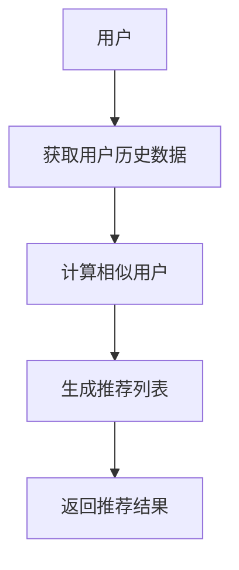
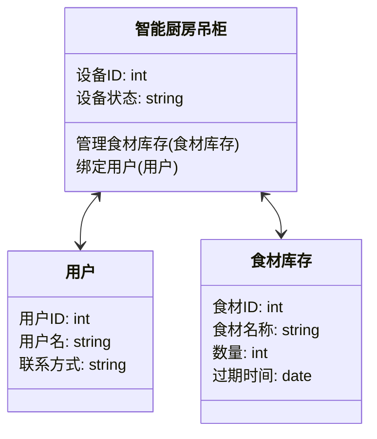
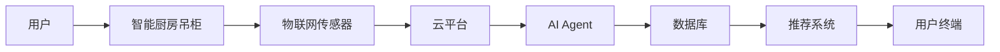
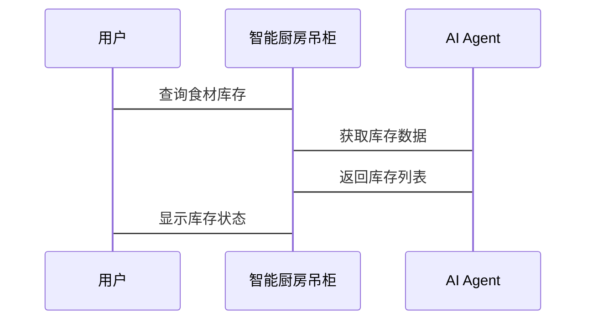

                 


# 《智能厨房吊柜：AI Agent的食材库存管理》

---

## 关键词：智能厨房吊柜, AI Agent, 食材库存管理, 物联网, 人工智能, 推荐算法

---

## 摘要：本文详细探讨了智能厨房吊柜在食材库存管理中的应用，结合AI Agent的核心算法和物联网技术，分析了系统架构设计与实现方案，最后通过实际案例展示了项目的落地实施。

---

# 第一部分：背景介绍与核心概念

## 第1章：问题背景与描述

### 1.1 问题背景

#### 1.1.1 智能家居的发展趋势
智能家居的普及正在改变人们的生活方式，厨房作为家庭生活中重要的场景之一，智能化需求日益增长。

#### 1.1.2 厨房智能化的需求
现代厨房需要更高效的食材管理方式，减少浪费，提高使用效率。

#### 1.1.3 食材库存管理的痛点
传统食材管理存在效率低、易遗忘、手动记录繁琐等问题，亟需智能化解决方案。

### 1.2 问题描述

#### 1.2.1 食材管理的复杂性
食材种类繁多，保质期不同，手动管理容易出错。

#### 1.2.2 用户需求分析
用户希望实时了解食材库存状态，自动提醒补货，推荐使用建议。

#### 1.2.3 现有解决方案的不足
现有方案多为手动管理或简单提醒，缺乏智能化和个性化推荐。

### 1.3 问题解决

#### 1.3.1 AI Agent的核心作用
AI Agent能够实时监测食材库存，智能推荐使用计划，优化管理效率。

#### 1.3.2 智能厨房吊柜的解决方案
通过智能吊柜与AI Agent结合，实现食材库存的智能化管理。

#### 1.3.3 技术实现路径
采用物联网传感器、AI算法和云平台，构建智能化的食材库存管理系统。

## 第2章：核心概念与联系

### 2.1 核心概念原理

#### 2.1.1 AI Agent的基本原理
AI Agent通过感知环境、处理信息、做出决策，实现自动化管理。

#### 2.1.2 物联网设备的工作机制
物联网设备通过传感器采集数据，通过网络传输到云端，进行处理和反馈。

#### 2.1.3 食材库存管理的实现方式
利用RFID技术、图像识别和传感器，实现食材的自动识别和库存记录。

### 2.2 核心概念对比表格

| 概念       | 描述                           |
|------------|--------------------------------|
| AI Agent   | 具有自主决策能力的智能体       |
| 物联网设备 | 连接物理世界与数字世界的设备   |
| 食材库存   | 食材的存储与管理状态           |

### 2.3 ER实体关系图

```mermaid
erd
  entity 智能厨房吊柜 {
    key 属性: 设备ID
    属性: 设备名称, 设备状态
  }
  entity 食材库存 {
    key 属性: 食材ID
    属性: 食材名称, 数量, 过期时间
  }
  entity 用户 {
    key 属性: 用户ID
    属性: 用户名称, 联系方式
  }
  智能厨房吊柜 --> 食材库存: 管理
  智能厨房吊柜 --> 用户: 绑定
```

---

# 第二部分：算法原理与数学模型

## 第3章：AI Agent的核心算法

### 3.1 推荐算法

#### 3.1.1 协同过滤推荐算法

协同过滤是一种基于用户行为相似性推荐的算法，分为基于用户的协同过滤和基于物品的协同过滤。

#### 3.1.2 基于内容的推荐算法

基于内容的推荐算法通过分析物品的属性，向用户推荐相似的物品。

#### 3.1.3 混合推荐算法

混合推荐算法结合协同过滤和基于内容的推荐方法，提升推荐的准确性和多样性。

### 3.2 算法实现

#### 3.2.1 协同过滤算法流程图



#### 3.2.2 代码实现

```python
def collaborative_filtering(user_id, data):
    # 获取用户的历史数据
    user_data = data[user_id]
    # 计算相似用户
    similar_users = find_similar_users(user_data)
    # 生成推荐列表
    recommendations = generate_recommendations(similar_users)
    return recommendations
```

### 3.3 算法的数学模型

#### 协同过滤的数学模型

$$相似度 = \frac{\sum (r_{u,i} - \bar{r}_u)(r_{u,j} - \bar{r}_j)}{\sqrt{\sum (r_{u,i} - \bar{r}_u)^2} \sqrt{\sum (r_{u,j} - \bar{r}_j)^2}}$$

---

# 第三部分：系统分析与架构设计

## 第4章：系统架构设计

### 4.1 系统功能设计

#### 4.1.1 领域模型类图



### 4.2 系统架构图



### 4.3 系统接口设计

#### 接口1：获取食材库存状态
- 输入：设备ID
- 输出：食材库存列表

#### 接口2：更新食材库存
- 输入：食材ID, 数量
- 输出：更新成功状态

### 4.4 系统交互序列图



---

# 第四部分：项目实战

## 第5章：项目实战与实现

### 5.1 环境安装

#### 安装Python和相关库
```bash
pip install numpy
pip install scikit-learn
pip install pymongo
```

### 5.2 核心功能实现

#### 5.2.1 食材识别
使用OpenCV进行图像识别，识别食材种类和数量。

#### 5.2.2 库存管理
通过数据库存储食材信息，实现自动更新和查询。

#### 5.2.3 推荐系统
基于协同过滤算法，推荐用户可能需要的食材。

### 5.3 代码实现

#### 5.3.1 食材识别代码
```python
import cv2

def recognize_food(image_path):
    # 使用OpenCV进行图像识别
    image = cv2.imread(image_path)
    # 进行图像处理和识别
    return result
```

#### 5.3.2 推荐系统代码
```python
from sklearn.metrics.pairwise import cosine_similarity

def get_recommendations(user_id, data):
    # 计算相似用户
    similar_users = find_similar_users(user_id, data)
    # 生成推荐列表
    recommendations = generate_recommendations(similar_users, data)
    return recommendations
```

### 5.4 案例分析

#### 5.4.1 食材库存管理案例
用户购买了一批食材，系统自动识别并更新库存，提醒用户及时使用临近过期的食材。

#### 5.4.2 推荐系统案例
用户喜欢烘焙，系统推荐面粉、黄油等烘焙材料，优化食材利用率。

---

## 第5章：项目小结

### 5.1 实践小结
通过实际案例，验证了智能厨房吊柜与AI Agent结合的可行性，提升了食材管理的效率和用户体验。

### 5.2 注意事项
- 数据隐私保护
- 系统稳定性保障
- 用户体验优化

### 5.3 拓展阅读
- 推荐算法的优化
- 物联网技术的深化应用
- AI Agent的多场景应用

---

# 第五部分：最佳实践

## 第6章：最佳实践与总结

### 6.1 实践小结
通过实际案例，验证了智能厨房吊柜与AI Agent结合的可行性，提升了食材管理的效率和用户体验。

### 6.2 注意事项
- 数据隐私保护
- 系统稳定性保障
- 用户体验优化

### 6.3 拓展阅读
- 推荐算法的优化
- 物联网技术的深化应用
- AI Agent的多场景应用

---

# 作者：AI天才研究院 & 禅与计算机程序设计艺术

---

本文通过详细分析智能厨房吊柜在食材库存管理中的应用，结合AI Agent的核心算法和物联网技术，展示了系统架构设计与实现方案，并通过实际案例验证了项目的落地实施。希望本文能为智能家居领域的发展提供新的思路和参考。

