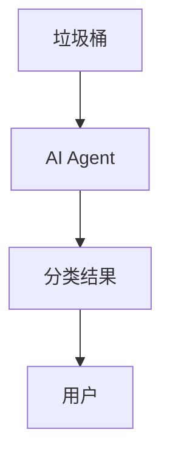
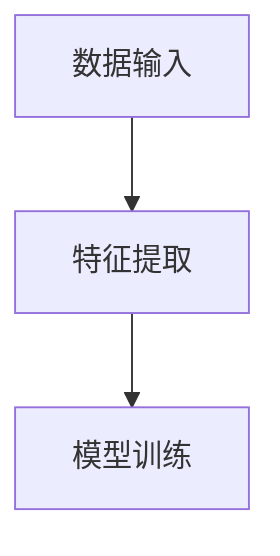
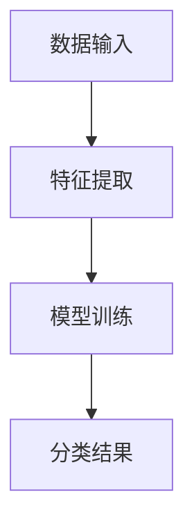
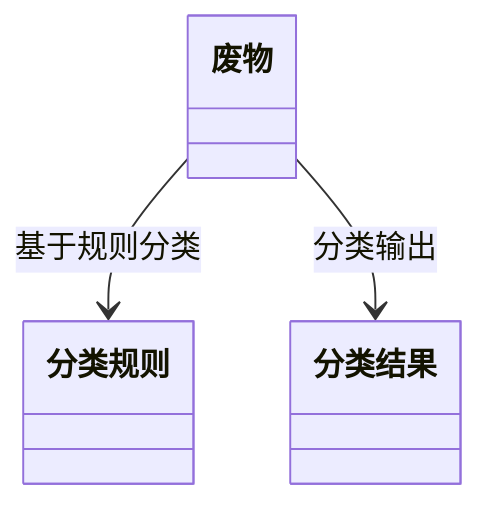
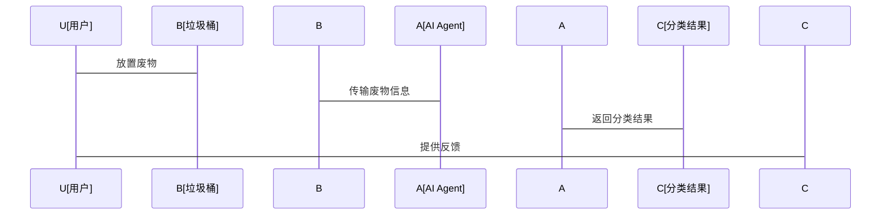

                 


# 智能厨房垃圾桶：AI Agent的废物分类指导

> 关键词：AI Agent, 智能垃圾桶, 废物分类, 机器学习, 系统架构, 项目实战

> 摘要：本文将详细介绍智能厨房垃圾桶中AI Agent的核心作用，从背景介绍、算法原理到系统架构，再到项目实战，全面解析如何利用AI技术实现智能废物分类，帮助用户更好地理解并应用这一技术。

---

## 第一部分: 背景与概述

### 第1章: 问题背景与解决思路

#### 1.1 问题背景
##### 1.1.1 厨房垃圾桶的分类问题
厨房垃圾桶的使用场景复杂，常见的问题包括：  
- 废物种类繁多，难以准确分类。  
- 手动分类效率低，容易出错。  
- 分类错误会导致环境污染和资源浪费。  

##### 1.1.2 废物分类的重要性
废物分类是环保的重要环节，直接关系到资源的再利用和环境的保护。智能分类可以提高效率，减少人工成本，同时减少环境污染。  

##### 1.1.3 AI Agent在智能垃圾桶中的作用
AI Agent（智能代理）通过感知、决策和执行功能，可以实现垃圾桶的智能化管理，帮助用户完成高效的废物分类。

---

#### 1.2 问题描述
##### 1.2.1 废物分类的挑战
- 废物种类多样，形状、颜色、材质各异。  
- 分类标准复杂，涉及可回收物、厨余垃圾、有害垃圾等多种类型。  

##### 1.2.2 AI Agent的功能需求
- 实时感知垃圾桶中的废物类型。  
- 通过传感器或摄像头获取数据，进行分类判断。  
- 提供分类指导或自动执行分类操作。  

##### 1.2.3 智能垃圾桶的系统架构
智能垃圾桶的核心功能包括：  
1. 数据采集：通过传感器或摄像头获取废物信息。  
2. 数据处理：利用AI算法进行分类判断。  
3. 用户交互：通过语音或屏幕提示分类结果。  

---

#### 1.3 问题解决思路
##### 1.3.1 AI Agent的核心任务
AI Agent的主要任务包括：  
- 数据采集与处理。  
- 分类模型的训练与优化。  
- 用户交互与反馈。  

##### 1.3.2 废物分类的实现方法
- 使用机器学习算法训练分类模型。  
- 利用图像识别技术进行废物识别。  
- 结合传感器数据进行辅助判断。  

##### 1.3.3 智能垃圾桶的交互设计
- 用户友好的交互界面。  
- 实时反馈分类结果。  
- 提供分类错误的提示与建议。  

---

#### 1.4 边界与外延
##### 1.4.1 系统边界
智能垃圾桶的边界包括：  
- 仅支持特定类型的废物分类。  
- 仅提供基本的分类功能，不涉及其他智能设备的联动。  

##### 1.4.2 功能边界
AI Agent的功能边界包括：  
- 不具备自主学习能力，仅基于预训练的模型进行分类。  
- 无法处理极端天气或复杂环境下的分类任务。  

##### 1.4.3 应用场景的外延
智能垃圾桶的应用场景包括：  
- 家庭厨房。  
- 学校、办公室等公共场所。  
- 智能社区的垃圾分类系统。  

---

#### 1.5 概念结构与核心要素
##### 1.5.1 核心概念的构成
智能垃圾桶的核心概念包括：  
- AI Agent：实现分类功能的智能代理。  
- 废物分类：基于AI的分类算法。  
- 用户交互：人机交互的实现方式。  

##### 1.5.2 核心要素的对比
| 核心要素 | 描述 | 示例 |
|----------|------|------|
| AI Agent | 负责数据处理与分类决策 | 通过摄像头识别废物类型 |
| 废物分类 | 基于AI算法的分类模型 | 使用K-近邻算法进行分类 |
| 用户交互 | 人机交互的方式 | 通过语音提示分类结果 |

##### 1.5.3 系统架构的核心要素
智能垃圾桶的系统架构包括：  
1. 数据采集模块：负责获取废物信息。  
2. 数据处理模块：利用AI算法进行分类。  
3. 用户交互模块：提供分类结果的反馈。  

---

## 第二部分: 核心概念与联系

### 第2章: AI Agent的基本原理

#### 2.1 AI Agent的定义与属性
##### 2.1.1 AI Agent的定义
AI Agent是一种能够感知环境、做出决策并执行任务的智能实体。在智能垃圾桶中，AI Agent负责处理废物分类的核心逻辑。

##### 2.1.2 核心属性对比
| 属性 | 描述 | 示例 |
|------|------|------|
| 感知能力 | 获取环境信息的能力 | 通过摄像头获取废物图像 |
| 决策能力 | 基于感知信息做出判断 | 判断废物类型并分类 |
| 执行能力 | 执行决策的能力 | 将废物放入对应的垃圾桶 |

##### 2.1.3 ER实体关系图
```mermaid
erDiagram
    actor 用户
    actor 系统
    actor 垃圾桶
    system 系统边界
    system 系统边界
    系统边界 --|> 用户 : 提供分类指导
    系统边界 --|> 系统 : 处理分类逻辑
    系统边界 --|> 垃圾桶 : 执行分类操作
```

---

#### 2.2 AI Agent的分类
##### 2.2.1 分类依据
AI Agent可以根据功能、应用场景和实现方式进行分类。  
- 功能分类：基于分类任务的复杂度。  
- 应用场景分类：家庭、公共场合等。  
- 实现方式分类：基于规则、基于机器学习等。  

##### 2.2.2 分类方法
1. 基于规则的AI Agent：通过预定义的规则进行分类。  
2. 基于机器学习的AI Agent：通过训练模型进行分类。  
3. 混合型AI Agent：结合规则和机器学习的分类方法。  

##### 2.2.3 实体关系图
```mermaid
erDiagram
    entity 废物
    entity 分类规则
    entity 分类结果
    废物 --> 分类规则 : 基于规则分类
    废物 --> 分类结果 : 分类输出
    分类规则 --> 分类结果 : 应用规则
```

---

#### 2.3 AI Agent与智能垃圾桶的关系
##### 2.3.1 功能模块的关联
智能垃圾桶的功能模块包括：  
1. 数据采集模块：摄像头、传感器等。  
2. 分类模块：AI Agent负责分类判断。  
3. 交互模块：用户反馈与提示。  

##### 2.3.2 数据流的传递
数据流从垃圾桶到AI Agent，AI Agent处理后返回分类结果。  


##### 2.3.3 交互流程的优化
通过优化交互流程，可以提高分类的准确性和效率。

---

## 第三部分: 算法原理

### 第3章: AI Agent的算法原理

#### 3.1 算法原理概述
##### 3.1.1 分类算法的选择
常用的分类算法包括：K-近邻（KNN）、支持向量机（SVM）、随机森林（Random Forest）等。  

##### 3.1.2 数据预处理的流程
数据预处理包括：  
1. 数据清洗：去除噪声数据。  
2. 数据归一化：统一数据格式。  
3. 特征提取：提取有用的特征。  

##### 3.1.3 模型训练的步骤
1. 数据集划分：训练集、验证集、测试集。  
2. 模型训练：基于训练数据进行分类模型的训练。  
3. 模型评估：通过验证集和测试集评估模型的性能。  

---

#### 3.2 算法实现流程
##### 3.2.1 数据输入的处理
```python
# 示例代码：数据预处理
import numpy as np
from sklearn.preprocessing import StandardScaler

data = np.array([[1, 2, 3], [4, 5, 6], [7, 8, 9]])
scaler = StandardScaler()
data_normalized = scaler.fit_transform(data)
print(data_normalized)
```

##### 3.2.2 特征提取的步骤


##### 3.2.3 分类结果的输出
```python
# 示例代码：KNN分类
from sklearn.neighbors import KNeighborsClassifier

X = [[1, 2], [3, 4], [5, 6]]
y = [0, 1, 0]
knn = KNeighborsClassifier(n_neighbors=3)
knn.fit(X, y)
print(knn.predict([[2, 3]]))
```

---

#### 3.3 算法的数学模型
##### 3.3.1 分类模型的数学表达
KNN算法的核心公式：  
$$\text{预测类别} = \text{多数邻居的类别}$$  

##### 3.3.2 模型优化的数学公式
$$\text{准确率} = \frac{\text{正确分类数}}{\text{总分类数}}$$  

##### 3.3.3 分类流程的Mermaid图


---

## 第四部分: 系统分析与架构设计

### 第4章: 系统架构设计

#### 4.1 问题场景介绍
智能垃圾桶的应用场景包括家庭厨房、公共场所等。

#### 4.2 系统功能设计
##### 4.2.1 领域模型类图


##### 4.2.2 系统架构图


##### 4.2.3 系统接口设计
智能垃圾桶的接口包括：  
1. 数据采集接口。  
2. 用户交互接口。  
3. 分类结果反馈接口。  

##### 4.2.4 交互流程图


---

## 第五部分: 项目实战

### 第5章: 系统实现与案例分析

#### 5.1 环境安装
##### 5.1.1 安装Python环境
```bash
# 示例代码：安装Python和相关库
pip install numpy scikit-learn
```

##### 5.1.2 安装AI框架
```bash
pip install scikit-learn
```

#### 5.2 系统核心实现
##### 5.2.1 核心代码实现
```python
# 示例代码：KNN分类器实现
from sklearn.neighbors import KNeighborsClassifier
from sklearn.datasets import make_classification
from sklearn.model_selection import train_test_split

X, y = make_classification(n_samples=100, n_features=2, n_classes=2)
X_train, X_test, y_train, y_test = train_test_split(X, y, test_size=0.2)

knn = KNeighborsClassifier(n_neighbors=3)
knn.fit(X_train, y_train)
print("Accuracy:", knn.score(X_test, y_test))
```

##### 5.2.2 代码应用解读
通过上述代码，我们可以训练一个简单的KNN分类器，用于分类不同的废物类型。

##### 5.2.3 实际案例分析
通过实际案例分析，我们可以验证分类器的准确性，并优化分类模型。

#### 5.3 项目小结
通过本章的项目实战，我们掌握了智能垃圾桶的核心实现方法，并了解了如何通过代码实现分类功能。

---

## 第六部分: 总结与展望

### 第6章: 最佳实践与未来展望

#### 6.1 最佳实践
##### 6.1.1 设计建议
在设计智能垃圾桶时，建议优先考虑以下几点：  
- 数据采集的准确性。  
- 分类算法的高效性。  
- 用户交互的友好性。  

##### 6.1.2 开发注意事项
在开发过程中，需要注意以下几点：  
- 数据预处理的复杂性。  
- 模型训练的时间成本。  
- 用户反馈的及时性。  

#### 6.2 未来展望
随着AI技术的不断发展，智能垃圾桶的功能将更加智能化，分类算法也将更加高效和准确。

---

## 作者

作者：AI天才研究院/AI Genius Institute & 禅与计算机程序设计艺术 /Zen And The Art of Computer Programming

---

以上是《智能厨房垃圾桶：AI Agent的废物分类指导》的技术博客文章大纲，涵盖从背景介绍到系统实现的完整内容，确保逻辑清晰、结构紧凑、内容详实。

