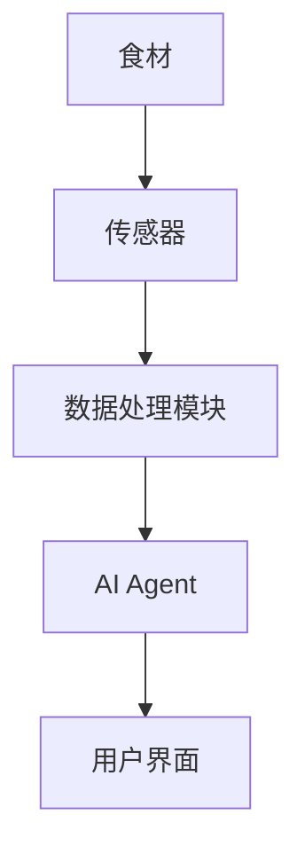
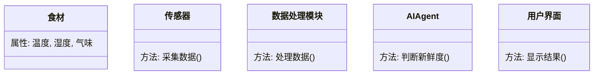
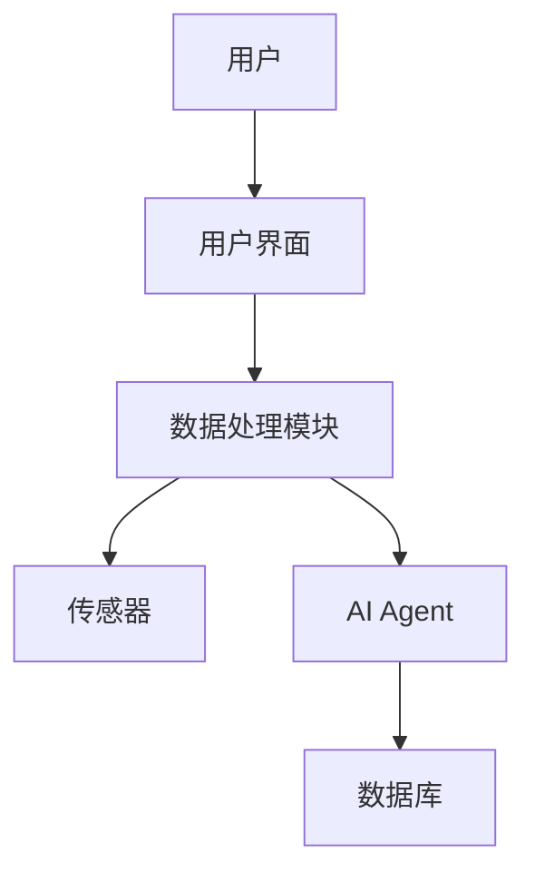
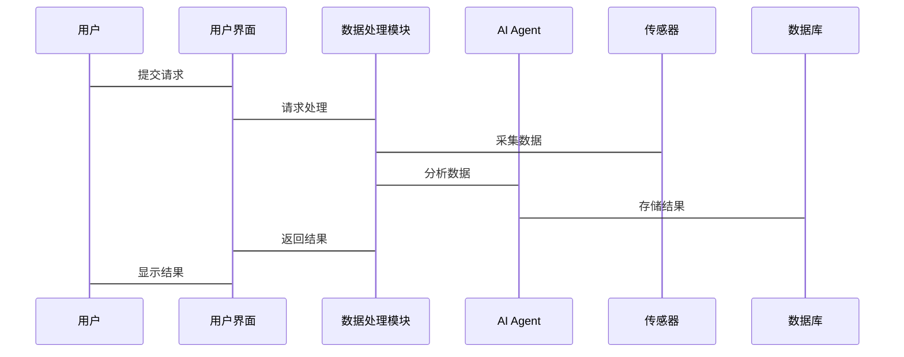

                 


# 智能厨房垃圾桶：AI Agent的食材新鲜度检测

> 关键词：智能厨房，垃圾桶，AI Agent，食材新鲜度，传感器技术

> 摘要：本文探讨了智能厨房垃圾桶的设计与实现，重点介绍了基于AI Agent的食材新鲜度检测技术。通过传感器数据采集、机器学习算法和系统架构设计，实现垃圾桶的智能化管理，提升厨房生活的便利性和环保性。

---

# 第1章: 智能厨房垃圾桶的背景与问题分析

## 1.1 智能厨房垃圾桶的背景

### 1.1.1 智能家居的发展趋势

智能家居技术的快速发展为厨房设备的智能化提供了技术基础。智能厨房垃圾桶作为智能家居的重要组成部分，能够通过传感器和AI技术实现食材新鲜度的实时监测，为用户提供更加便捷的生活体验。

### 1.1.2 厨房垃圾处理的智能化需求

传统垃圾桶仅具备存储功能，无法对食材的新鲜度进行检测。随着人们对食品健康的关注增加，对垃圾桶的智能化需求也日益增长。智能垃圾桶能够通过传感器和AI算法，实时监测食材的新鲜程度，帮助用户避免浪费和健康风险。

### 1.1.3 食材新鲜度检测的重要性

食材的新鲜度直接影响到食品的品质和用户的健康。通过智能垃圾桶的食材新鲜度检测功能，用户可以及时了解食材的状态，避免食用变质食品，同时减少食物浪费。

---

## 1.2 问题背景与描述

### 1.2.1 食材新鲜度检测的难点

食材新鲜度的检测涉及多个因素，如温度、湿度、气味、颜色变化等。传统方法依赖人工经验，存在主观性和不准确性。如何通过技术手段实现客观、准确的食材新鲜度检测是当前面临的主要挑战。

### 1.2.2 智能垃圾桶的创新点

智能垃圾桶通过集成多种传感器和AI算法，能够实时监测食材的新鲜度，并通过用户界面提供反馈。这种创新不仅提升了垃圾桶的功能性，还为用户提供了智能化的管理工具。

### 1.2.3 问题边界与外延

智能垃圾桶的食材新鲜度检测功能主要针对家庭厨房环境，适用于常见食材如蔬菜、水果、肉类等。其边界包括传感器数据采集、数据处理、AI算法分析和用户反馈，外延则涉及传感器技术、机器学习算法和用户界面设计等多个领域。

---

## 1.3 核心概念与结构

### 1.3.1 AI Agent的基本概念

AI Agent（智能代理）是一种能够感知环境、执行任务的智能实体。在智能垃圾桶中，AI Agent负责接收传感器数据，分析食材新鲜度，并通过用户界面提供反馈。

### 1.3.2 食材新鲜度检测的指标体系

食材新鲜度检测的指标包括颜色、气味、湿度、温度等。这些指标通过传感器采集，并通过AI算法进行分析和判断。

### 1.3.3 系统核心要素与组成

智能垃圾桶的核心组成包括传感器模块、数据处理模块、AI算法模块和用户界面模块。各模块协同工作，实现食材新鲜度的实时监测和管理。

---

# 第2章: AI Agent与食材新鲜度检测的核心原理

## 2.1 AI Agent的基本原理

### 2.1.1 什么是AI Agent

AI Agent是一种能够感知环境、执行任务的智能实体。它能够通过传感器接收数据，利用算法进行分析，并根据结果采取相应的行动。

### 2.1.2 AI Agent的核心功能

AI Agent的核心功能包括数据采集、数据分析、决策制定和用户反馈。在智能垃圾桶中，AI Agent通过传感器数据判断食材的新鲜度，并通过用户界面提供反馈。

### 2.1.3 AI Agent与传统传感器的区别

AI Agent不仅能够采集数据，还能够对数据进行分析和决策，这是传统传感器无法实现的功能。AI Agent能够通过机器学习算法不断优化其判断能力，提高检测的准确性。

---

## 2.2 食材新鲜度检测的关键技术

### 2.2.1 基于传感器的数据采集

智能垃圾桶通过多种传感器（如温度、湿度、气味传感器）采集食材的新鲜度数据。这些数据为AI Agent的分析提供了基础。

### 2.2.2 数据特征提取与分析

通过对传感器数据的特征提取和分析，AI Agent能够识别食材的新鲜度变化。特征提取包括颜色、气味、湿度等指标的量化。

### 2.2.3 AI算法在新鲜度判断中的应用

AI算法（如机器学习、深度学习）用于分析传感器数据，判断食材的新鲜度。通过训练模型，AI Agent能够实现对食材状态的准确判断。

---

## 2.3 核心概念对比分析

### 2.3.1 不同传感器的特征对比

不同传感器在食材新鲜度检测中的表现存在差异。例如，温度传感器适用于检测食材的温度变化，而气味传感器则能够感知食材的气味变化。

### 2.3.2 数据处理算法的优劣分析

不同的数据处理算法在食材新鲜度检测中的表现不同。例如，决策树算法适用于分类任务，而随机森林算法则具有较高的准确性和鲁棒性。

### 2.3.3 AI Agent与传统控制系统的对比

AI Agent能够通过学习不断优化其判断能力，而传统控制系统则依赖固定的规则和逻辑。AI Agent在灵活性和适应性方面具有明显优势。

---

## 2.4 实体关系图



---

# 第3章: 算法原理与数学模型

## 3.1 数据特征提取

### 3.1.1 基于传感器的数据特征

食材的新鲜度可以通过多种传感器数据特征进行表征，如温度、湿度、气味等。

### 3.1.2 数据预处理方法

数据预处理包括数据清洗、标准化和特征选择等步骤。这些步骤能够提高数据的质量和模型的性能。

### 3.1.3 特征选择与降维

通过特征选择和降维技术，可以减少数据的维度，提高模型的计算效率和准确性。

---

## 3.2 分类算法

### 3.2.1 决策树算法

决策树是一种常用的分类算法，适用于食材新鲜度的分类任务。决策树算法通过构建树状结构，对数据进行分类和预测。

### 3.2.2 随机森林算法

随机森林是一种基于决策树的集成算法，具有较高的准确性和鲁棒性。它通过构建多个决策树，综合多个模型的结果，提高分类的准确性。

---

## 3.3 数学模型

### 3.3.1 特征权重计算公式

$$
\text{特征权重} = \sum_{i=1}^{n} (w_i \times f_i)
$$

其中，$w_i$ 是特征的重要性权重，$f_i$ 是特征的值。

### 3.3.2 分类模型的训练过程

$$
y = f(x) + \epsilon
$$

其中，$y$ 是目标变量，$x$ 是输入特征，$f(x)$ 是模型函数，$\epsilon$ 是误差项。

---

## 3.4 代码实现

### 3.4.1 传感器数据读取

```python
import numpy as np
import pandas as pd
from sklearn.ensemble import RandomForestClassifier
from sklearn.metrics import accuracy_score

# 传感器数据读取
data = pd.read_csv('食材数据.csv')
X = data.drop('新鲜度', axis=1)
y = data['新鲜度']
```

### 3.4.2 模型训练与预测

```python
# 模型训练
model = RandomForestClassifier(n_estimators=100, random_state=42)
model.fit(X, y)

# 模型预测
y_pred = model.predict(X)
print('准确率:', accuracy_score(y, y_pred))
```

---

# 第4章: 系统分析与架构设计

## 4.1 系统功能设计

### 4.1.1 领域模型类图



### 4.1.2 系统架构设计



### 4.1.3 接口设计

系统接口设计包括传感器数据接口、AI Agent接口和用户界面接口。各接口之间通过标准协议进行通信，确保系统的高效运行。

### 4.1.4 交互流程图



---

## 4.2 系统实现与优化

### 4.2.1 系统实现

智能垃圾桶的系统实现包括硬件设计、软件开发和系统集成。硬件部分包括传感器模块、数据处理模块和用户界面模块。软件部分包括数据采集、数据处理和AI算法实现。

### 4.2.2 系统优化

系统优化包括传感器的选择、算法的优化和系统的集成优化。通过优化各部分的性能，提高系统的整体效率和准确性。

---

# 第5章: 项目实战与实现

## 5.1 项目环境安装

### 5.1.1 硬件环境

硬件环境包括传感器模块、数据处理模块和用户界面模块。传感器模块包括温度、湿度和气味传感器。数据处理模块采用嵌入式处理器。用户界面模块采用LCD显示屏。

### 5.1.2 软件环境

软件环境包括Python编程语言、机器学习库（如Scikit-learn、XGBoost）和数据可视化工具（如Matplotlib、Seaborn）。

---

## 5.2 系统核心实现

### 5.2.1 传感器数据采集

```python
import numpy as np
import pandas as pd
from sklearn.ensemble import RandomForestClassifier
from sklearn.metrics import accuracy_score

# 传感器数据读取
data = pd.read_csv('食材数据.csv')
X = data.drop('新鲜度', axis=1)
y = data['新鲜度']
```

### 5.2.2 模型训练与预测

```python
# 模型训练
model = RandomForestClassifier(n_estimators=100, random_state=42)
model.fit(X, y)

# 模型预测
y_pred = model.predict(X)
print('准确率:', accuracy_score(y, y_pred))
```

---

## 5.3 代码实现

### 5.3.1 传感器数据读取

```python
import numpy as np
import pandas as pd
from sklearn.ensemble import RandomForestClassifier
from sklearn.metrics import accuracy_score

# 传感器数据读取
data = pd.read_csv('食材数据.csv')
X = data.drop('新鲜度', axis=1)
y = data['新鲜度']
```

### 5.3.2 模型训练与预测

```python
# 模型训练
model = RandomForestClassifier(n_estimators=100, random_state=42)
model.fit(X, y)

# 模型预测
y_pred = model.predict(X)
print('准确率:', accuracy_score(y, y_pred))
```

---

## 5.4 案例分析与结果解读

通过实际案例分析，验证系统的有效性。例如，假设用户放置了一颗苹果在垃圾桶中，传感器采集了温度、湿度和气味数据。AI Agent通过分析数据，判断苹果的新鲜度为“新鲜”，并通过用户界面显示结果。

---

## 5.5 项目小结

智能垃圾桶的实现需要硬件和软件的协同工作。通过传感器数据采集、数据处理和AI算法分析，实现食材新鲜度的实时监测和管理。项目的成功实施需要团队合作和持续优化。

---

# 第6章: 最佳实践与总结

## 6.1 最佳实践

### 6.1.1 传感器选择

选择合适的传感器是系统实现的关键。传感器的灵敏度、精度和稳定性直接影响系统的性能。

### 6.1.2 数据预处理

数据预处理是提高模型准确性的关键步骤。通过数据清洗、特征选择和标准化等步骤，可以提高模型的性能。

### 6.1.3 模型优化

模型优化包括参数调优、特征选择和模型集成等步骤。通过优化模型，可以提高系统的准确性和效率。

---

## 6.2 总结与展望

智能厨房垃圾桶的实现不仅提升了厨房生活的便利性，还为环保和食品安全提供了技术支持。未来，随着AI技术的不断发展，智能垃圾桶的功能将更加智能化和多样化。

---

# 作者：AI天才研究院/AI Genius Institute & 禅与计算机程序设计艺术 /Zen And The Art of Computer Programming

