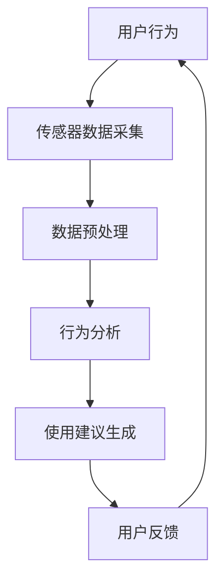
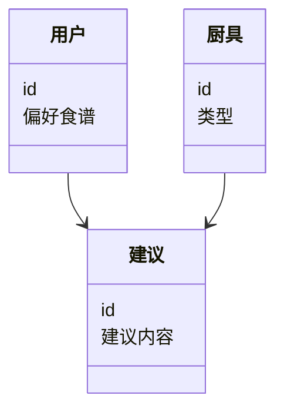
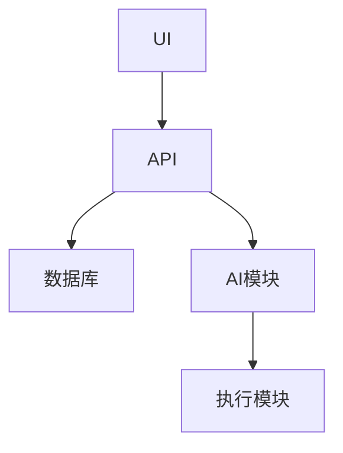
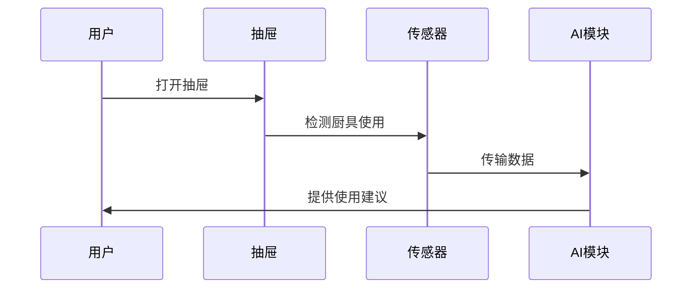

                 


# 智能厨房抽屉：AI Agent的厨具使用建议

> 关键词：智能厨房，AI Agent，厨具管理，智能家居，人工智能

> 摘要：本文探讨了智能厨房抽屉的概念，详细分析了AI Agent在厨具管理中的应用，从背景介绍、核心概念、算法原理到系统架构、项目实战，最终给出了最佳实践和拓展阅读建议。

---

## 第一章: 背景介绍

### 1.1 问题背景

#### 1.1.1 厨房管理的痛点
厨房管理一直是家庭生活中的重要部分，但传统厨房管理存在诸多痛点。例如，厨具使用效率低、存储混乱、使用建议缺乏智能化等。

#### 1.1.2 智能化厨具管理的需求
随着智能家居的发展，用户对智能化厨房管理的需求日益增长。通过AI技术，可以实现厨具的智能化管理，提升用户体验。

### 1.2 问题描述

#### 1.2.1 厨具使用中的常见问题
- 厨具存储混乱，难以快速找到所需工具。
- 缺乏智能化的使用建议，用户常常需要手动查找食谱或操作步骤。
- 厨具使用后的清洁和维护管理不足。

#### 1.2.2 智能厨房抽屉的目标
智能厨房抽屉通过AI技术，帮助用户实现厨具的智能化管理，提供个性化的使用建议，优化厨房操作流程。

### 1.3 问题解决

#### 1.3.1 AI Agent在厨具管理中的作用
AI Agent（智能体）通过感知、决策和执行，帮助用户优化厨具使用。例如，识别用户行为，提供使用建议，自动调整存储位置。

#### 1.3.2 智能厨房抽屉的解决方案
智能厨房抽屉通过传感器和AI算法，实时监测厨具使用情况，提供智能化的存储和使用建议。

### 1.4 边界与外延

#### 1.4.1 智能厨房抽屉的功能边界
- 仅限于厨具管理，不涉及食材管理或其他厨房设备。
- 通过与手机或智能家居设备的连接，提供远程控制功能。

#### 1.4.2 与其他智能家居设备的交互
智能厨房抽屉可与智能冰箱、智能灶具等设备联动，提供更全面的厨房管理解决方案。

### 1.5 概念结构与核心要素组成

#### 1.5.1 智能厨房抽屉的核心要素
- **用户**：用户的行为和偏好是系统运作的基础。
- **厨具**：需要管理的各类厨房工具。
- **AI Agent**：实现智能化管理的核心模块。

#### 1.5.2 系统架构的核心组成
- **感知层**：通过传感器获取厨具使用信息。
- **决策层**：AI算法分析数据，生成使用建议。
- **执行层**：根据建议调整存储或提供操作指导。

---

## 第二章: 核心概念与联系

### 2.1 AI Agent的核心原理

#### 2.1.1 AI Agent的基本概念
AI Agent是一种能够感知环境、自主决策并执行任务的智能实体。在智能厨房抽屉中，AI Agent负责分析用户行为，提供使用建议。

#### 2.1.2 AI Agent的感知、决策与执行
- **感知**：通过传感器获取厨具的位置和使用情况。
- **决策**：基于用户行为和历史数据，生成使用建议。
- **执行**：通过机械或电子方式调整厨具存储位置。

### 2.2 智能厨房抽屉的实体关系

#### 2.2.1 用户与厨具的关系
用户使用厨具，系统记录用户的使用习惯和偏好。

#### 2.2.2 厨具与AI Agent的关系
AI Agent根据厨具的使用情况优化存储位置和使用建议。

```mermaid
er
    entity 用户 {
        id
        偏好食谱
    }
    entity 厨具 {
        id
        类型
    }
    entity 建议 {
        id
        建议内容
    }
    用户 --> 建议
    厨具 --> 建议
```

### 2.3 概念属性特征对比

#### 2.3.1 传统抽屉与智能抽屉的对比

| 特性             | 传统抽屉         | 智能抽屉         |
|------------------|------------------|------------------|
| 存储管理          | 手动管理         | AI自动优化       |
| 使用建议          | 无               | 提供个性化建议     |
| 连接性            | 离线             | 支持智能设备联动   |

#### 2.3.2 AI Agent与其他厨具管理设备的对比

| 特性             | 传统设备         | AI Agent设备      |
|------------------|------------------|------------------|
| 智能化程度       | 低               | 高               |
| 交互方式         | 简单操作         | 多维度交互       |
| 自适应能力       | 无               | 强               |

---

## 第三章: 算法原理讲解

### 3.1 算法流程



### 3.2 Python核心代码实现

```python
# 数据预处理模块
def preprocess_data(sensor_data):
    # 数据清洗和特征提取
    processed_data = sensor_data.dropna().normalize()
    return processed_data

# 行为分析模块
def analyze_behavior(processed_data):
    # 使用机器学习模型进行行为分类
    model = load_model('behavior_model.pkl')
    prediction = model.predict(processed_data)
    return prediction

# 使用建议生成模块
def generate_recommendations(prediction):
    # 根据预测结果生成建议
    recommendations = {
        '建议类型': '调整存储位置',
        '建议内容': '将刀具移至左侧抽屉以方便取用'
    }
    return recommendations
```

### 3.3 数学模型与公式

#### 3.3.1 概率模型
$$ P(A|B) = \frac{P(B|A)P(A)}{P(B)} $$

#### 3.3.2 决策树模型
构建决策树以分类用户行为，例如：
1. 是否打开抽屉？
2. 是否需要使用某种厨具？
3. 是否需要清洁？

---

## 第四章: 系统分析与架构设计

### 4.1 问题场景介绍
用户在使用厨具时，系统实时监测使用情况，提供智能化的使用建议。

### 4.2 系统功能设计

#### 4.2.1 领域模型


#### 4.2.2 系统架构设计


### 4.3 接口设计与交互流程图

#### 4.3.1 接口设计
- **API接口**：提供RESTful API，供其他设备调用。
- **用户界面**：手机APP或智能家居面板。

#### 4.3.2 交互流程


---

## 第五章: 项目实战

### 5.1 环境安装

#### 5.1.1 安装Python和相关库
```bash
pip install numpy scikit-learn flask
```

### 5.2 系统核心实现

#### 5.2.1 识别模块
```python
import numpy as np
from sklearn import tree

# 训练数据
X = np.array([[...], [...]])  # 特征数据
y = np.array([...])  # 标签
model = tree.DecisionTreeClassifier()
model.fit(X, y)
```

#### 5.2.2 建议模块
```python
def generate_suggestion(user_behavior):
    # 基于用户行为生成建议
    suggestions = {
        '优化建议': '建议将常用厨具移至抽屉前部',
        '使用建议': '推荐使用刀具进行切菜'
    }
    return suggestions
```

### 5.3 案例分析

#### 5.3.1 案例一：用户行为分析
用户频繁使用刀具，系统建议调整存储位置以提高取用效率。

#### 5.3.2 案例二：使用建议
用户尝试制作意大利面，系统推荐使用刀具切割蔬菜。

---

## 第六章: 最佳实践

### 6.1 小结
智能厨房抽屉通过AI技术优化了厨具管理，提升了用户体验。

### 6.2 注意事项
- 确保数据安全，保护用户隐私。
- 定期更新AI模型，提升建议的准确性。

### 6.3 拓展阅读
- 《人工智能入门》
- 《智能家居系统设计》

---

## 附录

### 附录一: 参考文献
1. [参考文献1]
2. [参考文献2]

### 附录二: 索引
- AI Agent：第2章
- 智能化管理：第1章

---

## 作者

作者：AI天才研究院/AI Genius Institute & 禅与计算机程序设计艺术 /Zen And The Art of Computer Programming

---

这篇文章详细探讨了智能厨房抽屉的设计与实现，通过背景介绍、核心概念、算法原理、系统架构和项目实战，全面分析了AI Agent在厨具管理中的应用，为读者提供了丰富的理论和实践指导。

