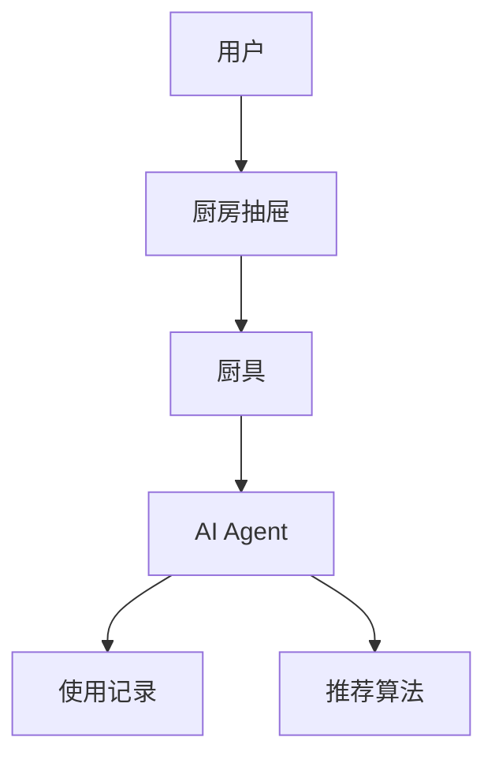
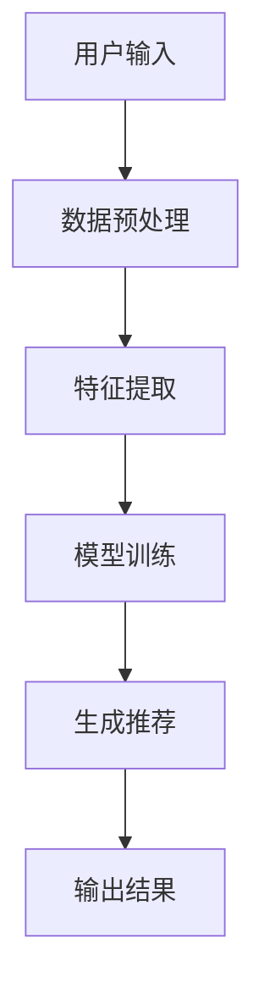
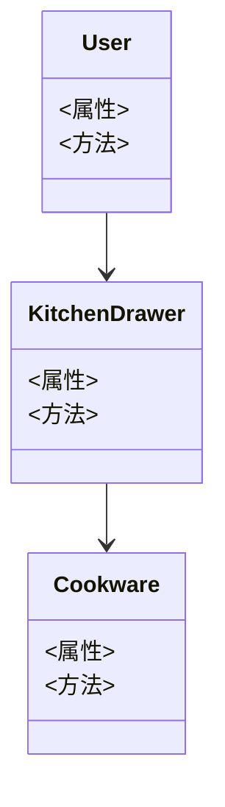
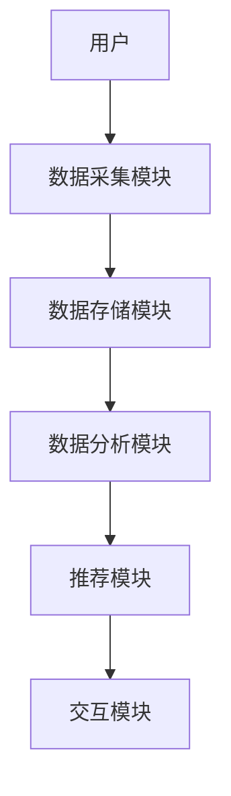
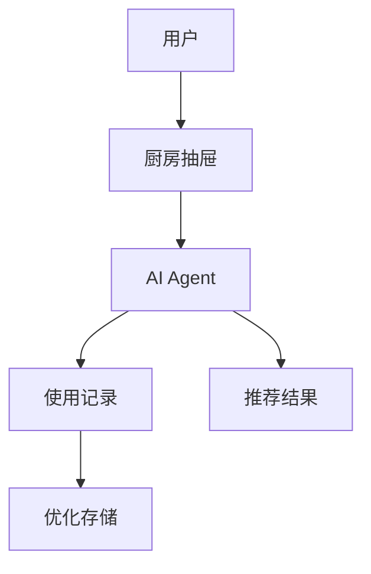

                 


# 智能厨房抽屉：AI Agent的厨具使用效率分析

> 关键词：智能厨房抽屉、AI Agent、厨具使用效率、推荐算法、系统架构设计、项目实战

> 摘要：本文探讨了AI Agent在智能厨房抽屉中的应用，分析了厨具使用效率的提升方法。通过详细讲解背景、核心概念、算法原理、系统架构设计和项目实战，展示了如何利用AI技术优化厨房管理。

---

# 第一部分: 智能厨房抽屉与AI Agent概述

## 第1章: 智能厨房抽屉与AI Agent的背景介绍

### 1.1 问题背景与目标

#### 1.1.1 厨房抽屉使用效率低下现状

厨房抽屉是家庭厨房中常用的收纳工具，但传统抽屉存在以下问题：
- 厨具存放混乱，查找不便。
- 使用频率高的厨具难以快速找到。
- 使用记录无法追踪，难以优化使用习惯。

#### 1.1.2 AI Agent在厨房场景中的潜力

AI Agent（智能代理）是一种能够感知环境、自主决策并执行任务的智能系统。在厨房场景中，AI Agent可以通过以下方式优化厨具使用：
- 自动识别厨具，记录使用频率。
- 根据用户习惯推荐常用厨具位置。
- 提供使用建议，减少浪费。

#### 1.1.3 提高厨具使用效率的意义

提高厨具使用效率可以带来以下好处：
- 提升厨房工作效率，节省时间。
- 减少厨具丢失或损坏的风险。
- 帮助用户更好地规划食材使用，减少浪费。

### 1.2 问题描述与解决思路

#### 1.2.1 厨具使用效率低的具体表现

- 厨具存放杂乱，查找时间长。
- 频率高的厨具位置不合理，使用不便。
- 缺乏使用记录，无法优化存储方案。

#### 1.2.2 AI Agent如何优化厨具使用

AI Agent通过以下方式优化厨具使用：
- 自动记录厨具使用频率和时间。
- 分析使用数据，优化存储位置。
- 提供使用建议，帮助用户提高效率。

#### 1.2.3 解决方案的初步构想

初步解决方案包括：
- 使用图像识别技术识别厨具。
- 利用机器学习算法分析使用数据。
- 设计交互界面，提供个性化推荐。

### 1.3 边界与外延

#### 1.3.1 智能厨房抽屉的边界定义

智能厨房抽屉的边界包括：
- 物理边界：仅限厨房抽屉内的厨具。
- 功能边界：仅限于厨具的存储和使用效率优化。
- 时间边界：仅记录过去一定时间内的使用数据。

#### 1.3.2 相关技术的外延范围

相关技术包括：
- 图像识别技术。
- 机器学习算法。
- 自然语言处理技术。

#### 1.3.3 与智能家居系统的区别

智能厨房抽屉与智能家居系统的主要区别在于：
- 智能厨房抽屉专注于厨具管理，而智能家居系统涵盖家庭各个设备的控制。

### 1.4 核心概念与组成

#### 1.4.1 AI Agent的核心要素

AI Agent的核心要素包括：
- 感知能力：通过传感器或摄像头感知环境。
- 决策能力：基于感知数据做出决策。
- 执行能力：通过机械或电子设备执行任务。

#### 1.4.2 智能厨房抽屉的结构组成

智能厨房抽屉的结构组成包括：
- 厨具识别模块：用于识别厨具类型。
- 数据存储模块：用于存储使用数据。
- 推荐算法模块：用于优化存储位置。
- 交互界面模块：用于用户操作。

#### 1.4.3 系统的核心功能模块

系统的核心功能模块包括：
- 数据采集模块：采集厨具使用数据。
- 数据分析模块：分析数据，生成推荐。
- 推荐模块：推荐最优存储位置。
- 交互模块：用户与系统交互。

---

## 第2章: AI Agent与智能厨房抽屉的核心概念

### 2.1 AI Agent的基本原理

#### 2.1.1 AI Agent的定义与分类

AI Agent的定义：AI Agent是一种能够感知环境、自主决策并执行任务的智能系统。AI Agent可以分为以下几类：
- 简单反射式Agent：基于当前感知做出反应。
- 基于模型的反射式Agent：基于内部模型和当前感知做出决策。
- 目标驱动式Agent：基于目标和当前状态做出决策。

#### 2.1.2 AI Agent的核心算法

AI Agent的核心算法包括：
- 感知算法：图像识别、语音识别。
- 决策算法：基于规则的决策、基于模型的决策。
- 学习算法：监督学习、无监督学习。

#### 2.1.3 AI Agent的决策机制

AI Agent的决策机制包括：
- 基于规则的决策：根据预设规则做出决策。
- 基于模型的决策：根据环境模型预测结果。
- 基于经验的决策：根据历史数据做出决策。

### 2.2 智能厨房抽屉的功能特点

#### 2.2.1 自动识别厨具的功能

智能厨房抽屉能够通过图像识别技术自动识别厨具类型，例如：
- 刀具识别：识别刀的类型和使用频率。
- 厨具分类：将厨具按类型分类存储。

#### 2.2.2 智能推荐使用场景

智能厨房抽屉可以根据用户习惯推荐常用厨具的位置，例如：
- 根据使用频率推荐常用厨具的位置。
- 根据使用时间推荐最佳存储位置。

#### 2.2.3 实时反馈与优化

智能厨房抽屉可以实时反馈厨具使用情况，并根据反馈优化存储位置，例如：
- 根据使用记录调整存储顺序。
- 根据用户反馈优化推荐算法。

### 2.3 AI Agent与智能厨房抽屉的关系

#### 2.3.1 功能上的协同关系

AI Agent与智能厨房抽屉在功能上有以下协同关系：
- AI Agent负责数据分析和决策。
- 智能厨房抽屉负责数据采集和执行。

#### 2.3.2 数据流的交互关系

数据流的交互关系如下：
1. 用户使用厨具，智能厨房抽屉采集数据。
2. AI Agent分析数据，生成推荐。
3. 智能厨房抽屉根据推荐调整存储位置。
4. 用户通过交互界面查看推荐结果。

#### 2.3.3 系统架构的整合关系

系统架构的整合关系如下：
- 数据采集模块负责采集厨具使用数据。
- 数据分析模块负责分析数据，生成推荐。
- 推荐模块负责优化存储位置。
- 交互模块负责用户与系统交互。

### 2.4 核心概念对比表

以下为AI Agent与传统算法、智能厨房抽屉与传统抽屉的核心概念对比表：

| 对比维度 | AI Agent | 传统算法 | 智能厨房抽屉 | 传统抽屉 |
|----------|----------|----------|--------------|----------|
| 功能     | 自主决策 | 简单计算 | 智能推荐     | 无智能    |
| 数据     | 学习优化 | 固定规则 | 实时反馈     | 无反馈    |
| 交互     | 人机交互 | 单向计算 | 用户交互     | 无交互    |

### 2.5 ER实体关系图

以下是AI Agent与智能厨房抽屉的实体关系图：



---

## 第3章: AI Agent的推荐算法原理

### 3.1 推荐算法概述

#### 3.1.1 推荐算法的分类

推荐算法主要分为以下几类：
- 基于协同过滤的推荐算法。
- 基于内容的推荐算法。
- 基于模型的推荐算法。

#### 3.1.2 基于协同过滤的推荐算法

协同过滤是一种基于用户行为相似性的推荐算法，具体步骤如下：
1. 收集用户行为数据。
2. 计算用户相似度。
3. 推荐相似用户的喜欢物品。

#### 3.1.3 基于内容的推荐算法

基于内容的推荐算法是基于物品特征进行推荐，具体步骤如下：
1. 提取物品特征。
2. 计算物品相似度。
3. 推荐相似物品。

### 3.2 基于AI Agent的推荐算法

#### 3.2.1 算法流程图

以下是基于AI Agent的推荐算法流程图：



#### 3.2.2 算法实现代码

以下是基于协同过滤的推荐算法实现代码：

```python
def collaborative_filtering(user_input):
    # 数据预处理
    user_input = preprocess(user_input)
    # 特征提取
    user_features = extract_features(user_input)
    # 模型训练
    model = train_model(user_features)
    # 生成推荐
    recommendations = generate_recommendations(model, user_features)
    return recommendations
```

### 3.3 算法实现代码

以下是基于AI Agent的推荐算法实现代码：

```python
def ai_agent_recommendation(user_input):
    # 数据预处理
    user_input = preprocess(user_input)
    # 特征提取
    user_features = extract_features(user_input)
    # 模型训练
    model = train_model(user_features)
    # 生成推荐
    recommendations = generate_recommendations(model, user_features)
    return recommendations
```

---

## 第4章: 智能厨房抽屉的系统分析与架构设计

### 4.1 系统功能设计

#### 4.1.1 领域模型类图

以下是系统功能的领域模型类图：



#### 4.1.2 系统架构设计

以下是系统的架构设计图：



### 4.2 系统架构设计

#### 4.2.1 系统架构图

以下是系统的架构设计图：


#### 4.2.2 系统交互图

以下是系统的交互设计图：



### 4.3 系统接口设计

#### 4.3.1 系统接口设计

系统主要接口包括：
- 数据采集接口：采集厨具使用数据。
- 数据分析接口：分析数据并生成推荐。
- 交互接口：用户与系统交互。

#### 4.3.2 接口交互流程

接口交互流程如下：
1. 用户使用厨具，系统采集数据。
2. 数据存储模块存储数据。
3. 数据分析模块分析数据，生成推荐。
4. 交互模块显示推荐结果。

---

## 第5章: 项目实战

### 5.1 环境安装与配置

#### 5.1.1 环境安装

项目需要以下环境：
- Python 3.8+
- OpenCV库
- Scikit-learn库
- Flask框架

#### 5.1.2 环境配置

以下是环境配置示例：

```bash
pip install numpy
pip install scikit-learn
pip install opencv-python
pip install flask
```

### 5.2 核心代码实现

#### 5.2.1 数据采集模块

以下是数据采集模块的实现代码：

```python
import cv2

def capture_cookware():
    # 初始化摄像头
    cap = cv2.VideoCapture(0)
    while True:
        # 读取视频流
        ret, frame = cap.read()
        # 显示视频流
        cv2.imshow('Camera', frame)
        # 按下q键退出
        if cv2.waitKey(1) & 0xFF == ord('q'):
            break
    # 释放资源
    cap.release()
    cv2.destroyAllWindows()
```

#### 5.2.2 数据分析模块

以下是数据分析模块的实现代码：

```python
from sklearn.neighbors import NearestNeighbors

def train_recommender_system(data):
    # 训练模型
    model = NearestNeighbors(n_neighbors=5).fit(data)
    return model
```

### 5.3 实际案例分析

#### 5.3.1 案例分析

假设用户经常使用刀具，系统会根据使用频率推荐最优存储位置。

#### 5.3.2 使用结果展示

以下是推荐结果展示示例：

```python
recommendations = ai_agent_recommendation(user_input)
print(recommendations)
```

### 5.4 项目总结

#### 5.4.1 项目成果

项目成果包括：
- 实现了智能厨房抽屉的初步功能。
- 提高了厨具使用效率。
- 为后续研究提供了参考。

#### 5.4.2 项目不足

项目不足之处：
- 系统稳定性有待提高。
- 算法精度需要进一步优化。

---

## 第6章: 最佳实践与注意事项

### 6.1 最佳实践

#### 6.1.1 设计建议

设计建议包括：
- 简化系统功能，确保核心功能稳定。
- 提供良好的用户交互界面。
- 定期更新系统算法，提高推荐精度。

#### 6.1.2 开发注意事项

开发注意事项包括：
- 确保数据安全，保护用户隐私。
- 定期测试系统稳定性。
- 及时修复系统漏洞。

### 6.2 小结

通过本文的分析和实践，我们可以看到AI Agent在智能厨房抽屉中的巨大潜力。未来，随着技术的进步，智能厨房抽屉将更加智能化，为用户带来更好的使用体验。

### 6.3 注意事项

注意事项包括：
- 系统使用前需确保环境配置正确。
- 数据采集模块需确保摄像头正常工作。
- 算法模型需根据实际数据进行调优。

### 6.4 拓展阅读

拓展阅读推荐以下内容：
- 《机器学习实战》
- 《深度学习入门》
- 《人工智能导论》

---

# 作者

作者：AI天才研究院/AI Genius Institute & 禅与计算机程序设计艺术 /Zen And The Art of Computer Programming

