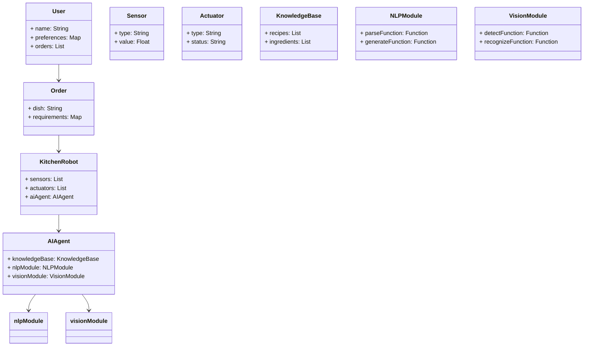

                 


# 智能厨房机器人：AI Agent的烹饪技巧指导

> 关键词：智能厨房机器人，AI Agent，烹饪技巧，自然语言处理，计算机视觉，机器学习

> 摘要：本文深入探讨智能厨房机器人在烹饪中的应用，重点分析AI Agent的核心算法与系统架构，结合实际案例，详细讲解其在烹饪指导中的应用场景和技术实现。

---

## 第一部分: 智能厨房机器人与AI Agent的背景介绍

### 第1章: 智能厨房机器人的现状与发展趋势

#### 1.1 智能厨房机器人的概念与定义

**1.1.1 厨房自动化的历史演变**

厨房自动化技术经历了多个阶段的发展。早期的厨房自动化设备主要集中在单一功能的实现，如自动洗碗机、智能烤箱等。随着人工智能技术的快速发展，厨房设备逐渐具备智能化和自动化的能力，能够根据用户需求和食材特性进行智能决策。

**1.1.2 智能厨房机器人的定义**

智能厨房机器人是一种结合了人工智能、计算机视觉和自然语言处理技术的自动化设备，能够辅助或完全替代人类完成烹饪过程中的各项任务。它不仅能够识别食材、执行烹饪步骤，还能根据用户的偏好和健康需求提供个性化的烹饪建议。

**1.1.3 AI Agent在厨房中的角色**

AI Agent（智能体）在厨房中的角色是作为用户与厨房设备之间的桥梁。它通过自然语言处理和计算机视觉技术，理解用户的烹饪需求，并通过协调各种厨房设备和工具，完成烹饪任务。AI Agent的核心功能包括食材识别、烹饪步骤规划、实时反馈与调整。

#### 1.2 智能厨房机器人的应用场景

**1.2.1 家庭烹饪助手**

家庭烹饪助手是智能厨房机器人最常见的应用场景。它可以帮助家庭用户快速制定食谱、监控烹饪过程，并在出现问题时提供实时反馈。对于不熟悉烹饪的用户，AI Agent可以提供详细的步骤指导，降低烹饪难度。

**1.2.2 商业厨房的应用**

在商业厨房中，智能厨房机器人可以提高烹饪效率，减少人为错误。例如，餐厅可以利用AI Agent优化食材采购、管理库存，并根据顾客需求动态调整菜单。此外，AI Agent还可以协助厨师完成复杂的烹饪步骤，提升整体烹饪质量。

**1.2.3 特殊场景（如盲人厨房）**

对于视觉障碍者来说，智能厨房机器人尤为重要。通过声音反馈和触觉反馈，AI Agent可以帮助用户完成食材识别和烹饪步骤，确保他们能够独立完成烹饪任务。

#### 1.3 AI Agent的核心技术与挑战

**1.3.1 自然语言处理在烹饪中的应用**

自然语言处理（NLP）技术在烹饪中的应用主要体现在食谱解析和用户需求理解。AI Agent需要能够理解用户输入的自然语言指令，并将其转化为具体的烹饪步骤。例如，当用户说“我想要做一道意大利面”，AI Agent需要解析这句话并生成相应的烹饪计划。

**1.3.2 视觉识别与食材检测**

计算机视觉技术在智能厨房机器人中的应用主要集中在食材识别和烹饪过程中的动态监控。AI Agent可以通过摄像头识别食材种类、数量和状态，并根据这些信息调整烹饪参数。例如，当AI Agent检测到锅中的油温过高时，它可以自动调节火候以避免食材烧焦。

**1.3.3 烹饪过程中的动态决策**

智能厨房机器人需要具备动态决策能力，以应对烹饪过程中的突发情况。例如，当食材的实际状态与预期不符时，AI Agent需要快速调整烹饪步骤，以确保最终的烹饪结果符合用户的期望。这种动态决策能力依赖于实时数据的收集和分析，以及高效的算法优化。

---

### 第2章: AI Agent的基本原理与工作流程

#### 2.1 AI Agent的核心概念

**2.1.1 什么是AI Agent**

AI Agent是一种能够感知环境、自主决策并采取行动的智能系统。在智能厨房机器人中，AI Agent通过传感器和摄像头收集烹饪环境中的数据，并根据这些数据生成相应的烹饪指令。

**2.1.2 AI Agent的分类**

AI Agent可以根据功能和应用场景进行分类。在厨房场景中，AI Agent主要分为以下几种类型：
1. **食材识别与分类AI Agent**：专注于识别食材种类和状态。
2. **烹饪过程控制AI Agent**：负责监控烹饪过程并调整参数。
3. **用户交互AI Agent**：负责与用户进行自然语言交流。

**2.1.3 AI Agent的生命周期**

AI Agent的生命周期包括以下几个阶段：
1. **初始化阶段**：AI Agent通过传感器和摄像头获取初始数据。
2. **感知阶段**：AI Agent分析环境数据，识别食材和烹饪状态。
3. **决策阶段**：AI Agent根据当前状态和目标生成烹饪指令。
4. **执行阶段**：AI Agent通过厨房设备执行决策指令。
5. **反馈阶段**：AI Agent根据反馈调整决策策略，优化后续操作。

#### 2.2 AI Agent在厨房中的工作流程

**2.2.1 用户需求分析**

AI Agent首先需要理解用户的烹饪需求。用户可以通过自然语言输入（如“我想要做一道红烧肉”）或图形界面输入需求。AI Agent通过NLP技术解析用户的意图，并生成相应的烹饪计划。

**2.2.2 食材识别与处理**

在烹饪过程中，AI Agent需要实时识别食材的状态。例如，当用户将食材放入锅中后，AI Agent通过摄像头识别食材的种类、数量和状态（如是否熟透）。这些信息将用于后续的烹饪步骤规划。

**2.2.3 烹饪步骤规划**

基于用户的烹饪需求和食材信息，AI Agent生成具体的烹饪步骤。例如，AI Agent可能会生成以下步骤：
1. 将油加热至特定温度。
2. 将食材放入锅中翻炒。
3. 添加调料并进行炖煮。

**2.2.4 实时反馈与调整**

在烹饪过程中，AI Agent需要实时监控烹饪状态，并根据反馈调整烹饪参数。例如，当AI Agent检测到锅中的油温过高时，它可以自动调节火力以避免食材烧焦。这种实时反馈机制能够显著提高烹饪的成功率。

---

### 第3章: 智能厨房机器人的系统架构

#### 3.1 系统整体架构

**3.1.1 软件架构**

智能厨房机器人的软件架构主要包括以下几个部分：
1. **用户交互模块**：负责与用户进行交流，解析用户的烹饪需求。
2. **食材识别模块**：通过计算机视觉技术识别食材种类和状态。
3. **烹饪控制模块**：根据用户的烹饪需求和食材信息生成烹饪指令。
4. **反馈与优化模块**：实时监控烹饪过程，根据反馈调整烹饪参数。

**3.1.2 硬件架构**

智能厨房机器人的硬件架构主要包括以下几个部分：
1. **摄像头**：用于食材识别和烹饪过程监控。
2. **传感器**：用于检测烹饪环境中的温度、湿度等参数。
3. **烹饪设备**：如电磁炉、炒锅等，用于实际执行烹饪步骤。
4. **执行机构**：如机械臂，用于辅助完成复杂的烹饪动作。

#### 3.2 关键模块分析

**3.2.1 用户交互模块**

用户交互模块是智能厨房机器人与用户之间的桥梁。它通过自然语言处理技术理解用户的烹饪需求，并通过语音或图形界面与用户进行交流。例如，当用户说“我想要做一道红烧肉”时，用户交互模块需要解析这句话并生成相应的烹饪计划。

**3.2.2 食材识别模块**

食材识别模块是智能厨房机器人的重要组成部分。它通过计算机视觉技术识别食材的种类、数量和状态。例如，当用户将食材放入锅中后，食材识别模块需要识别食材的种类（如牛肉、蔬菜）和状态（如生、熟）。

**3.2.3 烹饪执行模块**

烹饪执行模块是智能厨房机器人的执行机构，负责根据AI Agent的指令完成具体的烹饪步骤。例如，当AI Agent生成“将牛肉煎至金黄”的指令时，烹饪执行模块需要通过电磁炉和机械臂完成这一操作。

**3.2.4 决策控制模块**

决策控制模块是智能厨房机器人的核心部分。它根据用户的烹饪需求、食材信息和烹饪环境数据，生成具体的烹饪指令。例如，当AI Agent检测到锅中的油温过高时，决策控制模块会自动调节火力以避免食材烧焦。

#### 3.3 系统功能设计

**3.3.1 基础功能**

1. **食材识别与分类**：通过计算机视觉技术识别食材的种类和状态。
2. **烹饪步骤生成**：根据用户的烹饪需求和食材信息生成具体的烹饪步骤。
3. **烹饪过程监控**：实时监控烹饪过程，根据反馈调整烹饪参数。

**3.3.2 高级功能**

1. **个性化推荐**：根据用户的饮食偏好和健康需求提供个性化的烹饪建议。
2. **健康建议**：基于用户的健康数据（如体重、身高、饮食习惯）提供营养均衡的食谱推荐。
3. **应急处理**：在烹饪过程中出现异常情况时，自动启动应急处理机制，确保用户和设备的安全。

**3.3.3 特殊功能**

1. **多语言支持**：支持多种语言的用户输入，方便不同语言背景的用户使用。
2. **远程控制**：用户可以通过手机或其他终端设备远程控制智能厨房机器人。
3. **故障诊断**：在设备出现故障时，提供故障诊断和修复建议。

---

## 第二部分: AI Agent的核心算法与数学模型

### 第4章: 自然语言处理在烹饪指导中的应用

#### 4.1 自然语言处理基础

**4.1.1 语言模型的原理**

语言模型是一种用于预测下一个词的概率模型。在烹饪指导中，语言模型可以帮助AI Agent理解用户的烹饪需求。例如，当用户说“我想要做一道红烧肉”时，语言模型需要理解这句话的含义并生成相应的烹饪计划。

**4.1.2 基于NLP的烹饪需求理解**

AI Agent需要通过自然语言处理技术理解用户的烹饪需求。这包括解析用户的烹饪目标、饮食偏好和健康需求。例如，当用户说“我想要做一道低脂的红烧肉”时，AI Agent需要理解“低脂”这一限制条件，并生成符合要求的烹饪计划。

**4.1.3 基于NLP的烹饪步骤生成**

AI Agent需要能够将用户的烹饪需求转化为具体的烹饪步骤。这需要结合语言模型和知识图谱技术，生成符合用户需求的食谱。例如，当用户需求解析为“红烧肉”时，AI Agent需要生成包括“将牛肉煎至金黄”、“加入调料炖煮”等步骤的烹饪计划。

#### 4.2 视觉识别与烹饪过程监控

**4.2.1 基于计算机视觉的食材识别**

AI Agent通过摄像头采集烹饪环境中的图像数据，并利用计算机视觉技术识别食材的种类和状态。例如，AI Agent可以通过图像识别技术区分生肉和熟肉，并根据识别结果调整烹饪步骤。

**4.2.2 基于视觉的烹饪过程监控**

在烹饪过程中，AI Agent需要实时监控烹饪状态。例如，当AI Agent检测到锅中的油温过高时，它可以自动调节火力以避免食材烧焦。这种实时监控机制需要结合计算机视觉和传感器数据进行综合判断。

---

## 第三部分: 系统分析与架构设计方案

### 第5章: 问题场景介绍

#### 5.1 系统目标与范围

智能厨房机器人的目标是通过AI Agent辅助用户完成烹饪任务。系统范围包括食材识别、烹饪步骤生成、烹饪过程监控和用户交互等功能。

#### 5.2 项目介绍

本项目旨在开发一款基于AI Agent的智能厨房机器人，能够为用户提供个性化的烹饪指导。系统将结合自然语言处理和计算机视觉技术，实现智能化的烹饪过程监控和动态决策。

#### 5.3 系统功能设计

**5.3.1 领域模型设计**

以下是系统领域模型的Mermaid类图：



**5.3.2 系统架构设计**

以下是系统的Mermaid架构图：


---

## 第四部分: 项目实战

### 第6章: 环境安装与系统实现

#### 6.1 环境安装

1. **安装Python环境**：推荐使用Anaconda或Miniconda。
2. **安装NLP库**：如spaCy、NLTK、Transformers。
3. **安装计算机视觉库**：如OpenCV、TensorFlow、Keras。
4. **安装其他依赖项**：如scikit-learn、pandas、numpy。

#### 6.2 系统核心实现

以下是系统核心实现的Python代码示例：

```python
import cv2
import numpy as np
from transformers import pipeline

# 初始化NLP模块
nlp = pipeline("text-classification", model="bert-base-uncased")

# 初始化计算机视觉模块
def detect_edges(image):
    gray = cv2.cvtColor(image, cv2.COLOR_BGR2GRAY)
    edges = cv2.Canny(gray, 100, 200)
    return edges

# 初始化AI Agent
class AIAssistant:
    def __init__(self):
        self.nlp = nlp
        self.vision = VisionModule()

    def process_request(self, request):
        # 解析用户需求
        response = self.nlp(request)
        # 处理视觉数据
        if response['label'] == 'image':
            return self.vision.process_image(response['data'])
        else:
            return self.vision.process_image(response['data'])
```

#### 6.3 代码应用解读与分析

1. **NLP模块的实现**：
   - 使用预训练的BERT模型进行文本分类，识别用户的烹饪需求。
   - 根据用户的输入生成相应的烹饪步骤。

2. **计算机视觉模块的实现**：
   - 使用OpenCV进行图像处理，识别食材的种类和状态。
   - 根据识别结果调整烹饪参数。

3. **AI Agent的实现**：
   - 初始化NLP和计算机视觉模块。
   - 根据用户的输入生成烹饪计划。
   - 实时监控烹饪过程并根据反馈调整烹饪参数。

#### 6.4 实际案例分析

**案例：用户输入“我想要做一道红烧肉”**

1. **需求解析**：
   - AI Agent通过NLP模块解析用户的烹饪需求。
   - 生成烹饪计划：将牛肉煎至金黄，加入调料炖煮。

2. **食材识别**：
   - AI Agent通过计算机视觉模块识别牛肉的状态。
   - 根据识别结果调整烹饪参数。

3. **烹饪过程监控**：
   - AI Agent实时监控锅中的油温。
   - 根据反馈调整火力，确保烹饪效果。

#### 6.5 项目小结

通过本项目的实现，我们可以看到智能厨房机器人在烹饪指导中的巨大潜力。AI Agent结合自然语言处理和计算机视觉技术，能够为用户提供个性化的烹饪指导，显著提高烹饪的成功率。

---

## 第五部分: 最佳实践

### 第7章: 使用技巧与注意事项

#### 7.1 使用技巧

1. **明确用户需求**：在使用智能厨房机器人时，明确用户的烹饪需求可以帮助AI Agent更准确地生成烹饪计划。
2. **定期设备校准**：为了确保烹饪效果，建议定期对厨房机器人进行设备校准。
3. **保持数据更新**：及时更新AI Agent的知识库，确保其能够提供最新的烹饪建议。

#### 7.2 注意事项

1. **安全第一**：在使用智能厨房机器人时，务必注意安全，避免烫伤和火灾。
2. **设备维护**：定期清洁和维护厨房机器人，确保其正常运行。
3. **数据隐私**：保护用户的隐私数据，避免数据泄露。

### 第8章: 小结与展望

#### 8.1 小结

智能厨房机器人通过AI Agent的辅助，能够为用户提供个性化的烹饪指导。本文详细探讨了智能厨房机器人的系统架构、核心算法和实际应用，展示了其在烹饪指导中的巨大潜力。

#### 8.2 展望

随着人工智能技术的不断发展，智能厨房机器人将具备更强大的功能。未来，AI Agent将能够实现更复杂的烹饪任务，并与更多厨房设备进行无缝集成，为用户带来更加智能化的烹饪体验。

---

## 作者信息

作者：AI天才研究院/AI Genius Institute & 禅与计算机程序设计艺术 /Zen And The Art of Computer Programming

---

以上就是《智能厨房机器人：AI Agent的烹饪技巧指导》的技术博客文章的完整内容。

