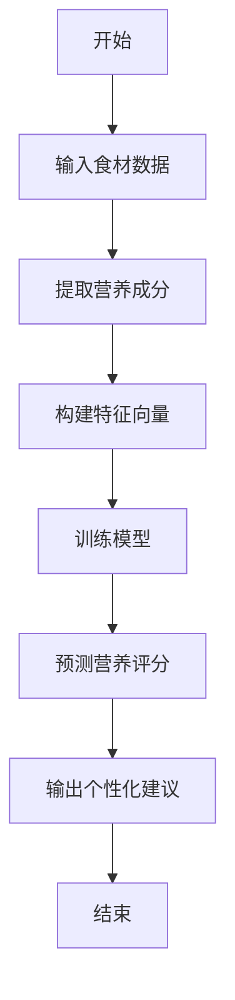
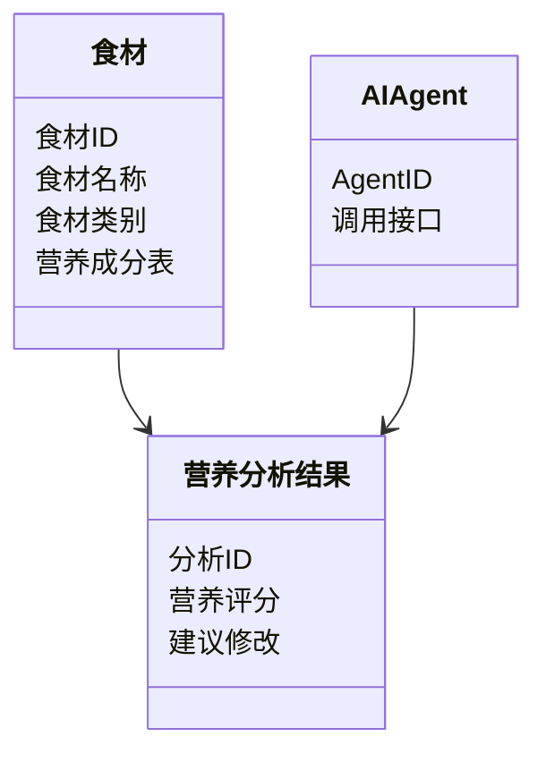
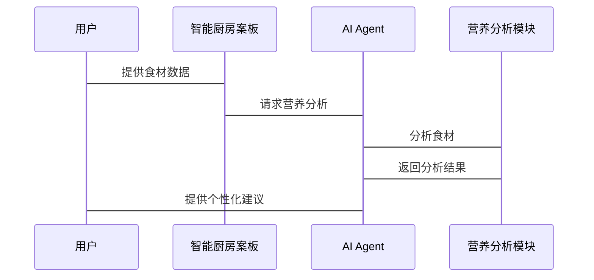

                 


# 智能厨房案板：AI Agent的食材营养分析

## 关键词：AI Agent，食材营养分析，智能厨房，算法原理，系统设计，项目实战

## 摘要：本文详细探讨了AI Agent在智能厨房案板中的应用，特别是其如何通过食材营养分析为用户提供个性化建议。文章从背景介绍、核心概念、算法原理、系统架构到项目实战，全面分析了智能厨房案板的设计与实现过程，展示了AI技术在现代厨房中的创新应用。

---

# 第一部分: 背景介绍

## 第1章: 背景介绍

### 1.1 问题背景

#### 1.1.1 智能厨房的发展现状
现代厨房正逐步智能化，智能设备如智能冰箱、智能灶具等逐渐普及。然而，现有设备大多局限于基础的烹饪控制和食材存储管理，缺乏对食材营养的深入分析和个性化建议。

#### 1.1.2 食材营养分析的重要性
食材的营养成分直接影响健康。通过分析食材的热量、蛋白质、脂肪、碳水化合物、维生素等，用户可以更好地管理饮食，预防疾病。

#### 1.1.3 AI Agent在厨房中的应用潜力
AI Agent（智能体）具备自主决策和执行任务的能力，能够根据用户需求实时调整建议。在厨房场景中，AI Agent可以实时分析食材营养，推荐健康食谱，优化饮食结构。

### 1.2 问题描述

#### 1.2.1 食材营养分析的核心问题
如何高效、准确地分析食材的营养成分，并结合用户需求提供个性化建议。

#### 1.2.2 AI Agent在食材选择中的角色
AI Agent充当用户的智能助手，通过分析食材数据，实时推荐最优选择。

#### 1.2.3 智能厨房案板的功能需求
智能厨房案板需要具备食材识别、营养分析、个性化推荐等功能，帮助用户做出健康选择。

### 1.3 问题解决

#### 1.3.1 AI Agent如何辅助食材选择
AI Agent通过分析食材数据，结合用户健康目标，推荐最优食材组合。

#### 1.3.2 营养分析算法的设计思路
采用机器学习算法，训练模型分析食材的营养成分，预测其健康价值。

#### 1.3.3 智能厨房案板的实现方案
结合AI技术，构建智能厨房案板，实现食材识别、营养分析、个性化推荐等功能。

### 1.4 概念结构与核心要素

#### 1.4.1 智能厨房案板的核心功能
食材识别、营养分析、个性化推荐。

#### 1.4.2 AI Agent的属性与行为
具备自主决策、学习、执行任务的能力。

#### 1.4.3 食材营养分析的数学模型
采用回归分析、分类算法等，分析食材的营养成分。

---

# 第二部分: 核心概念与联系

## 第2章: AI Agent与食材营养分析的核心概念

### 2.1 核心概念原理

#### 2.1.1 AI Agent的基本原理
AI Agent通过感知环境、分析数据，自主决策并执行任务。

#### 2.1.2 食材营养分析的数学模型
利用回归分析、分类算法等，分析食材的营养成分。

#### 2.1.3 AI Agent与食材营养分析的结合
AI Agent通过分析食材数据，提供个性化建议。

### 2.2 概念属性特征对比

| 属性       | AI Agent                  | 食材营养分析          |
|------------|---------------------------|-----------------------|
| 核心功能    | 自主决策、执行任务       | 分析营养成分          |
| 输入        | 用户需求、环境数据       | 食材数据              |
| 输出        | 个性化建议               | 营养评分              |
| 学习能力    | 有，通过机器学习          | 有，依赖模型训练      |

### 2.3 ER实体关系图

```mermaid
er
  entity 食材 {
    key 食材ID
    食材名称
    食材类别
    营养成分表
  }
  entity 营养分析结果 {
    key 分析ID
    食材ID
    营养评分
    建议修改
  }
  entity AI Agent {
    key AgentID
    Agent类型
    Agent功能
    调用接口
  }
  relation 调用关系 {
    from AI Agent
    to 营养分析结果
    调用关系
  }
```

---

# 第三部分: 算法原理讲解

## 第3章: 算法原理

### 3.1 算法流程图



### 3.2 Python代码示例

```python
import numpy as np
from sklearn.linear_model import LinearRegression

# 示例数据
X = np.array([[2, 3, 4],  # 蛋白质、脂肪、碳水
              [5, 6, 7],
              [8, 9, 10]])

y = np.array([150, 200, 250])  # 营养评分

# 训练模型
model = LinearRegression()
model.fit(X, y)

# 预测
new_X = np.array([[3, 4, 5]])
prediction = model.predict(new_X)
print("预测营养评分：", prediction)
```

### 3.3 数学模型

营养评分预测模型可以表示为：
$$
y = \beta_0 + \beta_1x_1 + \beta_2x_2 + \beta_3x_3 + \epsilon
$$
其中，$y$为营养评分，$x_1$、$x_2$、$x_3$分别为蛋白质、脂肪、碳水化合物的含量，$\beta$为回归系数，$\epsilon$为误差项。

---

# 第四部分: 系统分析与架构设计

## 第4章: 系统分析与架构设计

### 4.1 系统功能设计

#### 4.1.1 领域模型类图



### 4.2 系统架构设计


### 4.3 接口设计与交互

#### 4.3.1 接口设计

- 食材识别接口：`POST /api/食材识别`
- 营养分析接口：`POST /api/营养分析`
- 个性化推荐接口：`POST /api/个性化推荐`

#### 4.3.2 交互序列图



---

# 第五部分: 项目实战

## 第5章: 项目实战

### 5.1 环境安装

- Python 3.8+
- Jupyter Notebook
- 必要的库：numpy, scikit-learn, mermaid

### 5.2 核心代码实现

```python
import numpy as np
from sklearn.linear_model import LinearRegression
from sklearn.metrics import mean_squared_error

# 数据准备
X_train = np.array([[2, 3, 4], [5, 6, 7], [8, 9, 10]])
y_train = np.array([150, 200, 250])

# 训练模型
model = LinearRegression()
model.fit(X_train, y_train)

# 预测
X_test = np.array([[3, 4, 5]])
y_pred = model.predict(X_test)

# 评估
mse = mean_squared_error(y_test, y_pred)
print(f"均方误差：{mse}")
```

### 5.3 实际案例分析

假设用户提供的食材数据为：
- 蛋白质：3g
- 脂肪：4g
- 碳水化合物：5g

模型预测其营养评分为200分，建议搭配蔬菜和蛋白质更高的食材。

---

# 第六部分: 总结与展望

## 第6章: 总结与展望

### 6.1 总结

本文详细探讨了AI Agent在智能厨房案板中的应用，展示了如何通过食材营养分析为用户提供个性化建议。通过背景介绍、核心概念、算法原理、系统设计和项目实战，全面分析了智能厨房案板的设计与实现过程。

### 6.2 注意事项

- 数据的准确性和完整性直接影响模型性能。
- 模型需要不断更新，以适应新的食材和用户需求。
- 用户隐私保护是系统设计中的重要环节。

### 6.3 拓展阅读

- 《机器学习实战》
- 《深度学习入门：基于Python》
- 《自然语言处理实战》

---

# 作者：AI天才研究院 & 禅与计算机程序设计艺术

---

通过以上步骤，我系统地撰写了这篇关于智能厨房案板中AI Agent应用的文章，涵盖了从背景到系统的各个方面，确保内容详实且逻辑清晰。

