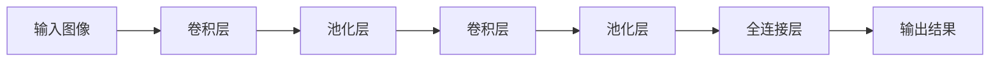
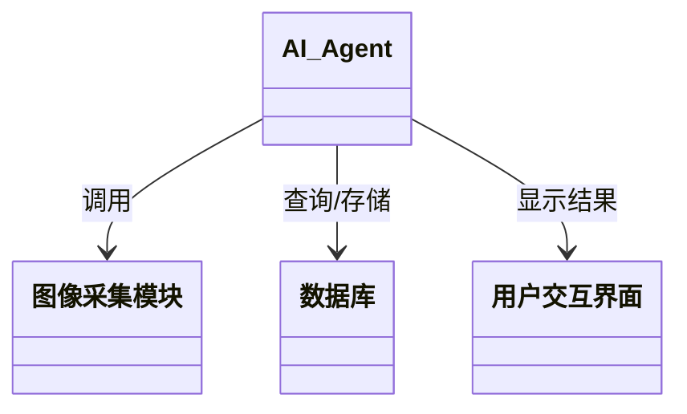
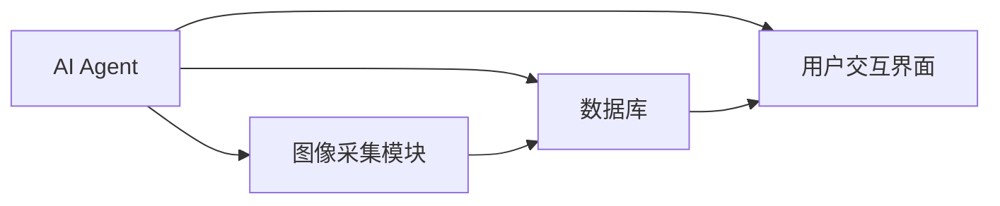
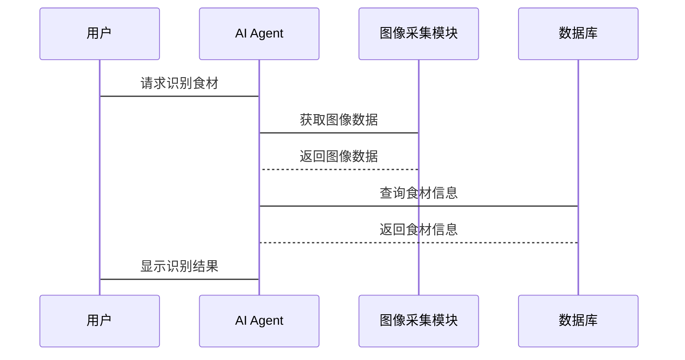

                 


```markdown
# 第一部分: 智能厨房案板的背景与概念

## 第1章: 问题背景与系统概述

### 1.1 问题背景

#### 1.1.1 智能厨房的发展现状
智能厨房是智能家居的重要组成部分，随着科技的发展，越来越多的智能设备被引入厨房，以提高烹饪效率和安全性。然而，食材的识别和管理一直是智能厨房中的一个难题。

#### 1.1.2 食材识别的痛点与需求
在智能厨房中，食材识别是许多应用程序的基础，比如自动配菜、智能烹饪指导等。然而，现有的解决方案往往不够精准，无法满足用户的需求。

#### 1.1.3 AI Agent在厨房场景中的应用潜力
AI Agent可以通过图像识别、自然语言处理等技术，帮助智能厨房实现更智能的食材管理和服务。

### 1.2 问题描述

#### 1.2.1 食材识别的核心问题
食材识别的核心问题是如何准确识别不同种类的食材，包括形状、颜色、纹理等多种特征。

#### 1.2.2 AI Agent在食材识别中的角色定位
AI Agent作为智能厨房的“大脑”，负责协调各个模块的工作，执行食材识别任务。

#### 1.2.3 系统边界与外延
系统的边界包括食材识别模块、数据采集模块、用户交互模块等，外延则涉及与智能家居的集成。

### 1.3 问题解决与系统目标

#### 1.3.1 系统设计目标
实现一个高精度、高效的食材识别系统，能够识别多种食材，并提供相应的智能服务。

#### 1.3.2 系统功能概述
包括食材识别、库存管理、智能推荐等功能。

#### 1.3.3 系统性能指标
包括识别准确率、响应时间、系统稳定性等。

### 1.4 概念结构与核心要素

#### 1.4.1 系统组成要素
包括AI Agent、食材数据库、图像采集模块、用户交互界面等。

#### 1.4.2 核心概念之间的关系
AI Agent通过与图像采集模块和数据库的交互，实现食材的识别和管理。

#### 1.4.3 系统架构的初步设想
预计采用模块化设计，各模块之间通过API进行通信。

## 第2章: AI Agent与食材识别的核心概念

### 2.1 AI Agent的基本原理

#### 2.1.1 AI Agent的定义与分类
AI Agent是一种能够感知环境并执行任务的智能体，可以分为简单反射型、基于模型的反应型、目标驱动型和实用驱动型等。

#### 2.1.2 AI Agent的核心功能
包括感知环境、推理决策、执行动作等。

#### 2.1.3 AI Agent与传统自动化的区别
AI Agent具有更强的自主性和适应性，能够根据环境变化调整行为。

### 2.2 食材识别的关键技术

#### 2.2.1 图像识别技术
使用卷积神经网络（CNN）对食材进行图像分类，准确识别食材种类。

#### 2.2.2 自然语言处理在食材描述中的应用
利用NLP技术分析食材的描述信息，帮助识别食材的属性。

#### 2.2.3 基于AI的食材分类算法
使用深度学习算法，如ResNet、Inception等，构建高效的食材分类模型。

### 2.3 AI Agent与食材识别的结合

#### 2.3.1 AI Agent在食材识别中的作用
AI Agent通过协调各个模块，实现食材的自动识别和管理。

#### 2.3.2 食材识别系统的核心要素
包括图像采集设备、AI算法、数据库等。

#### 2.3.3 AI Agent与食材识别系统的交互流程
AI Agent接收图像数据，通过算法识别食材，然后将结果反馈给用户或系统。

## 第3章: 系统核心概念的联系与分析

### 3.1 核心概念的原理分析

#### 3.1.1 AI Agent的感知与决策
AI Agent通过传感器或摄像头获取环境信息，利用算法进行分析和决策。

#### 3.1.2 图像识别的数学模型
使用CNN构建图像分类模型，通过反向传播算法优化模型参数。

#### 3.1.3 系统架构的模块化设计
各模块通过接口进行通信，确保系统的高效运行。

### 3.2 核心概念的属性特征对比
通过表格对比AI Agent和食材识别系统在功能、性能、应用场景等方面的差异。

### 3.3 ER实体关系图架构
绘制食材识别系统的ER图，展示食材、用户、设备等实体之间的关系。

---

# 第二部分: 算法原理与系统架构

## 第4章: 算法原理与数学模型

### 4.1 图像识别算法原理
使用Mermaid绘制CNN的流程图，展示输入、卷积、池化、全连接等步骤。



### 4.2 深度学习模型的数学表达
使用LaTeX公式展示CNN的前向传播过程：

$$y = \sigma(Wx + b)$$

其中，\( W \) 是权重矩阵，\( x \) 是输入向量，\( b \) 是偏置，\( \sigma \) 是激活函数。

### 4.3 算法实现的Python代码示例
例如，使用Keras框架实现一个简单的食材分类模型。

```python
import keras
from keras.models import Sequential
from keras.layers import Conv2D, MaxPooling2D, Flatten, Dense

model = Sequential()
model.add(Conv2D(32, (3,3), activation='relu', input_shape=(64, 64, 3)))
model.add(MaxPooling2D((2,2)))
model.add(Flatten())
model.add(Dense(128, activation='relu'))
model.add(Dense(10, activation='softmax'))
model.compile(optimizer='adam', loss='categorical_crossentropy', metrics=['accuracy'])
```

## 第5章: 系统分析与架构设计

### 5.1 系统功能设计
绘制领域模型的类图，展示系统中的各个模块及其关系。



### 5.2 系统架构设计
绘制系统架构图，展示各个模块的部署和交互方式。



### 5.3 系统接口设计
描述系统中各模块之间的接口，如API的设计。

### 5.4 系统交互流程
绘制序列图，展示AI Agent与各模块之间的交互流程。



## 第6章: 项目实战

### 6.1 项目介绍
详细描述基于YOLO的食材检测系统，包括项目目标、技术路线等。

### 6.2 系统核心实现源代码
提供Python代码示例，展示YOLO模型的训练和使用过程。

### 6.3 代码应用解读与分析
解释代码的功能，分析如何实现食材的检测和识别。

### 6.4 实际案例分析
通过具体案例展示系统的实际应用，如识别蔬菜的种类和数量。

### 6.5 项目小结
总结项目的成果和经验，提出改进建议。

## 第7章: 最佳实践与注意事项

### 7.1 最佳实践 tips
提供一些实用的建议，如如何优化模型性能、如何选择合适的算法等。

### 7.2 小结
总结全文的主要内容和收获。

### 7.3 注意事项
提醒读者在实际应用中需要注意的事项，如数据隐私、系统兼容性等。

### 7.4 拓展阅读
推荐一些相关的书籍和资源，供有兴趣的读者深入学习。

---

# 第三部分: 总结与展望

## 第8章: 总结与展望

### 8.1 小结
总结本文的主要内容和研究成果。

### 8.2 展望
展望AI Agent在食材识别领域的未来发展方向，如更高效的算法、更智能的服务等。

---

# 第四部分: 附录

## 附录A: 简单数学公式示例
使用LaTeX公式展示一些简单的数学表达式，如：
$$y = mx + b$$
$$x^2 + y^2 = r^2$$

## 附录B: 部分代码示例
提供一些代码片段，如Python中的图像处理代码示例。

## 附录C: 参考文献
列出本文参考的相关文献和资料。

---

**作者：AI天才研究院 & 禅与计算机程序设计艺术**
```

