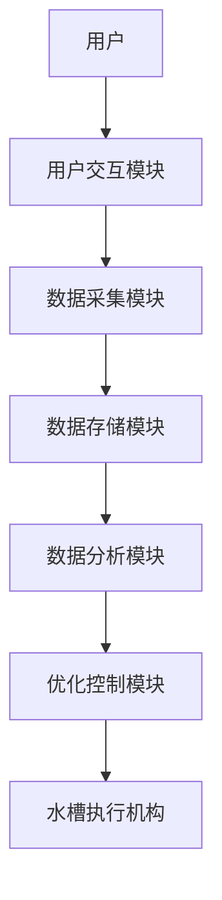
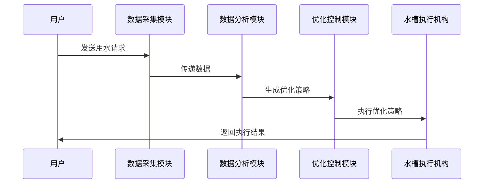

                 


# 智能厨房水槽：AI Agent的用水优化控制

> 关键词：智能厨房水槽，AI Agent，用水优化，智能家居，AI控制

> 摘要：本文详细探讨了智能厨房水槽的设计与实现，重点分析了基于AI Agent的用水优化控制技术。文章从背景、概念、算法、系统架构到项目实战，全面解析了智能厨房水槽的核心技术与实现方案。

---

# 第一部分: 智能厨房水槽与AI Agent概述

## 第1章: 智能厨房水槽的概念与应用背景

### 1.1 智能厨房水槽的定义与特点
#### 1.1.1 智能厨房水槽的定义
智能厨房水槽是一种结合了人工智能（AI）技术的厨房水槽系统，能够通过AI Agent实现用水量的智能优化控制。它通过传感器、数据采集和AI算法，实时监测用水情况并优化用水效率。

#### 1.1.2 智能厨房水槽的核心特点
- **智能感知**：通过传感器实时监测水温、水流速、水位等参数。
- **AI优化**：基于AI Agent的优化算法，实现用水量的精准控制。
- **节能环保**：通过优化用水量，减少水资源浪费，降低能耗。
- **人机交互**：支持用户通过手机APP或语音助手进行操作和监控。

#### 1.1.3 智能厨房水槽的应用场景
智能厨房水槽适用于家庭、酒店、商业厨房等场景，尤其适合对用水效率要求较高的环境。

### 1.2 AI Agent在智能厨房水槽中的作用
#### 1.2.1 AI Agent的基本概念
AI Agent是一种能够感知环境、自主决策并执行任务的智能体。它通过数据采集、分析和优化算法，实现对系统的智能控制。

#### 1.2.2 AI Agent在水槽优化控制中的应用
AI Agent能够实时监测水槽的使用状态，分析用户的用水习惯，优化用水量，减少浪费。

#### 1.2.3 AI Agent与传统水槽控制系统的区别
- **传统控制系统**：基于固定的逻辑和规则进行控制，无法根据实际使用情况动态调整。
- **AI Agent控制**：能够根据实时数据和用户行为，动态优化控制策略，提高用水效率。

---

## 第2章: 智能厨房水槽的用水优化背景

### 2.1 当前用水管理的问题与挑战
#### 2.1.1 水资源浪费的现状
全球水资源短缺问题日益严重，而家庭用水浪费现象普遍存在。

#### 2.1.2 用水效率低下的原因
- **用户习惯**：用户缺乏节水意识，用水方式不合理。
- **设备落后**：传统水槽控制系统无法根据实际需求动态调整用水量。

#### 2.1.3 智能化用水管理的必要性
通过智能化管理，减少水资源浪费，降低能源消耗，助力可持续发展。

### 2.2 AI技术在用水优化中的应用前景
#### 2.2.1 AI技术在用水管理中的优势
- **数据驱动**：通过大数据分析，优化用水策略。
- **动态调整**：AI能够实时感知环境变化，动态调整控制策略。
- **节能环保**：通过优化用水量，降低能源消耗。

#### 2.2.2 AI Agent在智能水槽中的潜在价值
AI Agent能够通过智能感知和优化控制，显著提高用水效率，减少水资源浪费。

#### 2.2.3 用水优化对可持续发展的意义
用水优化是实现可持续发展的重要组成部分，有助于缓解水资源短缺问题。

---

# 第二部分: 智能厨房水槽的核心技术与原理

## 第3章: AI Agent的基本原理与工作流程

### 3.1 AI Agent的核心概念
#### 3.1.1 AI Agent的定义与分类
AI Agent可以分为简单反射Agent和基于模型的Agent两类。简单反射Agent基于固定的规则进行决策，而基于模型的Agent能够通过学习和推理优化决策过程。

#### 3.1.2 AI Agent的基本组成要素
- **感知器**：用于采集环境数据。
- **推理器**：用于分析数据并生成决策。
- **执行器**：用于执行决策操作。

#### 3.1.3 AI Agent与智能水槽的结合
AI Agent通过感知水槽的使用状态，分析数据并优化控制策略，实现智能用水管理。

### 3.2 AI Agent的工作流程
#### 3.2.1 数据采集与处理
AI Agent通过传感器采集水槽的使用数据，包括水流速、水温、水位等。

#### 3.2.2 数据分析与决策
通过机器学习算法分析数据，优化用水策略。

#### 3.2.3 执行与反馈
根据优化后的策略，控制水槽的使用，并根据反馈调整策略。

---

## 第4章: 智能厨房水槽的优化算法

### 4.1 基于AI的优化算法概述
#### 4.1.1 优化算法的基本概念
优化算法是一种通过数学方法寻找最优解的技术，广泛应用于资源分配、过程控制等领域。

#### 4.1.2 常见优化算法的分类
- **确定性算法**：如梯度下降、牛顿法。
- **随机优化算法**：如模拟退火、遗传算法。

#### 4.1.3 AI在优化算法中的应用
AI通过机器学习和深度学习技术，优化传统优化算法的性能。

### 4.2 智能水槽优化算法的实现
#### 4.2.1 算法设计目标
- 最小化用水量。
- 提高用水效率。
- 降低能源消耗。

#### 4.2.2 算法实现步骤
1. 数据采集与预处理。
2. 建立优化模型。
3. 选择优化算法。
4. 实现算法并进行优化。

#### 4.2.3 算法优化与改进
通过机器学习和深度学习技术，优化传统优化算法的性能，提高优化效率。

---

## 第5章: 智能厨房水槽的数学模型与公式

### 5.1 数学模型的基本构建
#### 5.1.1 模型的输入变量与输出变量
- **输入变量**：水流速、水温、水位。
- **输出变量**：优化后的用水量。

#### 5.1.2 模型的约束条件
- 最大用水量限制。
- 最小用水量要求。

#### 5.1.3 模型的目标函数
$$ \text{最小化用水量} $$

### 5.2 优化算法的数学公式
#### 5.2.1 常用优化算法的数学表达
- 梯度下降法：
$$ \theta_{new} = \theta - \alpha \nabla f(\theta) $$

- 模拟退火法：
$$ \text{接受概率} = \exp\left(-\frac{\Delta E}{T}\right) $$

#### 5.2.2 AI Agent优化模型的数学推导
通过机器学习算法，优化传统优化算法的性能。

#### 5.2.3 算法收敛性分析
分析算法的收敛速度和稳定性。

---

# 第三部分: 智能厨房水槽的系统架构与实现

## 第6章: 智能厨房水槽的系统架构设计

### 6.1 系统应用场景
智能厨房水槽适用于家庭、酒店、商业厨房等场景。

### 6.2 系统功能设计
#### 6.2.1 系统功能模块
- 数据采集模块。
- 数据分析模块。
- 优化控制模块。
- 用户交互模块。

#### 6.2.2 系统功能流程
1. 数据采集模块采集水槽的使用数据。
2. 数据分析模块分析数据并生成优化策略。
3. 优化控制模块根据优化策略控制水槽的使用。
4. 用户交互模块提供人机交互界面。

### 6.3 系统架构设计
#### 6.3.1 系统架构图


#### 6.3.2 系统接口设计
- 数据采集接口：传感器接口。
- 用户交互接口：手机APP或语音助手。

#### 6.3.3 系统交互流程


## 第7章: 智能厨房水槽的项目实战

### 7.1 环境安装
- 硬件设备：水槽、传感器、控制模块。
- 软件环境：Python、机器学习库（如TensorFlow、Scikit-learn）。

### 7.2 核心代码实现
```python
import numpy as np
from sklearn import linear_model

# 数据采集
data = np.array([[1, 2], [2, 3], [3, 4], [4, 5]])

# 建立优化模型
model = linear_model.LinearRegression()
model.fit(data[:, 0].reshape(-1, 1), data[:, 1])

# 优化控制
def optimize_usage(predicted_usage):
    return model.predict(predicted_usage.reshape(-1, 1))
```

### 7.3 案例分析与解读
通过实际案例分析，验证智能厨房水槽的优化效果。

### 7.4 项目小结
总结项目实现过程中的经验和教训，提出改进建议。

---

## 第8章: 总结与展望

### 8.1 总结
智能厨房水槽通过AI Agent实现了用水的智能优化控制，显著提高了用水效率，减少了水资源浪费。

### 8.2 展望
未来，随着AI技术的不断发展，智能厨房水槽将更加智能化、个性化，为用户带来更好的使用体验。

---

作者：AI天才研究院/AI Genius Institute & 禅与计算机程序设计艺术 /Zen And The Art of Computer Programming

感谢您的阅读！如需进一步了解智能厨房水槽的技术细节，欢迎随时联系。

