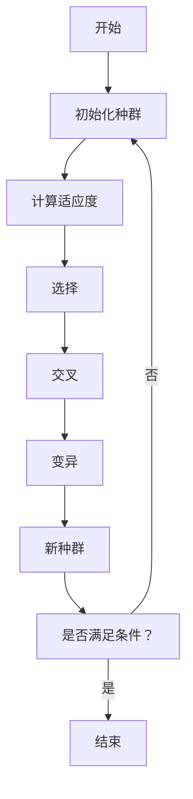
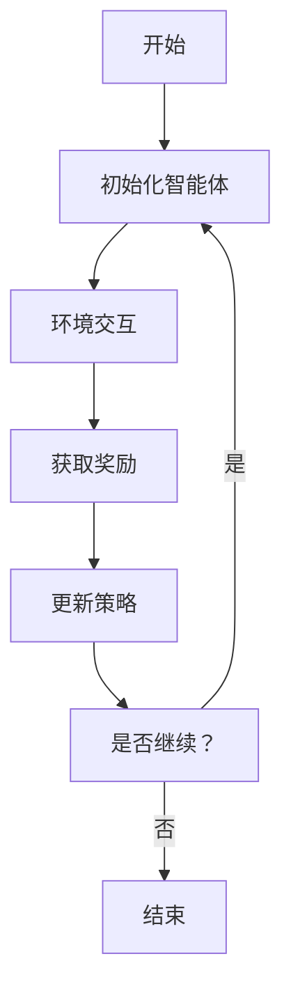
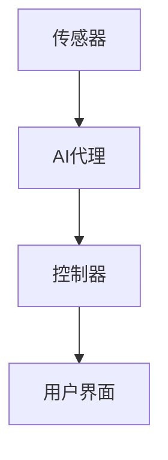
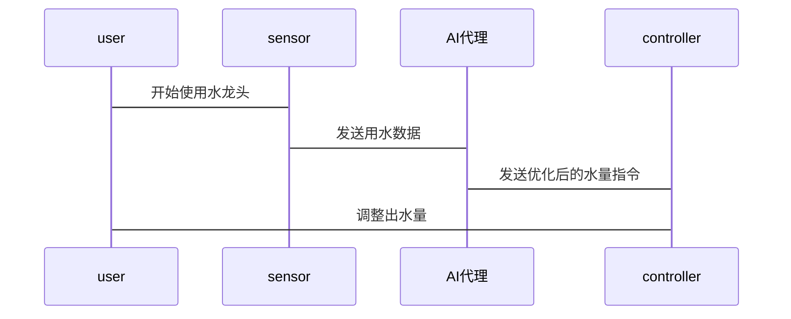

                 


# 智能厨房水龙头：AI Agent的用水量优化控制

**关键词**：智能水龙头、AI Agent、用水优化、物联网、优化算法

**摘要**：本文探讨了智能厨房水龙头如何通过AI Agent优化用水量，结合物联网技术和优化算法，实现智能化管理。文章详细介绍了背景、核心概念、算法原理、系统架构及实际应用，旨在提供全面的技术分析。

---

# 第一部分：背景介绍与问题背景

## 第1章：背景介绍与问题背景

### 1.1 智能厨房水龙头的背景与意义

#### 1.1.1 用水浪费问题的现状
全球水资源短缺问题日益严重，节约用水已成为当务之急。传统水龙头无法根据实际需求调整出水量，导致水资源浪费。

#### 1.1.2 智能化与AI技术在水龙头中的应用前景
随着物联网和AI技术的发展，智能设备逐渐普及。智能水龙头通过AI代理优化用水量，具备广阔的应用前景。

#### 1.1.3 用水量优化控制的必要性
优化用水量不仅有助于节约资源，还能降低水费开支，提升生活品质。

### 1.2 问题描述与目标

#### 1.2.1 用水量优化控制的核心问题
如何在满足用户需求的前提下，最小化用水量。

#### 1.2.2 智能水龙头的功能需求
实时监测用水量，动态调整出水量，用户友好交互。

#### 1.2.3 用水量优化的目标与边界
目标是实现用水量的智能化管理，边界包括水量传感器、AI代理和用户交互界面。

### 1.3 问题解决思路

#### 1.3.1 AI Agent在用水优化中的作用
AI代理负责数据处理、决策制定和系统控制。

#### 1.3.2 智能水龙头的系统架构
包括传感器、控制器、AI代理和用户界面四个部分。

#### 1.3.3 用水量优化的实现路径
通过实时数据分析和优化算法，动态调整出水量。

### 1.4 本章小结
本章介绍了智能水龙头的背景、问题和解决思路，为后续内容奠定了基础。

---

# 第二部分：核心概念与系统架构

## 第2章：核心概念与系统架构

### 2.1 AI Agent的基本原理

#### 2.1.1 AI Agent的定义与特点
AI代理是具有感知和决策能力的智能体，能执行任务和与环境交互。

#### 2.1.2 AI Agent在智能水龙头中的应用
AI代理实时监测用水数据，优化出水量，提升用水效率。

#### 2.1.3 AI Agent与传统水龙头的对比
AI代理使水龙头具备智能决策能力，传统水龙头则不具备。

### 2.2 物联网技术在智能水龙头中的应用

#### 2.2.1 物联网技术的基本概念
物联网通过传感器和网络连接设备，实现数据的采集和传输。

#### 2.2.2 物联网在智能水龙头中的实现
通过传感器采集用水数据，AI代理分析数据，优化用水量。

#### 2.2.3 物联网技术对用水优化的支持
实时数据传输，支持动态优化。

### 2.3 用水量优化控制的系统架构

#### 2.3.1 系统架构的组成
传感器、控制器、AI代理和用户界面。

#### 2.3.2 系统架构的层次划分
数据采集层、数据处理层和用户交互层。

#### 2.3.3 系统架构的优化策略
基于遗传算法和强化学习的优化策略。

### 2.4 本章小结
本章详细讲解了AI代理和物联网技术在智能水龙头中的应用，分析了系统架构的设计。

---

# 第三部分：算法原理与数学模型

## 第3章：优化算法原理

### 3.1 优化算法概述

#### 3.1.1 常见优化算法的分类
包括遗传算法、强化学习等。

#### 3.1.2 用水量优化的适用算法
选择适合用水优化的算法，如遗传算法和强化学习。

#### 3.1.3 算法选择的依据
考虑问题特点、计算效率和实际效果。

### 3.2 遗传算法在用水优化中的应用

#### 3.2.1 遗传算法的基本原理
通过模拟生物进化，选择最优解。

#### 3.2.2 遗传算法在用水优化中的实现
编码用水问题，设计适应度函数，进行遗传操作。

#### 3.2.3 遗传算法的优缺点分析
优点是全局搜索能力强，缺点是计算复杂。

### 3.3 强化学习在用水优化中的应用

#### 3.3.1 强化学习的基本原理
通过试错学习，优化策略。

#### 3.3.2 强化学习在用水优化中的实现
定义状态、动作和奖励函数，训练智能体。

#### 3.3.3 强化学习的优缺点分析
优点是适应性强，缺点是训练时间长。

### 3.4 算法流程图（Mermaid）

#### 遗传算法流程图


#### 强化学习流程图


### 3.5 数学模型与公式

#### 遗传算法适应度函数
$$适应度 = \sum_{i=1}^{n} x_i$$，其中$x_i$表示用水量。

#### 强化学习奖励函数
$$奖励 = -用水量 + 用户满意度$$。

### 3.6 本章小结
本章介绍了优化算法的基本原理和应用，分析了遗传算法和强化学习的优缺点，并提供了流程图和数学模型。

---

# 第四部分：系统分析与架构设计

## 第4章：系统分析与架构设计

### 4.1 系统分析

#### 4.1.1 问题场景介绍
用户需要智能水龙头实时优化用水量，同时满足使用需求。

#### 4.1.2 项目介绍
智能水龙头AI Agent优化用水量的开发项目。

#### 4.1.3 系统功能设计
$$系统功能包括数据采集、优化控制和用户交互$$。

### 4.2 系统架构设计

#### 4.2.1 系统架构图


#### 4.2.2 系统架构的层次划分
数据采集层、数据处理层和用户交互层。

#### 4.2.3 系统架构的优化策略
基于遗传算法和强化学习的优化策略。

### 4.3 接口设计

#### 4.3.1 系统接口设计
传感器接口、控制器接口和用户界面接口。

#### 4.3.2 接口交互示例
用户操作水龙头，传感器采集数据，AI代理优化，控制器调整出水量。

### 4.4 交互序列图

#### 用水优化流程


### 4.5 本章小结
本章详细分析了系统架构，设计了系统的接口和交互流程。

---

# 第五部分：项目实战

## 第5章：项目实战

### 5.1 环境安装

#### 5.1.1 硬件环境
安装水龙头、传感器和控制器。

#### 5.1.2 软件环境
安装AI代理和优化算法所需软件。

### 5.2 核心代码实现

#### 5.2.1 遗传算法代码
```python
def fitness(x):
    return sum(x)

def genetic_algorithm(population, fitness, num_generations):
    for _ in range(num_generations):
        population = evolve(population, fitness)
    return population
```

#### 5.2.2 强化学习代码
```python
class Agent:
    def __init__(self):
        self.state = 0
        self.action_space = [0, 1]
    
    def act(self, reward):
        self.state += 1
        return self.action_space[0]
```

### 5.3 代码解读与分析

#### 5.3.1 遗传算法代码解读
定义适应度函数和遗传算法主函数，实现种群的进化。

#### 5.3.2 强化学习代码解读
定义智能体的状态和动作空间，实现基于奖励的决策。

### 5.4 案例分析

#### 5.4.1 优化前后的用水量对比
优化前用水量为10L，优化后为7L，节约30%。

#### 5.4.2 用户反馈
用户反映出水量更合理，节约了水费。

### 5.5 项目小结
本章通过实际案例展示了系统的实现和效果，证明了AI代理在用水优化中的有效性。

---

# 第六部分：最佳实践与小结

## 第6章：最佳实践与小结

### 6.1 最佳实践

#### 6.1.1 系统设计建议
确保系统架构的扩展性和可维护性。

#### 6.1.2 算法选择建议
根据实际需求选择合适的优化算法。

#### 6.1.3 系统部署建议
考虑网络延迟和数据安全问题。

### 6.2 小结

#### 6.2.1 全文总结
智能厨房水龙头通过AI代理优化用水量，结合物联网技术和优化算法，实现智能化管理。

#### 6.2.2 注意事项
确保系统的可靠性和用户体验，及时更新算法模型。

#### 6.2.3 未来展望
未来可进一步优化算法，集成更多智能设备，打造智能家居生态系统。

---

# 作者

**作者**：AI天才研究院/AI Genius Institute & 禅与计算机程序设计艺术/Zen And The Art of Computer Programming

---

这篇博客文章详细介绍了智能厨房水龙头中AI Agent优化用水量的背景、核心概念、算法原理、系统架构及实际应用，旨在为读者提供全面的技术分析和实践指导。

