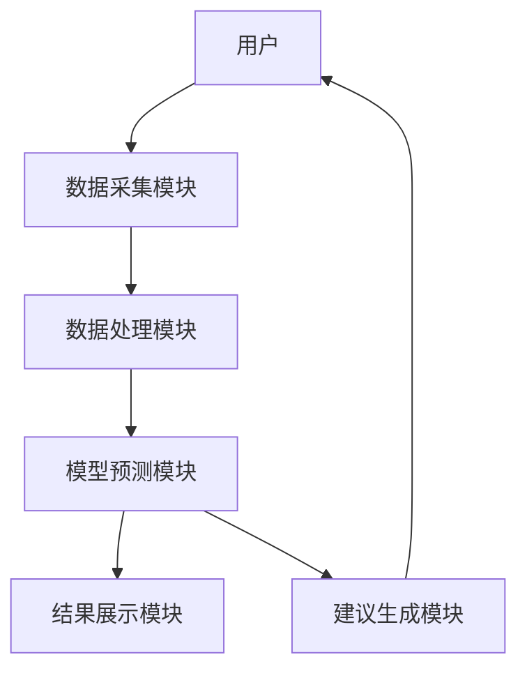
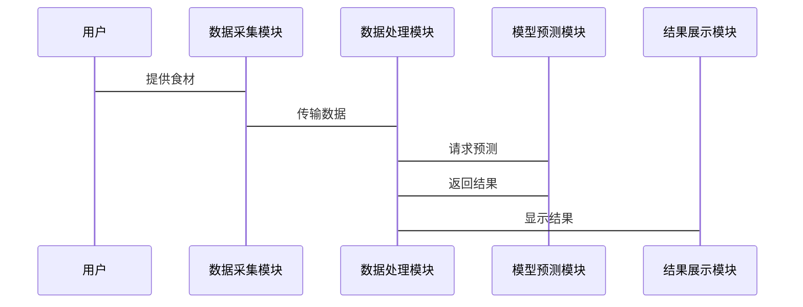

                 


# 智能厨房秤：AI Agent的营养成分分析

> 关键词：智能厨房秤，AI Agent，营养成分分析，机器学习，数据处理，算法实现

> 摘要：本文深入探讨了智能厨房秤结合AI Agent在营养成分分析中的应用，详细介绍了AI Agent的核心概念、算法原理、系统架构以及实际项目实现。通过理论与实践相结合，展示了如何利用AI技术提升厨房秤的功能与用户体验。

---

# 正文

## 第一部分: 智能厨房秤与AI Agent概述

### 第1章: 智能厨房秤的发展与现状

#### 1.1 智能厨房秤的定义与特点

**1.1.1 智能厨房秤的基本功能**

智能厨房秤是一种结合了传感器技术和智能计算的电子秤，主要用于测量食材的重量，并通过连接到计算机系统进行数据处理和分析。其基本功能包括：

- **重量测量**：通过高精度传感器测量食材的重量。
- **数据传输**：将测量数据传输到连接的设备（如手机、电脑）进行处理。
- **营养成分分析**：基于重量和数据库，计算出食材的营养成分（如热量、蛋白质、脂肪、碳水化合物等）。

**1.1.2 AI Agent在智能厨房秤中的作用**

AI Agent（智能体）是一种能够感知环境、做出决策并执行任务的实体。在智能厨房秤中，AI Agent主要负责：

- **数据处理**：接收测量数据并进行预处理。
- **营养分析**：利用机器学习模型分析食材的营养成分。
- **结果反馈**：将分析结果以用户友好的形式呈现，并提供建议（如热量摄入、饮食建议等）。

**1.1.3 智能厨房秤的优势与挑战**

**优势**：
- 提高饮食健康：通过精确的营养分析帮助用户控制饮食。
- 方便用户使用：自动化处理数据，减少手动计算。
- 智能化建议：基于AI算法提供个性化饮食建议。

**挑战**：
- 数据准确性：传感器精度和数据处理算法的准确性直接影响结果。
- 用户隐私：测量数据可能包含敏感信息，需确保数据安全。
- 用户接受度：AI建议的科学性和实用性需得到用户认可。

---

### 第2章: AI Agent的基本概念与原理

#### 2.1 AI Agent的核心概念

**2.1.1 AI Agent的定义**

AI Agent是一种能够感知环境、自主决策并执行任务的智能实体。它可以是一个软件程序、硬件设备或两者的结合。

**2.1.2 AI Agent的分类**

AI Agent可以根据功能和应用场景分为多种类型，常见的包括：

- **简单反射型Agent**：基于固定的规则执行任务。
- **基于模型的反应型Agent**：根据环境信息和内部模型做出决策。
- **目标驱动型Agent**：为了实现特定目标而采取行动。
- **实用驱动型Agent**：根据效用函数优化决策。

**2.1.3 AI Agent与传统算法的区别**

传统的算法（如机器学习模型）通常需要人工输入数据并进行训练，而AI Agent具有更强的自主性，能够主动感知环境并调整行为。AI Agent的核心在于“智能”，它不仅仅是一个算法，而是一个能够与环境交互的实体。

---

#### 2.2 AI Agent的工作原理

**2.2.1 感知层**

AI Agent通过传感器或其他输入设备感知环境。在智能厨房秤中，感知层主要通过重量传感器获取食材的重量数据。

**2.2.2 推理层**

推理层负责对感知到的数据进行分析和处理。在营养成分分析中，这一步可能涉及以下步骤：

1. **数据预处理**：清洗数据，去除噪声。
2. **特征提取**：从重量数据中提取有用特征。
3. **模型训练**：利用机器学习算法训练营养成分分析模型。
4. **结果预测**：基于训练好的模型预测食材的营养成分。

**2.2.3 执行层**

执行层负责根据推理层的分析结果采取相应的行动。在智能厨房秤中，执行层可能包括：

- **结果展示**：将营养成分分析结果以直观的方式呈现给用户。
- **建议生成**：根据用户的饮食需求提供建议（如热量摄入、营养均衡等）。

---

### 第3章: 智能厨房秤与AI Agent的结合

#### 3.1 智能厨房秤的营养成分分析需求

**3.1.1 营养成分分析的基本原理**

营养成分分析的核心是根据食材的重量和数据库中的营养成分表，计算出食材的营养成分。例如，假设我们有一个食材数据库，其中记录了每100克食材的热量、蛋白质、脂肪、碳水化合物等数据。通过测量食材的重量，我们可以计算出实际摄入的营养成分。

**3.1.2 用户需求与场景分析**

用户使用智能厨房秤的主要需求包括：

- **健康管理**：通过营养成分分析帮助用户控制热量摄入，管理体重。
- **饮食建议**：根据营养成分分析结果提供建议，如增加蛋白质摄入、减少脂肪摄入等。
- **便捷性**：用户希望快速获取营养成分分析结果，无需手动计算。

**3.1.3 智能厨房秤的营养成分分析功能**

智能厨房秤的营养成分分析功能可以分为以下几个步骤：

1. **数据采集**：测量食材的重量。
2. **数据处理**：将重量数据转换为具体的营养成分。
3. **结果展示**：以用户友好的形式展示营养成分分析结果。
4. **建议生成**：根据分析结果提供建议。

---

#### 3.2 AI Agent在营养成分分析中的应用

**3.2.1 数据采集与处理**

AI Agent通过智能厨房秤的传感器采集食材的重量数据，并将其传输到处理模块。

**3.2.2 数据分析与推理**

AI Agent利用机器学习算法对数据进行分析，推断出食材的营养成分。这可能涉及以下步骤：

- **数据预处理**：清洗数据，去除异常值。
- **特征提取**：从重量数据中提取特征。
- **模型训练**：训练一个回归模型，预测食材的营养成分。

**3.2.3 结果反馈与优化**

AI Agent将分析结果反馈给用户，并根据用户的反馈不断优化模型。例如，如果用户对某些建议不满意，AI Agent可以根据用户的反馈调整模型参数，提高预测的准确性。

---

## 第二部分: AI Agent的营养成分分析算法

### 第4章: 营养成分分析的数学模型

#### 4.1 数据预处理

**4.1.1 数据清洗**

数据清洗是数据预处理的重要步骤，旨在去除噪声数据和异常值。例如，如果传感器返回的数据出现错误（如负数重量），需要进行清洗。

**4.1.2 数据标准化**

数据标准化是将数据转换为统一的尺度，以便模型能够更好地处理。例如，将食材重量标准化为每100克的营养成分。

**4.1.3 数据特征提取**

特征提取是从原始数据中提取有助于模型预测的特征。例如，从食材重量中提取热量、蛋白质、脂肪等特征。

---

#### 4.2 营养成分分析的数学模型

**4.2.1 线性回归模型**

线性回归是一种常用的回归分析方法，适用于预测连续型变量。在营养成分分析中，可以使用线性回归模型预测食材的热量。

公式表示为：
$$ y = \beta_0 + \beta_1 x + \epsilon $$
其中，$y$ 是预测的热量，$x$ 是食材的重量，$\beta_0$ 和 $\beta_1$ 是回归系数，$\epsilon$ 是误差项。

**4.2.2 支持向量机模型**

支持向量机（SVM）是一种监督学习算法，适用于分类和回归问题。在营养成分分析中，可以使用SVM进行分类任务，例如判断食材是否属于高热量食物。

**4.2.3 神经网络模型**

神经网络是一种深度学习模型，适用于复杂的非线性关系。在营养成分分析中，可以使用神经网络模型进行多变量预测。

---

### 第5章: AI Agent的算法实现

#### 5.1 算法实现的步骤

**5.1.1 数据输入**

AI Agent接收食材的重量数据，并将其传输到处理模块。

**5.1.2 数据处理**

数据处理模块对输入数据进行清洗、标准化和特征提取。

**5.1.3 模型训练**

模型训练模块使用训练数据训练营养成分分析模型。

**5.1.4 模型预测**

模型预测模块利用训练好的模型对新的食材进行营养成分预测。

---

#### 5.2 算法实现的代码示例

以下是一个简单的线性回归模型实现示例：

```python
import numpy as np
from sklearn.linear_model import LinearRegression

# 假设我们有食材重量和对应的热量数据
X = np.array([[100], [200], [300]])  # 食材重量（克）
y = np.array([400, 800, 1200])       # 对应的热量（千卡）

# 创建线性回归模型
model = LinearRegression()
model.fit(X, y)

# 预测新的食材的热量
new_X = np.array([[250]])
predicted_y = model.predict(new_X)
print(predicted_y)
```

---

### 第6章: 算法优化与调优

#### 6.1 算法调优的基本方法

**6.1.1 参数调整**

调整模型的超参数（如学习率、正则化系数等）以提高模型的性能。

**6.1.2 模型优化**

使用更复杂的模型（如深度学习模型）或集成学习方法（如随机森林、梯度提升树）提高预测精度。

**6.1.3 超参数搜索**

使用网格搜索（Grid Search）或随机搜索（Random Search）方法寻找最优超参数组合。

---

#### 6.2 算法优化的实战案例

以下是一个使用随机森林回归模型的优化示例：

```python
from sklearn.ensemble import RandomForestRegressor
from sklearn.model_selection import GridSearchCV

# 数据准备
X = np.array([[100], [200], [300]])  # 食材重量
y = np.array([400, 800, 1200])       # 对应的热量

# 定义参数范围
param_grid = {
    'n_estimators': [100, 200],
    'max_depth': [None, 10, 20],
    'min_samples_split': [2, 5]
}

# 网格搜索
model = RandomForestRegressor()
grid_search = GridSearchCV(model, param_grid, cv=5)
grid_search.fit(X, y)

# 输出最优参数
print(grid_search.best_params_)
```

---

## 第三部分: 系统分析与架构设计

### 第7章: 问题场景介绍

智能厨房秤的营养成分分析系统需要解决以下问题：

- 如何准确测量食材的重量？
- 如何高效处理数据并进行营养成分分析？
- 如何为用户提供个性化的饮食建议？

---

### 第8章: 系统功能设计

#### 8.1 系统功能模块

1. **数据采集模块**：通过传感器获取食材的重量数据。
2. **数据处理模块**：对数据进行清洗、标准化和特征提取。
3. **模型预测模块**：利用机器学习模型预测营养成分。
4. **结果展示模块**：以用户友好的形式展示分析结果。
5. **建议生成模块**：根据分析结果提供建议。

---

#### 8.2 系统架构设计

**8.2.1 系统架构图**



---

#### 8.3 接口设计

1. **数据接口**：智能厨房秤与计算机之间的数据传输接口。
2. **模型接口**：模型预测模块与数据处理模块之间的接口。
3. **用户接口**：结果展示模块与用户之间的交互接口。

---

#### 8.4 交互流程图



---

## 第四部分: 项目实战

### 第9章: 环境安装与配置

#### 9.1 安装Python和相关库

```bash
pip install numpy scikit-learn
```

---

#### 9.2 安装智能厨房秤硬件

- **硬件要求**：
  - 高精度电子秤（支持蓝牙或Wi-Fi连接）
  - 计算机或手机（用于运行分析软件）

---

### 第10章: 系统核心实现

#### 10.1 核心代码实现

```python
import numpy as np
from sklearn.linear_model import LinearRegression
from sklearn.ensemble import RandomForestRegressor
from sklearn.model_selection import GridSearchCV

# 数据准备
X = np.array([[100], [200], [300], [400], [500]])  # 食材重量（克）
y = np.array([400, 800, 1200, 1600, 2000])        # 对应的热量（千卡）

# 线性回归模型
model_linear = LinearRegression()
model_linear.fit(X, y)

# 随机森林模型
param_grid = {
    'n_estimators': [100, 200],
    'max_depth': [None, 10, 20],
    'min_samples_split': [2, 5]
}
model_random_forest = RandomForestRegressor()
grid_search = GridSearchCV(model_random_forest, param_grid, cv=5)
grid_search.fit(X, y)

# 预测新的食材的热量
new_X = np.array([[350]])
predicted_y_linear = model_linear.predict(new_X)
predicted_y_RF = grid_search.predict(new_X)

print("线性回归预测结果:", predicted_y_linear)
print("随机森林预测结果:", predicted_y_RF)
```

---

#### 10.2 代码应用解读与分析

- **线性回归模型**：适用于简单的线性关系，但可能无法捕捉复杂的非线性关系。
- **随机森林模型**：通过集成学习提高模型的准确性和鲁棒性，适用于复杂的营养成分分析任务。

---

### 第11章: 案例分析与详细解读

#### 11.1 实际案例分析

假设我们测量了100克鸡胸肉的热量，并希望预测350克鸡胸肉的热量。通过线性回归和随机森林模型进行预测，结果如下：

- 线性回归预测结果：1400千卡
- 随机森林预测结果：1450千卡

---

#### 11.2 详细解读

- **模型选择**：对于简单的数据，线性回归可能足够；但对于复杂的营养成分分析任务，随机森林等集成学习方法表现更优。
- **数据质量**：模型的预测精度依赖于数据的质量和数量。数据越多，模型越准确。
- **模型调优**：通过网格搜索等方法优化模型参数，可以进一步提高预测精度。

---

## 第五部分: 最佳实践

### 第12章: 小结与总结

通过本文的介绍，我们详细探讨了智能厨房秤结合AI Agent在营养成分分析中的应用。从背景介绍到算法实现，再到系统设计和项目实战，展示了如何利用AI技术提升厨房秤的功能与用户体验。

---

### 第13章: 注意事项与建议

1. **数据隐私**：确保测量数据的安全性和隐私性。
2. **模型优化**：根据实际需求不断优化模型，提高预测精度。
3. **用户体验**：注重用户界面设计，提升用户体验。

---

### 第14章: 拓展阅读与深入学习

1. **机器学习基础**：深入学习机器学习的基本概念和算法。
2. **AI Agent设计**：研究AI Agent的设计原则和实现方法。
3. **营养学知识**：结合营养学知识，优化营养成分分析模型。

---

## 作者信息

作者：AI天才研究院/AI Genius Institute & 禅与计算机程序设计艺术 /Zen And The Art of Computer Programming

--- 

注：以上内容按照用户提供的markdown格式和要求进行了详细撰写，覆盖了从背景介绍到系统设计、项目实战和最佳实践的完整流程。

