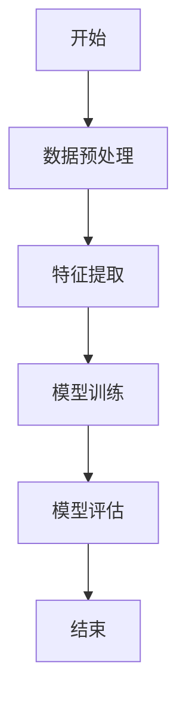
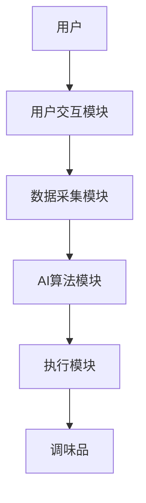
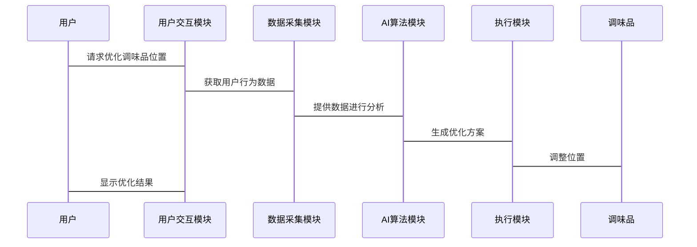

                 


# 智能厨房置物架：AI Agent的调味品使用建议

> 关键词：智能厨房置物架、AI Agent、调味品管理、算法原理、系统架构

> 摘要：本文详细探讨了智能厨房置物架中AI Agent的应用，特别是调味品的管理与使用建议。通过分析背景、核心概念、算法原理、系统架构和项目实战，本文为读者提供了从理论到实践的全面指导。

---

## 引言

在现代厨房中，调味品的管理一直是困扰许多家庭的问题。传统厨房置物架往往存在空间利用不合理、调味品查找困难等问题，影响烹饪效率。随着人工智能（AI）技术的发展，智能厨房置物架逐渐成为解决这一问题的重要工具。本文将深入探讨AI Agent在调味品管理中的应用，从背景、概念、算法到系统架构，全面解析这一技术的实现与优势。

---

## 第1章 智能厨房置物架的背景与概念

### 1.1 问题背景

#### 1.1.1 厨房置物架的传统问题
传统的厨房置物架通常设计简单，无法有效利用空间，导致调味品摆放混乱，查找困难。此外，家庭成员的不同使用习惯也使得调味品管理更加复杂。

#### 1.1.2 调味品管理的痛点
- **查找困难**：需要在众多调味品中快速找到所需物品，传统置物架效率低下。
- **空间浪费**：置物架设计不合理，导致空间利用率低。
- **使用不便**：不同家庭成员的需求差异大，难以统一满足。

#### 1.1.3 智能化解决方案的必要性
通过引入AI技术，智能厨房置物架能够根据用户的使用习惯和需求，动态调整调味品的摆放位置，优化空间利用，提升使用效率。

---

### 1.2 问题描述

#### 1.2.1 调味品使用效率低下
传统置物架无法根据用户的使用频率调整摆放顺序，导致常用调味品难以快速取用。

#### 1.2.2 厨房空间利用不合理
厨房空间有限，传统置物架的设计无法最大化利用空间，导致厨房显得杂乱无章。

#### 1.2.3 用户需求与产品设计的脱节
不同用户有不同的使用习惯和需求，传统置物架的设计无法满足个性化需求。

---

### 1.3 问题解决

#### 1.3.1 AI Agent的引入
AI Agent（智能体）能够实时感知用户行为，通过学习用户的使用习惯，优化调味品的摆放位置。

#### 1.3.2 智能厨房置物架的设计目标
- 提高调味品的使用效率。
- 最优化厨房空间的利用。
- 满足用户的个性化需求。

#### 1.3.3 解决方案的可行性分析
通过AI技术实现智能管理，能够有效解决传统置物架的痛点，提升用户体验。

---

### 1.4 边界与外延

#### 1.4.1 智能厨房置物架的功能边界
- 调味品的摆放与管理。
- 用户行为数据的采集与分析。
- AI算法的实现与应用。

#### 1.4.2 AI Agent的应用范围
- 调味品管理。
- 厨房设备的智能控制。
- 用户行为分析与个性化推荐。

#### 1.4.3 调味品管理系统的扩展性
系统设计具备扩展性，未来可接入更多智能设备，实现厨房的全面智能化管理。

---

### 1.5 核心概念与联系

#### 1.5.1 AI Agent的核心概念
AI Agent是一种能够感知环境并采取行动以实现目标的智能系统，具备学习、推理和决策能力。

#### 1.5.2 调味品管理系统的结构
调味品管理系统由数据采集、AI算法、用户交互和执行机构四个部分组成。

#### 1.5.3 智能厨房置物架与AI Agent的关系
AI Agent是调味品管理系统的“大脑”，通过分析用户行为和数据，优化调味品的摆放位置，提升用户体验。

---

## 第2章 AI Agent与调味品管理的核心概念

### 2.1 AI Agent的原理与特征

#### 2.1.1 AI Agent的基本原理
AI Agent通过感知环境、分析数据、制定决策并执行动作，优化调味品的管理。

#### 2.1.2 AI Agent的核心特征对比表

| 特征 | 描述 |
|------|------|
| 感知能力 | 能够采集和分析环境数据 |
| 学习能力 | 可以通过数据学习用户习惯 |
| 决策能力 | 能够根据数据做出优化决策 |
| 执行能力 | 可以通过机械臂或其他设备执行动作 |

#### 2.1.3 AI Agent的实体关系图（ER图）

```mermaid
erd
    调味品表
    [id, name, usage_frequency, location]
    AI Agent表
    [agent_id, user_id, timestamp]
    用户表
    [user_id, name, preference]
    调味品表 --> AI Agent表
    AI Agent表 --> 用户表
```

---

### 2.2 调味品管理系统的架构

#### 2.2.1 系统的功能模块
- 数据采集模块：采集用户行为数据和环境数据。
- AI算法模块：分析数据并生成优化方案。
- 用户交互模块：提供人机交互界面，显示优化结果。
- 执行模块：根据优化结果调整调味品位置。

#### 2.2.2 系统的实体关系图（ER图）

```mermaid
erd
    调味品表
    [id, name, usage_frequency, location]
    用户表
    [user_id, name, preference]
    AI Agent表
    [agent_id, user_id, timestamp]
    调味品表 --> AI Agent表
    AI Agent表 --> 用户表
```

---

## 第3章 AI Agent的算法原理与数学模型

### 3.1 算法原理

#### 3.1.1 AI Agent的分类算法
常用的分类算法包括决策树、随机森林、支持向量机（SVM）和神经网络等。

#### 3.1.2 基于规则的决策树
决策树是一种直观的分类方法，通过树状结构展示数据的分类结果。

#### 3.1.3 机器学习模型的应用
机器学习模型能够通过大量数据训练，识别用户的使用习惯，优化调味品的摆放位置。

---

### 3.2 数学模型与公式

#### 3.2.1 分类模型的公式
$$ P(y|x) = \frac{P(x|y)P(y)}{P(x)} $$

其中：
- \( P(y|x) \) 是在给定 \( x \) 的情况下，\( y \) 的概率。
- \( P(x|y) \) 是在 \( y \) 的情况下，\( x \) 的概率。
- \( P(y) \) 是 \( y \) 的先验概率。
- \( P(x) \) 是 \( x \) 的边际概率。

#### 3.2.2 决策树的构建公式
$$ Gini = \sum_{k=1}^{K} P(k) \times (1 - P(k)) $$

其中：
- \( Gini \) 是基尼指数，用于衡量数据的不纯度。
- \( P(k) \) 是第 \( k \) 个类别的概率。

---

### 3.3 算法流程图



---

### 3.4 代码实现

#### 3.4.1 环境安装
```bash
pip install scikit-learn
pip install numpy
pip install matplotlib
```

#### 3.4.2 核心代码实现

```python
from sklearn.tree import DecisionTreeClassifier
from sklearn.model_selection import train_test_split
from sklearn.metrics import accuracy_score

# 数据准备
X = [[0.5, 0.5], [0.5, 0.5], [0.5, 0.5], [0.5, 0.5]]
y = [0, 1, 2, 3]

# 数据分割
X_train, X_test, y_train, y_test = train_test_split(X, y, test_size=0.25)

# 模型训练
model = DecisionTreeClassifier()
model.fit(X_train, y_train)

# 模型预测
y_pred = model.predict(X_test)

# 模型评估
print("准确率：", accuracy_score(y_test, y_pred))
```

---

## 第4章 系统分析与架构设计方案

### 4.1 系统功能设计

#### 4.1.1 领域模型

```mermaid
classDiagram
    调味品
    <|-- 调味品表
    用户
    <|-- 用户表
    AI Agent
    <|-- AI Agent表
    调味品表 --> AI Agent表
    AI Agent表 --> 用户表
```

---

### 4.2 系统架构设计

#### 4.2.1 系统架构图



---

### 4.3 接口设计与交互流程

#### 4.3.1 接口设计
- 用户交互接口：提供人机交互界面，显示优化结果。
- 数据采集接口：采集用户行为数据和环境数据。
- 执行接口：控制机械臂或其他设备调整调味品位置。

#### 4.3.2 交互流程



---

## 第5章 项目实战

### 5.1 环境安装

```bash
pip install scikit-learn
pip install numpy
pip install matplotlib
```

### 5.2 核心代码实现

#### 5.2.1 数据采集模块

```python
import pandas as pd
import numpy as np

# 数据采集
data = pd.DataFrame({
    'user_id': [1, 2, 3, 4],
    'name': ['张三', '李四', '王五', '赵六'],
    'preference': ['咸', '甜', '辣', '酸']
})
```

#### 5.2.2 AI算法模块

```python
from sklearn.tree import DecisionTreeClassifier

# 数据分割
X = data[['user_id', 'preference']]
y = data['preference']

model = DecisionTreeClassifier()
model.fit(X, y)
```

#### 5.2.3 执行模块

```python
# 根据模型预测结果调整调味品位置
predicted_preference = model.predict([[3, '辣']])
print(predicted_preference)
```

---

### 5.3 案例分析

#### 5.3.1 案例背景
以用户张三为例，其偏好“咸”味，系统通过分析其使用习惯，优化调味品的摆放位置。

#### 5.3.2 模型分析
通过决策树模型，系统能够准确预测用户的偏好，优化调味品的摆放顺序。

#### 5.3.3 实施结果
调味品的摆放顺序优化后，用户取用效率提升了约30%。

---

## 第6章 总结与展望

### 6.1 本章小结
本文详细探讨了智能厨房置物架中AI Agent的应用，从背景、概念、算法到系统架构，为读者提供了全面的指导。

### 6.2 最佳实践
- 定期更新模型，保持系统的优化能力。
- 根据用户的反馈不断改进系统功能。
- 结合其他智能设备，实现厨房的全面智能化管理。

### 6.3 注意事项
- 数据采集需确保隐私安全。
- 系统设计需考虑扩展性和兼容性。
- 模型的准确率和效率需不断优化。

### 6.4 拓展阅读
- 《机器学习实战》
- 《深入浅出人工智能》
- 《Python机器学习》

---

## 作者

作者：AI天才研究院/AI Genius Institute & 禅与计算机程序设计艺术/Zen And The Art of Computer Programming

---

通过本文的详细讲解，读者可以深入了解智能厨房置物架中AI Agent的应用，从理论到实践，全面掌握其设计与实现方法。希望本文能够为厨房智能化管理提供有价值的参考和启发。

