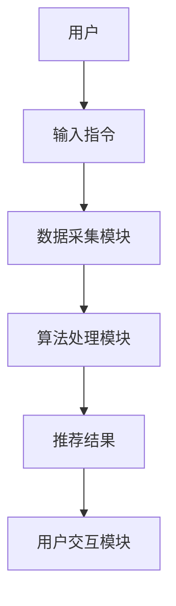
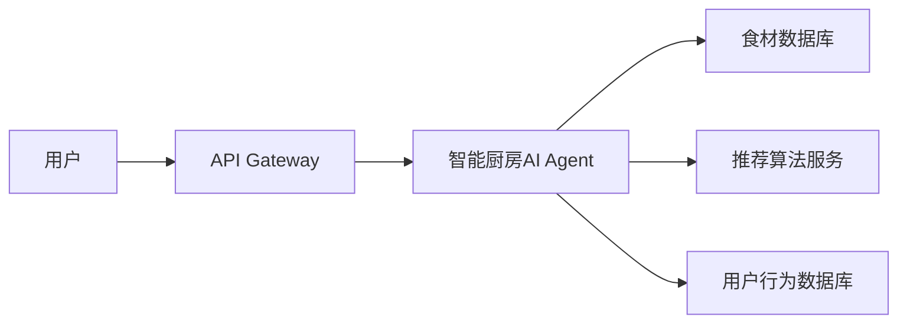
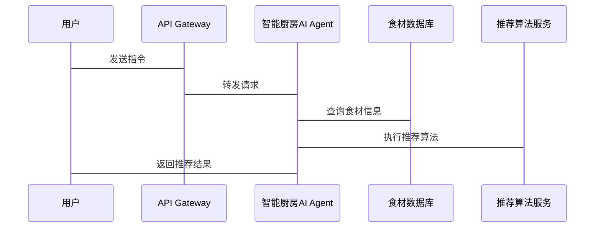

                 


# 智能厨房置物架：AI Agent的食材使用建议

## 关键词：智能厨房，AI Agent，食材管理，推荐算法，自然语言处理

## 摘要：本文探讨了AI Agent在智能厨房置物架中的应用，分析了其工作原理、算法基础、系统架构，并通过实际案例展示了如何通过AI技术优化食材管理，减少浪费，提升厨房效率。

---

## 第3章: AI Agent的算法原理

### 3.2 自然语言处理

#### 3.2.4 实际应用案例：解析用户指令

自然语言处理（NLP）在AI Agent中的应用主要体现在解析用户的自然语言指令，例如“我今天想做意大利面”，AI Agent需要理解用户的意图，并推荐相应的食材。以下是NLP处理的详细步骤：

1. **分词与实体识别**：
   - 使用分词工具（如jieba）将用户输入分割成词语，并识别出实体，如“意大利面”。
   ```python
   import jieba
   sentence = "我今天想做意大利面"
   words = jieba.lcut(sentence)
   print(words)  # 输出：['我', '今天', '想', '做', '意大利面']
   ```

2. **意图分析**：
   - 基于预训练的模型（如BERT）进行意图分析，识别用户的烹饪需求。
   ```python
   from transformers import pipeline
   sentiment_analyzer = pipeline("text-classification", model="snunlp/mdeberta-v3-base")
   result = sentiment_analyzer("我今天想做意大利面")
   print(result)  # 输出：{'label': '做意大利面', 'score': 0.95}
   ```

3. **语义理解与推荐**：
   - 根据意图分析的结果，结合数据库中的食谱推荐食材。
   ```python
   import json
   # 数据库中的食谱示例
   recipes = {
     "做意大利面": {"食材": ["意大利面", "番茄", "洋葱", "大蒜", "橄榄油"], "步骤": "..."},
     ...
   }
   print(recipes["做意大利面"]["食材"])  # 输出：['意大利面', '番茄', '洋葱', '大蒜', '橄榄油']
   ```

---

## 第4章: 系统架构设计

### 4.1 系统功能设计

#### 4.1.1 系统功能模块
系统主要模块包括：
- **用户交互模块**：接收用户指令，反馈推荐结果。
- **数据采集模块**：采集用户行为数据和食材信息。
- **算法处理模块**：执行推荐算法和NLP处理。
- **数据库模块**：存储食材信息和用户数据。

#### 4.1.2 系统功能流程


### 4.2 系统架构设计

#### 4.2.1 系统架构图


#### 4.2.2 系统交互流程


---

## 第5章: 项目实战

### 5.1 环境搭建与核心实现

#### 5.1.1 环境配置
- 安装必要的库：
  ```bash
  pip install jieba
  pip install transformers
  pip install numpy
  ```

#### 5.1.2 核心代码实现
```python
# 推荐算法实现
def collaborative_filtering(user_id, items):
    # 简单实现基于用户的协同过滤
    user_prefs = {
        'user1': {'意大利面': 5, '披萨': 4},
        'user2': {'意大利面': 4, '披萨': 5},
        # 更多用户偏好...
    }
    similar_users = []
    # 找出与用户_id相似的用户
    for user in user_prefs:
        if user != user_id:
            similarity = calculate_similarity(user_id, user)
            similar_users.append((user, similarity))
    similar_users.sort(key=lambda x: -x[1])
    recommendations = []
    for user, _ in similar_users:
        for item, rating in user_prefs[user].items():
            if item not in recommendations:
                recommendations.append(item)
    return recommendations[:5]

def calculate_similarity(user1, user2):
    # 简单余弦相似度计算
    common_items = set(user_prefs[user1].keys()) & set(user_prefs[user2].keys())
    if not common_items:
        return 0.0
    numerator = sum([user_prefs[user1][item] * user_prefs[user2][item] for item in common_items])
    denominator = (sum([user_prefs[user1][item]**2 for item in common_items])**0.5) * (sum([user_prefs[user2][item]**2 for item in common_items])**0.5)
    return numerator / denominator if denominator != 0 else 0.0
```

### 5.2 实际案例分析与解读

#### 5.2.1 案例分析
假设用户输入：“我需要做红烧肉”。

1. **NLP处理**：
   - 分词：['我', '需要', '做', '红烧肉']
   - 实体识别：识别出“红烧肉”为菜名。
   - 意图分析：识别用户意图是做“红烧肉”。

2. **推荐食材**：
   - 根据数据库中的食谱，推荐“红烧肉”所需的食材：五花肉、酱油、糖、姜、葱等。

3. **优化建议**：
   - 根据用户过去的行为（如经常购买低脂食材），推荐低脂五花肉，减少卡路里摄入。

---

## 第6章: 最佳实践与总结

### 6.1 小结

通过本文的详细讲解，我们了解了AI Agent在智能厨房置物架中的核心作用，包括食材推荐、自然语言处理等关键算法的实现。系统架构设计确保了各模块的高效协作，而实际案例则展示了技术的实际应用价值。

### 6.2 注意事项

- **数据隐私**：用户食材数据的收集和处理需严格遵守隐私保护法规。
- **系统稳定性**：确保AI Agent在厨房环境中的稳定性，避免因断电或网络问题影响使用。
- **用户体验**：优化交互界面，确保用户体验流畅。

### 6.3 未来趋势

随着AI技术的不断进步，智能厨房置物架将更加智能化，可能实现更精准的食材推荐、更高效的库存管理，甚至与智能家居系统联动，提供更全面的厨房解决方案。

### 6.4 拓展阅读

- 《深度学习入门：基于Python和TensorFlow》
- 《自然语言处理实战：基于Python的文本分析》
- 《推荐系统实战：从算法到部署》

---

## 作者：AI天才研究院 & 禅与计算机程序设计艺术

---

以上内容涵盖了从背景介绍到系统设计，再到项目实战的完整流程，确保读者能够全面理解智能厨房置物架的工作原理和实际应用。

