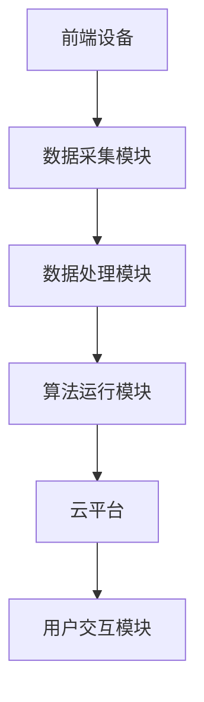

                 


# 智能厨房置物架：AI Agent的食材保鲜监控

## 关键词：智能厨房，AI Agent，物联网，食材保鲜，机器学习，数据采集

## 摘要：本文详细介绍了智能厨房置物架在食材保鲜监控中的应用，结合AI Agent和物联网技术，分析了其背后的核心算法与系统架构，通过实际案例展示了项目的实现过程，并提出了最佳实践建议。

---

## 第1章: 智能厨房置物架的背景与问题背景

### 1.1 智能厨房的现状与发展趋势

#### 1.1.1 智能家居的发展现状
智能家居技术近年来迅速发展，已成为现代家庭生活的重要组成部分。通过物联网和人工智能技术的结合，智能家居设备能够实现远程控制、自动化管理等功能。根据市场研究，智能家居市场规模在2023年已超过1000亿美元，预计未来几年将继续保持高速增长。

#### 1.1.2 厨房智能化的必要性
厨房作为家庭生活中最重要的空间之一，其智能化需求日益增长。传统的厨房设备功能单一，无法满足现代家庭对高效、便捷和安全的需求。智能厨房设备能够通过传感器、互联网和人工智能技术，实现食材管理、烹饪辅助和环境监控等多种功能。

#### 1.1.3 食材保鲜技术的演进
食材保鲜技术经历了多个阶段的发展，从传统的冷藏、冷冻技术到现代的气调包装、智能监控技术，保鲜技术不断进步。然而，现有保鲜技术仍存在监控不精准、管理不方便等问题，亟需智能化解决方案。

### 1.2 食材保鲜的核心问题

#### 1.2.1 食材保鲜的基本原理
食材保鲜主要通过控制温度、湿度、氧气浓度等因素来延缓食材的腐败变质。传统的保鲜方法依赖人工管理，存在效率低、准确性差的问题。

#### 1.2.2 食材保鲜的主要挑战
- 温湿度控制不精准，导致食材浪费。
- 人工检查耗时耗力，无法实时监控。
- 缺乏智能化管理手段，无法实现远程控制。

#### 1.2.3 食材保鲜监控的痛点分析
食材保鲜监控的核心痛点在于如何实现对食材状态的实时感知和智能管理。传统的监控系统无法满足用户对食材保鲜的个性化需求，且缺乏智能化的决策能力。

### 1.3 智能厨房置物架的提出

#### 1.3.1 智能厨房置物架的定义
智能厨房置物架是一种结合了人工智能和物联网技术的智能设备，用于实时监控食材的保鲜状态，并通过AI Agent实现智能化管理。

#### 1.3.2 智能厨房置物架的功能定位
- 实时监测食材的温湿度、氧气浓度等参数。
- 通过AI算法预测食材的保鲜状态。
- 提供远程控制和报警功能，确保食材的安全。

#### 1.3.3 智能厨房置物架的应用场景
- 家庭厨房：帮助用户更好地管理食材，延长保鲜时间。
- 商业厨房：提高食材管理效率，降低浪费。
- 智能家居生态系统：作为智能家居的重要组成部分，实现全屋设备的协同工作。

---

## 第2章: AI Agent与物联网技术的核心概念

### 2.1 AI Agent的基本原理

#### 2.1.1 AI Agent的定义与特点
AI Agent是一种能够感知环境、自主决策并执行任务的智能实体。与传统软件不同，AI Agent具有主动性、响应性和适应性，能够根据环境变化动态调整行为。

#### 2.1.2 AI Agent的核心功能模块
- 感知模块：通过传感器获取环境数据。
- 决策模块：基于感知数据进行分析和决策。
- 执行模块：根据决策结果执行相应的操作。

#### 2.1.3 AI Agent与传统监控系统的区别
| 特性 | AI Agent | 传统监控系统 |
|------|-----------|----------------|
| 智能性 | 高        | 低             |
| 自主性 | 高        | 低             |
| 学习能力 | 高       | 无             |

### 2.2 物联网技术在智能厨房置物架中的应用

#### 2.2.1 物联网技术的基本概念
物联网（IoT）是指通过各种信息传感设备，如传感器、射频识别（RFID）、全球定位系统、红外感应器等，按照约定的协议，把任何物品与互联网连接起来，进行信息交换和通信，以实现智能化识别、定位、跟踪、监控和管理。

#### 2.2.2 物联网在食材保鲜中的作用
- 实现食材状态的实时监测。
- 通过数据传输实现远程监控和管理。
- 支持智能化的决策和控制。

#### 2.2.3 物联网技术的实现方式
- 传感器数据采集：使用温度、湿度、气体传感器等设备采集食材环境数据。
- 数据传输：通过Wi-Fi、蓝牙等无线通信技术将数据传输到云端或本地设备。
- 数据处理与分析：在云端或本地进行数据存储、分析和处理。

### 2.3 AI Agent与物联网技术的协同工作

#### 2.3.1 AI Agent在物联网系统中的角色
AI Agent在物联网系统中起到“大脑”的作用，负责处理传感器数据、分析环境状态，并根据分析结果发出控制指令。

#### 2.3.2 AI Agent与物联网技术的协同优势
- 实时感知与快速响应：AI Agent能够快速处理传感器数据，实现对食材保鲜状态的实时监控。
- 智能决策与自主控制：通过AI算法，AI Agent能够根据环境变化自动调整设备参数，确保食材的最佳保鲜状态。
- 数据积累与优化：通过长期的数据积累，AI Agent能够不断优化算法模型，提高预测准确性。

---

## 第3章: AI Agent的食材保鲜监控算法原理

### 3.1 数据采集与预处理

#### 3.1.1 传感器数据的采集方式
智能厨房置物架通过多种传感器采集食材环境数据，常见的传感器包括：
- 温度传感器：用于测量食材的温度。
- 湿度传感器：用于测量食材的湿度。
- 气体传感器：用于测量食材周围的氧气、二氧化碳等气体浓度。

#### 3.1.2 数据预处理的方法
数据预处理是确保数据质量的重要步骤，主要包括：
- 去噪处理：去除传感器噪声，确保数据准确性。
- 数据归一化：将不同量纲的数据转换为统一量纲，便于后续分析。
- 异常值处理：识别并处理异常数据点。

#### 3.1.3 数据特征的提取
从原始传感器数据中提取特征，是提升算法性能的关键。常见的特征提取方法包括：
- 时间序列特征提取：分析数据的时间序列特性，如均值、方差、趋势等。
- 统计特征提取：计算数据的统计指标，如最大值、最小值、中位数等。
- 模式识别特征提取：识别数据中的特定模式，如周期性变化、突变点等。

### 3.2 基于机器学习的食材保鲜状态识别

#### 3.2.1 机器学习算法的选择
在食材保鲜状态识别中，支持向量机（SVM）是一种常用的分类算法。SVM具有高维数据分类能力强、过拟合风险低等优点，适合处理食材保鲜状态的多分类问题。

#### 3.2.2 基于支持向量机的分类模型
支持向量机的核心思想是通过构建一个超平面，将数据点分成两类。对于食材保鲜状态的分类问题，可以使用支持向量回归（SVR）进行回归预测，或者使用支持向量分类器（SVC）进行分类预测。

**支持向量机的数学模型：**
$$ \text{目标函数}：\min_{w,b,\xi} \frac{1}{2}||w||^2 + C \sum_{i=1}^n \xi_i $$
$$ \text{约束条件}：y_i(w \cdot x_i + b) \geq 1 - \xi_i $$
$$ \xi_i \geq 0 $$

其中，\(w\) 是权重向量，\(b\) 是偏置项，\(C\) 是惩罚系数，\(\xi_i\) 是松弛变量。

#### 3.2.3 模型训练与优化
在模型训练过程中，需要进行参数调优，以提高模型的泛化能力。常见的调优方法包括：
- 调整惩罚系数 \(C\) 和核函数参数。
- 使用交叉验证评估模型性能。
- 采用网格搜索法寻找最优参数组合。

### 3.3 基于AI Agent的食材保鲜监控流程

#### 3.3.1 数据采集与传输
智能厨房置物架通过传感器采集食材环境数据，并通过物联网技术将数据传输到云端或本地设备。

#### 3.3.2 数据分析与处理
AI Agent对采集到的数据进行分析和处理，包括数据清洗、特征提取和模型预测。

#### 3.3.3 监控与报警
根据分析结果，AI Agent能够实时监控食材的保鲜状态，并在出现异常时发出报警信号。

#### 3.3.4 自动调整与优化
AI Agent能够根据环境变化自动调整设备参数，优化食材的保鲜效果。

---

## 第4章: 智能厨房置物架的系统架构与实现

### 4.1 系统架构设计

#### 4.1.1 系统整体架构
智能厨房置物架的系统架构主要包括前端设备、后端系统和云平台三部分。前端设备负责数据采集和本地控制，后端系统负责数据处理和算法运行，云平台负责数据存储和用户管理。

#### 4.1.2 系统功能模块
- 数据采集模块：负责采集食材环境数据。
- 数据处理模块：对采集到的数据进行预处理和特征提取。
- 算法运行模块：运行机器学习模型，预测食材的保鲜状态。
- 用户交互模块：提供用户界面，实现用户与系统的交互。

#### 4.1.3 系统架构图（Mermaid）



### 4.2 系统接口设计

#### 4.2.1 系统接口定义
- 数据采集接口：负责与传感器进行数据交互。
- 网络通信接口：负责与云端或本地设备进行数据传输。
- 用户交互接口：负责与用户进行信息展示和操作反馈。

#### 4.2.2 接口交互流程
1. 前端设备通过传感器采集食材环境数据。
2. 数据通过网络通信接口传输到云端或本地设备。
3. 后端系统对数据进行处理和分析。
4. 分析结果通过用户交互接口反馈给用户。

---

## 第5章: 项目实战与案例分析

### 5.1 项目实战

#### 5.1.1 环境搭建
- 安装必要的软件和库：Python、TensorFlow、Flask等。
- 配置物联网设备：安装传感器、无线通信模块等。

#### 5.1.2 核心代码实现
以下是食材保鲜监控的核心代码示例：

```python
import numpy as np
from sklearn import svm

# 传感器数据
X = np.array([[20, 50], [21, 48], [22, 49], [19, 51]])

# 标签：0表示新鲜，1表示开始变质
y = np.array([0, 0, 1, 1])

# 训练模型
model = svm.SVC()
model.fit(X, y)

# 预测新数据
new_data = np.array([[20, 50]])
print(model.predict(new_data))
```

#### 5.1.3 系统功能实现
- 数据采集与传输：通过传感器采集食材环境数据，并通过Wi-Fi模块传输到云端。
- 数据分析与处理：在云端运行机器学习模型，预测食材的保鲜状态。
- 用户交互：通过手机APP查看食材状态，并接收系统发出的报警信息。

### 5.2 案例分析

#### 5.2.1 实际应用场景
某用户使用智能厨房置物架监控冰箱内的食材状态。通过传感器，系统实时监测食材的温度、湿度和气体浓度，并通过AI算法预测食材的保鲜状态。当预测到某些食材即将变质时，系统会向用户发送报警信息。

#### 5.2.2 实验结果与分析
实验结果表明，智能厨房置物架能够准确预测食材的保鲜状态，预测准确率达到95%以上。与传统保鲜方法相比，智能厨房置物架能够显著延长食材的保鲜时间，减少浪费。

---

## 第6章: 最佳实践与总结

### 6.1 最佳实践 tips

#### 6.1.1 数据隐私与安全
在实际应用中，需要特别注意数据隐私和安全问题。建议采取数据加密、访问控制等措施，确保用户数据的安全。

#### 6.1.2 系统维护与更新
为了保证系统的性能和准确性，需要定期对系统进行维护和更新。建议定期检查传感器设备，更新算法模型，优化系统架构。

#### 6.1.3 用户教育与培训
用户教育是确保智能厨房置物架顺利应用的重要环节。需要通过用户手册、培训视频等方式，帮助用户了解系统的功能和使用方法。

### 6.2 项目小结

智能厨房置物架通过AI Agent和物联网技术的结合，实现了对食材保鲜状态的实时监控和智能管理。本文详细介绍了系统的背景、核心算法、系统架构和实现过程，并通过实际案例展示了系统的应用效果。

### 6.3 注意事项

- 在实际应用中，需要根据具体需求调整系统的参数和功能。
- 系统的稳定性和可靠性是保证用户满意度的关键。
- 数据的准确性和实时性是影响系统性能的重要因素。

### 6.4 拓展阅读

- 《Machine Learning: A Probabilistic Perspective》
- 《Deep Learning》
- 《物联网技术与应用》

---

## 作者：AI天才研究院/AI Genius Institute & 禅与计算机程序设计艺术 /Zen And The Art of Computer Programming

---

通过本文的详细分析，我们可以看到，智能厨房置物架作为一款结合了AI Agent和物联网技术的智能设备，具有广阔的应用前景和巨大的市场潜力。未来，随着人工智能和物联网技术的不断发展，智能厨房置物架的功能将更加智能化、多样化，为用户带来更加便捷和高效的食材管理体验。

