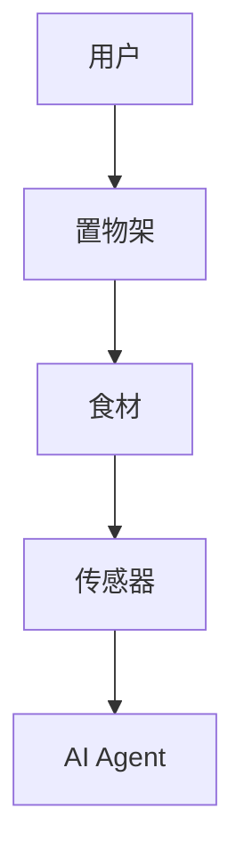
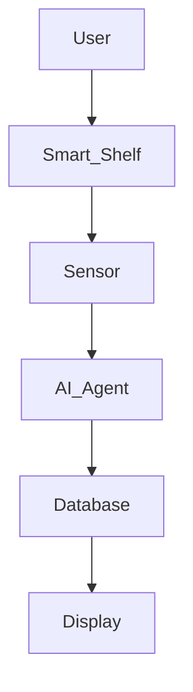
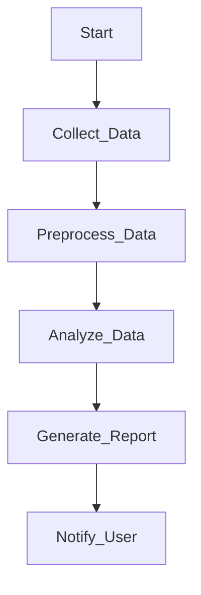
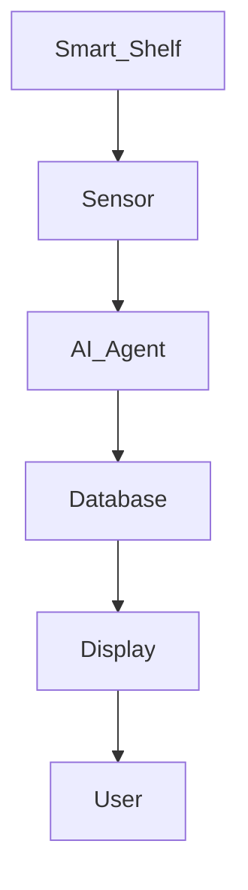

                 


# 智能厨房置物架：AI Agent的食材新鲜度监测

> 关键词：智能厨房置物架、AI Agent、食材新鲜度监测、物联网技术、机器学习算法、系统架构设计

> 摘要：本文深入探讨了智能厨房置物架在食材新鲜度监测中的应用，结合AI Agent技术，详细分析了其实现原理、系统架构设计、算法优化策略及实际应用场景。文章从背景介绍、核心概念、算法原理、系统架构、项目实战等多个维度展开，为读者提供了全面的技术解读和实践指导。

---

# 第一部分: 智能厨房置物架背景与核心概念

## 第1章: 问题背景与需求分析

### 1.1 问题背景介绍

#### 1.1.1 食材新鲜度管理的重要性
食材的新鲜度直接影响到食品的安全性和营养价值。传统的食材管理方式依赖于人工检查，这种方式效率低、易出错，且难以实现精准监测。随着智能家居和物联网技术的快速发展，通过智能化设备实现食材新鲜度的实时监测成为可能。

#### 1.1.2 智能厨房置物架的出现背景
智能厨房置物架是一种结合了物联网技术、AI算法和传感器技术的智能化设备，旨在通过实时监测食材的状态，帮助用户更好地管理食材，延长食材的保鲜时间，避免浪费。

#### 1.1.3 当前食材管理的主要痛点
- 传统管理方式耗时耗力，容易遗漏。
- 食材新鲜度的判断依赖人工经验，主观性强。
- 现有智能设备功能单一，缺乏AI辅助。

### 1.2 问题描述与目标设定

#### 1.2.1 食材新鲜度监测的核心问题
如何通过传感器和AI算法，实现对食材新鲜度的实时、精准监测，并提供相应的提醒和建议。

#### 1.2.2 智能置物架的目标功能
- 实时监测食材的新鲜度。
- 提供智能化的管理建议。
- 通过物联网技术实现数据的上传和分析。
- 提供用户友好的交互界面。

#### 1.2.3 边界与外延
- 边界：仅关注食材的新鲜度监测，不涉及食材的存储和烹饪。
- 外延：可扩展至其他智能家居设备，形成完整的厨房智能化解决方案。

### 1.3 核心概念与系统组成

#### 1.3.1 AI Agent的基本概念
AI Agent是一种能够感知环境、做出决策并执行任务的智能体。在智能厨房置物架中，AI Agent负责接收传感器数据，分析食材的新鲜度，并向用户或系统发送指令。

#### 1.3.2 智能置物架的组成结构
智能置物架主要由以下几个部分组成：
- **传感器模块**：用于采集食材的温度、湿度、气体浓度等数据。
- **AI Agent模块**：负责数据的分析和决策。
- **用户交互模块**：提供用户友好的操作界面。
- **物联网通信模块**：实现数据的上传和远程控制。

#### 1.3.3 核心要素与功能模块
- **传感器模块**：包括温度传感器、湿度传感器、气体传感器等。
- **AI Agent模块**：包括数据预处理、特征提取、模型训练和预测。
- **用户交互模块**：包括显示界面、语音提示、手机APP等。
- **物联网通信模块**：包括Wi-Fi、蓝牙、ZigBee等通信协议。

---

## 第2章: 核心概念与系统架构

### 2.1 AI Agent的基本原理

#### 2.1.1 AI Agent的定义与分类
AI Agent可以分为两类：基于规则的Agent和基于学习的Agent。在智能厨房置物架中，我们采用基于机器学习的AI Agent，通过训练模型实现对食材新鲜度的预测。

#### 2.1.2 基于AI的食材新鲜度监测算法
食材新鲜度监测算法的核心是通过传感器数据训练一个分类模型，将食材的状态分为新鲜、即将变质和已变质三种状态。

#### 2.1.3 系统的核心算法流程
- 数据采集：通过传感器获取食材的温度、湿度、气体浓度等数据。
- 数据预处理：对数据进行标准化和归一化处理。
- 特征提取：提取关键特征，如温度变化率、湿度波动幅度等。
- 模型训练：使用支持向量机（SVM）或随机森林（Random Forest）等算法训练分类模型。
- 预测与决策：根据实时数据，预测食材的新鲜度，并向用户发送提醒。

### 2.2 实体关系与系统架构

#### 2.2.1 实体关系图（ER图）


#### 2.2.2 系统架构图


### 2.3 核心算法与流程

#### 2.3.1 食材新鲜度监测流程


---

## 第3章: 算法原理与实现

### 3.1 算法选择与优化

#### 3.1.1 机器学习算法的选择
支持向量机（SVM）和随机森林（Random Forest）是常用的分类算法。在食材新鲜度监测中，SVM表现优于随机森林，因为它更适合处理小规模数据。

#### 3.1.2 数据预处理与特征提取
- 数据预处理：去除噪声、归一化处理。
- 特征提取：提取温度、湿度、气体浓度等关键特征。

#### 3.1.3 算法实现与优化
- 使用Python的scikit-learn库实现SVM模型。
- 通过交叉验证优化模型参数。

#### 3.1.4 数学模型与公式
- SVM的目标函数：
  $$ \min_{w,b,\xi} \frac{1}{2}||w||^2 + C\sum_{i=1}^n \xi_i $$
- 约束条件：
  $$ y_i(w \cdot x_i + b) \geq 1 - \xi_i $$
  $$ \xi_i \geq 0 $$

### 3.2 系统功能与架构设计

#### 3.2.1 系统功能设计
- 传感器数据采集：温度、湿度、气体浓度。
- 数据分析：AI Agent实时分析数据。
- 用户通知：通过手机APP或语音助手提醒食材状态。

#### 3.2.2 系统架构设计


---

## 第4章: 项目实战与代码实现

### 4.1 环境安装与配置

#### 4.1.1 硬件安装
- 安装温度传感器（DHT11）和气体传感器（MQ-135）。
- 将传感器连接到Raspberry Pi。

#### 4.1.2 软件安装
- 安装Python和必要的库（如Raspbian OS、scikit-learn、paho-mqtt）。

### 4.2 系统核心实现

#### 4.2.1 数据采集与处理
```python
import Adafruit_DHT
import Adafruit_MQ_135

def get_sensor_data():
    humidity, temperature = Adafruit_DHT.read_retry(DHT11, 4)
    gas = Adafruit_MQ_135.read MQ135()
    return {"temperature": temperature, "humidity": humidity, "gas": gas}
```

#### 4.2.2 AI Agent实现
```python
from sklearn import svm

def train_model(X_train, y_train):
    clf = svm.SVC()
    clf.fit(X_train, y_train)
    return clf

def predict(model, X_test):
    return model.predict(X_test)
```

#### 4.2.3 数据库与通信
```python
import paho.mqtt.client as mqtt

def on_publish(client, userdata, mid):
    print("数据已发送")

client = mqtt.Client()
client.connect("localhost", 1883)
client.on_publish = on_publish
```

---

## 第5章: 最佳实践与小结

### 5.1 最佳实践
- 定期校准传感器，确保数据准确性。
- 优化AI模型，提升预测精度。
- 提供多平台支持，方便用户使用。

### 5.2 小结
本文详细介绍了智能厨房置物架的实现原理、系统架构和算法优化策略。通过实际案例分析，展示了如何利用AI Agent实现食材新鲜度的实时监测。未来，随着AI和物联网技术的进一步发展，智能厨房置物架将更加智能化和人性化。

### 5.3 注意事项
- 确保数据安全，避免用户隐私泄露。
- 定期维护系统，确保设备正常运行。

### 5.4 拓展阅读
- 推荐阅读《机器学习实战》和《物联网技术入门与实践》。

---

作者：AI天才研究院/AI Genius Institute & 禅与计算机程序设计艺术 /Zen And The Art of Computer Programming

