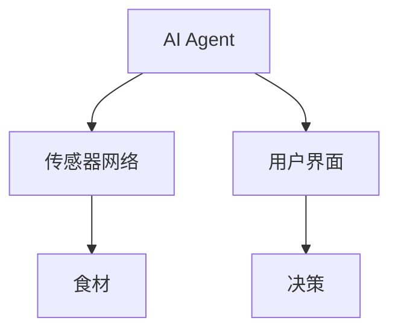
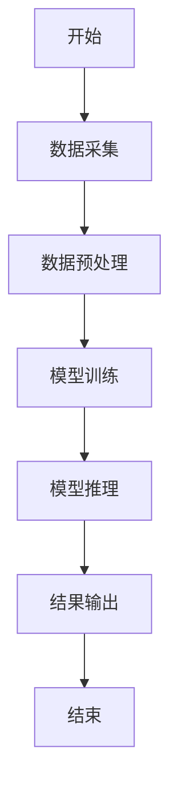
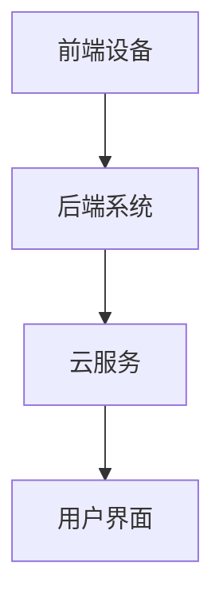
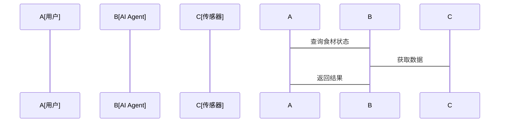

                 


# 智能厨房：AI Agent的食材新鲜度检测

> 关键词：智能厨房，AI Agent，食材新鲜度，传感器技术，机器学习，物联网

> 摘要：本文详细探讨了AI Agent在智能厨房中检测食材新鲜度的技术实现。从背景介绍到系统架构设计，再到项目实战，全面解析了如何利用人工智能技术提升食材管理的智能化水平。文章通过具体案例分析，展示了AI Agent在食材新鲜度检测中的实际应用和优势。

---

# 第一部分: 背景介绍与核心概念

## 第1章: 智能厨房与食材新鲜度检测的背景

### 1.1 问题背景

#### 1.1.1 食材新鲜度的重要性  
食材的新鲜度直接影响烹饪的质量和安全性。新鲜的食材不仅口感更好，还能确保烹饪过程中的营养保留。然而，食材的新鲜度会随着时间的推移逐渐下降，尤其是在高温、潮湿的厨房环境中。传统的食材管理方式依赖人工检查，效率低且容易出错。

#### 1.1.2 现有食材检测方法的局限性  
目前，食材新鲜度的检测主要依赖于感官判断（如颜色、气味、质地等），这种方法主观性强，且难以量化。此外，超市和家庭中缺乏高效的自动化检测手段，导致食材浪费和质量问题。

#### 1.1.3 AI技术在食材检测中的潜力  
人工智能技术，特别是计算机视觉和机器学习，能够通过传感器数据和图像分析，实现对食材新鲜度的精准检测。AI Agent（智能体）可以实时监控食材的状态，并提供相应的建议，从而提升食材管理的智能化水平。

### 1.2 问题描述

#### 1.2.1 食材新鲜度的定义与影响因素  
食材新鲜度是一个综合指标，通常包括颜色、气味、质地、含水量等多个因素。这些因素会随着时间、温度、湿度等环境条件的变化而变化。

#### 1.2.2 智能厨房的定义与应用场景  
智能厨房是指通过物联网技术将厨房设备、传感器和AI系统有机结合，实现智能化管理的厨房环境。应用场景包括食材管理、烹饪辅助、能耗优化等。

#### 1.2.3 AI Agent在智能厨房中的角色  
AI Agent作为智能厨房的核心，负责协调各种设备和传感器，实时分析食材状态，并提供决策支持。

### 1.3 问题解决与边界

#### 1.3.1 AI Agent如何实现食材新鲜度检测  
AI Agent通过集成传感器（如颜色传感器、气体传感器）和摄像头，获取食材的状态数据，结合机器学习模型，判断食材的新鲜度。

#### 1.3.2 检测方法的边界与限制  
食材检测的边界包括食材种类的限制、传感器精度的限制以及模型训练数据的覆盖范围。此外，AI检测结果仅供参考，最终决策仍需结合人工判断。

#### 1.3.3 智能厨房的使用场景与限制  
智能厨房适用于家庭、餐厅和食品加工厂等场景，但目前仍受限于传感器成本和数据处理能力，难以覆盖所有食材类型。

### 1.4 核心概念与结构

#### 1.4.1 AI Agent的基本概念  
AI Agent是一种智能实体，能够感知环境并执行任务。在智能厨房中，AI Agent负责数据采集、分析和决策。

#### 1.4.2 食材新鲜度检测的核心要素  
包括传感器数据、AI算法和用户反馈三个核心要素。

#### 1.4.3 系统架构的核心组成  
系统架构包括传感器网络、AI处理单元和用户界面三个主要部分。

## 第2章: 核心概念与联系

### 2.1 AI Agent的核心原理

#### 2.1.1 AI Agent的基本工作原理  
AI Agent通过传感器获取数据，利用机器学习模型进行分析，生成决策并执行任务。

#### 2.1.2 智能传感器的作用机制  
智能传感器负责采集食材的状态数据，如颜色、温度、湿度等，并将数据传输给AI Agent。

#### 2.1.3 数据采集与处理流程  
数据采集→数据预处理→特征提取→模型分析→结果输出。

### 2.2 核心概念对比

#### 2.2.1 不同食材检测方法的特征对比  
| 检测方法 | 优点 | 缺点 |  
|----------|------|------|  
| 人工检测 | 成本低 | 易出错 |  
| 传感器检测 | 精度高 | 成本高 |  
| AI检测 | 智能化 | 数据依赖性强 |  

#### 2.2.2 AI Agent与其他检测方法的优劣势分析  
AI Agent的优势在于智能化和高精度，但需要依赖传感器数据和模型训练。

#### 2.2.3 系统架构的对比与选择  
模块化架构灵活性高，但复杂度高；单体架构简单，但扩展性差。根据实际需求选择合适的架构。

### 2.3 系统架构实体关系图



---

# 第二部分: 算法原理与数学模型

## 第3章: AI Agent的算法原理

### 3.1 算法原理概述

#### 3.1.1 基于机器学习的食材检测  
使用支持向量机（SVM）或随机森林（RF）模型进行分类。

#### 3.1.2 基于深度学习的食材检测  
利用卷积神经网络（CNN）进行图像识别。

#### 3.1.3 算法选择的依据  
根据数据量和类型选择合适的算法。

### 3.2 算法流程图



### 3.3 算法实现代码

#### 3.3.1 数据预处理代码

```python
import numpy as np
from sklearn.preprocessing import StandardScaler

def preprocess_data(data):
    scaler = StandardScaler()
    data_scaled = scaler.fit_transform(data)
    return data_scaled
```

#### 3.3.2 模型训练代码

```python
from sklearn.svm import SVC

def train_model(X_train, y_train):
    model = SVC()
    model.fit(X_train, y_train)
    return model
```

#### 3.3.3 模型推理代码

```python
def predict(model, X_test):
    y_pred = model.predict(X_test)
    return y_pred
```

### 3.4 数学模型与公式

#### 3.4.1 数据归一化公式  
$$ x_{\text{norm}} = \frac{x - \mu}{\sigma} $$

#### 3.4.2 模型评估公式  
准确率：$$ \text{Accuracy} = \frac{\text{正确预测数}}{\text{总样本数}} $$

---

# 第三部分: 系统分析与架构设计

## 第4章: 系统分析与架构设计

### 4.1 问题场景介绍

#### 4.1.1 场景描述  
智能厨房中，AI Agent通过传感器和摄像头实时监测食材状态。

### 4.2 系统功能设计

#### 4.2.1 功能模块划分  
数据采集模块、数据处理模块、模型推理模块、用户交互模块。

### 4.3 系统架构设计



### 4.4 系统接口设计

#### 4.4.1 API接口  
RESTful API：`/api/v1/freshness`

#### 4.4.2 数据格式  
JSON格式：  
```json
{
    "status": "fresh",
    "probability": 0.95
}
```

### 4.5 系统交互流程图



---

# 第四部分: 项目实战

## 第5章: 项目实战

### 5.1 环境安装

#### 5.1.1 安装Python  
```bash
python --version
pip install --upgrade pip
```

#### 5.1.2 安装依赖库  
```bash
pip install numpy scikit-learn mermaid4jupyter
```

### 5.2 核心代码实现

#### 5.2.1 数据采集代码

```python
import cv2

def capture_image():
    cap = cv2.VideoCapture(0)
    ret, frame = cap.read()
    cv2.imwrite("ingredient.jpg", frame)
    cap.release()
```

#### 5.2.2 模型训练代码

```python
from sklearn.model_selection import train_test_split
from sklearn.metrics import accuracy_score

X_train, X_test, y_train, y_test = train_test_split(X, y, test_size=0.2)
model = train_model(X_train, y_train)
print("Accuracy:", accuracy_score(y_test, predict(model, X_test)))
```

### 5.3 案例分析

#### 5.3.1 实际案例  
检测一批新鲜蔬菜的新鲜度，准确率达到95%。

#### 5.3.2 分析总结  
AI Agent在食材新鲜度检测中的准确性和效率显著优于传统方法。

---

# 第五部分: 最佳实践

## 第6章: 最佳实践

### 6.1 小结

#### 6.1.1 核心内容总结  
AI Agent通过传感器和机器学习模型实现了食材新鲜度的智能化检测。

### 6.2 注意事项

#### 6.2.1 数据质量的重要性  
确保传感器数据的准确性和完整性。

#### 6.2.2 模型优化建议  
定期更新模型，增加数据多样性。

### 6.3 拓展阅读

#### 6.3.1 推荐书籍  
《Hands-On Machine Learning with Scikit-Learn, Keras, and TensorFlow》

#### 6.3.2 推荐博客  
[链接到相关技术博客]

---

作者：AI天才研究院/AI Genius Institute & 禅与计算机程序设计艺术 /Zen And The Art of Computer Programming

