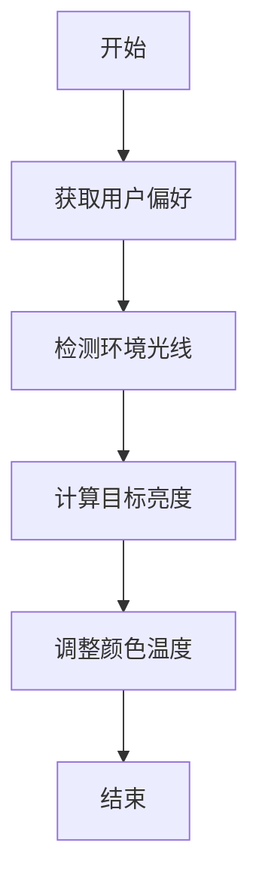
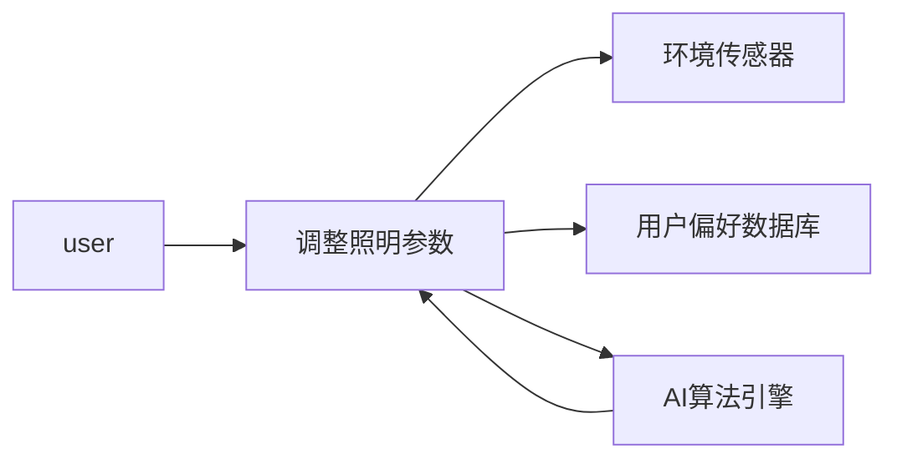

                 


# 智能台灯：AI Agent的个性化照明方案

## 关键词：
智能台灯，AI Agent，个性化照明，算法实现，系统架构，项目实战

## 摘要：
本文探讨了AI Agent技术在智能台灯中的应用，重点分析了如何通过AI算法实现个性化照明方案。文章从背景、核心概念、算法原理、系统架构、项目实战到最佳实践进行了详细阐述，结合mermaid图表和Python代码示例，帮助读者全面理解智能台灯的个性化照明设计。

---

# 目录大纲

## 第一部分：背景介绍

### 第1章：问题背景与描述

#### 1.1 问题背景
- 传统照明的局限性
- 用户需求的变化
- AI技术在照明领域的应用潜力

#### 1.2 问题描述
- 照明方案的个性化需求
- 环境适应性的挑战
- 用户偏好与环境数据的结合

#### 1.3 解决方案
- 引入AI Agent实现个性化照明
- 数据驱动的动态调整
- 多设备协同的智能系统

#### 1.4 边界与外延
- 系统功能的边界
- 与其他智能家居设备的协同
- 个性化照明的范围界定

## 第二部分：核心概念与联系

### 第2章：AI Agent与个性化照明的关系

#### 2.1 AI Agent的核心概念
- AI Agent的基本定义
- 智能台灯中的AI Agent功能
- 个性化照明方案的设计原则

#### 2.2 AI Agent与智能台灯的实体关系图
```mermaid
erDiagram
    user {
        +id : int
        +name : string
        +preferences : string
    }
    environment {
        +time : datetime
        +location : string
        +lighting_conditions : string
    }
    smart_lamp {
        +id : int
        +status : boolean
        +brightness : int
        +color_temp : int
    }
    user --> environment : "感知环境"
    environment --> smart_lamp : "调整照明"
    user --> smart_lamp : "个性化设置"
```

#### 2.3 AI Agent的算法与模型
- 常见算法概述
- 神经网络模型在个性化照明中的应用
- 算法选择的依据

## 第三部分：算法原理讲解

### 第3章：AI Agent的核心算法实现

#### 3.1 算法概述
- 算法目标
- 输入与输出
- 算法流程图


#### 3.2 算法实现细节
- 亮度调节算法
- 颜色温度调节算法
- 算法的数学模型

#### 3.3 算法代码示例
```python
import numpy as np

def adjust_brightness(current_brightness, target_brightness):
    # 使用PID控制算法调整亮度
    error = target_brightness - current_brightness
    integral = integral + error * dt
    derivative = (error - previous_error) / dt
    adjusted_brightness = current_brightness + Kp * error + Ki * integral + Kd * derivative
    return adjusted_brightness

# 示例调用
current_brightness = 50
target_brightness = 70
dt = 1
Kp = 0.5
Ki = 0.1
Kd = 0.2
integral = 0
previous_error = 0
new_brightness = adjust_brightness(current_brightness, target_brightness)
print(new_brightness)
```

#### 3.4 算法的数学模型
- 亮度调节公式：$$ B = B_{\text{current}} + K_p \times (B_{\text{target}} - B_{\text{current}}) $$
- 颜色温度调节公式：$$ T = T_{\text{current}} + K_p \times (T_{\text{target}} - T_{\text{current}}) $$

## 第四部分：系统分析与架构设计

### 第4章：系统架构设计

#### 4.1 问题场景介绍
- 用户需求分析
- 环境数据采集
- 系统功能设计

#### 4.2 系统架构图


#### 4.3 系统功能设计
- 用户偏好设置
- 环境数据采集
- 照明参数调整
- 系统状态反馈

#### 4.4 系统接口设计
- 用户界面API
- 环境传感器接口
- AI算法引擎接口

#### 4.5 交互设计
- 用户与系统的交互流程
- 系统的反馈机制
- 异常处理流程

## 第五部分：项目实战

### 第5章：项目实现

#### 5.1 环境安装
- Python环境配置
- 库的安装：numpy, scipy, matplotlib

#### 5.2 系统实现
- 用户偏好数据库的设计
- 环境传感器数据采集
- AI算法实现

#### 5.3 代码实现
```python
import numpy as np
from sklearn.metrics import mean_squared_error

def evaluate_algorithm(actual, predicted):
    mse = mean_squared_error(actual, predicted)
    return mse

# 示例数据
actual_brightness = np.array([50, 60, 70, 80])
predicted_brightness = np.array([55, 65, 75, 85])
score = evaluate_algorithm(actual_brightness, predicted_brightness)
print(f"算法评分：{score}")
```

#### 5.4 案例分析
- 典型案例分析
- 算法效果展示
- 总结与优化

#### 5.5 项目总结
- 项目成果
- 实施经验
- 改进建议

## 第六部分：最佳实践与小结

### 第6章：总结与注意事项

#### 6.1 最佳实践
- 数据收集的重要性
- 算法选择的合理性
- 系统设计的模块化

#### 6.2 注意事项
- 数据隐私保护
- 系统兼容性
- 安全性考虑

#### 6.3 未来展望
- 新技术的应用
- 算法的优化
- 系统的扩展性

## 作者

作者：AI天才研究院/AI Genius Institute & 禅与计算机程序设计艺术 /Zen And The Art of Computer Programming

---

通过以上大纲，我可以开始撰写完整的文章，确保每个部分都详细展开，并且包含必要的图表和代码示例，帮助读者更好地理解智能台灯中AI Agent的个性化照明方案。

