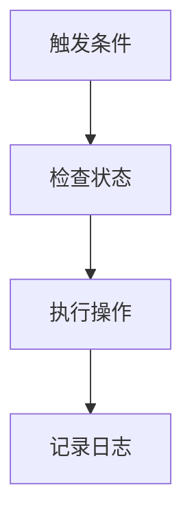
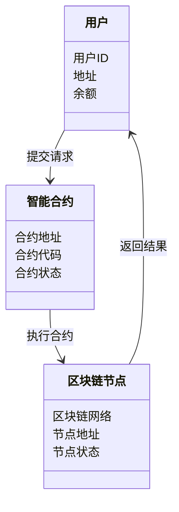
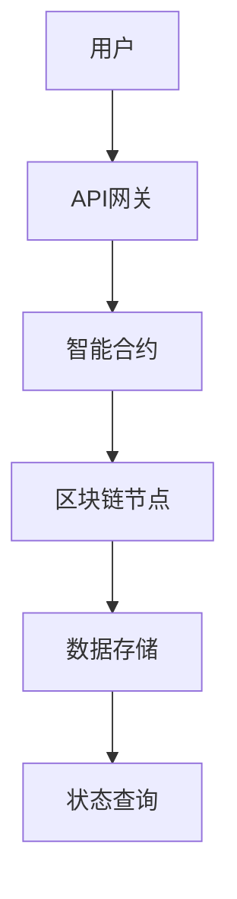
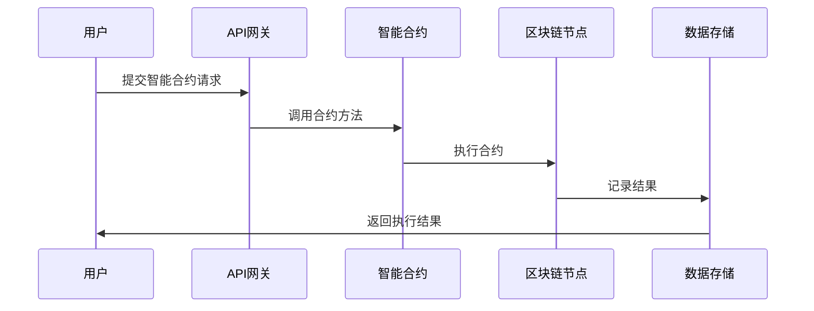

                 


# 智能合约技术在法律服务领域的应用前景

## 关键词：智能合约，区块链，法律服务，去中心化，法律效率，合同自动化

## 摘要：智能合约技术作为区块链技术的重要应用之一，正在逐步改变传统法律服务的模式。通过智能合约，法律服务可以实现合同的自动履行、纠纷的快速解决以及法律效率的提升。本文将从智能合约的基本概念、技术原理、系统设计、项目实战以及最佳实践等方面，详细探讨智能合约在法律服务领域的应用前景，分析其优势与挑战，并展望未来的发展方向。

---

# 第一部分：智能合约技术基础

## 第1章：智能合约技术概述

### 1.1 智能合约的基本概念

#### 1.1.1 智能合约的定义与特点
智能合约是一种基于区块链技术的自动化执行合约，其核心特点包括：
- **去中心化**：不依赖于任何中间机构，直接在区块链上运行。
- **自动化**：根据预设的条件自动执行操作。
- **透明性**：合约代码和执行记录公开透明，可追溯。
- **不可篡改性**：一旦部署到区块链上，合约代码无法被修改。

#### 1.1.2 智能合约的工作原理
智能合约的工作流程可以分为以下几个步骤：
1. **触发条件**：当满足特定条件（如时间到达、事件发生）时，合约自动执行。
2. **状态检查**：合约检查当前的状态和相关数据。
3. **执行操作**：根据合约逻辑执行相应的操作（如转账、记录状态变化）。
4. **记录日志**：将操作结果记录在区块链上，确保可追溯性。

#### 1.1.3 智能合约与传统法律服务的对比

| 对比维度       | 智能合约                     | 传统法律服务               |
|----------------|------------------------------|---------------------------|
| 执行方式       | 自动化执行                   | 需人工干预                 |
| 信任基础       | 基于区块链的去中心化信任     | 基于法律机构的信用         |
| 效率           | 高效，减少人工干预           | 低效，依赖繁琐的流程       |
| 成本           | 低成本，去中介化             | 成本高，需支付中介费用       |

---

## 第2章：智能合约技术的核心概念与联系

### 2.1 智能合约的核心原理

#### 2.1.1 智能合约的执行流程
智能合约的执行流程可以用以下Mermaid图表示：



#### 2.1.2 智能合约的去中心化特性
智能合约的去中心化特性使其能够避免传统法律服务中对第三方机构的依赖，从而降低信任成本。

#### 2.1.3 智能合约的安全性分析
智能合约的安全性依赖于区块链的共识机制和加密算法。常见的加密算法包括：
- **哈希函数**：如SHA-256，用于数据的唯一标识。
- **数字签名**：用于验证数据的完整性和真实性。

### 2.2 智能合约与法律服务的关联

#### 2.2.1 智能合约在法律服务中的应用场景
智能合约在法律服务中的主要应用场景包括：
1. **合同自动化履行**：如自动支付租金、自动续签合同。
2. **纠纷解决**：通过智能合约记录的交易历史，快速定位问题。
3. **法律合规性检查**：智能合约可以嵌入法律条款，自动检查是否符合相关法规。

#### 2.2.2 智能合约与法律合规性的关系
智能合约需要符合相关法律法规，尤其是在数据隐私和合规性方面。例如，GDPR（通用数据保护条例）对个人数据的保护要求需要在智能合约设计中体现。

#### 2.2.3 智能合约对法律效率的提升
智能合约可以显著提高法律服务的效率，例如：
- **减少人工干预**：自动执行合同条款。
- **实时监控**：实时跟踪合同履行情况。
- **快速响应**：在触发条件时立即执行操作。

### 2.3 实体关系图与概念对比表

#### 2.3.1 智能合约的ER实体关系图
以下是智能合约的ER实体关系图：

```mermaid
erDiagram
    participant 用户
    participant 智能合约
    participant 区块链节点
    participant 合约执行结果
    用户 --> 智能合约: 提交请求
    智能合约 --> 区块链节点: 执行合约
    区块链节点 --> 合约执行结果: 记录结果
```

---

# 第二部分：智能合约技术的算法原理

## 第3章：智能合约的算法实现

### 3.1 智能合约的执行流程

#### 3.1.1 智能合约的触发条件
智能合约的触发条件可以是时间、事件或特定的交易行为。例如：
- 时间触发：在特定日期执行合约。
- 事件触发：当某次交易发生时执行合约。

#### 3.1.2 智能合约的状态管理
智能合约需要管理自身的状态，例如：
- 合约当前阶段（未履行、已履行、已终止）。
- 相关数据（如金额、参与方信息）。

#### 3.1.3 智能合约的执行结果
智能合约的执行结果需要记录在区块链上，以确保可追溯性和透明性。

### 3.2 智能合约的数学模型与公式

#### 3.2.1 智能合约的哈希函数
哈希函数用于生成数据的唯一标识。例如，SHA-256哈希函数可以将任意长度的数据映射为一个固定长度的哈希值。

```latex
$$
\text{哈希值} = \text{SHA-256}(\text{输入数据})
$$
```

#### 3.2.2 智能合约的加密算法
加密算法用于保护数据的安全性。例如，椭圆曲线加密算法（ECDSA）常用于生成数字签名。

```latex
$$
\text{签名} = \text{ECDSA}(\text{私钥}, \text{哈希值})
$$
```

#### 3.2.3 智能合约的共识机制
共识机制用于确保区块链上的数据一致性和安全性。常见的共识机制包括：
- 工作量证明（PoW）：如比特币使用的机制。
- 权益证明（PoS）：如以太坊2.0使用的机制。

---

## 第4章：智能合约的数学模型与公式

### 4.1 智能合约的哈希函数

#### 4.1.1 哈希函数的定义
哈希函数将任意长度的输入数据映射为一个固定长度的输出值，通常用于数据的唯一标识。

#### 4.1.2 哈希函数的数学模型
哈希函数的数学模型可以表示为：
$$
H(x) = \sum_{i=1}^{n} x_i \times w_i \mod p
$$
其中，$x_i$是输入数据的第$i$个字符，$w_i$是权重系数，$p$是模数。

#### 4.1.3 哈希函数的应用场景
哈希函数广泛应用于数据完整性验证、数据索引和数据存储等领域。

### 4.2 智能合约的加密算法

#### 4.2.1 加密算法的分类
加密算法主要分为对称加密和非对称加密两类。对称加密（如AES）速度快，适用于数据加密；非对称加密（如RSA）安全性高，适用于数字签名。

#### 4.2.2 加密算法的数学原理
非对称加密的数学原理基于大整数的分解难度。例如，RSA算法基于分解大整数的困难性。

#### 4.2.3 加密算法的实现代码
以下是一个简单的RSA加密算法实现：

```python
import random

def is_prime(n):
    if n < 2:
        return False
    for p in [2, 3, 5, 7, 11, 13, 17, 19, 23, 29, 31, 37]:
        if n % p == 0:
            return n == p
    d = n // 2
    for a in range(2, d):
        if pow(a, d, n) == 1:
            return True
        if pow(a, d-1, n) == n-1:
            return True
    return False

def generate_keypair():
    while True:
        p = random.randint(2**512, 2**513)
        if is_prime(p):
            break
    while True:
        q = random.randint(2**512, 2**513)
        if is_prime(q):
            break
    n = p * q
    phi = (p-1)*(q-1)
    e = 65537
    d = pow(e, -1, phi)
    return (e, n), (d, n)

public_key, private_key = generate_keypair()
print("公钥:", public_key)
print("私钥:", private_key)
```

---

# 第三部分：智能合约技术的系统分析与架构设计

## 第5章：法律服务领域的智能合约系统分析

### 5.1 法律服务场景介绍

#### 5.1.1 合同管理
智能合约可以用于自动管理合同的履行，例如自动支付租金、自动续签合同。

#### 5.1.2 纠纷解决
通过智能合约记录的交易历史，可以快速定位问题，减少纠纷解决的时间和成本。

#### 5.1.3 法律合规性检查
智能合约可以嵌入法律条款，自动检查是否符合相关法规。

---

## 第6章：系统设计与架构

### 6.1 系统功能设计

#### 6.1.1 领域模型
以下是法律服务领域的智能合约系统领域模型：



---

## 第7章：系统架构设计

### 7.1 系统架构设计

#### 7.1.1 整体架构
以下是智能合约系统的整体架构图：



---

## 第8章：系统接口设计

### 8.1 接口设计

#### 8.1.1 API接口
以下是智能合约系统的API接口设计：

| 接口名称         | 接口功能               | 请求方式 | 请求参数               | 返回值                 |
|------------------|-----------------------|----------|-----------------------|------------------------|
| 提交请求         | 提交智能合约请求       | POST     | 用户ID，合约地址       | 请求结果（成功或失败） |
| 查询状态         | 查询合约执行状态       | GET      | 用户ID，合约地址       | 合约状态               |
| 获取结果         | 获取合约执行结果       | GET      | 用户ID，合约地址       | 执行结果               |

---

## 第9章：系统交互设计

### 9.1 交互流程图

以下是智能合约系统的交互流程图：



---

# 第四部分：智能合约技术的项目实战

## 第10章：项目实战

### 10.1 环境搭建

#### 10.1.1 安装以太坊钱包
安装以太坊钱包（如MetaMask），并连接到以太坊测试网络。

#### 10.1.2 安装Solidity编译器
安装Solidity编译器（如 Remix IDE）。

### 10.2 核心实现源代码

#### 10.2.1 智能合约源代码
以下是一个简单的智能合约实现：

```solidity
// SPDX-License-Identifier: MIT
pragma solidity ^0.8.0;

contract SimpleContract {
    address payable public recipient;
    uint256 public amount;

    constructor(address payable _recipient, uint256 _amount) {
        recipient = _recipient;
        amount = _amount;
    }

    function execute() public {
        recipient.transfer(amount);
    }
}
```

#### 10.2.2 部署与调用
使用MetaMask部署上述智能合约，并调用`execute`函数。

---

## 第11章：实际案例分析

### 11.1 案例分析

#### 11.1.1 智能合同的自动履行
例如，一个自动支付租金的智能合约，当每月1号自动将租金转入房东账户。

#### 11.1.2 智能合约的纠纷解决
当合同履行出现问题时，智能合约可以提供完整的交易记录，帮助快速定位问题。

---

## 第12章：项目小结

### 12.1 项目总结
通过本次项目，我们了解了智能合约在法律服务领域的应用，掌握了智能合约的部署、调用和实际案例的实现。

---

# 第五部分：最佳实践

## 第13章：最佳实践

### 13.1 实践小贴士

#### 13.1.1 注意安全性
智能合约的安全性至关重要，需进行充分的测试和审计。

#### 13.1.2 遵守法律法规
在设计智能合约时，需遵守相关法律法规，尤其是数据隐私和合规性方面。

### 13.2 总结与展望

#### 13.2.1 总结
智能合约技术为法律服务领域带来了去中心化、自动化和高效性的优势，正在逐步改变传统法律服务的模式。

#### 13.2.2 展望
未来，随着区块链技术的不断发展，智能合约在法律服务领域的应用将更加广泛，例如智能合约的自动化纠纷解决、智能合约的智能合规性检查等。

---

# 作者信息

作者：AI天才研究院/AI Genius Institute & 禅与计算机程序设计艺术 /Zen And The Art of Computer Programming

---

以上是《智能合约技术在法律服务领域的应用前景》的技术博客文章的完整大纲和内容。

