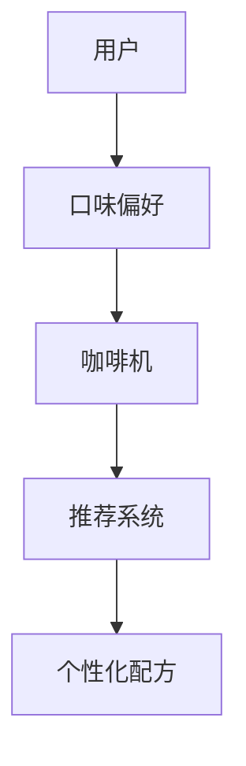
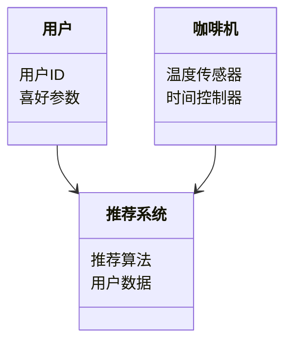
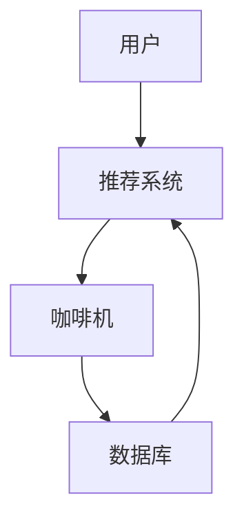

                 


# 智能咖啡机：AI Agent的个性化口味定制

> 关键词：智能咖啡机，AI Agent，个性化口味定制，推荐算法，系统架构设计，数学模型

> 摘要：本文探讨了如何通过AI Agent技术实现智能咖啡机的个性化口味定制。从背景介绍到系统架构设计，再到实际项目案例，详细分析了AI在咖啡机中的应用，包括推荐算法、系统设计和优化策略。

---

# 第一部分: 背景介绍

## 第1章: 智能咖啡机与AI Agent概述

### 1.1 智能咖啡机的基本概念

#### 1.1.1 智能咖啡机的定义与分类
智能咖啡机是一种结合了人工智能技术的咖啡制作设备，能够根据用户的口味偏好自动调整咖啡的配方和制作参数。根据功能的不同，智能咖啡机可以分为基础版和高级版，其中高级版集成了AI Agent技术，能够实现个性化口味定制。

#### 1.1.2 AI Agent的基本概念
AI Agent（人工智能代理）是一种能够感知环境、自主决策并执行任务的智能实体。在智能咖啡机中，AI Agent负责收集用户数据、分析偏好并生成个性化推荐。

#### 1.1.3 个性化口味定制的必要性
随着消费者对咖啡品质要求的提高，传统的固定配方模式已无法满足市场需求。通过AI Agent实现个性化口味定制，能够提升用户体验，增强品牌竞争力。

### 1.2 智能咖啡机的发展历程

#### 1.2.1 咒唤式咖啡机的出现
最早的智能咖啡机具备基础的自动化功能，用户通过按键选择预设的咖啡类型。

#### 1.2.2 AI技术在咖啡机中的应用
随着AI技术的发展，智能咖啡机开始具备数据采集和分析能力，能够根据用户的历史数据优化咖啡配方。

#### 1.2.3 个性化口味定制的演变
从简单的口味选择到基于用户偏好的个性化推荐，智能咖啡机的个性化定制功能逐步完善。

## 第2章: 个性化口味定制的背景与需求

### 2.1 个性化口味定制的背景

#### 2.1.1 消费者对咖啡口味的多样化需求
现代消费者对咖啡的口感、浓度和风味有更高的要求，单一的口味选择已无法满足市场需求。

#### 2.1.2 咖啡行业竞争加剧的现状
咖啡市场的竞争日益激烈，品牌之间的差异化竞争主要体现在产品和服务的个性化上。

#### 2.1.3 AI技术在咖啡行业的应用潜力
AI技术能够通过数据分析和机器学习，帮助咖啡机实现精准的个性化推荐。

### 2.2 个性化口味定制的核心问题

#### 2.2.1 用户口味偏好的识别与建模
通过收集用户的饮用历史和反馈数据，建立用户口味偏好的数学模型。

#### 2.2.2 咖啡成分的精准控制
智能咖啡机需要能够精确控制水温、研磨度、萃取时间等关键参数，以实现个性化口味。

#### 2.2.3 系统实时反馈与优化
通过实时监测用户的反馈，系统能够动态调整配方，持续优化用户体验。

### 2.3 个性化口味定制的边界与外延

#### 2.3.1 系统功能的边界
个性化口味定制功能仅限于咖啡机本身，不涉及其他外部设备。

#### 2.3.2 外部环境的影响
环境因素如温度和湿度可能影响咖啡的口感，系统需要具备一定的环境适应能力。

#### 2.3.3 用户体验的优化方向
通过简化操作流程和提升界面友好度，进一步优化用户体验。

---

# 第二部分: 核心概念与联系

## 第3章: AI Agent的核心原理

### 3.1 AI Agent的基本原理

#### 3.1.1 感知层: 数据采集与处理
AI Agent通过传感器和用户输入收集数据，如用户的口味偏好和饮用历史。

#### 3.1.2 计算层: 算法实现与决策
基于收集的数据，AI Agent利用推荐算法生成个性化配方。

#### 3.1.3 执行层: 系统反馈与优化
系统根据用户的反馈调整配方，并将数据反馈到计算层进行优化。

### 3.2 智能咖啡机中的AI Agent架构

#### 3.2.1 分层架构设计
智能咖啡机的AI Agent架构通常分为数据采集层、算法处理层和系统执行层。

#### 3.2.2 各模块的功能与交互
- 数据采集层：负责收集用户数据。
- 算法处理层：进行数据分析和配方推荐。
- 系统执行层：根据推荐结果调整咖啡机参数。

#### 3.2.3 系统的整体流程
数据采集 → 数据分析 → 生成推荐 → 系统调整 → 用户反馈 → 持续优化。

## 第4章: 核心概念的联系与对比

### 4.1 核心概念属性对比表

| 概念          | 输入      | 输出      | 核心算法       | 实时性 |
|---------------|-----------|-----------|----------------|--------|
| 用户偏好      | 咖啡口味数据 | 个性化推荐 | 协同过滤       | 高      |

### 4.2 ER实体关系图



---

# 第三部分: 算法原理

## 第5章: 推荐算法的实现与优化

### 5.1 推荐算法的实现

#### 5.1.1 协同过滤算法
协同过滤是一种基于用户相似性推荐算法，分为基于用户的协同过滤和基于物品的协同过滤。

#### 5.1.2 聚类分析算法
聚类分析将用户分成不同的群体，基于群体特征进行推荐。

#### 5.1.3 基于内容的推荐算法
基于咖啡成分和用户偏好进行推荐。

### 5.2 推荐算法的优化

#### 5.2.1 基于数学模型的优化
通过矩阵分解和奇异值分解优化推荐效果。

#### 5.2.2 基于实时反馈的优化
根据用户的实时反馈动态调整推荐结果。

#### 5.2.3 基于混合模型的优化
结合多种推荐算法的优点，提升推荐精度。

## 第6章: 算法实现的代码示例

### 6.1 协同过滤算法的Python实现

```python
import numpy as np

def collaborative_filtering(user_data, user_id):
    # 数据预处理
    user_matrix = np.array(user_data)
    user_index = np.where(user_matrix[:, 0] == user_id)[0][0]
    
    # 计算相似用户
    similarity = np.dot(user_matrix, user_matrix[user_index])
    # 生成推荐
    recommendations = np.argsort(similarity)
    return recommendations
```

---

# 第四部分: 系统分析与架构设计

## 第7章: 系统功能设计

### 7.1 领域模型设计



### 7.2 系统架构设计



### 7.3 接口设计

- 用户接口：用于输入偏好和查看推荐。
- 系统接口：用于数据交互和控制命令。

---

# 第五部分: 项目实战

## 第8章: 实际项目案例分析

### 8.1 环境安装

#### 8.1.1 系统要求
- 操作系统：Linux/Windows/MacOS
- 开发工具：Python 3.8+
- 依赖库：numpy, scikit-learn

### 8.2 核心代码实现

#### 8.2.1 推荐算法实现

```python
from sklearn.cluster import KMeans

def cluster_recommendation(X, n_clusters):
    model = KMeans(n_clusters=n_clusters)
    model.fit(X)
    return model.predict(X)
```

### 8.2.2 系统交互实现

```python
def system_interaction(user_input, system_state):
    # 处理用户输入
    # 更新系统状态
    return new_system_state
```

### 8.3 案例分析与解读

#### 8.3.1 案例分析
通过实际数据训练推荐算法，分析其准确性和效率。

#### 8.3.2 代码解读
详细解读推荐算法的实现细节和系统交互逻辑。

### 8.4 项目总结

#### 8.4.1 成果展示
展示个性化口味定制系统的实际效果。

#### 8.4.2 经验总结
总结项目实施过程中的经验和教训。

---

# 第六部分: 最佳实践与小结

## 第9章: 最佳实践与小结

### 9.1 最佳实践

#### 9.1.1 系统优化建议
建议定期更新算法模型，优化系统性能。

#### 9.1.2 用户体验提升
通过简化操作流程和提升界面友好度，进一步优化用户体验。

### 9.2 小结

本文详细探讨了AI Agent在智能咖啡机中的应用，从背景介绍到系统设计，再到实际案例，全面分析了个性化口味定制的实现过程。通过本文的分析，读者可以深入了解如何利用AI技术提升咖啡机的功能和用户体验。

---

作者：AI天才研究院/AI Genius Institute & 禅与计算机程序设计艺术 /Zen And The Art of Computer Programming

