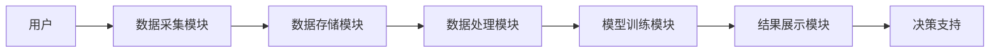

                 


# 《智能商业银行客户价值分析》

> 关键词：智能商业银行, 客户价值分析, 人工智能, 大数据, 机器学习, 数据挖掘

> 摘要：本文详细探讨了智能商业银行客户价值分析的理论基础、核心算法、系统架构及实际应用。通过分析客户行为、属性及贡献度，结合RFM模型、K-means聚类算法和逻辑回归模型，展示了如何利用人工智能技术提升商业银行客户价值分析的精度和效率。本文还提供了系统设计与实现的详细步骤，帮助读者理解并应用这些技术。

---

## 第一部分: 智能商业银行客户价值分析概述

### 第1章: 智能商业银行的发展背景与客户价值分析的重要性

#### 1.1 智能商业银行的定义与特点
智能商业银行是传统商业银行与人工智能、大数据技术深度融合的产物。它通过智能技术实时分析客户需求、行为模式和市场趋势，为客户提供个性化服务，优化银行运营效率。

#### 1.2 客户价值分析的定义与意义
客户价值分析是通过对客户行为、属性和贡献度的分析，评估客户对银行的潜在价值。其意义在于帮助银行制定精准的营销策略，提升客户满意度和忠诚度。

#### 1.3 智能商业银行客户价值分析的背景与发展趋势
随着人工智能技术的快速发展，智能商业银行客户价值分析逐渐成为金融行业的重要研究方向。通过大数据分析，银行能够更精准地识别高价值客户，降低运营成本，提高盈利能力。

---

### 第2章: 智能商业银行客户价值分析的核心概念与联系

#### 2.1 客户价值分析的核心概念
客户价值分析涉及客户属性、行为和贡献度的评估。客户属性包括年龄、性别和职业等，客户行为包括交易频率和金额，客户贡献度则通过RFM模型计算。

#### 2.2 客户价值分析的关键要素
- **客户属性**：包括基本特征和交易历史。
- **客户行为**：包括交易频率、金额和时间。
- **客户贡献度**：通过RFM模型计算客户的价值。

#### 2.3 客户价值分析的模型与方法
- **RFM模型**：通过客户最近一次交易、交易频率和交易金额来评估客户价值。
- **K-means聚类模型**：将客户分为不同群组，分析各群组的特征和价值。
- **逻辑回归模型**：预测客户流失风险，优化客户服务策略。

#### 2.4 智能商业银行客户价值分析的流程
1. 数据收集：获取客户交易数据和行为数据。
2. 数据预处理：清洗和标准化数据。
3. 模型训练：应用RFM和K-means等算法进行客户分群。
4. 结果分析：评估客户价值，制定营销策略。

---

### 第3章: 智能商业银行客户价值分析的算法原理

#### 3.1 数据预处理
- **数据清洗**：删除无效数据和异常值。
- **数据转换**：将非数值型数据转换为数值型数据。
- **数据标准化**：对数据进行归一化处理，确保各特征的可比性。

#### 3.2 客户聚类分析
- **K-means算法原理**：
  1. 初始化k个质心。
  2. 计算每个样本到质心的距离，将样本分配到最近的质心。
  3. 重新计算质心位置，重复步骤1和2，直到质心不再变化。

  ```mermaid
  graph TD
    A[开始] --> B[初始化质心]
    B --> C[计算样本到质心距离]
    C --> D[分配样本到最近质心]
    D --> E[重新计算质心]
    E --> F[判断收敛]
    F -->|收敛？| G[结束]
    F -->|否| C
  ```

- **DBSCAN算法原理**：基于密度的聚类算法，识别高密度区域为聚类中心。

#### 3.3 客户分类分析
- **逻辑回归模型**：
  1. 数据预处理：将客户数据标准化。
  2. 模型训练：使用逻辑回归算法训练客户流失预测模型。
  3. 模型评估：通过混淆矩阵和准确率评估模型性能。

  ```python
  import numpy as np
  from sklearn.linear_model import LogisticRegression

  # 假设X为特征矩阵，y为标签
  model = LogisticRegression()
  model.fit(X, y)
  ```

---

## 第二部分: 系统分析与架构设计

### 第4章: 系统设计与实现

#### 4.1 问题场景介绍
智能商业银行客户价值分析系统需要处理海量客户数据，实时分析客户行为和价值，支持精准营销和风险控制。

#### 4.2 系统功能设计
- **数据采集模块**：采集客户交易数据和行为数据。
- **数据处理模块**：清洗和标准化数据。
- **模型训练模块**：训练聚类和分类模型。
- **结果展示模块**：可视化客户分群结果和价值分析报告。

#### 4.3 系统架构设计


---

## 第三部分: 项目实战

### 第5章: 项目实施与案例分析

#### 5.1 环境安装
- 安装Python和相关库：`pip install numpy scikit-learn pandas`

#### 5.2 核心代码实现
```python
from sklearn.cluster import KMeans
from sklearn.metrics import silhouette_score

# 示例数据
X = [[1, 2], [3, 4], [5, 6], [7, 8], [9, 10]]

# 训练K-means模型
model = KMeans(n_clusters=2, random_state=0)
model.fit(X)

# 评估模型
score = silhouette_score(X, model.labels_)
print(f"模型 silhouette score: {score}")
```

#### 5.3 案例分析
通过实际数据集训练模型，分析客户价值，制定精准营销策略。

---

## 第四部分: 最佳实践与总结

### 第6章: 最佳实践与注意事项

#### 6.1 小结
智能商业银行客户价值分析通过数据挖掘和机器学习技术，帮助银行提升客户价值和运营效率。

#### 6.2 注意事项
- 数据隐私保护
- 模型调优与优化
- 业务场景与技术结合

#### 6.3 拓展阅读
推荐学习相关书籍和论文，深入理解机器学习和大数据分析技术。

---

## 作者

作者：AI天才研究院（AI Genius Institute） & 禅与计算机程序设计艺术（Zen And The Art of Computer Programming）

---

以上为《智能商业银行客户价值分析》的技术博客文章大纲，具体内容可根据实际需求进一步扩展和补充。

