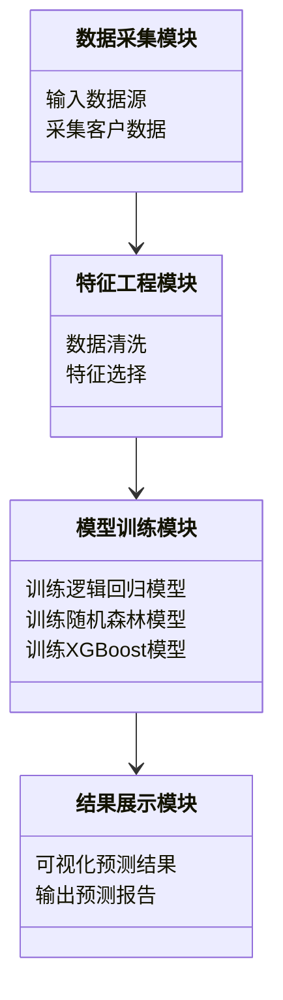
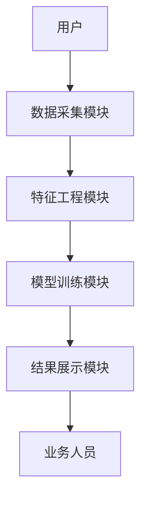

                 


# 智能商业银行客户流失预测

> 关键词：客户流失预测，商业银行，人工智能，机器学习，金融风险管理

> 摘要：本文系统地探讨了智能商业银行客户流失预测的核心概念、算法原理、系统设计与实际应用。通过结合人工智能和机器学习技术，分析商业银行客户流失的特征、构建预测模型、设计系统架构，并通过实际案例展示预测方法的应用效果。本文旨在为商业银行提供客户流失预测的理论支持与实践指导，帮助金融机构优化客户关系管理、降低客户流失率并提升风险管理能力。

---

## 第一部分: 智能商业银行客户流失预测概述

### 第1章: 商业银行客户流失预测的背景与意义

#### 1.1 客户流失的定义与分类

客户流失是指客户终止与商业银行的业务关系，不再使用商业银行的产品或服务的行为。在金融行业，客户流失是一个普遍现象，但其背后隐藏着巨大的业务风险和成本。客户流失可以分为以下几类：

- **自然流失**：客户因自身需求变化或满意度下降而主动终止关系。
- **被动流失**：客户因外部竞争或产品政策调整而流失。
- **风险流失**：客户因信用风险或欺诈行为而被银行主动终止关系。

#### 1.2 客户流失预测的背景与现状

随着金融行业的竞争加剧，客户流失问题日益突出。传统客户流失预测方法依赖于简单的统计分析，难以捕捉复杂的客户行为模式和潜在风险。近年来，人工智能和机器学习技术的发展为商业银行客户流失预测提供了新的解决方案。

#### 1.3 客户流失预测的业务价值

客户流失预测对商业银行具有重要的业务价值：

- **优化客户关系管理**：通过预测客户流失风险，银行可以提前采取措施挽留客户，提升客户满意度和忠诚度。
- **降低经营成本**：客户流失预测可以帮助银行识别高风险客户，避免因客户流失而产生的额外成本。
- **提升风险管理能力**：通过预测客户流失，银行可以更好地识别潜在的信用风险和欺诈行为，增强风险管理能力。

---

## 第二部分: 客户流失预测的核心概念与模型

### 第2章: 客户流失预测的核心概念

#### 2.1 客户流失预测的特征工程

特征工程是客户流失预测模型的核心部分，主要包括以下几类特征：

- **客户属性特征**：如年龄、性别、收入水平、职业等。
- **行为特征**：如交易频率、交易金额、活跃程度等。
- **时间特征**：如最近一次交易时间、账户开立时间等。

#### 2.2 客户流失预测的评估指标

客户流失预测的评估指标主要分为两类：

- **分类指标**：如准确率（Accuracy）、召回率（Recall）、F1值（F1 Score）等。
- **业务指标**：如客户保留率、成本节约率等。

#### 2.3 客户流失预测的模型选择

根据数据特性和业务需求，可以选择以下模型：

- **逻辑回归（Logistic Regression）**：适用于二分类问题，适合预测客户是否流失。
- **随机森林（Random Forest）**：适用于特征较多的场景，具有较强的鲁棒性。
- **梯度提升（Gradient Boosting）**：如XGBoost、LightGBM等，适合处理非线性关系。

### 第3章: 客户流失预测的核心模型原理

#### 3.1 逻辑回归模型

逻辑回归是一种经典的二分类算法，其核心思想是通过sigmoid函数将线性回归的输出映射到概率空间。

$$ P(y=1|x) = \frac{e^{\beta_0 + \beta_1 x_1 + \cdots + \beta_n x_n}}{1 + e^{\beta_0 + \beta_1 x_1 + \cdots + \beta_n x_n}} $$

逻辑回归的优点是简单易用、解释性强，但其性能受限于线性假设，难以处理复杂的非线性关系。

#### 3.2 随机森林模型

随机森林是一种基于决策树的集成算法，通过随机采样和特征选择生成多个决策树，并通过投票或加权的方式进行预测。

随机森林的优势在于能够处理高维数据、具有较强的抗过拟合能力，但其解释性较弱，且计算复杂度较高。

#### 3.3 XGBoost模型

XGBoost是一种基于梯度提升的算法，通过优化目标函数和正则化技术来提升模型性能。

XGBoost的核心思想是通过不断优化损失函数，逐步构建强分类器。其数学模型如下：

$$ \text{损失函数} = \sum_{i=1}^n \left[ -y_i \ln(p_i) - (1 - y_i) \ln(1 - p_i) \right] + \lambda \sum_{j=1}^m \theta_j^2 $$

XGBoost的优势在于性能优越、可调参数多，适合处理复杂的分类问题。

---

## 第三部分: 系统分析与项目实战

### 第4章: 系统分析与架构设计

#### 4.1 问题场景介绍

商业银行客户流失预测系统需要解决以下问题：

- **数据获取**：从银行系统中获取客户数据。
- **特征提取**：从数据中提取有用的特征。
- **模型训练**：基于特征数据训练客户流失预测模型。
- **结果展示**：将预测结果以直观的方式展示给业务人员。

#### 4.2 系统功能设计

以下是系统功能模块的类图：



#### 4.3 系统架构设计

以下是系统架构设计的mermaid图：



### 第5章: 项目实战

#### 5.1 环境安装

以下是项目实战所需的环境安装步骤：

1. 安装Python和相关库：
   ```bash
   pip install numpy pandas scikit-learn xgboost matplotlib
   ```

2. 安装Jupyter Notebook：
   ```bash
   pip install jupyter
   ```

#### 5.2 系统核心实现源代码

以下是客户流失预测模型的Python实现代码：

```python
import pandas as pd
import numpy as np
from sklearn.model_selection import train_test_split
from sklearn.preprocessing import StandardScaler
from sklearn.linear_model import LogisticRegression
from sklearn.ensemble import RandomForestClassifier
from xgboost import XGBClassifier
from sklearn.metrics import accuracy_score, recall_score, f1_score

# 数据加载与预处理
data = pd.read_csv('customer_churn.csv')
data = data.dropna()
X = data.drop(columns=['customer_id', 'is_churn'])
y = data['is_churn']

# 数据分割
X_train, X_test, y_train, y_test = train_test_split(X, y, test_size=0.2, random_state=42)

# 特征标准化
scaler = StandardScaler()
X_train = scaler.fit_transform(X_train)
X_test = scaler.transform(X_test)

# 模型训练
lr_model = LogisticRegression(random_state=42).fit(X_train, y_train)
rf_model = RandomForestClassifier(random_state=42).fit(X_train, y_train)
xgb_model = XGBClassifier(random_state=42).fit(X_train, y_train)

# 模型预测与评估
lr_pred = lr_model.predict(X_test)
rf_pred = rf_model.predict(X_test)
xgb_pred = xgb_model.predict(X_test)

lr_accuracy = accuracy_score(y_test, lr_pred)
rf_accuracy = accuracy_score(y_test, rf_pred)
xgb_accuracy = accuracy_score(y_test, xgb_pred)

print(f"Logistic Regression Accuracy: {lr_accuracy}")
print(f"Random Forest Accuracy: {rf_accuracy}")
print(f"XGBoost Accuracy: {xgb_accuracy}")
```

#### 5.3 实际案例分析

以某商业银行的真实数据为例，我们可以通过上述代码实现客户流失预测模型，并分析预测结果。以下是部分代码实现和结果展示：

```python
# 可视化预测结果
import matplotlib.pyplot as plt

plt.figure(figsize=(10, 6))
plt.title('Customer Churn Prediction')
plt.bar(['Logistic Regression', 'Random Forest', 'XGBoost'], [lr_accuracy, rf_accuracy, xgb_accuracy])
plt.ylabel('Accuracy')
plt.show()
```

---

## 第四部分: 总结与展望

### 第6章: 总结与展望

#### 6.1 本章小结

本文系统地探讨了智能商业银行客户流失预测的核心概念、算法原理、系统设计与实际应用。通过结合人工智能和机器学习技术，分析商业银行客户流失的特征、构建预测模型、设计系统架构，并通过实际案例展示预测方法的应用效果。

#### 6.2 未来展望

未来，随着人工智能和机器学习技术的不断发展，商业银行客户流失预测将更加智能化和个性化。以下是未来可能的研究方向：

- **引入时间序列分析**：通过分析客户行为的时间特征，进一步提升预测精度。
- **深度学习模型的应用**：如LSTM、Transformer等，适用于处理复杂的时序数据。
- **客户行为预测的实时性**：通过实时数据流处理技术，实现客户流失预测的实时性。

---

## 作者：AI天才研究院/AI Genius Institute & 禅与计算机程序设计艺术 /Zen And The Art of Computer Programming

