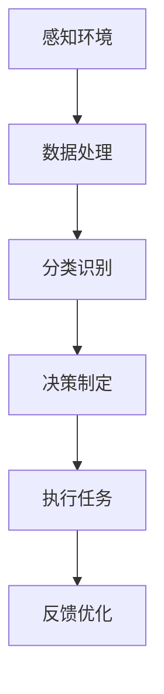
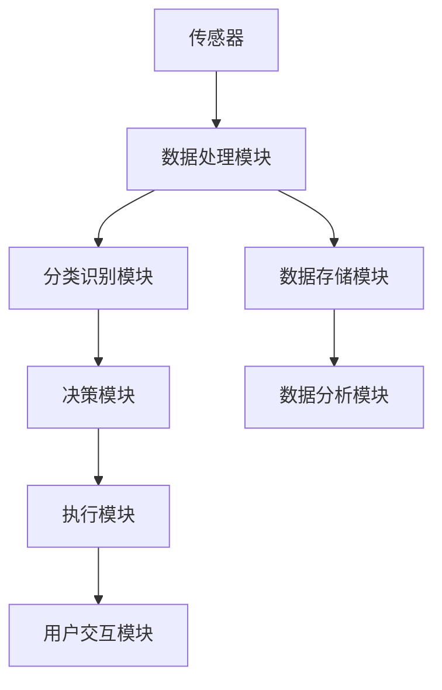
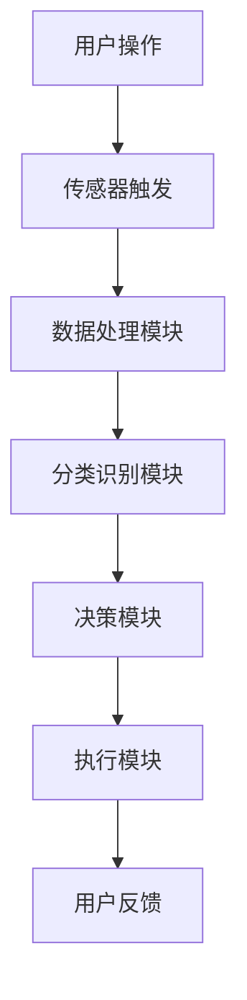
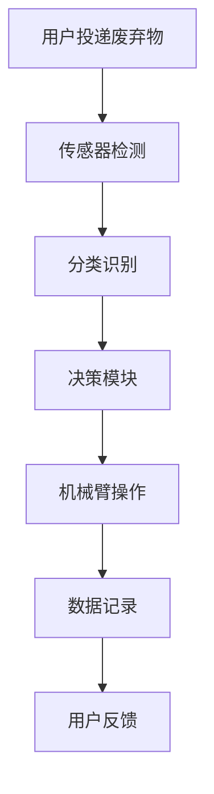

                 


```markdown
# 智能回收站：AI Agent的社区资源循环利用管理

> 关键词：AI Agent、智能回收站、社区资源、循环利用、可持续发展、AI算法

> 摘要：本文探讨了如何利用AI Agent技术优化社区资源的回收和循环利用，详细介绍了AI Agent的核心原理、算法实现、系统架构及实际应用场景，结合项目实战案例，总结了最佳实践和未来发展方向。

---

## 第一章: 问题背景与核心概念

### 1.1 问题背景
#### 1.1.1 当前资源浪费与环境污染问题
现代社会的快速发展带来了资源消耗的急剧增加，同时也产生了大量的废弃物。据统计，全球每年产生的垃圾总量超过20亿吨，其中大部分未得到有效回收和利用，导致环境污染和资源浪费问题日益严重。

#### 1.1.2 社区资源管理的挑战
社区作为社会的基本单元，其资源管理效率直接影响到整体的环保效果。传统的资源回收方式存在效率低、分类不精准、管理复杂等问题，难以满足现代环保需求。

#### 1.1.3 AI技术在资源管理中的潜力
人工智能技术的发展为资源管理提供了新的解决方案。AI Agent（智能代理）能够通过感知环境、自主决策和执行任务，实现资源的高效回收和利用。

### 1.2 核心概念与定义
#### 1.2.1 AI Agent的定义与功能
AI Agent是一种能够感知环境、自主决策并执行任务的智能系统。它可以用于资源管理、环境监测、数据分析等领域。

#### 1.2.2 智能回收站的定义与目标
智能回收站是一种结合AI技术的资源回收设备，其目标是实现资源的高效分类、回收和再利用，减少浪费和环境污染。

#### 1.2.3 资源循环利用的定义与重要性
资源循环利用是指通过对废弃物的分类、回收和再加工，使其重新进入生产或消费过程，减少资源消耗和环境污染。

### 1.3 问题解决思路
#### 1.3.1 引入AI Agent的必要性
AI Agent能够通过智能算法优化资源回收流程，提高分类准确率和回收效率。

#### 1.3.2 AI Agent在资源管理中的作用
AI Agent能够实时感知环境、自动分类废弃物、优化回收路径，从而实现资源的高效利用。

#### 1.3.3 智能回收站的设计目标
智能回收站的目标是通过AI技术实现资源的智能化管理，减少人工干预，提高回收效率和资源利用率。

---

## 第二章: AI Agent与智能回收站的核心原理

### 2.1 AI Agent的基本原理
#### 2.1.1 AI Agent的核心算法
AI Agent的核心算法包括感知算法、决策算法和执行算法。感知算法用于获取环境信息，决策算法用于制定行动策略，执行算法用于实现具体任务。

#### 2.1.2 AI Agent的感知与决策机制
AI Agent通过传感器、摄像头等设备感知环境信息，利用机器学习算法进行数据分析，从而做出最优决策。

#### 2.1.3 AI Agent的执行与反馈机制
AI Agent根据决策结果执行具体任务，并通过反馈机制不断优化自身的算法模型。

### 2.2 智能回收站的系统架构
#### 2.2.1 智能回收站的整体架构
智能回收站由硬件设备、AI算法、数据处理模块和用户交互界面组成，能够实现废弃物的自动分类、回收和数据记录。

#### 2.2.2 系统功能模块
智能回收站的功能模块包括：废弃物识别模块、分类模块、回收模块、数据分析模块和用户交互模块。

#### 2.2.3 智能回收站的核心算法
智能回收站的核心算法包括图像识别算法、分类算法和路径优化算法。

---

## 第三章: 算法原理与实现

### 3.1 AI Agent的算法流程
#### 3.1.1 算法流程图
以下是AI Agent的算法流程图：



#### 3.1.2 算法实现步骤
1. 感知环境：通过传感器获取环境信息。
2. 数据处理：对获取的数据进行预处理和特征提取。
3. 分类识别：利用机器学习算法对废弃物进行分类识别。
4. 决策制定：基于分类结果制定回收策略。
5. 执行任务：根据决策结果执行具体任务。
6. 反馈优化：根据执行结果优化算法模型。

#### 3.1.3 算法优化策略
通过不断优化感知算法、分类算法和决策算法，提高AI Agent的效率和准确性。

### 3.2 智能回收站的数学模型
#### 3.2.1 分类模型的数学表达
分类模型可以通过支持向量机（SVM）或随机森林（Random Forest）等算法实现。以下是一个简单的SVM分类模型：

$$
\text{分类结果} = \text{sign}(w \cdot x + b)
$$

其中，$w$是权重向量，$x$是输入特征，$b$是偏置项。

#### 3.2.2 路径优化模型
路径优化模型可以通过遗传算法（GA）或蚁群算法（ACO）实现。以下是一个简单的路径优化模型：

$$
\text{总成本} = \sum_{i=1}^{n} (c_i \cdot d_i)
$$

其中，$c_i$是第$i$条路径的成本，$d_i$是第$i$条路径的距离。

---

## 第四章: 系统分析与架构设计

### 4.1 问题场景介绍
社区资源管理中存在的主要问题包括：资源分类不准确、回收效率低、管理成本高等。

### 4.2 系统功能设计
#### 4.2.1 系统功能模块
智能回收站的功能模块包括：废弃物识别模块、分类模块、回收模块、数据分析模块和用户交互模块。

#### 4.2.2 功能实现需求
1. 废弃物识别：能够准确识别废弃物的类型和数量。
2. 分类存储：能够将废弃物分类存储，便于后续处理。
3. 数据分析：能够记录回收数据并生成报表。
4. 用户交互：能够与用户进行交互，提供回收信息和操作指南。

#### 4.2.3 功能实现价值
智能回收站的功能实现能够提高资源回收效率，降低管理成本，减少环境污染。

### 4.3 系统架构设计
#### 4.3.1 系统架构图
以下是智能回收站的系统架构图：



#### 4.3.2 系统实现步骤
1. 硬件设备选型：选择合适的传感器和摄像头。
2. 数据处理模块开发：开发数据预处理和特征提取算法。
3. 分类识别模块开发：开发图像识别算法。
4. 决策模块开发：开发路径优化算法。
5. 执行模块开发：开发机械臂控制算法。
6. 用户交互模块开发：开发用户界面和交互逻辑。

### 4.4 接口与交互设计
#### 4.4.1 系统接口设计
智能回收站需要与传感器、机械臂、数据库和用户终端进行交互。

#### 4.4.2 系统交互流程
以下是系统交互流程图：



---

## 第五章: 项目实战与案例分析

### 5.1 环境安装与配置
#### 5.1.1 系统运行环境
需要安装Python、TensorFlow、OpenCV、ROS等工具。

#### 5.1.2 硬件设备配置
需要配置摄像头、机械臂、传感器等硬件设备。

### 5.2 系统核心实现
#### 5.2.1 废弃物分类识别模块
以下是分类识别模块的Python代码示例：

```python
import tensorflow as tf
from tensorflow.keras import layers

# 定义模型
model = tf.keras.Sequential([
    layers.Conv2D(32, (3,3), activation='relu', input_shape=(224, 224, 3)),
    layers.MaxPooling2D((2,2)),
    layers.Conv2D(64, (3,3), activation='relu'),
    layers.MaxPooling2D((2,2)),
    layers.Flatten(),
    layers.Dense(128, activation='relu'),
    layers.Dense(10, activation='softmax')
])

# 编译模型
model.compile(optimizer='adam', loss='sparse_categorical_crossentropy', metrics=['accuracy'])

# 训练模型
model.fit(train_images, train_labels, epochs=10, validation_data=(test_images, test_labels))
```

#### 5.2.2 路径优化模块
以下是路径优化模块的Python代码示例：

```python
import numpy as np
import matplotlib.pyplot as plt

# 定义遗传算法
def genetic_algorithm(population, fitness_func, num_generations):
    for _ in range(num_generations):
        population = fitness_func(population)
        population = mutation(population)
    return population

# 定义适应度函数
def fitness_func(population):
    # 计算每条路径的适应度
    pass

# 定义变异函数
def mutation(population):
    # 对种群进行变异操作
    pass

# 初始化种群
initial_population = np.random.rand(10, 5, 2)

# 运行遗传算法
result = genetic_algorithm(initial_population, fitness_func, 100)
```

### 5.3 案例分析与经验总结
#### 5.3.1 实际应用案例
以下是智能回收站在某社区的应用案例：



#### 5.3.2 案例分析与经验总结
通过实际应用案例可以看出，智能回收站能够显著提高资源回收效率，减少环境污染。

---

## 第六章: 最佳实践与小结

### 6.1 最佳实践
#### 6.1.1 系统维护与优化
定期维护硬件设备，优化算法模型，确保系统的高效运行。

#### 6.1.2 系统扩展与升级
根据实际需求，逐步扩展系统功能，引入新的技术。

#### 6.1.3 用户培训与教育
加强对用户的培训和教育，提高用户的参与度和满意度。

### 6.2 总结与展望
智能回收站通过AI Agent技术实现了社区资源的高效回收和循环利用，未来可以通过引入更多先进技术（如区块链、物联网）进一步优化系统的功能和性能。

### 6.3 注意事项
在实际应用中，需要注意数据安全、系统稳定性等问题，确保系统的可靠运行。

### 6.4 拓展阅读
建议读者进一步学习AI、机器学习和物联网等相关技术，深入了解智能回收站的实现细节。

---

## 作者：AI天才研究院/AI Genius Institute & 禅与计算机程序设计艺术 /Zen And The Art of Computer Programming
```

